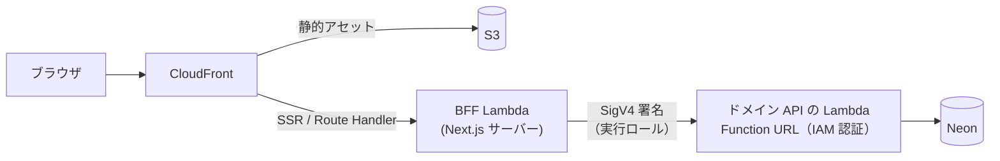

# effort-tracker

SES／受託向けの勤怠・工数管理 SaaS。

このリポジトリの主題は、動くアプリケーションそのものではなく、**AI駆動開発における人間とAIの責務分界を、リポジトリの上で検証可能な形にすること**にある。

「AIに任せた部分」と「人間が決めた部分」は、口頭では区別できても、成果物からは見えなくなる。ここでは両者を `docs/` と CI に落とし、**分界が守られているかを機械が検査する**状態を作っている。

- **どの判断を人間が下したか** → `docs/adr/` の各 ADR に「決定者」欄がある
- **なぜその分界なのか** → [`docs/ai-collaboration.md`](docs/ai-collaboration.md)
- **分界が守られていることを何が保証するか** → [`docs/harness/verification-loop.md`](docs/harness/verification-loop.md)

---

## 現在の状況

**基盤整備の段階であり、アプリケーションはまだ動かない。** 誇張を避けるため、正直に書いておく。

| 領域 | 状態 |
|---|---|
| 規約・ADR・ドメインモデル | 一通り揃っている |
| 検証ハーネス（`make verify` / CI） | 動作する |
| ドメイン層（`services/api`） | パッケージの骨のみ。ロジック未実装 |
| Web（`apps/web`） | 未スキャフォールド（ハーネスは `SKIP` を明示） |
| エンドユーザー認証（Amazon Cognito） | 未実装（[#52](../../issues/52)） |
| インフラ（`infra/terraform`） | 未着手 |
| **デモURL** | **未公開。** インフラ（`infra/terraform`）が未着手のため |

---

## スコープ

MVP のユースケースは3つに限定する。**これ以外を実装しない。**

1. 稼働実績の入力・編集（[#5](../../issues/5)）
2. 月次締め（[#6](../../issues/6)）
3. 承認申請・承認（[#7](../../issues/7)）

**認証基盤（後述の Amazon Cognito）は、この3ユースケースを支える横断的なインフラであり、4つ目の業務ユースケースを追加するものではない**（[ADR 0016](docs/adr/0016-cognito-end-user-authentication.md)、`docs/rules/scope.md`）。ロール（`Engineer` / `Approver`）は認可の判断であり、ユーザー・ロール管理画面は非スコープのまま — ロールはデモ用に切替可能とするに留め、割り当ての管理 UI は作らない。

集約は **勤務月 (`WorkMonth`) の1つだけ**を厳密にモデリングする。勤務月は **契約 × 年月**によって一意に決まる（技術者 × 年月ではない。掛け持ちという業務実態に基づく判断）。

用語と業務ルールの定義は [`docs/domain/ubiquitous-language.md`](docs/domain/ubiquitous-language.md) にある。**このリポジトリで最も重要な文書はここである** — 精算幅のスナップショット、丸め規則、締めと承認の状態遷移といった、間違えるとテストごと嘘になる決定が置いてある。

### 今後の展望（スコープ外）

意図的に外している。「時間がなかった」ではなく、集約を1つに絞るための判断である。

- 請求・支払
- ファイル添付
- 承認の取消し（承認済を終端状態として扱っている）
- 技術者の稼働を契約横断で見る画面（集約をまたぐ参照系の関心事）

---

## アーキテクチャ



**ブラウザからドメイン API の Lambda を直接叩けない。** Function URL が IAM 認証なので、SigV4 署名できるサーバー側（BFF Lambda）以外は到達できない。この一方通行は運用ルールではなく、構造として担保されている。

Lambda の呼び出しは `apps/web/src/lib/lambda-client.ts` に集約し、署名の実装を分散させない。

---

## 技術スタック

### アプリケーション

| 層 | 技術 | 選定の理由 |
|---|---|---|
| `apps/web` | Next.js (App Router) / TypeScript | Route Handler を BFF として使い、SigV4 署名をサーバー側に閉じ込める。UI と BFF が同一デプロイに収まる |
| `services/api` | Go / AWS Lambda | コールドスタートを数百ms に抑えられる。標準ライブラリだけでドメイン層を素直に書ける（[ADR 0013](docs/adr/0013-aws-native-hosting-over-vercel.md)） |
| — 内部構造 | クリーンアーキテクチャ（`domain` / `usecase` / `adapter` / `driver`） | 依存は内側にのみ向かう。最内周の `domain` が何にも依存しないことを `make check-domain-deps` が検査する（[ADR 0008](docs/adr/0008-clean-architecture.md)） |
| `infra/terraform` | Terraform / AWS | コストガードレールをコードで固定し、レビュー基準にする（[ADR 0013](docs/adr/0013-aws-native-hosting-over-vercel.md)） |
| DB | Neon (PostgreSQL) | RDS の常駐課金（~$15/月）を避ける。Lambda が VPC 外にあるためプーラー経由で接続する |
| ホスティング | AWS ネイティブ（S3 + CloudFront + Lambda） | OpenNext アダプタで Next.js を Lambda 上へ載せ、ホスティング全体を AWS 内で完結させる（[ADR 0013](docs/adr/0013-aws-native-hosting-over-vercel.md)） |
| 認証（AWS） | CI: GitHub OIDC ／ ランタイム: BFF Lambda の実行ロール（SigV4 署名） | 静的アクセスキーを排除する（[ADR 0014](docs/adr/0014-execution-role-over-vercel-oidc.md)） |
| 認証（エンドユーザー） | Amazon Cognito（User Pool） | ログイン3方式（ゲスト＝閲覧のみ／メール+パスワード+MFA(TOTP)／Google OIDC）を提供し、BFF（Route Handler）でトークン検証を終端する。そこから先のドメイン API 呼び出しは従来どおり実行ロールの SigV4 署名（[ADR 0003](docs/adr/0003-lambda-function-url-iam-auth.md) / [ADR 0014](docs/adr/0014-execution-role-over-vercel-oidc.md) のサービス間認証）であり、Cognito はこれを置換せず別レイヤーとして併存する（[ADR 0016](docs/adr/0016-cognito-end-user-authentication.md)） |
| CI | GitHub Actions | ローカルと同一の `make` ターゲットを呼ぶ |
| テスト（Go） | 標準 `testing` + `google/go-cmp` | アサーション DSL とモックライブラリを入れない。テストダブルは手書きの Fake（[ADR 0007](docs/adr/0007-testing-with-stdlib-and-go-cmp.md)） |
| テスト（Web） | Vitest | 導入は `apps/web` のスキャフォールド時（[#9](../../issues/9)） |

**使わないものも技術選定の一部である。** API Gateway / ALB / NAT Gateway / RDS / ECS / Provisioned Concurrency は、いずれも要件に対して過剰かアイドル課金が理由で意図的に外している。却下の経緯は [ADR 0002](docs/adr/0002-serverless-over-ecs.md) の「検討した代替案」にある。

### バージョンと固定箇所

| ツール | バージョン | 固定箇所 |
|---|---|---|
| Go（言語バージョン） | 1.26 | `services/api/go.mod` — **単一の情報源。** CI は `go-version-file` で読む |
| Go ツールチェーン | 1.26.5 | `.devcontainer/Dockerfile`（`golang:1.26.5-bookworm` から COPY） |
| Node.js | 24 | `.devcontainer/Dockerfile`（ベースイメージ）/ `.github/workflows/ci.yml` |
| Terraform | 1.15.8 | `.devcontainer/Dockerfile` / `.github/workflows/ci.yml` |
| golangci-lint | 2.12.2 | `.devcontainer/Dockerfile` / `.github/workflows/ci.yml` |
| gitleaks | 8.30.1 | `.devcontainer/Dockerfile` / `.github/workflows/ci.yml` |
| Next.js / TypeScript | 未定 | `apps/web` が未スキャフォールドのため（[#9](../../issues/9)） |

**Dockerfile と `ci.yml` の2箇所で同じ値を固定している。** 二重管理ではあるが、devcontainer と GitHub Actions では取得方法が異なり、単一の情報源にまとめる手段がない。**片方だけ上げると「ローカルで通るが CI で落ちる」が発生し、ハーネスの前提そのものが壊れる。** 上げるときは必ず同時に更新する。

Go だけは `go.mod` を単一の情報源にできている。あわせて `GOTOOLCHAIN=local` を設定し、`go.mod` がより新しい Go を要求したときに**ツールチェーンを自動ダウンロードさせない**。既定値（`auto`）では `proxy.golang.org` を取りに行き、ファイアウォール環境では原因の分かりにくいハングになるため、明示的に失敗させている。

---

## 設計判断

ADR は Nygard 形式。**書き換えず、覆すときは新しい ADR で置き換える**（`廃止（NNNN により置換）`）。過去の判断を消すと、判断の経緯という成果物そのものが失われるため。

| ADR | 決定 | 決定者 |
|---|---|---|
| [0001](docs/adr/0001-record-architecture-decisions.md) | アーキテクチャ決定を記録する | 人間 |
| [0002](docs/adr/0002-serverless-over-ecs.md) | ~~コンテナ常駐構成ではなくサーバーレスを採用する~~（0013 により置換） | 人間 |
| [0003](docs/adr/0003-lambda-function-url-iam-auth.md) | Lambda Function URL を IAM 認証で保護する | 人間 |
| [0004](docs/adr/0004-issue-docs-reference-model.md) | Issue と docs の責務を分け、レファレンス型で運用する | 人間 |
| [0005](docs/adr/0005-vercel-aws-oidc-federation.md) | ~~Vercel から AWS への認証に OIDC Federation を使う~~（0014 により置換） | 人間 |
| [0006](docs/adr/0006-onion-architecture.md) | ~~内部アーキテクチャにオニオンアーキテクチャを採用する~~（0008 により置換） | 人間 |
| [0007](docs/adr/0007-testing-with-stdlib-and-go-cmp.md) | テストは標準 testing と go-cmp のみで書く | 人間 |
| [0008](docs/adr/0008-clean-architecture.md) | 内部アーキテクチャにクリーンアーキテクチャを採用する | 人間 |
| [0009](docs/adr/0009-branch-protection-via-ruleset.md) | ブランチ保護を ruleset に一本化し、承認必須をやめる | 人間 |
| [0010](docs/adr/0010-harness-engineering.md) | ハーネスエンジニアリングの5構成要素を導入する | 人間 |
| [0011](docs/adr/0011-orchestrator-required-entry.md) | オーケストレーターを必須の入口とし、main エージェントの直接処理を禁じる | 人間 |
| [0012](docs/adr/0012-issue-command-as-slash-command.md) | `/issue` をスラッシュコマンドとして実装し、機械判定部をプロンプトから切り出す | 人間 |
| [0013](docs/adr/0013-aws-native-hosting-over-vercel.md) | デモの公開ホスティングを Vercel から AWS ネイティブ（S3 + CloudFront + Lambda）へ移す | 人間 |
| [0014](docs/adr/0014-execution-role-over-vercel-oidc.md) | Vercel OIDC Federation を廃止し、BFF Lambda の実行ロールで AWS を呼ぶ | 人間 |
| [0015](docs/adr/0015-claude-design-for-design-system.md) | フロントエンドのデザインシステムに Claude Design を採用する | 人間 |
| [0016](docs/adr/0016-cognito-end-user-authentication.md) | エンドユーザー認証に Amazon Cognito を採用する | 人間 |
| [0017](docs/adr/0017-pgx-as-postgres-driver.md) | Postgres ドライバに pgx を採用する | 人間 |

**すべて人間が決定者である。** これは偶然ではなく、`CLAUDE.md` が「技術選定の変更（ADR が必要な判断）」を人間の責務に置いているためである。AI が単独で「承認済み」の ADR を起票することを禁じている。

---

## コストとセキュリティのガードレール

デモを無期限に公開し続ける前提から、**機能要件と同格**として扱う。「後で入れる」ことを許容しない。

### コスト — 月 $5 が上限（[ADR 0013](docs/adr/0013-aws-native-hosting-over-vercel.md)）

一般的なリファレンス構成（ALB + ECS Fargate + RDS）は、**リクエストがゼロでも月 ~$87** かかる（概算）。NAT Gateway だけで予算の9倍になる。単一要素の削減では届かないため、構成ごと変えている。

**AWS には口座全体を止める真のハード課金上限が存在しない。** 構造的に固定できるのは Lambda の同時実行数であり、それ以外は検知＋半自動遮断による近似にとどまる。

| 項目 | 設定 |
|---|---|
| Lambda 予約同時実行数 | `5`（**BFF / SSR・ドメイン API の両 Lambda** に効く。課金の最悪値を構造的に固定する） |
| AWS Budgets | 月 $5 で2本（実績80% / 予測100%） |
| Budget Actions | 閾値到達で IAM / SCP の deny を適用し、新規リソース作成を凍結（翌予算期に自動リバート） |
| CloudFront | ディストリビューション単位のハード上限は無い（**最弱点**）。従量遮断は Budget → SNS → Lambda によるカスタム回路で、**数時間の遅延**がある。`docs/rules/cost-guardrails.md` の Route Handler レート制限が CloudFront 帯域への一次防御（WAF は $5 予算と二律背反のため非必須） |
| 使用禁止 | NAT Gateway / ALB / RDS / ECS |
| デモデータ | 日次リセット |

### セキュリティ

- **静的アクセスキーがどこにも存在しない。** CI は GitHub OIDC、ランタイムは BFF Lambda 自身の実行ロールによる SigV4 署名で、長期認証情報を使わない方針に統一している。漏洩させる対象がないので、鍵のローテーション運用も要らない
- **Function URL は `AWS_IAM`。`NONE` を禁じる**（[ADR 0003](docs/adr/0003-lambda-function-url-iam-auth.md)）。`NONE` は認証と到達可能性を混同している
- **信頼ポリシーで `sub` 条件を省かない**（GitHub OIDC の信頼ポリシー。詳細は `docs/rules/security.md`）。GitHub Actions の OIDC プロバイダは GitHub 利用者全体で共有されており、`sub` を省くと任意のリポジトリのワークフローが当該 IAM ロールを引き受けられる
- `gitleaks` を `make verify` と CI の両方で実行する（作業ツリー + 履歴）
- `docs/` 内の AWS アカウントID・接続文字列・URL は**すべて架空の値**である

---

## 開発プロセス

### SDD — 仕様を書いてから実装する

`docs/specs/` に仕様書がない機能は実装しない。受け入れ条件は、テストに落とせる粒度で書く。

### Issue と docs の責務分界 — レファレンス型（[ADR 0004](docs/adr/0004-issue-docs-reference-model.md)）

**正解のデータは常に `docs/` にある。**

| 置き場所 | 持つもの | 持たないもの |
|---|---|---|
| GitHub Issue | 実装の**タスク**、仕様を決めるための**議論** | 決定した仕様そのもの |
| `docs/` | 決定した**最新の**設計・仕様のみ | 議論の過程、タスクの進捗 |

Issue に仕様を書き写さず、`docs/` へのリンクを貼る。二重管理を避けるためだけではない — **古い docs を読んだAIは、古い仕様を正しく実装する。** テストごと古くなるので Green が無意味になる。

`services/` `apps/` を変更する PR は `docs/` への参照が必須で、CI の `spec-link` が検査する。仕様を要さない変更は `no-spec` ラベルで例外扱いにする。**例外にラベルという明示的な操作を要求するのは、例外を使った事実を記録に残すためである。**

同じ除外軸で `review-trail` が、実装↔レビューの往復証跡が PR コメントに定型フォーマットで残っているか、往復数が上限内かを検査する。上限値は `docs/harness/verification-loop.md` の表から読み、スクリプトに持たない。**ただしこの検査が見るのは記録だけである** — *PR に記録された* 形式と往復数であって実セッションの往復ではなく、記録をごまかせば擦り抜ける。「外部が書き込める場所を正解の置き場所にしない」という ADR 0004 と同じ限界を承知のうえで置いている。

### TDD — Red → Green → Refactor

テストを先に書き、**Red を確認してから**実装に入る。Red を踏んでいないテストは、対象が壊れても落ちない可能性を排除できていない。

### DDD — ドメイン層の隔離

`services/api/internal/domain/` は **Go の標準ライブラリのみに依存する**。フレームワーク、ORM、AWS SDK、ログライブラリを import しない。

この規約はレビューでは腐る（import が1行増える変更は最も見落とされやすい）。**`make check-domain-deps` が機械的に検査する。**

### コミット履歴

「仕様 → テスト → 実装」の順序が履歴に残るようにしている。1コミットに仕様とテストと実装を混在させない。

```
docs: 月次締めの仕様追加
test: 月次締めのテスト追加      ← この時点で Red
feat: 月次締め実装              ← この時点で Green
```

---

## 検証ハーネス

設計と運用ルールは [`docs/harness/verification-loop.md`](docs/harness/verification-loop.md)。

| コマンド | 内容 |
|---|---|
| `make help` | ターゲット一覧 |
| `make verify` | `lint` + `test` + `check-domain-deps` + `scan-secrets` |
| `make test` | 全レイヤーのテスト |
| `make lint` | 全レイヤーの Lint / 型チェック |
| `make check-domain-deps` | ドメイン層が標準ライブラリのみに依存しているか検査 |
| `make scan-secrets` | gitleaks によるシークレット検出 |

**CI はこれと同一の make ターゲットを呼ぶ。** CI 側にだけ存在する検査を作らない。作った瞬間、ローカルの Green が信用できなくなる。

未スキャフォールドの層は、黙って成功させず `SKIP` をログに出す。「通った」のか「素通りした」のかを区別できなくすると、ハーネスが信用を失うため。

```
==> test-web
  SKIP: apps/web/package.json が無い（Next.js 未スキャフォールド）
```

ただし**ドメイン層の依存検査だけは、対象が無い場合に失敗させる。** 「検査対象が無いので通った」は偽の Green であり、ハーネスとして最も避けるべき状態だからである。

> この検査があるから、DDD の「フレームワーク非依存」が主張ではなく事実になる。「ドメイン層を分離しました」は誰でも言える。**CI が落ちる状態にしてあること**が差になる。

---

## セットアップ

VS Code の Dev Containers 拡張が要る。それ以外の前提はない。

```bash
git clone https://github.com/h-k741953/effort-tracker.git
cd effort-tracker
code .
# コマンドパレット → Dev Containers: Reopen in Container
make verify
```

Go / Terraform / gitleaks / golangci-lint は **devcontainer のビルド時に導入される**。`init-firewall.sh` が実行時の外向き通信を allowlist 方式で制限しているため、**コンテナ起動後にツールチェーンを入れることはできない。** 追加や更新が必要なら `.devcontainer/Dockerfile` を変更してリビルドする。

> **バージョンを上げるときは `.devcontainer/Dockerfile` と `.github/workflows/ci.yml` を同時に更新する。** 片方だけ上げると「ローカルで通るが CI で落ちる」が発生し、ハーネスの前提そのものが壊れる。

---

## 受け入れたトレードオフ

いずれも [ADR 0013](docs/adr/0013-aws-native-hosting-over-vercel.md) / [0003](docs/adr/0003-lambda-function-url-iam-auth.md) で意図して選んだ結果であり、バグではない。

- **コールドスタートが発生する。** SSR Lambda（BFF）とドメイン API Lambda の2段で起こりうる。デモ初回アクセスの体感が悪化する。Go を選ぶことで数百ms程度に収まる見込みだが、ゼロにはならない。Provisioned Concurrency は常駐課金なので**使わない**
- **同時アクセスが集中すると 429 が返る。** 予約同時実行数 5 が上限で、SSR Lambda にも効くため画面ロード自体が 429 になりうる。コスト保護のための意図的な挙動である
- **Lambda が VPC 外にあり、DB 接続はインターネット経由になる。** NAT Gateway を避けるための判断。Neon の TLS と接続文字列に依存する
- **ローカルからドメイン API の Lambda を curl できない。** IAM 認証のため SigV4 署名が要る
- **CloudFront の帯域課金の請求主体が自分になる。** ディストリビューション単位のハード上限が無く、遮断は遅延ありのカスタム回路に頼る
- **OpenNext というサードパーティ・アダプタへの依存が増える。** Next.js の版追従で互換が崩れうる

> **これは本番設計ではない。** 前提は「収益のないデモを $5/月で無期限公開する」であって、SLA が要求される実案件に流用してはならない。前提が変われば結論も変わる。

---

## ハーネスで検出できないもの

正直に記録しておく。

- **業務ルールの誤り** — テストごと間違っている場合、Green は何も保証しない
- **ユビキタス言語のズレ** — 用語が現場と違っても CI は通る
- **集約の切り方の誤り** — 動作はする。数ヶ月後に破綻する

これらは [`docs/ai-collaboration.md`](docs/ai-collaboration.md) で**人間の責務**に置いた項目と正確に一致する。分界の基準は一つしかない — **間違いがテストで検出できるか。検出できないなら人間が決める。**
