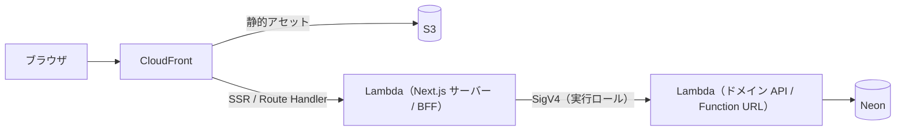

# 0013. デモの公開ホスティングを Vercel から AWS ネイティブ（S3 + CloudFront + Lambda）へ移す

- **ステータス**: 承認済み
- **日付**: 2026-07-23
- **決定者**: 人間（プロジェクトオーナー）

> **本 ADR は Issue #1「[discuss] デモ公開のホスティングをどう選ぶか」の結論を記録する。** 調査とトレードオフ整理は AI が担い、ホスティングの選定そのものは人間が決定した（`docs/ai-collaboration.md` の責務分界）。本決定に伴い、同一 PR で ADR 0002 を「廃止（0013 により置換）」とし、ADR 0005 は ADR 0014 で置換した（ADR 0001 運用ルール3）。

## コンテキスト

ADR 0002 は **Vercel Hobby（$0）** を無料枠の一角に据え、月 $5 の予算でサーバーレス構成を採用した。ADR 0005（Vercel → AWS の OIDC Federation）の調査中に、この前提に2つの綻びが判明した（ADR 0005「未解決のリスク」）。

1. **Vercel Hobby は非商用・個人利用に限定される。** 商用の定義は「プロジェクトの制作に関わった誰かの金銭的利益を目的とするあらゆるデプロイ」と広く、公開デモを伴うポートフォリオはその位置づけ次第で規約解釈のリスクを負い続ける。
2. **Vercel は Hobby のデプロイを予告なく削除する権利を留保している。** README で公開するデモURLの可用性が、構造的に保証されない。

この前提が覆ると、以下が連鎖して確定しなくなる。

- **README のデモURLの可用性**（ADR 0002 の「無期限に公開し続ける」前提）
- **ADR 0002 の予算前提**（月 $5。Vercel Pro に上げると $20 で4倍超過）
- **ADR 0005 の認証機構**（ホスティングを変えると Vercel OIDC Federation ごと作り直し）

Issue #1 で4案（Hobby 継続 / Vercel Pro / 他ホスティング / デモ公開をやめる）を横並びに調査した。判断を分ける主軸は、コストではなく **「BFF（Route Handler）がどこで動くか」＝ AWS を呼ぶ認証手段** だった。

- **BFF が AWS の外（Vercel / Cloudflare / Netlify）にある限り、AWS を呼ぶ認証が別途要る。** ネイティブの OIDC Federation を持つのは Vercel だけで、Cloudflare / Netlify はランタイム OIDC を持たず、自前 OIDC プロバイダの構築か静的キーに落ちる（ADR 0005 の「静的キーをどこにも置かない」方針と衝突する）。
- **BFF が AWS の中にあれば、実行ロール（IAM）で直接権限を持てる。** OIDC Federation そのものが不要になり、ADR 0005 が「単一障害点」と認めた信頼ポリシーの設定ミス（`sub` 条件の欠落）というリスクが構造的に消える。

`apps/web` は未スキャフォールドであり、アプリ側の移行コストは小さい。この時点で決めておくことで、Vercel 固有の実装（`@vercel/oidc-aws-credentials-provider` 等）を作り込む前に方向を確定できる。

## 決定

**Next.js を AWS 上でセルフホストする。静的アセットを S3、配信を CloudFront、SSR / Route Handler を Lambda に載せる。Vercel Hobby を置き換える。**

### アダプタは OpenNext を採る

Next.js（App Router）を Lambda + CloudFront + S3 の形へパッケージするアダプタとして **OpenNext（`@opennextjs/cloudflare` ではなく AWS 向けの OpenNext）** を採用する。SST はこの OpenNext を内包する上位ツールであり、導入の是非は実装時に別途判断する（本 ADR はアダプタの系統を OpenNext に固定するに留める）。

- OpenNext は Next.js の `standalone` ビルド出力を AWS Lambda 向けに変換する。App Router / Route Handler / middleware / SSR / ISR / Server Actions を Node ランタイムで動かせる
- OpenNext は他候補（Cloudflare 等）より成熟しており、Next.js の版追従の実績がある。ただし**サードパーティのアダプタ依存が1つ増える**（後述のトレードオフ）

### ADR 0003 の IAM 認証は維持する

ドメイン API の Lambda Function URL は `authorization_type = "AWS_IAM"` のまま（ADR 0003）。BFF（Next.js サーバーの Lambda）は**自身の実行ロール**で SigV4 署名し、ドメイン API を呼ぶ。実行ロールの権限は `lambda:InvokeFunctionUrl` を**当該関数のみ**に限定する（ADR 0005 の権限最小化を実行ロールへ引き継ぐ）。

**これにより ADR 0005 の Vercel OIDC Federation は不要になる。** ただし ADR 0005 の本文は書き換えない。認証機構の置換は独立した判断として **ADR 0014** に切り出し、0005 を廃止・置換する（ADR 0001 運用ルール3。追記・書き換えをしない）。

### 使用禁止リストは維持する

ADR 0002 の禁止リスト（**NAT Gateway / ALB / RDS / ECS**）はそのまま維持する。禁止理由（アイドル時課金）は本構成でも変わらない。CloudFront + Lambda は ALB / NAT を要さず、この禁止リストと整合する。

### コストガードレール — Lambda は構造的に固定、CloudFront は検知＋半自動遮断で近似する

AWS には**口座全体を止める真のハード課金上限が存在しない**。したがって ADR 0002 / 0003 と同じ「構造的上限 → 検知 → 半自動遮断」の多層で近似する。コンポーネントごとに固定できる精度が異なる。

| 要素 | ガードレール | 精度 |
|---|---|---|
| **Lambda（BFF ＋ ドメイン API の両方）** | `reserved_concurrent_executions = 5` | ◎ 課金の最悪値を同時実行数で構造的に固定（ADR 0003 の既存策を両 Lambda へ適用） |
| **AWS Budgets** | 月 $5・実績80%（$4）／予測100%（$5）の2本 | ○ 検知のみ（ADR 0002 から継承） |
| **Budget Actions** | 閾値到達で IAM / SCP の deny を適用し、新規リソース作成を凍結（翌予算期に自動リバート） | △ アクション型は IAM / SCP / EC2・RDS 停止の3つのみ |
| **CloudFront** | 無料枠 1TB / 1000万req/月（恒久）。**ディストリビューション単位のハード上限は無い** | △ 最弱点。下記参照 |
| **S3** | CloudFront キャッシュ経由でオリジンヒットが稀。S3 → CloudFront 転送は無料 | ○ 実質微小 |

**CloudFront の従量課金がこの構成の主要リスクである。** 無料枠は上限ではなく allowance であり、超過すると自動で従量課金（北米・欧州で 1TB 超は ~$0.085/GB）に移る。Budget Actions のアクション型に CloudFront を止める純正手段は無いため、遮断するなら **Budget → SNS → カスタム Lambda でディストリビューションを無効化**する回路を自作するしかない。しかも Budgets のコストデータは数時間遅延するため、**リアルタイムの遮断にはならない**。

**これは Vercel からの移行で新規に発生するリスクである。** Vercel Hobby では帯域の請求主体が Vercel だった（超過すれば向こうがプロジェクトを止める）。AWS へ移すと帯域の請求主体が自分になる。正規のデモtrafficは無料枠（1TB / 1000万req）に遠く及ばないため実害はほぼ濫用・DDoS 時に限られるが、**その残余リスクを自分が負う**ことを受け入れる。

WAF のレートベースルールは緩和策になるが、**WAF は ACL 基本料 ~$5/月**で $5 予算を単体で食う。導入するなら予算前提の再設計を要するため、**本 ADR では WAF を必須にせず、`docs/rules/cost-guardrails.md` の既存「Route Handler レート制限」を一次防御とする**。CloudFront 帯域の従量遮断は上記カスタム回路に委ね、その遅延を限界として明記する。

## 影響

### 良い影響

- **Hobby の規約解釈リスク・予告削除リスクから解放される。** README のデモURLの可用性が自分の管理下に入る
- **月 $5 の予算前提を維持できる。** Vercel Pro（$20）と違い ADR 0002 の予算設計を壊さない
- **ADR 0005 の単一障害点が構造的に消える。** BFF が AWS 実行ロールを直接持つため OIDC Federation が不要になり、`sub` 条件の設定ミスというリスクごと無くなる。「静的キーを使わない」方針が、federation という追加機構なしに満たされる
- **技術スタックの提示が AWS に一貫する。** CloudFront / S3 / Lambda / Terraform が一体になり、ポートフォリオとしての見せ場が増える
- 使用禁止リスト（NAT / ALB / RDS / ECS）と整合し、VPC 不要の小さな Terraform という ADR 0002 の利点を概ね保つ

### 悪い影響 / トレードオフ

これらは**受け入れる**トレードオフであり、README に隠さず書く。

- **CloudFront の帯域課金の請求主体が自分になる。** ディストリビューション単位のハード上限が無く、遮断は遅延ありのカスタム回路に頼る。この構成の最大のトレードオフ
- **OpenNext というサードパーティのアダプタ依存が増える。** Vercel 依存が OpenNext 依存に一部置き換わる。Next.js の版追従で互換が崩れうる
- **2段コールドスタート。** SSR Lambda（BFF）とドメイン API Lambda の2層でコールドスタートが起こりうる。デモ初回の体感がさらに悪化する可能性
- **SSR Lambda に `reserved_concurrent_executions = 5` を課すと、同時アクセスが5を超えたときページ描画自体が 429 になる。** ADR 0002 が「429 は意図的」と述べた挙動が、API だけでなく画面ロードにも及ぶ。コスト保護のための意図的挙動でありバグではないが、露出はより目立つ
- **Terraform が増える。** CloudFront ディストリビューション・OAC・S3・SSR Lambda の配線が加わり、ADR 0002 が誇った「Terraform が小さい」利点を一部相殺する
- **これは本番設計ではない。** 前提は「収益のないデモを $5/月で無期限公開する」であり、SLA が要求される文脈へ流用してはならない（ADR 0002 と同じ但し書きを引き継ぐ）

### 反映した範囲（本決定と同一 PR で実施）

本決定の承認に伴い、同一 PR で以下を反映した。

- **ADR 0002** のステータスを「廃止（0013 により置換）」に変更（本文は書き換えない）
- **`docs/rules/cost-guardrails.md`** に、両 Lambda への予約同時実行数・Budget Actions・CloudFront の従量遮断回路（遅延ありの限界を含む）を追記
- **ADR 0005** の置換として **ADR 0014** を起こし、0005 を廃止・置換
- **Issue #1** を PR マージ時にクローズし、本 ADR へのリンクを残す（ADR 0004 レファレンス型運用）

## 検討した代替案

| 案 | 月額 | 却下理由 |
|---|---:|---|
| **Vercel Hobby 継続** | $0 | 本 Issue が問題視した非商用制限・予告削除リスクを負い続ける。据え置きは論点の先送りにすぎない |
| **Vercel Pro** | $20 | 可用性・規約リスクは消えるが、ADR 0002 の月 $5 予算を4倍超過する。「$5 で無期限公開」という設計主張ごと書き換えになる |
| **Cloudflare Workers（OpenNext）** | $0 | 商用可・無料・無制限帯域は魅力だが、**ランタイム OIDC Federation を持たない**。AWS を呼ぶには自前 OIDC プロバイダ構築か静的キーが必要で、ADR 0005 の「静的キーを置かない」方針が崩れる。BFF を AWS に置く動機を消し、AWS を使う意味（技術スタック提示）とも競合する |
| **Netlify（無料）** | $0 | Cloudflare と同じく、ランタイム OIDC Federation を一次情報で確認できず。静的キー回避の保証が立たない。積極的に選ぶ理由が乏しい |
| **素の S3 + CloudFront（静的ホスティング）** | ~$0 | Route Handler（BFF）・Auth.js のサーバーセッション・SigV4 署名はサーバー実行を要し、静的配信では代替できない。`next export` で載せると BFF アーキテクチャ（ADR 0003 / architecture.md）が崩壊する。**Lambda を伴う本決定とは別物として却下** |
| **デモ公開をやめる** | $0 | ADR 0002 / 0003 の前提（不特定多数が触る公開エンドポイント）が崩れ、IAM 認証やコストガードレールの設計根拠ごと変わる。ポートフォリオの目的（公開デモ）を放棄する |

## 関連

- ADR 0002: サーバーレス構成の採用（**本 ADR が置換する**。Vercel Hobby を選んだ判断）
- ADR 0003: Lambda Function URL の IAM 認証（**維持**。BFF は実行ロールで SigV4 署名する）
- ADR 0005: Vercel → AWS の OIDC Federation（本構成では不要。**ADR 0014 で置換**）
- ADR 0014: OIDC Federation を廃止し実行ロールで AWS を呼ぶ（本 ADR の帰結）
- ADR 0001: ADR の運用ルール（廃止・置換の手順）
- `docs/rules/cost-guardrails.md`: コストガードレールの規約本文（承認時に追記）
- `docs/rules/architecture.md`: BFF 経由の一方通行（維持される）
- Issue #1: 本決定の議論（結論は本 ADR に反映し、Issue にはリンクを残す。ADR 0004 レファレンス型運用）

## 参考

- [OpenNext](https://opennext.js.org/) — Next.js を AWS / Cloudflare 向けにパッケージするアダプタ
- [Amazon CloudFront Pricing](https://aws.amazon.com/cloudfront/pricing/) — 無料枠（1TB / 1000万req）と超過時の従量単価
- [AWS Budgets Actions](https://docs.aws.amazon.com/cost-management/latest/userguide/budgets-controls.html) — 閾値到達時のアクション型（IAM / SCP / EC2・RDS）
- [Vercel: OpenID Connect (OIDC) Federation](https://vercel.com/docs/oidc) — 置換対象の認証機構
