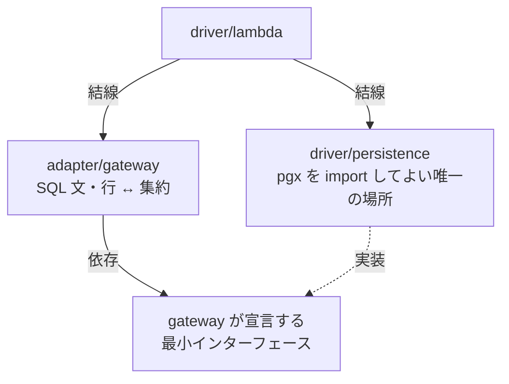

# 0017. Postgres ドライバに pgx を採用する

- **ステータス**: 承認済み
- **日付**: 2026-07-28
- **決定者**: 人間（プロジェクトオーナー）

> **決定そのものは 2026-07-27 に人間が明示選択で確定した**（Issue #51。確定内容は `docs/specs/workmonth-implementation-design.md`「人間が確定させた決定」5行目）。本 ADR はその決定を**記録するために起票**したものであり、決定を新たに作ってはいない。技術選定の変更は人間の決定領域であり、AI が単独で「承認済み」の ADR を起こすことはしない（ADR 0001 運用ルール5・`docs/ai-collaboration.md`）。

## コンテキスト

`services/api` の実装に着手するにあたり、**PostgreSQL（Neon）へ接続する手段**を決める必要が生じた。前提は既存の決定で固まっている。

- **DB は Neon（PostgreSQL）**。RDS は使用禁止リストにある（ADR 0013。原型は ADR 0002〈廃止・0013 により置換〉）
- **実行基盤は Lambda**。VPC 外からインターネット経由で Neon に接続し、コネクションは Neon 側のプーラー（PgBouncer 互換エンドポイント）に依存する（ADR 0002 が「コネクションプールと相性が悪い」として記録済み）
- **内部アーキテクチャはクリーンアーキテクチャ**で、DB ドライバを import してよいのは最外周の `driver` だけである（ADR 0008）
- **`domain` は Go 標準ライブラリのみ**に依存し、テストコードも含めて `make check-domain-deps` が機械検査する（ADR 0007・ADR 0008）

つまり選定の争点は「ドメインモデルをどう永続化するか」ではなく、**最外周に置く SQL 実行手段として何を使うか**に閉じている。集約は `WorkMonth` の1つだけで（`docs/rules/scope.md`）、テーブルは契約・勤務月・稼働実績の3つ、エンドポイントも少数である（`docs/specs/workmonth-implementation-design.md` AC-10-5）。**規模が小さいことは、抽象度の高い道具を選ぶ理由にならない。**

一方で、稼働実績を含む集約の保存は1トランザクションで行う必要があり（同 AC-10-7）、Lambda のコールドスタート時に接続を確立して再利用する形も要る（同 AC-10-2）。トランザクションと接続の寿命を明示的に扱えることは要件である。

## 決定

**Postgres ドライバに pgx（`github.com/jackc/pgx`）を採用する。**

### 本 ADR が固定すること

1. **ドライバは pgx とする。** `lib/pq` 等の他ドライバを使わない
2. **pgx を import してよいのは `driver/persistence` だけとする。** 他の層（`domain` / `usecase` / `adapter`）は pgx を知らない
3. **`domain` は Go 標準ライブラリのみを維持する。** 本決定は `domain` に一切影響しない
4. **pgx をテストの依存に持ち込まない。** テストで許される非標準ライブラリは go-cmp だけである（ADR 0007 を変更しない）

### 本 ADR が固定しないこと

- **`database/sql` 経由（`pgx` の `database/sql` ドライバ）で使うか、pgx のネイティブ API を使うか**は実装 PR の判断に委ねる（`workmonth-implementation-design.md` AC-13-3）
- **メジャー版（モジュールパスの版接尾辞）**を本 ADR では固定しない。実装 PR が現行の安定版を選ぶ
- **DDL 全文・マイグレーション手段・インデックス設計**（同 AC-10-6）。本決定はドライバの選定に閉じる

### 層の境界 — pgx を `driver/persistence` に閉じる

SQL 文と行 ↔ 集約の変換は `adapter/gateway` が持つが、**gateway は pgx を直接 import しない**。SQL の実行手段は gateway 側が宣言する最小のインターフェースで受け取り、その pgx 実装を `driver/persistence` が提供して `driver/lambda` が結線する。`adapter` が `driver` を import しないという依存の向き（ADR 0008）と、本決定の「pgx を最外周に閉じる」を同時に満たすための形である。具体形は `workmonth-implementation-design.md` D-11 が持つ。

### ADR 0007 との関係 — テストの依存は増やさない

pgx を採ることは、**テストの依存許可リストを変更しない**。ADR 0007 が許す非標準ライブラリは go-cmp のみで、本 ADR はそれを置換も拡張もしない。永続化のテスト（実 DB を要するテスト）の扱いは ADR 0007 が未決とした領域のままであり、本 ADR でも決めない。

## 影響

### 良い影響

- **PostgreSQL 固有の機能と型に素直に届く。** pgx は PostgreSQL 専用のドライバであり、拡張問い合わせプロトコル・PostgreSQL の型・`COPY` 等を、汎用インターフェースの最小公倍数に削られずに扱える
- **トランザクションと接続の寿命を明示的に書ける。** 集約の保存を1トランザクションで閉じる要求（AC-10-7）と、コールドスタート時に接続を確立して再利用する要求（AC-10-2）が、隠れた挙動に頼らず素直に書ける
- **接続プール（`pgxpool`）が同梱されており、追加の道具を要さない。** Lambda 実行環境ごとの接続再利用を、別ライブラリを足さずに実装できる
- **`database/sql` 経由でも使える。** ネイティブ API か標準インターフェースかの選択を、依存を差し替えずに実装 PR まで持ち越せる
- **`domain` は無傷である。** 追加の依存は最外周に閉じ、`make check-domain-deps` の主張（`domain` は標準ライブラリのみ）は変わらない

### 悪い影響 / コスト

- **「pgx が `driver/persistence` にしか現れない」ことは機械検査されない。** `make check-domain-deps` が保証するのは **`domain` の側だけ**である。gateway や interactor が pgx を import しても CI は落ちない。**この境界はレビューと規律で守るしかない**。ADR 0008 が「CI が検査しない境界が増える」と記録した問題と同型であり、本決定はその未検査領域をさらに1つ増やす（`workmonth-implementation-design.md` AC-13-2）
- **依存が1つ増える。** 依存の規律を主題とするリポジトリにおいて、追加は常に説明責任を伴う。pgx 自身も推移的依存をいくつか持ち込む。`domain` の外であることは、増やしてよい理由にはならない
- **Lambda + サーバーレス Postgres のコネクション管理が実装側の負担として残る。** Lambda は VPC 外から接続し（ADR 0002）、実行環境の数だけ接続が増えうる。上限は予約同時実行数 = 5（`docs/rules/cost-guardrails.md`）が構造的に抑えるが、これはコスト保護の副次効果であって接続管理の設計ではない
- **Neon のプーラー（PgBouncer 互換・トランザクションプーリング）との組み合わせに注意が要る。** pgx の既定はプリペアドステートメントのキャッシュを伴う拡張プロトコルであり、トランザクションプーリング下では実行モードやキャッシュの設定を要する可能性がある（**具体的な設定は実装時に一次情報で要確認**）。ドライバを変えてもプーラー側の制約は消えないが、既定値の相性という形で現れる点は pgx 固有のコストである
- **`database/sql` の標準インターフェースを離れる選択肢を開いたままにする。** 実装 PR がネイティブ API を選んだ場合、ドライバ差し替えは `driver/persistence` の実装と gateway が宣言する最小インターフェースの再実装を要し、`database/sql` を挟んだ場合より高くつく。**その差が実装 PR まで未確定のまま残ること自体もコスト**であり（AC-13-3）、承知のうえで受け入れる
- **PostgreSQL に固定される。** 汎用インターフェースを捨てる分、他 RDBMS への移行は選択肢から実質的に外れる。Neon（ADR 0013）を前提とする現状では実害が無い、というだけの理由で受け入れている

## 検討した代替案

| 案 | 却下理由 |
|---|---|
| `database/sql` + `lib/pq` | 標準インターフェースによる可搬性は得るが、**`lib/pq` は事実上メンテナンスが停止**しており（README 自身が後継として pgx を案内。一次情報は実装時に要確認）、長期に依存する選択として弱い。PostgreSQL 固有の型・機能も `database/sql` の最小公倍数に削られる |
| ORM（GORM / ent 等） | 集約1つ・テーブル3つの規模に対して依存と学習コストが過大。**構造体タグや基底型がモデル側へ滲み出しやすく**、`domain` を標準ライブラリのみに保つ制約（ADR 0007・0008）と正面から緊張する。発行される SQL が不透明になり、丸め・超過の計算を SQL 側へ漏らさないという責務分界（AC-9-3）も守りにくい |
| クエリのコード生成（sqlc 等） | 型安全な生成コードは魅力だが、**ツールチェーンの追加は devcontainer のリビルドを要する**（実行時にインストールできない。`docs/rules/commands.md`）。生成物のレビュー負荷も増える。なお sqlc は pgx を出力先に取れるため、必要になった時点で本決定を覆さずに再検討できる |
| クエリビルダ（squirrel 等） | 動的な条件組み立てを要するクエリが現時点で無い。**必要のない抽象を先に入れることになる** |
| pgx を `adapter/gateway` でも直接使う | 記述は短くなるが、`adapter` が `driver` を import しない依存の向き（ADR 0008）を壊す。**未検査の境界を規律で守るという本 ADR の負担を、守る対象ごと放棄する**ことになる |

## 関連

- ADR 0013: ホスティングを AWS ネイティブへ移す（**本 ADR の前提**。Lambda + Neon という実行基盤）
- ADR 0003: Lambda Function URL の IAM 認証（**維持**。Neon への到達経路の前提）
- ADR 0002: サーバーレス構成の採用（**廃止・0013 により置換**。Neon 採用と「コネクションプールと相性が悪い」の初出）
- ADR 0008: クリーンアーキテクチャ（**維持**。DB ドライバは `driver` に閉じる。未検査の境界という論点も同型）
- ADR 0007: テストは標準 testing と go-cmp のみ（**維持・変更しない**。pgx をテストの依存に持ち込まない）
- ADR 0001: ADR の運用ルール（決定者の明記・技術選定は人間の決定）
- `docs/specs/workmonth-implementation-design.md`: D-10 / D-11・AC-1-6・AC-9-3・AC-10-3・AC-12-6・AC-13-2 / AC-13-3（本決定の層への写像）
- `docs/harness/verification-loop.md`「ドメイン層の依存検査」: 機械検査が保証する範囲と、その外側
