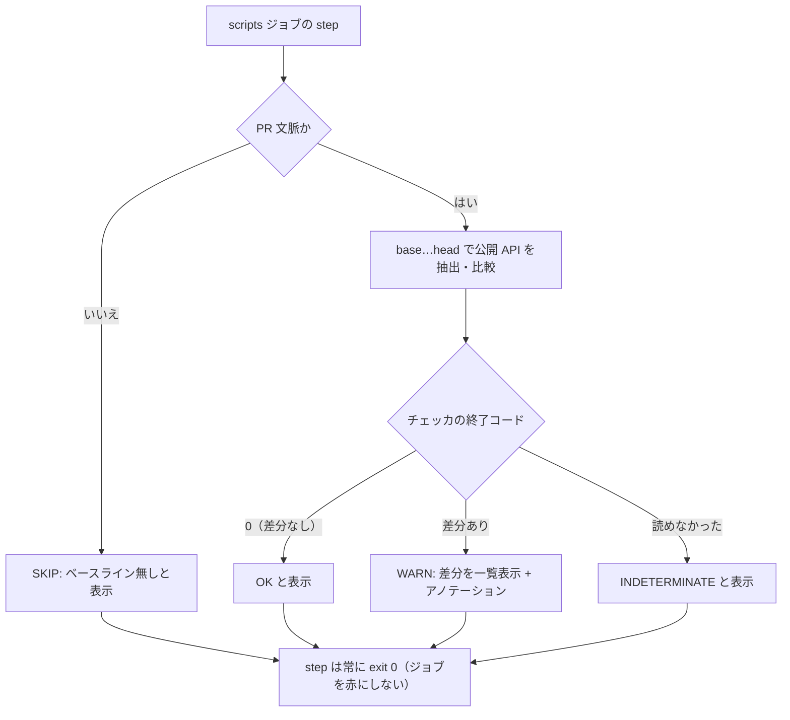

# 0018. 公開 API の差分を CI 警告として可視化し、一線を停止条件へ恒久化する

- **ステータス**: 承認済み
- **日付**: 2026-09-04
- **決定者**: 人間（プロジェクトオーナー）

> **下記「決定」1〜4 は 2026-09-04 に人間が下したものである**（Issue #89、`discussion`）。本 ADR はその決定を**記録するために起草**したものであり、決定を新たに作ってはいない。**ステータス `承認済み` は、起草後に人間が本文を確認して明示的に指示したものである**（ADR 0001 運用ルール5 が禁じるのは **AI が単独で「承認済み」で起票すること**であり、人間の明示指示はこれに当たらない）。5〜8 は人間が「起草時に決めてよい」とした範囲で **AI が決めた**（節を分けて明示する）。

## コンテキスト

工程エージェント（tester / implementer）に対して、次の一線が置かれている。

> **新しい名前・新しい公開 API・新しい差し替え点を作る必要が出たら、書く前に停止して報告する。**

これは `docs/rules/responsibility.md` の分界（ドメイン境界・集約の切り方・ユビキタス言語の用語は人間の決定領域）の、工程エージェント側での現れである。仕様に無い名前を工程が単独で作れるなら、用語と設計の決定権が実質的に AI 側へ移る。

**この一線が破られた。しかも指示文を強化した直後に再発した**（Issue #89 が記録した実測。2回連続）。**強化で塞げないことが測られている**という点が重要で、これは「もっと強く書く」では前に進めないことを意味する。

一方、機械的な強制手段には既存の制約がある。

- **ADR 0009 で承認必須を廃止している。** マージのゲートは機械的検査のみであり、CODEOWNERS 的に人間のレビューをマージ条件へ差し込む経路は無い（ADR 0009 決定2・「悪い影響」1点目）
- **ADR 0010 §A は同型の問題に既に答えを出している。** ハーネス自身の改変について「当面は**差分を CI の警告として可視化するに留め**、ブロックはしない」と決め、その限界を「悪い影響」の1点目へ記録した。**本 ADR が扱うのは、同じ形をプロダクトコードの公開 API へ適用するかどうかである**

なお、`services/api` の Go パッケージは、`internal/` 配下にあってモジュール外から import できないものか、エントリポイントの `package main` であって import の対象になりえないもののいずれかである。したがってモジュール外の利用者はいない。**したがってここでの「公開 API」は互換性の問題ではなく、「エクスポートされた識別子＝設計上の新しい名前と新しい差し替え点」の代理指標である。** この代理が完全でないことは「限界」に記す。

## 決定

### 人間が下した決定（2026-09-04）

#### 1. 方針は「警告 ＋ 明文化」の併用とする

新規エクスポート、およびエクスポート済みシンボルのシグネチャ変更の差分を **CI で検出し、ブロックせず警告として可視化する**。**厳格版（承認の記録が無ければ必須チェックを赤にする）は採らない**（却下理由は「検討した代替案」(a)）。

#### 2. 一線を停止条件へ恒久化する

上記の一線を `.claude/agents/tester.md` / `.claude/agents/implementer.md` の**停止条件**へ書く。

**停止条件の追加は ADR 0010 §A で「改変してはならない（人間の承認が要る）」側に列挙されている。本決定がその承認にあたる。** AI が自分の停止条件を書き換えたのではないことを、本 ADR が記録として担保する。

**書くのは後続タスクである。本 ADR は方針の記録に留め、エージェント定義には手を入れない。**

#### 3. 承認の記録はコミット trailer に置く

一線を越えることを人間が承認した場合、その記録は**コミットの trailer** に残す。**PR コメントは採らない**（却下理由は「検討した代替案」の該当行）。

#### 4. 対象言語は Go のみから始める

`services/api`（Go）だけを対象に開始する。**TypeScript（`apps/web`）は実績を見てから判断する**（将来の再検討事項）。

### 起草時に AI が決めた事項

人間が「起草時に決めてよい」とした範囲である。**上の1〜4 とは決定者が異なる。**

#### 5. 差分のベースラインは「PR の base…head」とする

**工程コミット間は採らない。工程コミットの境界を機械が識別する手段が現状無いためである。** `docs:` / `test:` / `feat:` の prefix はコミット規約（`docs/rules/commit-convention.md`）であって機械的な保証ではなく、**当事者が自由に書ける**。境界の識別を当事者の自己申告に置けば、「一線を越えた実装コミットを `docs:` と名乗る」だけで検査を外せる。

したがって **PR の base（merge-base）から head までを1つの単位**とする。これはレビューの単位であり、警告を読む人間の作業単位とも一致する。

**PR 文脈でない実行では、ベースラインが取れないことを明示して SKIP する。** `.github/workflows/ci.yml` は `on: push (develop, main)` と `on: pull_request (develop, main)` の**両方**で走るため、push 実行では base ref が定まらない。ここは**黙って成功させず、`SKIP`（ベースライン無し）と表示する**（`docs/harness/verification-loop.md`「未着手のレイヤーは『SKIP』を明示する」と同じ扱い）。

> **実装上の制約**: `scripts` ジョブの `actions/checkout@v7` は fetch-depth を指定しておらず（`secrets` ジョブのみ `fetch-depth: 0` を明示している）、既定の浅いクローンでは merge-base が取れない。ベース側の取得手段は実装側で明示的に用意する必要がある。

#### 6. 警告の出し方 — 既存 `scripts` ジョブへ step を足し、step は非ゼロで終えない

**新規ジョブを起こさない。** 新規ジョブは ruleset `protect-main` の必須チェックへの追加登録（ブラウザ操作）を人間に要求し、登録漏れは「実行され緑になるがマージ条件ではない」という発見しにくい状態を生む（`docs/harness/verification-loop.md`「必須チェックへの登録」、`docs/specs/issue-command.md` L19 / L33 の先例）。既存 `scripts` ジョブ（表示名 `Scripts (checker logic)`）へ step を追加する。

**ここには罠がある。`scripts` は必須チェック7本の1つであり、追加した step が非ゼロで終了すればジョブが赤になり、決定1が採らないと決めた「ブロック」がそのまま実現してしまう。** 相乗り先が必須チェックであることが、警告の出し方を制約する。

そこで次の形を採る。

- **チェッカ本体の終了コードは殺さない。** 一度変数に受けてから verdict へ写像する。`| ... || true` でパイプへ繋いで握り潰す形は採らない（`docs/harness/verification-loop.md`「`-test` には終了コードの番人が要る」で実際に踏んだ偽 Green と同型）
- **step 自身は常に 0 で終える。** そのうえで verdict を**必ず**ログ・`$GITHUB_STEP_SUMMARY`・`::warning::` アノテーションへ出す
- **4つの verdict をすべて表示する。`OK` を含めて黙らない**（「通った」のか「素通りした」のかを区別できなくしない）



#### 7. チェッカの形 — `check-domain-deps` に倣う

`docs/harness/verification-loop.md`「ドメイン層の依存検査」の形を踏襲する。

1. **入力を差し替えればローカルで完全実行できる純粋なフィルタとする**（`check-review-trail.sh` の `TRAIL_FILE`、`issue-gate.sh` と同じ性質）。比較の入力は「旧側のエクスポート一覧」「新側のエクスポート一覧」の2つで、`git` やネットワークをチェッカ本体に内包しない
2. **fixture で検査する。** `make test-scripts` 系のターゲットに載せ、**新規追加・シグネチャ変更・変更なし・入力欠損のそれぞれで期待どおりの verdict を返すこと**を固定する。通る側だけを検査すると、検査が何も見ていなくても緑になる（`docs/specs/issue-command.md` AC-8-13 と同じ理由）
3. **判定の権威をツールチェーン側に置く。正規表現でソースを舐めない。** エクスポート集合とシグネチャの抽出は Go 標準ライブラリの `go/parser` / `go/ast`（Go 自身のパーサ）で行う。`go list` の `.Standard` に判定を委ねたのと同じ考え方である
   - **`go doc` や型解決を要する手段は採らない。** ベース側ツリーからの抽出は**依存解決を要してはならない**。devcontainer は実行時にモジュールを取得できず（`docs/harness/verification-loop.md`「実行環境の前提」）、依存解決を挟めば「ベース側だけ抽出に失敗する」壊れ方をする。構文レベルの抽出なら、ソースが読めれば必ず動く
   - **代償**: 型エイリアス・埋め込みによるメソッド昇格など、型解決を要する事実は見えない。**これは守備範囲の違いであって欠陥ではない**（`go list` が構文エラーを見ないのと同じ整理）

##### (iv) 「検査対象が無ければ失敗させる」はそのままは適用できない

`check-domain-deps` の「対象が無い場合は成功ではなく失敗を返す」を、この警告専用検査へ**そのまま持ち込むことはできない**。理由は2つある。

- **失敗の行き先が無い。** 決定1・6 により step は非ゼロで終えない。「失敗させる」と書いても、実際には表示以上のことが起きない
- **ベースラインの不在は正常状態でもある。** push 実行でベースが取れないのは壊れている兆候ではなく、構成どおりの帰結である（決定5）

そこで**適用先を分割する**。

| 対象 | 「対象が無い」ときの扱い |
|---|---|
| **チェッカのロジック**（純粋フィルタ、fixture が検査する側） | 入力が読めない / 壊れている場合は `INDETERMINATE` を**非ゼロ終了**で返す。`OK` へ倒さない（読めなかったことは、違反が無いことを意味しない） |
| **CI step**（相乗り先が必須チェック） | 非ゼロを持てないため、代わりに**「黙って成功させない」で置き換える**。`SKIP` / `INDETERMINATE` を必ず表示する |
| **抽出対象そのものの不在**（`services/api` に Go パッケージが1つも無い） | 「未着手」ではなく「壊れている」。`INDETERMINATE` として**表示**する。ただしジョブは赤くならない |

**3行目が決定1（ブロックしない）を選んだことの帰結である。** `check-domain-deps` では偽 Green を止められたが、ここでは表示までしか担保できない。限界として記録する。

#### 8. 承認記録の trailer は `Approved-API-Change:` とする

書式は Git の trailer 慣行（`Co-authored-by:` と同形）に合わせ、**1件につき1行**とする。

```
Approved-API-Change: <パッケージ>.<シンボル> (added|signature-changed) — <人間が承認した理由を一行で>
```

- キー名を `Approved-API-Change` としたのは、**何が承認されたのか**（API の変更）と**誰の承認か**（人間）が字面から読めるためである
- コミット本文の一部として**履歴に残り**、rebase 限定のマージ方式（ADR 0009 決定4）のもとでコミットと1対1の対応を保つ
- **PR コメントと違い、第三者が追記できない**（後述「検討した代替案」）

## 限界

**以下は決定どおりの帰結であり、欠陥ではない。隠さず記録する。**

### 1. 決定1 は「新しい差し替え点」を捕まえられない

エクスポート集合の差分が見せるのは**公開 API の増減だけ**である。一線が禁じている「新しい差し替え点を作ること」は、**正当な新規エクスポートとまったく同じ形**で差分に現れる。

> **記録（2026-09-04 実測。出所: 作業ツリーの `apps/web/src/lib/auth-config.ts` 113 行目の定義、および `apps/web/src/lib/auth-handlers.ts` 120 行目・165 行目の呼び出し。現況の持ち主はこれらのソースそのもの）** — `loadPublicOrigin`（PR #87）は実装から実際に呼ばれている。**「参照0件のエクスポート」のような機械的に怪しい形をしていない。**

**検知できるのは公開 API の増減だけで、その中から一線越えを弁別するのは人間である。** 決定1が提供するのは「見るべき差分の候補リスト」であって、判定そのものではない。

さらに、**この実例自体が決定4（Go のみから開始）の対象外である。** `loadPublicOrigin` は TypeScript であり、一線が破られた当の箇所を初期スコープは検査しない。決定4は実績を見てから広げる判断であり、**その実績が積まれるまで、この種の差分は Go 側でしか観測されない。**

### 2. 差分検知から人間のレビューを強制できない

**ADR 0009 で承認必須を廃止しているため、差分が出たことをもって人間のレビューをマージ条件にすることはできない。** これは ADR 0010 §A が「改変の検出手段は残された課題である」として記し、同 ADR の「悪い影響」1点目が限界として記録した制約**そのもの**である。本 ADR はこの制約を解消しない。同じ制約の下で、対象をプロダクトコードの公開 API へ広げるだけである。

### 3. trailer を書くこと自体は止められない

承認の記録をコミット trailer に置いても、**当事者（AI）が trailer を自分で書くことを機械的に禁じる手段は無い**。書かれた trailer が本当に人間の承認を表しているかは、artifact からは区別できない。

これは `docs/harness/verification-loop.md`「上限を超えた往復を人間が承認したとき — `loop-extended` ラベル」の「**ラベルを付けるのは人間であり、AI がこのラベルを自分で付けてはならない**」と**同型**である。**規律に残る部分**であり、`no-spec` / `loop-extended` / `[direct]`（ADR 0011）と同じ列に並ぶ。

## 影響

### 良い影響

- **一線が「指示文の強さ」から「記録された決定」へ移る。** 停止条件への追加が ADR 0010 §A の承認事項として本 ADR に記録されるため、後から AI が自分で緩めた場合に、緩めたこと自体が差分として説明を要する
- **越えた事実が事後に読める形で残る。** 破られたときに気づく手段がゼロだった状態から、「差分として目に入る」状態へ上がる。検知は判定ではないが、**見えないものはレビューできない**
- **相乗りにより人間のブラウザ操作が発生しない**（決定6）。ruleset の必須チェック登録漏れという、Issue #30 で実際に踏んだ発見しにくい失敗モードを新設しない
- **チェッカが `check-domain-deps` と同じ形に揃う**（決定7）。純粋フィルタ + fixture + ツールチェーン権威という既存の型を再利用でき、検査不能地帯にチェッカのバグだけが残ることを避けられる

### 悪い影響 / コスト

- **警告は無視できる。** ブロックしない以上、読まれなければ何も起きない。ADR 0011 が「警告を注入して続行する」案を却下した理由（警告は無視できる）は、ここでは**受け入れたコスト**である。受け入れるのは、厳格版が持つ副作用（代替案 (a)）のほうが高いと判断したためである
- **必須チェックへの相乗りが、警告の表現力を制約し続ける。** step が非ゼロを持てないため、将来この検査を厳格化したくなった場合は、ジョブ構成（＝ruleset への登録）から見直すことになる
- **偽陽性が常態化しうる。** 正当な新規エクスポートは日常的に発生し、その大半は一線越えではない。**警告が多すぎれば読まれなくなる**という、ADR 0011 が偽陽性について記録した退化（「毎回 `[direct]` を打つ習慣への退化」）と同型のリスクがある。**この退化は機械では検出できない**
- **対象言語が偏る。** 決定4により当面 Go だけが検査され、`apps/web`（TypeScript）は検査されない。**一線が実際に破られた箇所は後者である**（限界1）
- **構文レベルの抽出に伴う取りこぼしが残る**（決定7）。型解決を要する変更は差分に現れない
- **`SKIP` 経路が残る**（決定5）。push 実行では走らないため、「PR を経ない変更」には効かない。これは `spec-link` / `review-trail` が持つ除外軸の問題（`docs/harness/verification-loop.md`「プロセス検査は『除外軸』自体が偽の Green になりうる」）と同じ性質だが、本検査は**そもそもブロックしない**ため、偽 Green の実害は「警告が出ない」に留まる

## 検討した代替案

| 案 | 却下理由 |
|---|---|
| **(a) 厳格版** — 承認の記録が無ければ必須チェックを赤にする | 判定の核（「その新規エクスポートは一線越えか」）が**機械には決まらない**（限界1）。正当な新規エクスポートまで赤になり、通すには毎回 trailer を書くことになる。**その trailer を書くのは当事者であり**（限界3）、結果として「赤を消すために当事者が承認を自称する」経路が常態化する。**ラベルや trailer を『例外を記録に残すため』に使うという既存の原理**（`no-spec` / `loop-extended` / `[direct]`）**が、必須の通過儀礼へ退化する。** ブロックの強度を上げた分だけ、記録としての意味が失われる |
| **(b) 検査せず規律に留める** — `docs/rules/notation.md`「機械検査の限界」と同型に、明文化と遵守だけで担保する | **2回連続で破られ、しかも指示文を強化した直後に再発した**（Issue #89 の記録）。**強化で塞げないことが測られている**以上、「もっと明確に書く」は同じ結果を再生産する。`docs/rules/notation.md` が機械検査を諦めている理由は「**応答は振る舞いで CI に痕跡が残らず**、新規かどうかも機械が判定できない」ことであり、**こちらは痕跡（エクスポート集合の差分）が残る**点で前提が違う |
| **(c) 越えたこと自体は許容し、事後に必ず人間の追認を通す形を明文化する** | **これは「書く前に停止して報告する」という要求の緩和にあたる。** `docs/rules/development-process.md` は「**要求（不変条件・禁止・限界）を実装の都合で緩めない — 緩める判断は人間の承認事項**」と定める。**破られた事実は、要求を下げる理由ではなく、検知を足す理由である。** 事後追認へ倒すと、停止条件は「越えてから報告すればよい」に読み替えられ、停止条件としての機能を失う |
| **承認の記録を PR コメントに置く** | `docs/harness/verification-loop.md` の信頼境界（304〜310 行目）が3点を記録している。(1) **当事者は事後に整形できる**（記録をごまかせば擦り抜ける）。(2) **コメント権限のある第三者なら誰でも追記できる**。(3) 必須チェックと組み合わせると、**第三者のコメント1件で当該 PR を恒久的にマージ不能にできる**（復旧手段は削除のみ）。加えて ADR 0004 の「**外部が書き込める場所を正解の置き場所にしない**」に反する。コミット trailer は第三者が追記できず、履歴としてバージョン管理下に入る |
| **TypeScript を同時に対象化する** | 抽出手段が Go と共通化できず（`go/parser` に相当する権威を別途選ぶ判断が要る）、初回から2言語ぶんの偽陽性を抱えることになる。**警告が読まれなくなる退化**（「悪い影響」）を最初から招く。決定4のとおり Go で実績を見てから判断する。**この判断のコストは限界1に記録済みである**（一線が実際に破られたのは TypeScript 側） |
| ベースラインを工程コミット間に取る | 工程コミットの境界を機械が識別する手段が無い。`docs:` / `test:` / `feat:` の prefix は当事者が自由に書け、**検査を外す操作が prefix の書き換え1つで済む**（決定5） |
| 新規 CI ジョブを起こす | ruleset `protect-main` への必須チェック登録（ブラウザ操作）を人間に要求し、登録漏れが「実行され緑になるがマージ条件ではない」状態を生む（`docs/harness/verification-loop.md`「必須チェックへの登録」、Issue #30 で実際に踏んだ） |
| 正規表現でソースからエクスポートを抽出する | 判定の権威が自前の正規表現になる。`check-domain-deps` が「パスにドットが含まれるか」で判別する案を**誤りとして退けた**のと同じ理由であり、`vendor/` 相当の想定外ケースで静かに壊れる（決定7） |

## 関連

- **Issue #19（未着手・OPEN）とは検査対象が異なる。統合できると読まないこと。** #19 は **ハーネス自身**（`.claude/` と `docs/harness/`）の差分を CI で警告するもので、ADR 0010「承認後に切る実装 Issue」の**項目8**（自己改善の改変許可リストの明文化と CI 差分警告 — §A）にあたる。本 ADR（#89）が対象とするのは **プロダクトコードの公開 API** の差分である。**形（差分を警告に留め、ブロックしない）が同じであることは、対象が同じであることを意味しない。** 両者は別々に存在し、片方の実装がもう片方を満たすことはない
- ADR 0010: ハーネスエンジニアリングの5構成要素 — **§A**（停止条件の追加は人間の承認事項〔決定2〕。「差分を CI の警告として可視化するに留め、ブロックはしない」の出所〔決定1〕。改変検出は残された課題〔限界2〕）、**§F**（機械で止められる範囲と規律に留まる範囲を分けて記録する〔限界3〕）、**「悪い影響」1点目**（差分をブロックできない限界の初出〔限界2〕）、**「承認後に切る実装 Issue」項目8**（Issue #19 との対象の違い）
- ADR 0009: ブランチ保護を ruleset に一本化し、承認必須をやめる（承認をマージ条件にできない〔限界2〕。rebase 限定〔決定8〕）
- ADR 0004: Issue と docs のレファレンス型運用（外部が書き込める場所を正解の置き場所にしない〔PR コメント案の却下〕）
- ADR 0001: アーキテクチャ決定を記録する（決定者の明記・AI が単独で「承認済み」で起票しない〔本 ADR のステータス〕。粒度）
- ADR 0011: オーケストレーターを必須の入口とする（例外に明示的な操作を要求する原理〔決定8〕。警告は無視できる〔悪い影響〕。偽陽性による退化〔悪い影響〕）
- `docs/harness/verification-loop.md`: 「ドメイン層の依存検査」（チェッカの形〔決定7〕）、「必須チェックへの登録」（新規ジョブを起こさない〔決定6〕）、「実装↔レビューループ」の `loop-extended`（AI が自分で付けてはならない〔限界3〕）、「CI の構成」304〜310 行目（信頼境界〔PR コメント案の却下〕）、「ハーネスの限界」（検出できないものは人間が持つ〔限界1〕）
- `docs/rules/development-process.md`: 「要求を実装の都合で緩めない — 緩める判断は人間の承認事項」（代替案 (c) の却下）
- `docs/rules/notation.md`: 「機械検査の限界」（代替案 (b) と同型の形。前提の違い）
- `docs/rules/responsibility.md`: 人間に確認を取る範囲（一線の由来〔コンテキスト〕）
- `docs/specs/issue-command.md`: L19 / L33（既存 `scripts` ジョブへ step を足す先例〔決定6〕）、AC-8-13（違反する側で落ちることを fixture で固定する〔決定7〕）
- Issue #89: 本決定の議論（結論は本 ADR が持つ。Issue のコメントは docs より優先されない — ADR 0004）
