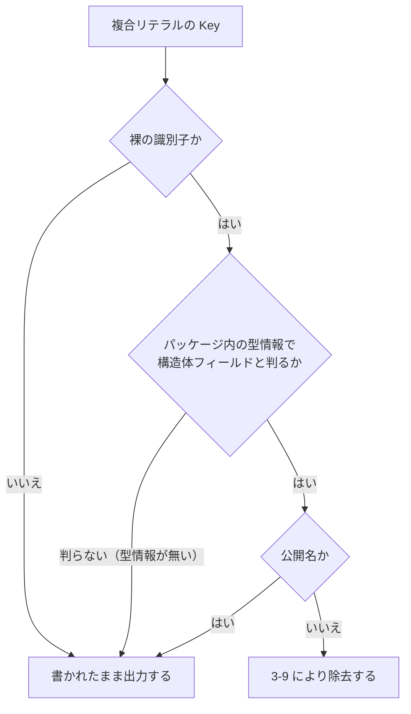

# 0019. 公開 API 抽出にパッケージ内へ閉じた型解決を導入し、関数リテラルの本体を `<signature>` から落とす

- **ステータス**: 提案中
- **日付**: 2026-09-14
- **決定者**: 「決定1」「決定2」は**人間（プロジェクトオーナー）**（2026-09-14。Issue #93 / PR #95）。「決定3」〜「決定6」は**起草時に AI が決めた事項**（節を分けて明示する）

> **ステータスを `承認済み` にしていないのは、本 ADR の起草時点で人間が本文を確認していないためである**（ADR 0001 運用ルール5「AI が単独で『承認済み』で起票しない」）。決定1・2 の**内容**は人間が下したものであり、AI が作ったものではない。

## コンテキスト

`docs/specs/public-api-diff-check.md` **AC-3-6-1** は、抽出規則（3-6 の名前除去 / 3-9 の非公開メンバ除去 / 3-9-1 の展開 / 3-9-2 の境界）が **型式が現れるすべての位置へ一様に掛かる**ことを要求する。とりわけ、型式の内部に現れる式（配列長の式、その中の呼び出しの引数、複合リテラルなど）の内部にも掛かる。**構文位置や式の種類で場合分けしない**ことは同項の根拠1〜4 が述べるとおりで、場合分けは数え上げから漏れた位置に同じ壊れ方を残す。

この一様性を実装へ落とす過程で、**構文解析だけでは決められない箇所が2つ**現れた。ADR 0018 決定7-3（`go/parser` / `go/ast` だけで抽出する。型解決を採らない）の前提で扱いきれない範囲である。

### 壁I — 関数リテラルは型だけでなく「本体」を持つ

`ast.FuncLit` は関数型（`FuncType`）に加えて本体 `{ ... }` を持つ。本体は任意の文の列であり、**公開型の外形ではない**。AC-3-6-1 の期待値表 (viii) / (ix) は関数型の部分に 3-6 が掛かること（引数名・結果名が落ちること）を固定するが、**本体を `<signature>` にどう出すかは仕様が定めていない**。

本体をそのまま出せば、ローカル変数名・非公開識別子・任意の式が `<signature>` に入る。すなわち**本体の中身を変えただけで `SIGNATURE_CHANGED` が出る**（偽陽性の常態化 —— ADR 0018「悪い影響」）。同時に、その位置に限って非公開識別子が綴りに現れ、AC-9-8（非公開フィールド・非公開メソッドの変更は差分に出ない）が**位置によって真でなくなる**（AC-3-6-1 根拠2 が退けた形そのもの）。

### 壁II — 複合リテラルのキーは、構文が同じまま正反対の扱いを要する

> **実測（2026-09-14。実行者: オーケストレーター。`go build` / `go run` がいずれも EXIT=0 で返した結果。現況の持ち主は Go 言語仕様と `go/ast` の実装である）**

```go
const hidden = 2
type t struct { hidden int; Pub int }
type C [unsafe.Sizeof([...]int{hidden: 1})]int   // キー = 配列インデックス（定数参照）
type D [unsafe.Sizeof(t{hidden: 1, Pub: 2})]int  // キー = 構造体フィールド名
```

- **C のキーは「値」が配列長を決める。** `hidden = 2` なら 24 バイト（長さ3）、`5` なら 48 バイト（長さ6）。**落とせば長さの変化が `<signature>` のバイト一致に吸収される＝偽 Green**
- **D のキーは非公開フィールド名**であり、AC-3-9 / AC-9-8 が除去を要求する
- **構文だけでは C と D を区別できない。** どちらも `ast.KeyValueExpr.Key` の裸の `*ast.Ident` である

つまり「全部残す」は AC-3-9 に反し（偽陽性）、「全部落とす」は偽 Green を作る。**どちらへ倒しても穴が出る**のであって、規則の強弱の問題ではない。これが型解決を要する核心である。

## 決定

### 人間が下した決定（2026-09-14）

> 以下の `I-1` / `II-5` は、**人間が提示した選択肢につけた人間自身の呼称**である。選択肢の一覧そのものは Issue #93 / PR #95 の議論にあり、**結論は本 ADR が持つ**（ADR 0004）。

#### 1. 関数リテラルの本体を `<signature>` に出力しない（選択肢 I-1）

`ast.FuncLit.Body` を**固定綴り**（例: `{ ... }`）へ畳み、本体の内容を `<signature>` に出さない。

- **綴りそのものは本 ADR で固定しない。** 仕様の期待値表とテストが持つ（3-7-1 / 3-9-2 / 3-10-1 の期待値表と同じ扱い）
- **本体を除去して痕跡ごと消すのではなく、固定綴りで畳む。** 関数リテラルであることと関数型であることの区別を綴りに残すためである

**この決定は偽 Green を作らない。** 根拠は次の実測である。

> **実測（2026-09-14。実行者: オーケストレーター。`go run` が EXIT=0 で返した結果。現況の持ち主は Go 言語仕様 `unsafe.Sizeof` と `ast.ArrayType` の定義である）**
>
> ```
> unsafe.Sizeof(func(a int) int { return a })              = 8
> unsafe.Sizeof(func(a int) int { x := a*99; return x+1 }) = 8
> ```

**関数リテラルの本体は定数式の値に効かない。** 型式の内部に任意の式が現れる構文位置は `ast.ArrayType.Len`（配列長）だけであり、そこでの定数評価に本体は寄与しない。したがって「本体を落としたせいで型の外形の変化が隠れる」形は作れない。

**AC-3-6-1 の期待値表 (viii) / (ix) を緩めない。** 同表が要求するのは「対照の `<signature>` が対象の `<signature>` に**部分文字列として現れる**こと」であり、本体を固定綴りへ畳んでも関数型の綴りはそのまま残る（対照側は本体を持たないため、部分文字列の関係は保たれる）。**本決定は `<signature>` の内容を減らす決定であって、規則が掛かる位置を減らす決定ではない。**

#### 2. 型解決を導入する（選択肢 II-5）

壁II を解くために、抽出器へ**型解決を導入する**。これは **AC-3-11**（「依存解決・型解決・ネットワークアクセスを行わない」）および **ADR 0018 決定7-3**（型解決を要する手段は採らない／型解決を要する変更は差分に現れない）の**置換**にあたる。置換の範囲は決定6 が確定させる。

### 起草時に AI が決めた事項

**上の1・2 とは決定者が異なる。** 人間が名指しした論点（型解決の範囲、AC-3-11 との条文上の始末）を、実測に基づいて埋めたものである。

#### 3. 型解決の範囲 —— 抽出の正しさが「import 先の解決の成否」に依存しないこと

範囲は**解析対象パッケージ内で完結させる**。正確には次の形で定める。

> **抽出結果は、import 先の型解決が成功したか失敗したかによって変わらない。**

「import 先を一切読まない」ではなく「**読めても読めなくても結果が同じ**」とするのは、実装が標準の `importer` を使えば stdlib の export data は読めてしまうためである。**禁じるべきは読むことではなく、正しさがそれに依存することである。**

根拠は2つの実測である。

> **実測A（2026-09-14。実行者: オーケストレーター。`go run` の結果。現況の持ち主は `go/types` / `go/importer` の実装である）**
>
> `go/types` + `importer.Default()` を実際に走らせた結果:
> - stdlib のみを import するパッケージ → `CheckErr=<nil>`、**成功**
> - `services/api/cmd/exportlist`（テストが go-cmp を import）→ **失敗**。`could not import github.com/google/go-cmp/cmp (cannot find package ... in any of: $GOROOT, $GOPATH)`。`importer.Default()` は**モジュールキャッシュを見ない**
> - ただし **import 解決に失敗しても型検査は継続し、パッケージ内の情報は得られる**（同じ実行で `Uses=3628` が埋まった）

> **実測B（2026-09-14。実行者: オーケストレーター。`go build` が EXIT=1 で返した結果。現況の持ち主は Go 言語仕様である）**
>
> ```
> outer/outer.go:5:17: cannot refer to unexported field hidden in struct literal of type inner.T
> ```
>
> **別パッケージから非公開フィールドをキーに使うことは、Go の言語仕様が禁じている。**

実測B から、**「複合リテラルのキーに現れる非公開フィールド名」は必ず同一パッケージ内で宣言された型のものである**。したがって **AC-3-9 / AC-9-8 が要求する除去は、パッケージ内に閉じた型解決で取りこぼしなく満たせる。** 配列インデックスに他パッケージの**公開**定数が来る形（`[...]int{pkg.N: 1}`）はありうるが、そこは**書かれたまま出力すればよく、解決も改変も要らない**。

**外部 import を解決しても得るものが無い**（非公開キーはそこに現れえない）一方、**解決しようとすれば devcontainer で成立しない**（実測A、`docs/specs/devcontainer-go-module-policy.md`、`.devcontainer/init-firewall.sh` が実行時の外向き通信を遮断する）。範囲の決め手はこの非対称性である。

#### 4. 型情報が得られない位置は「書かれたまま出力する」へ倒す

複合リテラルのキーの扱いは次のとおり。



**既定（`K`）へ倒すことが、決定3 の「結果が import 解決の成否に依存しない」を成立させる。**

- 型情報が無い＝複合リテラルの型が解決できない場合、実測B によりそのキーは**非公開フィールド名ではありえない**。よって残すことが 3-9 に反しない
- 外部の型が解決**できた**場合、そのキーは公開フィールド名か公開定数のいずれかであり、やはり残す。**解決の成否で出力が変わらない**

#### 5. 型解決の用途は「複合リテラルのキーの弁別」に限る

**`<signature>` の綴りは、引き続き書かれた型式から作る。** 型解決の結果で綴りを置き換えない（型エイリアスを実体へ展開しない、型注釈の無い `var` / `const` の型を推論して埋めない、埋め込みによる昇格メソッドを列挙しない）。

これにより **AC-9-4 の限界は有効なまま残る。本 ADR は「見えるもの」を増やす決定ではない。** 用途を広げれば、綴りが「書かれた形」から離れ、3-7 / 3-7-1 が固定した正規化の前提（`go/printer` の出力を畳む）が別物になる。**壁II を解くのに必要な最小の範囲だけを解禁する。**

#### 6. AC-3-11 / ADR 0018 決定7-3 の始末 —— 解禁するのは型解決だけである

AC-3-11 は「**依存解決・型解決・ネットワークアクセス**を行わない」を一体で禁じている。**本 ADR が置換するのは、このうち「型解決」だけである。**

| 項目 | 本 ADR 後の扱い |
|---|---|
| **型解決** | **解禁する。** 範囲は決定3・用途は決定5 のとおり |
| **依存解決**（モジュールの取得） | **禁止のまま据え置く。** `packages.Load` やモジュール取得を要する手段を採らない |
| **ネットワークアクセス** | **禁止のまま据え置く。** `.devcontainer/init-firewall.sh` の遮断下でも成立することが前提である |
| 使用してよいパッケージ | `go/parser` / `go/ast` / `go/printer` / `go/token` に **`go/types` / `go/constant` / `go/importer`** を加える。**いずれも標準ライブラリであり、AC-3-12（`services/api/go.mod` の `require` を1件も増やさない）は変わらない** |
| **型検査のエラー** | **抽出器の非ゼロ終了の理由にしない。** AC-3-14 が定めるのは**構文解析**の失敗であり、型検査のエラーはそこに含まれない（本項は 3-14 を緩めるものではなく、3-14 が扱っていない区分を埋めるものである） |

**型検査のエラーを致命にできない理由は2つある。** (a) 実測A のとおり、外部 import を持つパッケージでは import 解決が必ず失敗する。`services/api/go.mod` は `aws-lambda-go` / `aws-sdk-go-v2` / `pgx` / `go-cmp` を `require` しており、**これらを import するパッケージは現に存在する**（標準ライブラリのみに閉じるのは `domain` 配下だけである —— `docs/rules/development-process.md`）。致命にすれば抽出器はそれらのパッケージで必ず落ち、検査そのものが死ぬ。(b) AC-3-3 はビルドタグを解釈せず**全ファイルを読む**ため、条件付きコンパイルで分岐した宣言が重複し、型検査エラーになりうる。いずれの場合も**決定4 の既定が安全側へ倒す**。

**ADR 0018 決定7-3 が依存解決を禁じた理由は満たされたままである。** 同項が挙げた理由は「依存解決を挟めば『**ベース側だけ抽出に失敗する**』壊れ方をする」ことだった。パッケージ内に閉じた型解決は、**ソースが読めれば必ず動く**（import 解決の失敗が致命的でない —— 実測A）。ベース側と head 側で挙動が分かれない。

## 限界

**以下は決定どおりの帰結であり、欠陥ではない。隠さず記録する。**

### 1. ADR 0018 の字面は「型解決を採らない」のまま残る

**ADR 0018 には一切手を入れない**（ADR 0001 運用ルール3「ADR は書き換えず、追記もしない」）。**「置換された」と書き足すこともしない。**

同時に、**ADR 0018 のステータスを `廃止（0019 により置換）` にもしない。** 本 ADR が置換するのは決定7-3 の「型解決を採らない」という一点だけであり、**決定1〜6・8 と「限界」節は有効なまま残る**ためである。ADR 0018 全体を廃止扱いにすれば、有効な決定まで無効に読まれる。

**その代償として残る限界: ADR 0018 だけを読んだ者（人間・AI）は、抽出器が型解決を行わないと読む。** 実体の持ち主は本 ADR と `docs/specs/public-api-diff-check.md` である。**この食い違いを機械が検出する手段は無く、担保は本行を読む者の規律に留まる**（ADR 0010 §F の「止められない側」）。これは同仕様 AC-9-14 が ADR 0018 決定6 の字面について記録したのと**同型の残存**である。

### 2. 型解決を導入しても「見えるもの」は増えない

決定5 により、型エイリアス経由の実体変更・埋め込みによるメソッド昇格・型注釈の無い `var` / `const` の型は、**引き続き差分に現れない**（AC-9-4）。**「型解決を入れたのだから 9-4 は縮んだ」と読まない。**

### 3. 抽出器が重くなる

型検査は構文解析より遅く、CI step はベース側・head 側で2回抽出する（AC-7-11）。また抽出器の実装が複雑になる分、**抽出器自身のバグの余地が増える**。抽出器が誤って少なく出力すれば `OK` になる（AC-9-11 が既に記録した性質）。受け皿は抽出器の Go テスト（`make test-api`）である。

## 影響

### 良い影響

- **AC-3-6-1 の一様性が、構文で解けない位置まで届く。** 壁II は「規則の強弱」ではなく「構文情報の不足」であり、**型解決なしには偽陽性と偽 Green のどちらかを必ず選ばされる**。本決定はその二択そのものを解消する
- **`<signature>` から任意のコード片が消える**（決定1）。関数リテラルの本体が入らなくなり、本体を編集しただけの変更が `SIGNATURE_CHANGED` として現れない
- **判定の権威がツールチェーン側に留まる。** 「これはフィールド名か配列インデックスか」を自前のヒューリスティックで決めず、`go/types` に委ねる。ADR 0018 決定7-3 の「正規表現でソースを舐めない」「`go list` の `.Standard` に委ねる」と同じ考え方である
- **標準ライブラリだけで閉じる。** `require` が増えず、`.devcontainer/Dockerfile` の pin 追随も devcontainer リビルドも発生しない

### 悪い影響 / コスト

- **完了済み仕様の条文を書き換える。** `docs/specs/public-api-diff-check.md` の AC-3-11 は本 ADR により置換される。**これは「要求を実装の都合で緩める」ことではない**（`docs/rules/development-process.md`）—— 緩める判断は人間の承認事項であり、**決定2 がその承認にあたる**。条文と期待値表の更新は**本 ADR とは別のコミット**で行う（1コミット1関心。コミット規約）
- **「型解決が効いているか」は黙って退化しうる。** 決定4 の既定は安全側だが、**既定へ倒れたこと自体はログにも差分にも現れない**。受け皿は抽出器のテストであり、**非公開フィールドのキーが除去されること**と**配列インデックスのキーが保たれること**の**両方**を期待値として固定する必要がある。片側だけを固定すると、「常に既定へ倒す」実装でも緑になる（`docs/specs/issue-command.md` AC-8-13 / 同仕様 AC-6-5「通る側だけを検査しない」と同型）
- **ADR 0018 の字面と実体の食い違いが2件目になる**（限界1。1件目は同仕様 AC-9-14 が記録した相乗り先ジョブ名）

## 検討した代替案

### 壁I（関数リテラルの本体）について

| 案 | 却下理由 |
|---|---|
| 本体を `go/printer` でそのまま出す | 本体の中身の変更が `SIGNATURE_CHANGED` になる（偽陽性の常態化 —— ADR 0018「悪い影響」）。同時に非公開識別子がその位置に限って `<signature>` へ現れ、**AC-9-8 が「ある位置を除いて真」という条件付きの命題へ変わる**（AC-3-6-1 根拠2 が明示的に退けた形） |
| 関数リテラルを式ごと落とす | **AC-3-6-1 の期待値表 (viii) / (ix) が要求する「関数型の綴りが現れること」を満たさない。** 引数名・結果名が落ちることを固定できなくなる |
| 本体の内部にも 3-6 / 3-9 を掛ける（本体を正規化して出す） | 本体は**文の列**であって型式ではない。規則の適用先が「型式が現れる位置」から「任意の文」へ広がり、条文の範囲そのものが定義できなくなる。かつ偽陽性は解消しない |

### 壁II（複合リテラルのキー）について

| 案 | 却下理由 |
|---|---|
| 型解決を入れず、キーを**全部残す** | 非公開フィールド名が `<signature>` に残る。**AC-3-9 / AC-9-8 に反する**（偽陽性） |
| 型解決を入れず、キーを**全部落とす** | 実測（壁II の C）のとおり、**配列長の変化が隠れる**（24 バイト ↔ 48 バイト）。3-9-2 根拠1 / 3-10-1 根拠1 が「偽 Green」として退けたのと同じ形 |
| 構文で分岐する（複合リテラルの型が配列型か構造体型かを書かれた型式から判定する） | **名前付き型を通すと成立しない。** `type t struct{...}` と `type arr [3]int` はどちらも裸の型名として書かれ、**名前だけでは配列か構造体か決まらない**。「名前付き型を使った瞬間に壊れる」形であり、部分的な構文分岐は穴を残す（AC-3-6-1 根拠3・根拠4 と同じ） |
| **import 先まで解決する**（`packages.Load` 等） | devcontainer で成立しない（実測A、`docs/specs/devcontainer-go-module-policy.md`、`init-firewall.sh`）。ADR 0018 決定7-3 が禁じた「**ベース側だけ抽出に失敗する**」壊れ方そのものである。**しかも実測B により、そこまで解決しても得るものが無い**（非公開フィールドのキーは必ず同一パッケージ内） |
| 外部 import が解決できないパッケージでは抽出を諦める（非ゼロ終了） | `services/api` には外部 import を持つパッケージが現に存在し、そこでは import 解決が必ず失敗する（実測A、`services/api/go.mod` の `require`）。恒常的に `INDETERMINATE` となり、**検査が判定を返さなくなる**。AC-9-9 が `DUPLICATE` について「安全側だが、無害ではない」と記録したのと同じ壊れ方を、常態として作り込むことになる |
| `go/types` を使わず、パッケージ内のシンボル表を自前で組む | **判定の権威が自前の実装になる。** ADR 0018 決定7-3「判定の権威をツールチェーン側に置く。正規表現でソースを舐めない」と同じ理由で退ける。型の同定は Go のスコープ規則・埋め込み・型パラメータを伴い、自前実装は静かに壊れる |

## 関連

- **ADR 0018: 公開 API の差分を CI 警告として可視化し、一線を停止条件へ恒久化する** —— **決定7-3 の「型解決を採らない」を本 ADR が置換する**。同 ADR の他の決定（1〜6・8）と「限界」節は**有効なまま残り、同 ADR のステータスは `承認済み` のまま据え置く**（限界1）。**同 ADR には手を入れない**（ADR 0001 運用ルール3）
- ADR 0001: アーキテクチャ決定を記録する（運用ルール3〔ADR を書き換えない〕・ルール4〔決定者の明記〕・ルール5〔AI が単独で「承認済み」で起票しない〕）
- ADR 0004: Issue と docs のレファレンス型運用（選択肢の議論は Issue #93 / PR #95、結論は本 ADR が持つ）
- ADR 0010: ハーネスエンジニアリング —— §F（機械で止められる範囲と規律に留まる範囲を分ける〔限界1〕）、§G（応答言語）
- `docs/specs/public-api-diff-check.md`: **AC-3-11**（本 ADR が置換する条文）、**AC-3-6-1 とその根拠1〜4**（一様性の要求。壁I / 壁II の出所）、**AC-3-9 / AC-9-8**（非公開メンバの除去）、**AC-9-4**（型解決を要する事実は見えない —— 決定5 により有効なまま）、**AC-3-12 / AC-3-14 / AC-3-3**（決定6 の表が触れる範囲）、**AC-9-14**（ADR の字面と実体の食い違いの先例〔限界1〕）。**条文と期待値表の更新は本 ADR とは別のコミットで行う**
- `docs/specs/devcontainer-go-module-policy.md`: devcontainer は実行時にモジュールを取得できない（決定3・決定6 の前提）
- `docs/rules/development-process.md`: 「要求を実装の都合で緩めない —— 緩める判断は人間の承認事項」（AC-3-11 の置換が決定2 という人間の承認に基づくこと）
- `docs/rules/notation.md`: 図は mermaid で書く（決定4 の図）
- Issue #93 / PR #95: 本決定の議論（結論は本 ADR が持つ。Issue のコメントは docs より優先されない —— ADR 0004）
