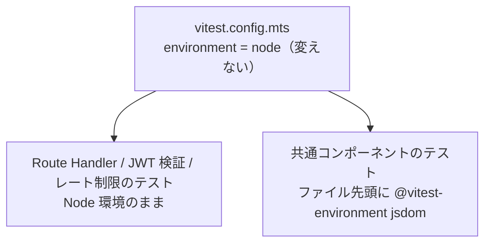

# 0020. Web のテストに DOM 検証ライブラリを追加する

- **ステータス**: 承認済み
- **日付**: 2026-09-16
- **決定者**: 人間（プロジェクトオーナー）

## コンテキスト

ADR 0007 は「テストは標準 `testing` と go-cmp のみで書く」を決め、アサーションライブラリもモックライブラリも入れないと定めた。これは **Go の制約**である。同 ADR §5 は Web について「テストランナーは Vitest」とだけ決め、設定はスキャフォールド（#9）の範囲へ送っている。**ライブラリを足すか否かは Web については決めていない。**

ADR 0007 の許可リスト（go-cmp のみ）を機械的に強制しているのは `make check-domain-deps` であり、その検査対象は Go の `services/api/internal/domain` に限られる。**Go 向けの制約が Web へ自動適用されることはない。** この整理は `docs/specs/web-app-scaffold.md` AC-3-5 が持っており、同 AC は「入れる判断も本仕様の範囲外であり、必要になった Issue で判断する」として、判断そのものを将来へ預けていた。

Issue #53（デザインシステム）が、その「必要になった Issue」に当たる。`docs/specs/design-system.md` AC-6 は共通コンポーネント11点の公開 props と a11y 属性を受け入れ条件として固定しており、そこには次が含まれる。

- `role` / `aria-modal` / `aria-invalid` / `aria-describedby` / `aria-labelledby` / `type` の付き方、`label` と入力欄の結び付き
- `ConfirmDialog` の Esc キーで `onCancel` が呼ばれ `onConfirm` が呼ばれないこと（AC-6-9）

依存を増やさない手段（`react-dom/server` の静的レンダリング）では、後者のキーボード操作を検証できない。検証しない選択を採れば、AC-6 の a11y 属性は**規律頼み**になる。このリポジトリは `check-domain-deps` や `spec-link` のように、規律頼みだった箇所を繰り返し機械検査へ移してきた経緯を持つ（`docs/harness/verification-loop.md`）。

一方で、依存を足すこと自体に代償がある。Go 側で「ライブラリを足さない」姿勢を採りながら Web 側で足せば、**同一リポジトリ内で姿勢がずれる。** ずれを承知で決めるなら、その事実が記録に残っていなければならない（ADR 0001）。

## 決定

**`apps/web` のテストに DOM 検証ライブラリを追加する。** 追加は下記の範囲に限る。

### 1. 追加するのは3点に限る

- `@testing-library/react`
- `@testing-library/dom`
- `jsdom`

**`@testing-library/user-event` は足さない。** キーボード・ポインタ操作の検証は、テストから発火する合成イベントに留める。実ブラウザのイベント順序・フォーカス移動・IME の挙動は再現しない。

**アサーションライブラリ／モックライブラリは引き続き足さない。** アサーションは Vitest 標準の `expect` を使う。`@testing-library/jest-dom` のようなマッチャ拡張も本 ADR の範囲に含めない。**3点の外へ広げる判断は人間の承認事項**であり、実装工程が自ら足さない。2点目以降の拡張が必要になったときは、ADR 0007 が go-cmp の追加について定めたのと同じく、**本 ADR を置換する判断**が要る。

**バージョンは本 ADR の条文に書かない**（特定時点の実測を条文へ埋め込まない。`docs/rules/development-process.md`）。pin の現況は `apps/web/package.json` が持つ。

### 2. グローバルの `environment` を `jsdom` へ変えない

Vitest のグローバル設定（`apps/web/vitest.config.mts`）の `environment` は `"node"` のままとする。DOM 環境は、**コンポーネントのテストファイル単位**で `@vitest-environment jsdom` のドックブロックを置いて与える。

理由は、**既存テストの前提を変えないため**である。`apps/web` には Route Handler・JWT 検証・レート制限といった Node 環境を前提とするテストが既にあり、グローバルを `jsdom` へ倒すと、それらは「意図せず別の環境で緑になっている」状態になる。DOM が要るのはコンポーネントのテストだけであり、要るところにだけ与える。

### 3. ADR 0007 を置換せず、補完する

**本 ADR は ADR 0007 を置き換えない。** ADR 0007 が定めた Go 側の制約（標準 `testing` + go-cmp のみ、モックライブラリ不採用、`check-domain-deps` を `-test` 込みで強制）は**一切変わらない**。本 ADR が決めるのは、ADR 0007 §5 が Web について空けたまま残した一点、すなわち「Vitest に何を足してよいか」である。したがって ADR 0007 のステータスは「承認済み」のままとする。

| 対象 | 許される依存 | 強制の手段 |
|---|---|---|
| Go `domain` の本体 | 標準ライブラリのみ | `make check-domain-deps`（ADR 0007） |
| Go `domain` のテスト | 標準ライブラリ + go-cmp | `make check-domain-deps`（ADR 0007） |
| `apps/web` のテスト | Vitest 標準 + 本 ADR の3点 | **無し（規律）** |

### 4. 受け入れ条件の中身は変えない

本決定は `docs/specs/design-system.md` AC-6 の中身を変えない。AC-6 は観測可能な出力として書かれており、**手段が確定したことで AC-6 の出力側が Red を踏めるようになった**だけである。Issue #53 の実装に効く受け入れ条件は同仕様 D-1 が持つ。

## 影響

### 良い影響

- **AC-6 の a11y 属性と `ConfirmDialog` の Esc が機械検査になる。** 規律頼みで残るはずだった受け入れ条件が、CI で落ちる対象へ移る
- **既存の Node 環境テストが無傷で残る。** 環境の切り替えがファイル単位に閉じるため、Route Handler・JWT 検証・レート制限のテストは前提を変えずに動き続ける
- **「Web にも ADR 0007 が効いている」という誤読が消える。** Go 向けの制約と Web 向けの制約が別の決定として分かれ、どちらがどこへ効くかが表で読める

### 悪い影響 / トレードオフ

- **この歯止めには機械検査が無い。** Web には `check-domain-deps` に相当する依存検査が無く、「追加は3点に限る」も「グローバルの `environment` を変えない」も、**CI では検出できない**。`package.json` に4点目を足しても、`vitest.config.mts` を `jsdom` へ倒しても、テストは緑のまま通る。受け皿は本 ADR の明文化とレビュー工程に留まる（`docs/specs/web-app-scaffold.md` AC-10-2、`docs/specs/design-system.md` AC-11-10）
- **Go と Web で姿勢がずれる。** 「ライブラリを足さない」を Go で貫きながら Web では足す。ずれは意図的だが、**読み手には一貫性の欠如に見えうる**。本 ADR がその説明責任を負う
- **jsdom は実ブラウザではない。** レイアウト・実描画・CSS の計算値は再現されない。コントラスト比や視覚的な崩れは、この検査では捕まらない
- **`user-event` を採らない代償として、キーボード操作の網羅を主張できない。** 検証できるのは AC-6 が名指しした挙動に限られ、緑は「アクセシブルである」ことを意味しない
- **依存が3つ増える。** 監査・更新の対象が増え、`apps/web` の依存グラフは jsdom 経由で相応に広がる

## 検討した代替案

| 案 | 却下理由 |
|---|---|
| (b) `react-dom/server` の静的レンダリングのみで出力 HTML を検証する（依存を増やさない） | **クリック・キーボード操作を検証できない。** `ConfirmDialog` の Esc（AC-6-9）が検査対象から落ち、限界として固定するほかなくなる |
| (c) DOM 検証を行わず、CSS・型・純関数の検査だけに限る | **AC-6 の a11y 属性が機械検査されなくなり、規律頼みになる。** このリポジトリが繰り返し塞いできた失敗の型をそのまま残すことになる |
| `@testing-library/user-event` も併せて入れる | 現時点の AC-6 が要求する操作は合成イベントで足りる。**必要が生じていない依存を先に入れない**（必要になった時点で本 ADR を置換して判断する） |
| グローバルの `environment` を `jsdom` にして一律 DOM 環境にする | 設定は単純になるが、**既存の Node 環境テストの前提を黙って変える。** 環境差に起因する偽 Green を持ち込む |
| ADR 0007 を置換して「Go と Web を貫く1つのテスト方針」に書き直す | ADR 0007 の Go 向けの決定は有効なまま。**覆っていない決定を置換しない**（ADR 0001 運用ルール3） |

## 関連

- **ADR 0007: テストは標準 testing と go-cmp のみで書く** — 本 ADR が**補完する**対象。置換ではない。§5 が Web について空けた一点を本 ADR が埋める
- ADR 0001: ADR は書き換えず、追記もしない（本 ADR を新規に起こした根拠）
- ADR 0004: Issue と docs のレファレンス型運用（**決定の本文は本 ADR が持ち、仕様側は参照に留める**）
- ADR 0015: デザインシステムに Claude Design を採用する（本決定を要した Issue #53 の前提）
- `docs/specs/design-system.md` D-1 — 本決定が Issue #53 の実装へ課す受け入れ条件（D-1-1〜D-1-4）
- `docs/specs/web-app-scaffold.md` AC-3-5 — 「Web には ADR 0007 が自動適用されない」整理と、判断を「必要になった Issue」へ預けた条文
- `docs/harness/verification-loop.md` — 規律頼みを機械検査へ移す方針、および Web 側に検査が無いこと
