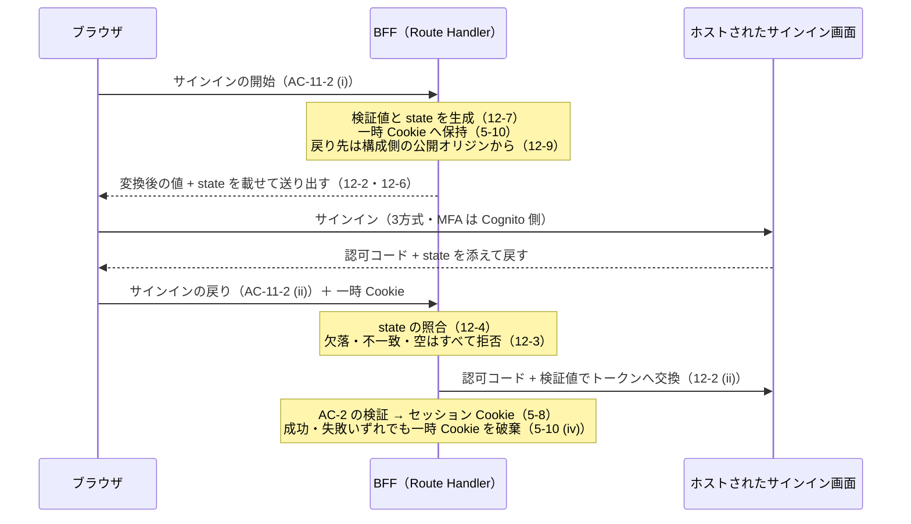

# BFF のトークン終端とロールの受け渡し

Issue #52 のうち **`apps/web`（BFF）に載る部分**の仕様。**方式の決定は `docs/adr/0016-cognito-end-user-authentication.md` が、操作者の伝達は `docs/specs/domain-api-http-contract.md` が持ち、本仕様はそれらを参照して「BFF の終端が満たすべき形」だけを定める**（ADR 0004）。認証方式・ロールの分界・ヘッダ名・エラーコードを本仕様へ書き写さない。

- **決定者**: 人間（プロジェクトオーナー）。方式は ADR 0016、操作者の伝達は 2026-07-27 の人間決定（`domain-api-http-contract.md` D-2）。**AI が業務判断・技術選定を足さない**
- **日付**: 2026-09-01
- **前提 ADR**: 0016（BFF 終端）／0014・0003（実行ロールの SigV4・Function URL の IAM 認証）／0007 §5（Web のテストは Vitest）／0004（レファレンス型運用）／0010 §A（依存の許可リストは人間の承認事項）
- **隣接仕様**: `docs/specs/cognito-auth-infra.md`（本 Issue のインフラ側）／`docs/specs/login-ui.md`（UI。本 Issue の非対象）／`docs/specs/domain-api-http-contract.md`（BFF より先のレイヤー）／`docs/specs/web-app-scaffold.md`（`apps/web` の足場とハーネス）

**ファイルを2つに分けた理由は `docs/specs/cognito-auth-infra.md`「なぜ仕様を2ファイルに分けるか」が持つ。ここへ書き写さない**（ADR 0004）。

> **着手条件は満たされている（2026-09-01）。** Q-A〜Q-F は同日に人間がすべて決定し（Q 節）、`web-app-scaffold.md` AC-9 / U-1 が課していた Route Handler の着手条件も**本 Issue で a〜e を決めたことで満たされた**（P-5・AC-11）。**AC-5-5（デモ用ロール切替）の署名鍵の供給経路も Q-F = (b) で決着しており、本仕様に着手を保留する条文は無い。**

---

## スコープ

- **Cognito が発行したトークンの検証**（BFF＝サーバー側で終端する。ADR 0016）
- **検証結果から現在ユーザーを確定させること**、および**ゲスト（未認証）との区別**
- **`Engineer` / `Approver` のデモ用切替を BFF が解釈できる形にすること**（受け渡し方式は Q-B = (a)。BFF が発行する署名済み Cookie）
- **確定した操作者をドメイン API へ渡す形の遵守**（`domain-api-http-contract.md` D-2 が既に決めた形に従うこと。**再定義しない**）
- **認証の終端に要する最小の Route Handler**（サインインの開始・戻り・ロール切替。Q-E = (a)。AC-11）
- **Route Handler のレート制限**（`src/lib/rate-limit.ts` 相当。U-1 の a〜e を 2026-09-01 に人間が決定。AC-11）
- 上記を `apps/web` の Vitest で検査すること

### 非スコープ

- **ログイン画面・ロール切替コントロールの UI** —— 後続のフロント Issue（`docs/specs/login-ui.md`）。**本仕様は画面を作らない**
- **Cognito のインフラ構成**（User Pool・Google 連携・アプリクライアント）—— `docs/specs/cognito-auth-infra.md`
- **認証以外の Terraform** —— `docs/specs/infra-terraform.md`（Issue #8）
- **ユーザー・ロール管理画面、承認者の割り当て・招待・組織管理** —— `docs/rules/scope.md`／ADR 0016 が非スコープとして維持
- **`src/lib/lambda-client.ts`（SigV4 署名によるドメイン API 呼び出し）の実装** —— 本仕様が要求するのは「認証の終端がその経路を壊さないこと」（AC-6）までであり、**クライアント本体は本 Issue で作らない**（`web-app-scaffold.md` AC-9）。**スタブ・TODO だけの空実装も置かない**（同 AC-8-5 と同型）
- **ドメイン API の HTTP 契約の実装**（各エンドポイントの呼び出し）—— `docs/specs/domain-api-http-contract.md` と後続 Issue
- **`docs/rules/` の改訂** —— 本 Issue は規約本文を書き換えない
- **本番への apply・デプロイ** —— 人間の承認事項

---

## 前提（P）— 確定事項（参照のみ、再定義しない）

| # | 前提 | 出典 |
|---|---|---|
| P-1 | エンドユーザー認証は **BFF（Next.js Route Handler）で終端**する。BFF が Cognito 発行のトークンを検証し、**そこから先のドメイン API 呼び出しは実行ロールの SigV4 署名**（ADR 0014）。**ADR 0003 / 0014 はサービス間認証で別レイヤーであり、ADR 0016 はそれを置換しない（併存）** | ADR 0016 |
| P-2 | **ブラウザ → Next.js Route Handler → Lambda の一方通行。** Route Handler 以外から Lambda を呼ばない。Lambda 呼び出しは `apps/web/src/lib/lambda-client.ts` に集約する | `docs/rules/architecture.md` |
| P-3 | **操作者の伝達は `X-Actor-Id` / `X-Actor-Role` の2ヘッダ**で行い、SigV4 の署名対象に含める。**ゲストは両ヘッダを送らない**（`Guest` というロール値を作らない）。ロールは `Engineer` / `Approver` の2つ。**人間が 2026-07-27 に確定** | `domain-api-http-contract.md` D-2・AC-1-4〜AC-1-8 |
| P-4 | **`X-Actor-Id` と技術者識別子は同一の識別子空間にある（Cognito が確定させた利用者識別子）。** ゲスト（ヘッダ不在）でも参照系の一部は 200、更新系と承認待ち一覧は 401 | `domain-api-http-contract.md` AC-1-6・AC-1-7 |
| P-5 | **Route Handler（`src/app/api/` 配下）の着手条件は満たされた。** 同条件は「最初の Route Handler を作る Issue は、レート制限のパラメータ（U-1 の a〜e）をセットで決めずに着手できない」であり、**この着手条件は 2026-08-14 の決定（案1）後も外れていない。本 Issue が「最初の Route Handler を作る Issue」であり、2026-09-01 に人間が a〜e をセットで決定したことで条件を満たした**（Q-E = (a)）。**a〜e の決定値の正解の置き場所は本仕様 AC-11 である**（`web-app-scaffold.md` へ書き写さない＝ADR 0004） | `web-app-scaffold.md` AC-9・U-1／本仕様 AC-11 |
| P-6 | **`apps/web` のテストは Vitest**（`vitest run`）。**アサーション／モックのライブラリを追加しない**。テストが0件で緑にしない。**依存を最小限にし、認証ライブラリを先回りして入れない** | ADR 0007 §5・`web-app-scaffold.md` AC-3-1／3-5／AC-8-4 |
| P-7 | **`npm ci` 以降、lint / test がネットワークアクセスを要求しない。決定的であること**（現在時刻・乱数に依存して結果が変わるテストを置かない） | `web-app-scaffold.md` AC-6-3・AC-6-4 |
| P-8 | **依存ライブラリの許可リストは人間の承認事項。** 列挙されていない改変は、弱体化の疑いがある側に倒す | ADR 0010 §A・`docs/rules/development-process.md` |
| P-9 | **自己承認排除（`approval.md` D-4）はロールに依存せず維持する。** ロールを `Approver` に切り替えても、自分が技術者である勤務月は承認・差戻しできない | ADR 0016・`login-ui.md` P-5・`domain-api-http-contract.md` AC-7-4 |
| P-10 | 現況（実測 2026-09-01）: `apps/web` に **Route Handler は存在せず、`src/lib/lambda-client.ts` も存在しない**。`src/lib/` は `.gitkeep` のみ。テストは `src/next.config.test.ts` の1本 | `apps/web` の作業ツリー |

---

## 受け入れ条件（AC）

| AC | 主題 | 主に効く工程 |
|---|---|---|
| AC-1 | 終端の位置 —— どこで検証するか | tester・implementer・reviewer |
| AC-2 | トークン検証が満たすこと（境界値） | tester・implementer |
| AC-3 | 検証の失敗と、ゲスト（未認証）の扱い | tester・implementer |
| AC-4 | 機密の露出禁止 | tester・reviewer |
| AC-5 | 現在ユーザーとロールの確定 | tester・implementer |
| AC-6 | ドメイン API 側との境界（AWS 認証を混ぜない） | reviewer |
| AC-7 | 依存と実装形（差し替え可能に受ける） | tester・implementer |
| AC-8 | テストの形（Vitest・決定的・ネットへ出ない） | tester |
| AC-9 | 本 Issue で作らないもの | reviewer |
| AC-10 | 限界 —— 緑が意味しないこと | reviewer |
| AC-11 | **Route Handler とレート制限**（U-1 の a〜e の決定値の持ち主） | tester・implementer・reviewer |
| AC-12 | **サインインの開始と戻り** —— 認可コードの保護（PKCE + `state`）と戻り先の出所 | tester・implementer・reviewer |
| Q | **決定済み（2026-09-01・2026-09-03 / 人間）** —— 採った案と採らなかった案の記録 | 全工程 |

### AC-1. 終端の位置

| # | 条件 | 期待 |
|---|---|---|
| 1-1 | 検証の実行場所 | トークンの検証は **BFF（サーバー側で動くコード）でのみ行う**（P-1）。**ブラウザ側の検証結果を信用しない** —— クライアントが「検証済み」と申告した値を、そのまま操作者として採用しない |
| 1-2 | 検証を経ない経路を作らない | **状態を変える操作へ至る経路が、検証を通らずに成立しないこと**（`docs/rules/architecture.md`・P-2）。ブラウザから Lambda（ドメイン API）へ直接到達する経路を作らない |
| 1-3 | 置き場所 | 検証の実装は **`apps/web/src/lib/` 配下**に置く（`docs/rules/architecture.md` が `src/lib/` を名指ししている階層規則に揃える。`web-app-scaffold.md` AC-1-6）。**具体のファイル名は本仕様で固定しない**。**リポジトリ直下へ出さない** |
| 1-4 | 検証を単体で呼べること | **検証は、HTTP の要求・応答を組み立てずに単体で呼べる形にする**（`infra-terraform.md` AC-8-6「設定の組み立てはネットワークに触れずに単体で呼べる」と同型）。**Route Handler の内側にだけ存在する形にしない** —— そうするとテストが Route Handler の起動を要し、P-5 の着手条件に縛られる範囲が広がる |

### AC-2. トークン検証が満たすこと（境界値）

**「検証する」だけでは検査に落ちないため、何を拒否するかを列挙する。** 下表がそのままテストの入出力になる。**受理／拒否の判定だけを検査し、拒否の文言は検査しない**（`infra-terraform.md` 10-4-w と同型）。

| # | 入力 | 期待 |
|---|---|---|
| 2-1 | 当該 User Pool が発行した、署名・発行者・宛先・有効期限・種別のいずれも正しいトークン | **受理**。利用者識別子を取り出せる |
| 2-2 | 署名が対応しない鍵で作られたトークン（改竄・別の鍵） | **拒否** |
| 2-3 | 署名アルゴリズムを `none` にしたトークン、署名部が空のトークン | **拒否**。**許可するアルゴリズムを許可リストで固定し、トークン側の申告に従わない** |
| 2-4 | 発行者（`iss`）が当該 User Pool でないトークン | **拒否** |
| 2-5 | 宛先（`aud` 相当）が当該アプリクライアントでないトークン | **拒否** |
| 2-6 | 有効期限（`exp`）を過ぎたトークン | **拒否** |
| 2-7 | 利用開始時刻（`nbf`）より前に検証されたトークン | **拒否** |
| 2-8 | 種別（`token_use` 相当）が想定と異なるトークン | **拒否**。**本 BFF が受け付ける種別を1つに固定し、別の種別を代替として受理しない** |
| 2-9 | トークンが無い／空文字／形式が JWT でない文字列 | **拒否**（例外で異常終了させず、未認証として扱えること。AC-3-1） |
| 2-10 | 検証に要する公開鍵の取得 | **サーバー側で取得し、再取得を要求ごとに行わない**（`infra-terraform.md` AC-8-4「コールドスタート時に1度だけ取得し、以後は再利用する」と同じ思想）。**取得先は AC-2-4 の発行者から導く** —— **鍵の取得先をブラウザからの入力で決めない** |
| 2-11 | 有効期限の判定に用いる時刻 | **検証を呼ぶ側から与えられる形にする**（テストが時刻に依存しないため。P-7・`web-app-scaffold.md` AC-6-4）。**現在時刻を暗黙に読む形だけにしない** |
| 2-12 | 検証の対象を増やさない | **本表以外の検証（独自クレームの要求等）を先回りで足さない。** 足す必要が生じたら本仕様を更新してから行う |

### AC-3. 検証の失敗と、ゲスト（未認証）の扱い

| # | 条件 | 期待 |
|---|---|---|
| 3-1 | 検証失敗 | **未認証として扱う**（例外で応答を壊さない）。**「検証に失敗したが通す」経路を作らない** —— 既定値へ黙って落ちない（`infra-terraform.md` AC-8-5 と同じ思想） |
| 3-2 | ゲスト（未認証）の操作可否 | **状態を変える操作を実行させない**（ADR 0016 決定 1・`work-month-screen-ui.md` AC-3 ゲスト行）。ドメイン API 側でも 401 になる（P-4）が、**BFF がそれに頼って素通しにしない**（多層防御。ADR 0003 の思想と同型） |
| 3-3 | ゲストの閲覧 | **未認証でも閲覧導線が成立する**（ADR 0016 決定 1・`login-ui.md` AC-4）。**未認証を理由に一律で拒否しない** —— 参照系の可否は `domain-api-http-contract.md` AC-1-6 が持ち、**本仕様へ書き写さない** |
| 3-4 | 失敗の応答 | **機密を露出させず、再試行できる**（`login-ui.md` AC-7-1）。**破壊的な副作用を伴わない**（同 AC-7-2）。Q-C = (a) の決着を受け、具体は次のとおり —— (i) **状態を変える操作へ至る Route Handler は 401 を返す**。これは 3-1 の「未認証として扱う」の帰結であり、**`domain-api-http-contract.md` AC-1-6 が未認証（ヘッダ不在）に定めた扱いと同じになる**（新しい契約を作らず、同型として揃える。エラーコードの実体は同仕様が持ち、本仕様へ書き写さない）、(ii) **検証に失敗したセッション Cookie を破棄する**（無効な値を保持したまま次の要求へ持ち越さない。5-5 のロール Cookie も同時に破棄する）、(iii) **応答の本文・ヘッダに、トークン・その一部・失敗の内部的な理由（署名不一致か期限切れかの別を含む）を載せない**（4-1・4-2。**受理／拒否の判定だけを検査し、拒否の文言は検査しない**＝AC-2 前文）、(iv) **再試行の導線を壊さない** —— 失敗を理由に Cookie 以外の状態を変えない |

### AC-4. 機密の露出禁止

| # | 条件 | 期待 |
|---|---|---|
| 4-1 | ログ・エラー文言 | **トークン・その一部・クライアントシークレット・パスワード・ロール切替 Cookie の署名鍵（5-5 (viii)）をログとエラー文言に含めない**（`infra-terraform.md` AC-8-9・`docs/rules/security.md`・`login-ui.md` AC-2-3） |
| 4-2 | URL | **トークンを URL（クエリ・パス）へ載せない**（同 AC-2-3。参照元ヘッダとアクセスログへ漏れる） |
| 4-3 | クライアント側の永続ストレージ | **トークンをブラウザの永続ストレージ（`localStorage` / `sessionStorage` 等、スクリプトから読める場所）へ置かない。この禁止は保持方式に依らず成立する。** Q-C = (a) が定めた保持方式（`HttpOnly` + `Secure` + `SameSite` の Cookie。5-8）は**本行と矛盾しない** —— `HttpOnly` の Cookie は**スクリプトから読めず**、`localStorage` 等の永続ストレージでもないためである。**この整合を根拠に本行を緩めない**（`HttpOnly` を外した Cookie・スクリプトから読む経路を作らない） |
| 4-4 | リポジトリ | **実トークン・実クライアントシークレット・実 URL・実アカウント ID をコードにもテストにも `docs/` にも書かない**（`docs/rules/security.md`）。テストで使う鍵・トークンは**テスト内で組み立てるか、明らかにダミーと読める固定値**にする |
| 4-5 | シークレット検査 | **`make scan-secrets` が通ること。** 落ちた場合、**gitleaks の除外設定を黙って足さずに停止して人間へ上げる**（`web-app-scaffold.md` AC-8-3・AC-11-9） |

### AC-5. 現在ユーザーとロールの確定

| # | 条件 | 期待 |
|---|---|---|
| 5-1 | 現在ユーザーの出所 | **`X-Actor-Id` に載せる利用者識別子は、検証済みトークンから取り出した値だけから決める**（P-3・P-4・`login-ui.md` AC-5-2）。**クライアントが送ってきた識別子を採用しない**（なりすましの経路になる） |
| 5-2 | どのクレームを使うか | **不変の主体識別子（`sub`）を使う**（Q-A = (a)。2026-09-01 に人間が決定）。**`X-Actor-Id` に載せる値は、検証済みトークンの `sub` からのみ決める。** **メールアドレス・ユーザー名など、変更されうる／方式をまたいで衝突しうるクレームを `X-Actor-Id` に載せない**（`cognito-auth-infra.md` AC-4-6・Q-3 = (a) により、同じメールでも方式ごとに別の `sub` になる）。**表示のために別のクレームを使う場合でも、`X-Actor-Id` の値は `sub` から決める**（Q-A で採らなかった (c) の後半に当たる部分は本 Issue の非対象＝画面は `login-ui.md`）。**`sub` が取り出せないトークンは受理しない**（AC-2-1 の「利用者識別子を取り出せる」を満たさない） |
| 5-3 | ロールの値 | **`Engineer` / `Approver` の2つだけ**（P-3・ユビキタス言語）。**`Guest` というロール値を作らない** —— ゲストは**両ヘッダの不在**で表す（`domain-api-http-contract.md` AC-1-5・D-2） |
| 5-4 | ヘッダの組 | **両方そろって送るか、両方送らないかのいずれか**（同 AC-1-4。片方だけは 400） |
| 5-5 | デモ用ロール切替の受け渡し | **BFF が発行する署名済み Cookie に保持し、切替は BFF の経路（AC-11-2 (iii)）を通す**（Q-B = (a)。2026-09-01 に人間が決定）。確定した条件は —— (i) **ロールの値は、BFF が署名した Cookie を BFF 自身が検証して得た値だけから決める。署名が検証できない・欠けている Cookie の値を採用しない**（**クライアントの自己申告を認可の根拠にしない**＝Q-B 決定。改竄不可）、(ii) **切替を要求できるのは BFF の経路だけ**とし、**要求ヘッダ・クエリ・本文で与えられたロールを採用しない**、(iii) **値は `Engineer` / `Approver` のいずれかに限る**（5-3）。それ以外は切替を成立させない、(iv) **切替はロールにのみ効き、利用者識別子（5-1・5-2）を書き換えない**、(v) **ゲスト（未認証）には切替を与えない** —— 検証済みセッションが無い状態でロール Cookie を発行しない（`login-ui.md` AC-6-5）、(vi) **Cookie の属性は 5-8 と同じ**（`HttpOnly` + `Secure` + `SameSite`）、(vii) **切替は BFF 側で解釈し、ブラウザがドメイン API へ直接届く経路を作らない**（P-2）、(viii) **署名鍵は BFF の環境変数から受け取る**（Q-F = (b)。2026-09-01 に人間が決定。Terraform 側の注入と逸脱の範囲は `cognito-auth-infra.md` AC-8-6 / AC-8-7 が持ち、**本仕様へ書き写さない**＝ADR 0004）。帰結として —— **未設定・空のときは既定値へ黙って落ちず、推測もせず、失敗として扱う**（AC-7-5）。すなわち **鍵が無い状態でロール切替を素通しにしない**（無署名の Cookie を発行しない・自己申告を採用しない・インスタンスごとに鍵を生成して代替しない＝予約同時実行数 5 で別インスタンスが検証できない）。**鍵をログ・エラー文言・応答・URL・ブラウザから読める場所へ出さない**（4-1〜4-3）。**鍵を要求（ヘッダ・クエリ・本文・Cookie）から受け取る形にしない**。**署名と検証のために npm 依存を追加しない**（Q-D = (a) が承認したのはトークン検証の1本だけ。AC-7-1 (vi)・AC-11-13。**必要になったら足す前に停止して人間へ上げる**）。**限界（鍵が tfstate と環境変数に残ること・ローテーション手段を本 Issue で持たないこと）は `cognito-auth-infra.md` AC-11-12 が持つ**（10-13 から参照する） |
| 5-6 | 自己承認排除との関係 | **ロールを `Approver` に切り替えても、自分が技術者である勤務月の承認・差戻しは成立しない**（P-9）。**この不変条件をドメイン API 側の 403 に委ねきらず、BFF もロール切替を理由に迂回路を作らない**。**判定の実体はドメイン側が持ち、本仕様へ書き写さない**（`domain-api-http-contract.md` AC-7-4） |
| 5-7 | 管理 UI との分界 | **ロールの割り当てを保存・管理する仕組みを作らない**（`docs/rules/scope.md`／ADR 0016／`login-ui.md` AC-6-3）。**Cognito のグループ・カスタム属性をロールの実体にしない**（`cognito-auth-infra.md` AC-10-4）。**5-5 の Cookie は要求ごとのデモ用の切替状態であって、ロールの割り当ての保存先ではない** —— サーバー側に利用者ごとのロールを永続させない |
| 5-8 | 検証済みセッションの保持方式 | **トークンは `HttpOnly` + `Secure` + `SameSite` を付けた Cookie に保持する**（Q-C = (a)。2026-09-01 に人間が決定）。確定した条件は —— (i) **3つの属性をいずれも欠かさない**（`HttpOnly` を外さない・`Secure` を外さない・`SameSite` を付ける。`SameSite` の具体の値は実装側が持ち、**サインインの戻り（AC-11-2 (ii)）が成立する範囲で最も狭いものを選ぶ**）、(ii) **外部のセッションストアを作らない**（Q-C で採らなかった (b)。予約同時実行数 5 のためインスタンスが分かれるが、**新規リソースを増やさない**＝`docs/rules/cost-guardrails.md`）、(iii) **サーバー側のメモリにセッションを持たない**（インスタンス間で共有されず、5 倍の不整合を認証へ持ち込むため）、(iv) **Cookie の値をブラウザのスクリプトから読める場所へ複製しない**（4-3）、(v) **有効期限が切れた・検証に失敗したセッション Cookie は破棄する**（3-4 (ii)） |
| 5-9 | Cookie のサイズ | **Cookie のサイズ上限（ブラウザ・CloudFront の制約）に触れうることを、方式の代償として受け入れる**（Q-C = (a) の既知のトレードオフ）。**上限を回避するために外部ストアを導入しない** —— 収まらないと分かったら、**保持するトークンの種類を減らせるかを先に検討し、それでも収まらなければ停止して人間へ上げる**（Q-C を選び直す判断は人間の承認事項）。**上限に触れるかどうかは Vitest では分からない**（限界 10-12） |
| 5-10 | **サインインの一時値の保持方式**（AC-12 が用いる値の持ち主） | **サインインの開始（AC-11-2 (i)）から戻り（同 (ii)）までの間だけ保つ一時的な値であり、検証済みセッション（5-8）とは別に持つ。** 条件は —— (i) **保持先はブラウザへ送る Cookie とし、外部のセッションストアもサーバー側のメモリも用いない**（5-8 (ii)(iii) と同じ理由。**予約同時実行数 5 でインスタンスが分かれるため、開始を処理したインスタンスと戻りを処理するインスタンスが同一とは限らない**）、(ii) **属性は 5-8 (i) の3つ（`HttpOnly` + `Secure` + `SameSite`）をいずれも欠かさない** —— **一時値もブラウザのスクリプトから読める場所へ置かない**（4-3）、(iii) **`SameSite` の値の選定は、本行の一時 Cookie が戻りの要求で送られるかどうかに依存する** —— **ホストされたサインイン画面（別サイト）からの遷移で送られない値を選ぶと、AC-12 の照合が成立しない**。これは 5-8 (i)「**サインインの戻り（AC-11-2 (ii)）が成立する範囲で最も狭いもの**」の「成立する範囲で」に具体を与えるものであり、**同行を緩めるものではない**（**成立する範囲のなかで、より広い値を選んでよいことにはならない**）、(iv) **戻りを処理した時点で破棄する** —— **成功・失敗のいずれでも次の要求へ持ち越さない**（3-4 (ii) が失敗したセッション Cookie の破棄を求めるのと同じ理由。**使い終えた一時値を次のサインインへ再利用しない**）、(v) **有効期間を検証済みセッション（5-8）より長くしない**。**具体の Cookie 名・`SameSite` の値・有効期間は実装側が持ち、本仕様に書かない**（AC-1-3 と同型） |
| 5-11 | **デモ用ロール切替の反転元（既定のロール）** —— **決定済み（2026-09-03 / 人間。Q-J）** | **検証済みセッションがあり、5-5 (i) を満たす正当なロール Cookie が無いときの反転元は `Engineer` とする。** 切替の要求（AC-11-2 (iii)）は、この反転元を `Approver` へ反転させる。確定した条件は —— (i) **「正当なロール Cookie が無い」に含めるもの** —— **ロール Cookie が存在しない（初回の切替）／署名が欠けている／署名が検証できない（改竄された・別の鍵で署名された）／値が `Engineer` / `Approver` のいずれでもない**（5-5 (i)(iii)）。**これらをすべて同じ扱いとし、いずれの場合も反転元を `Engineer` とする** —— 場合ごとに別の既定を与えない、(ii) **検証に失敗した Cookie を昇格の根拠にしない** —— **失敗したときは既定へ落ちるのであって、Cookie が主張する値へは落ちない**。**`Approver` を主張する改竄された Cookie があっても、反転元は `Engineer` である**（5-5 (i) の帰結であり、3-1「検証に失敗したが通す経路を作らない」と同じ思想）、(iii) **採った理由は、低い権限側を既定にすることである** —— **改竄・検証失敗の Cookie が昇格につながらない形にする**。**自己承認排除はロールに依存せず維持されるため（P-9。本文の持ち主は `login-ui.md` AC-6-4 と `domain-api-http-contract.md` AC-7-4 であり、本仕様へ書き写さない＝ADR 0004）、どちらを既定にしても自己承認の穴は開かない。それでも既定は権限の低い側を採る**、(iv) **本行が定めるのはデモ用の切替の反転元であって、ロールの割り当ての保存ではない**（5-7 を緩めない）。**既定は利用者に依らず一律であり、「この利用者の既定は `Approver`」といった状態をサーバー側に持たない** —— **利用者ごとのロールを永続させる仕組みを、本行を根拠に作らない**、(v) **ゲスト（未認証）には本行を適用しない** —— ゲストはロールを持たず、**両ヘッダの不在**で表す（5-3・5-5 (v)・P-3）。**ゲストへ既定として `Engineer` を与えない**、(vi) **本行は 5-5 (viii)・AC-7-5 を緩めない** —— **署名鍵が未設定・空のときに「既定の `Engineer` として素通しにする」ことの根拠に本行を用いない**。鍵が無いときは切替が成立せず、失敗として扱う |

#### 検査（Vitest）— 5-11 の反転元。**下表がそのままテストの入出力になる**

**Red を先に踏む**（AC-8-2）。**反転後の値だけを見て緑にしない** —— 切替を要求した場合だけを検査すると、**Cookie の主張を反転元に採る実装も緑になりうる**（AC-8-5 と同じ理由。5-c と 5-d を対で検査する）。**拒否の文言は検査しない**（AC-2 前文）。

| # | 入力 | 期待 |
|---|---|---|
| 5-a | 検証済みセッションがあり、**ロール Cookie が無い**。切替を要求しない | 操作者のロールは **`Engineer`**（5-11） |
| 5-b | 検証済みセッションがあり、**ロール Cookie が無い**。切替を**1回**要求する | 反転して **`Approver`** になる（反転元が `Engineer` であること） |
| 5-c | **`Approver` を主張するが検証できないロール Cookie**（改竄された／別の鍵で署名された／署名が欠けた）がある。切替を要求しない | 操作者のロールは **`Engineer`**。**`Approver` にならない**（5-11 (ii)。**3通りを個別に検査する**） |
| 5-d | 同じ Cookie がある状態で、切替を**1回**要求する | **`Approver`** になる。**`Engineer` にならない** —— `Engineer` になるのは Cookie の主張（`Approver`）を反転元に採った場合であり、**5-11 (ii) に反する** |
| 5-e | **正しく署名されているが、値が `Engineer` / `Approver` のいずれでもない**ロール Cookie がある | **その値を採用しない**（5-5 (iii)）。反転元は **`Engineer`**（5-11 (i)） |
| 5-f | **正当に署名された `Approver` のロール Cookie**がある。切替を要求しない | **`Approver`**（5-5 (i)）。**既定は反転元であって、正当な Cookie を無視する根拠ではない** —— **5-11 が `Engineer` を返す実装で緑にならないこと** |
| 5-g | ゲスト（**検証済みセッションが無い**）が切替を要求する | **切替が成立せず、ロール Cookie を発行しない**（5-5 (v)）。**既定として `Engineer` を与えない** —— 操作者ヘッダは**両方とも送らない**（5-3・P-3） |

#### 検査（Vitest）— **セッション Cookie（5-8 (i)）とロール Cookie（5-5 (vi)）の属性**。**下表がそのままテストの入出力になる**

**Red を先に踏む**（AC-8-2）。**本表の対象は 5-a〜5-g（5-11 の反転元）とは別で、Cookie に付く属性である。** 見るのは **`HttpOnly` / `Secure` / `SameSite` の3属性がいずれも欠けていないこと**までであり、**`SameSite` にどの値を採るかは実装側が持つため検査しない**（5-8 (i)・AC-1-3 と同型）。**一時 Cookie（5-10 (ii)）についての同じ検査は 12-k が持つ。ここへ書き写さない**（ADR 0004。**同じ要求を両所へ置かない**）。

| # | 入力 | 期待 |
|---|---|---|
| 5-h | **サインインの戻り（AC-11-2 (ii)）が成功した応答**が送出する、**検証済みセッション Cookie の `Set-Cookie`** | **3属性をいずれも欠かない**（5-8 (i)）。**属性を欠いた形が緑にならないこと**（12-k と同じ粒度）。**応答が実際に送出する `Set-Cookie` を直接見る** —— **共通の組み立て（直列化）の関数だけを呼んで確かめる形にしない**。理由は、**関数が属性を付けていても、経路がその関数を通らなければ属性は失われ、関数だけを見る検査は緑のまま残る**ためである |
| 5-i | **デモ用ロール切替（AC-11-2 (iii)）が成立した応答**が送出する、**ロール Cookie の `Set-Cookie`** | **3属性をいずれも欠かない**（5-5 (vi) が 5-8 (i) と同じ属性を課す）。**属性を欠いた形が緑にならないこと**。**5-h と同じく、応答が実際に送出する `Set-Cookie` を直接見る**（組み立ての関数だけを見る形にしない） |

### AC-6. ドメイン API 側との境界（AWS 認証を混ぜない）

| # | 条件 | 期待 |
|---|---|---|
| 6-1 | AWS 認証の手段 | **ドメイン API への到達は BFF の実行ロールによる SigV4 のみ**（ADR 0014・0003・P-1）。**Cognito のトークンを AWS の認証に用いない** —— **Identity Pool 等で AWS の資格情報へ交換する経路を作らない**（`docs/rules/security.md`「ランタイムの AWS 認証に外部 IdP との federation を挟まない」・`cognito-auth-infra.md` AC-6-2） |
| 6-2 | トークンの転送 | **Cognito のトークンをドメイン API へそのまま転送しない。** ドメイン API はトークン検証をせず、**BFF が確定させた操作者・ロールを2ヘッダで受け取る**（`domain-api-http-contract.md` P-2・D-2） |
| 6-3 | 署名対象 | **操作者ヘッダは SigV4 の署名対象に含める**（同 AC-1-8）。**この実現は `lambda-client.ts` の責務であり、本 Issue では作らない**（AC-9）。**本仕様が要求するのは、認証の終端がこの形を前提として壊さないことまでである** |
| 6-4 | 契約を再定義しない | ヘッダ名・エラーコード・ステータスコードの実体は `domain-api-http-contract.md` が持つ。**本仕様へ書き写さない**（ADR 0004） |

### AC-7. 依存と実装形

| # | 条件 | 期待 |
|---|---|---|
| 7-1 | 依存の追加 | **Cognito 専用の検証ライブラリを1本だけ追加する**（Q-D = (a)。2026-09-01 に人間が決定。`aws-jwt-verify` 相当で、**発行者・宛先・種別の検証まで含むもの**）。確定した条件は —— (i) **本数はちょうど1本**。**汎用の JWT / JOSE ライブラリと併用しない**（2本目を足さない）、(ii) **用途はトークン検証に限る**。他の用途へ流用しない、(iii) **署名検証を自前実装しない**（Q-D で採らなかった (c)。誤りがランタイムでしか露見しない）、(iv) **追加先は `apps/web/package.json` の依存であり、`package-lock.json` をコミットする**（`web-app-scaffold.md` AC-2-3）、(v) **アサーション／モックのライブラリは引き続き追加しない**（7-3）、(vi) **2本目が要ると分かったら、足す前に停止して人間へ上げる**（P-8・ADR 0010 §A。**許可リストの無断拡大にあたる**）。**ライブラリ名の実体は `package.json` が持ち、版を本仕様に書かない** |
| 7-2 | 差し替え可能に受ける | **公開鍵の取得（AC-2-10）は、呼ぶ側が宣言する最小のインターフェース越しに受け取る**（`infra-terraform.md` AC-8-11・AC-9-12 と同型。**新しい ADR も新しい技術選定も要さず、既存の決定の適用である**）。①宣言するのは**呼ぶ側**、②メソッドは AC-2 を満たす最小に限り、これ以外を足さない、③**ライブラリ固有の型を公開 API の引数・戻り値へ露出させない**、④**テストは手書きの差し替え（インメモリ Fake）で書く**。**Q-D = (a) の決着は本行を緩めない** —— 採用するライブラリが自ら公開鍵を取得する機能を持っていても、**テストがネットへ出ない形で差し替えられること**（AC-8-3）。差し替えられない形で組み込まない |
| 7-3 | モックライブラリを入れない | **アサーション／モックのライブラリを追加しない**（P-6・`web-app-scaffold.md` AC-3-5）。Vitest 標準の `expect` を使う |
| 7-4 | 層を増やさない | 検証の実装を `src/lib/` に閉じ、**新しい層・新しいディレクトリ階層の規則を作らない**（`web-app-scaffold.md` AC-1-5 / AC-1-6 が確定させた配置に従う） |
| 7-5 | 環境変数の読み取り | User Pool・アプリクライアントの識別子（`cognito-auth-infra.md` AC-8-1）と、**ロール切替 Cookie の署名鍵**（5-5 (viii)・Q-F = (b)。同 AC-8-6）は、**いずれも BFF の環境変数から受け取る**（Terraform 側が注入する）。**未設定・空のときは、既定値へ黙って落ちず、推測もせず、失敗として扱う**（`infra-terraform.md` AC-8-5・AC-9-12 と同型）。**環境変数の名前の実体は構成側と実装側が持ち、本仕様に書かない** —— **本仕様は役割で参照する**。**「失敗として扱う」が応答としてどう現れるかは 7-7 が持つ** |
| 7-6 | **公開オリジンの読み取り**（Q-H = (a)。2026-09-03 に人間が決定） | **サインインの戻り先（`redirect_uri`）の組み立てに用いる公開オリジンは、BFF の環境変数から受け取る**（構成側が注入する。**Terraform 側の要求の持ち主は `cognito-auth-infra.md` AC-8-8 / AC-8-9 であり、本仕様へ書き写さない**＝ADR 0004）。確定した条件は —— (i) **要求（ヘッダ・クエリ・本文・Cookie）から公開オリジンを導かない**（AC-12-9）。**これは AC-2-10「鍵の取得先をブラウザからの入力で決めない」と同型の要求である** —— 検証や戻り先といった**信頼の起点をブラウザからの入力で決めない**、(ii) **未設定・空のときは、既定値へ黙って落ちず、推測もせず、失敗として扱う**（7-5 と同じ扱い）。**要求元のホストを代替として用いない** —— それは (i) が禁じた「推測」そのものであり、**フォールバックとしても認めない**、(iii) **環境変数の名前の実体は構成側と実装側が持ち、本仕様に書かない** —— **本仕様は役割で参照する**（7-5 と同型） |
| 7-7 | **構成が欠けているときの応答の形**（7-5・7-6 (ii)・5-5 (viii) の「失敗として扱う」の現れ方） | **構成が欠けていることを、応答の形として一意に決める** —— **7-5 / 7-6 が「失敗として扱う」とだけ定めていたため、応答の形が実装ごとに分かれうる**。条件は —— (i) **ステータスは、サーバー側の構成の失敗を表す 5xx とする**。**未認証（3-4 (i) の 401）・超過（11-8 の 429）と同じ値にしない** —— **構成の欠落を、利用者側に原因がある失敗と応答上で区別できなくしない**、(ii) **本来の処理を実行しない** —— **送り出し（AC-11-2 (i)）を成立させず、コード交換（同 (ii)）へ進まず、セッション Cookie（5-8）・ロール Cookie（5-5）を発行しない**（11-8 (i)「本来の処理を実行しない」と同型）。**一時 Cookie（5-10）を明示的に破棄しないことは限界 10-18 が持つ**、(iii) **応答の本文・ヘッダに、欠けている変数の名前・その値・失敗の内部的な理由を載せない**（4-1・4-2・3-4 (iii) と同型。**署名鍵が欠けている場合を含む**＝5-5 (viii)）、(iv) **応答の本文で状態・理由を説明しない** —— **本文を持たない（空である）**。理由は、**本文に置いた説明はステータスと独立に書けるため、両者が食い違っても検査に掛からない**ためである（説明を持たせなければ、食い違いうる面が無くなる）。**食い違いを防ぐために本文の文字列を期待値として突き合わせる形を採らない** —— **検査は「本文が空であること」に留める**（AC-2 前文「拒否の文言は検査しない」と同じ思想）、(v) **5xx のうちどの値を採るかは実装側が持ち、本仕様は 5xx であることまでを定める**（AC-1-3・11-3 と同型。**限界は 10-17**） |

#### 検査（Vitest）— 7-7 の応答の形。**下表がそのままテストの入出力になる**

**Red を先に踏む**（AC-8-2）。**受理側と対で検査する** —— 失敗側だけを検査すると、**常に失敗を返す実装が緑になる**（AC-8-5 と同じ理由。7-d と対にする）。**拒否の文言は検査しない**（AC-2 前文）。

| # | 入力 | 期待 |
|---|---|---|
| 7-a | **7-5 / 7-6 が読む値のいずれか1つが未設定／空**の状態で、AC-11-2 の3経路を呼ぶ（**ロール切替は検証済みセッションを与えたうえで呼ぶ** —— 未認証の 401 と混ざらないため） | **本来の処理が成立しない** —— **送り出し（302）が起きず、コード交換へ進まず、セッション Cookie・ロール Cookie を発行しない**（7-7 (ii)） |
| 7-b | 同上 | **ステータスが 5xx である**（7-7 (i)）。**401・429 と同じ値にならない** |
| 7-c | 同上 | **応答の本文が空である**（7-7 (iv)）。**本文の文字列を期待値として突き合わせない** |
| 7-d | **構成がそろっている**状態で同じ3経路を呼ぶ | **7-a〜7-c の結果にならない** —— **送り出し・コード交換・Cookie の発行が成立し、ステータスが 5xx にならない**（**常に失敗を返す実装が緑にならないこと**＝AC-8-5） |

### AC-8. テストの形

| # | 条件 | 期待 |
|---|---|---|
| 8-1 | 手段 | **Vitest**（`make test-web` の経路。P-6）。**新しいテストランナー・外部ツールを導入しない** |
| 8-2 | Red を先に踏む | AC-2 の各行に対応するテストを**実装より先に書き、落ちることを確認してから実装へ入る**（`docs/rules/development-process.md` TDD）。**`web-app-scaffold.md` AC-3-7 の例外（reviewer によるミューテーション実測）は本 Issue に適用しない** —— 同 (f)「ランナー導入後の Issue には適用しない」 |
| 8-3 | 決定的であること | **現在時刻・タイムゾーン・乱数に依存しない**（P-7・AC-2-11。時刻は引数で与える）。**外部へ通信しない** —— **実際の Cognito・実際の JWKS エンドポイントを呼ばない**（`infra-terraform.md` 12-9 / 12-15 と同型） |
| 8-4 | 鍵とトークン | テスト用の鍵・トークンは**テスト内で組み立てるか、明らかにダミーと読める固定値**にする（AC-4-4） |
| 8-5 | 意味のあるテスト | **対象が壊れても落ちないテストを置かない**（`web-app-scaffold.md` AC-3-3）。**AC-2 の拒否側（2-2〜2-9）を、受理側と同じ数だけ検査する** —— 受理だけを検査すると、**常に受理する実装が緑になる**。**5-5 のロール Cookie も同様に拒否側を検査する** —— 署名が検証できない Cookie・署名の欠けた Cookie・別の鍵で署名された Cookie・`Engineer` / `Approver` 以外の値（5-5 (i)(iii)）、および**鍵が未設定のとき**（5-5 (viii)）に**切替が成立しないこと**を見る。受理側だけを検査すると、**常に採用する実装が緑になる** |

### AC-9. 本 Issue で作らないもの（対象外の固定）

**以下が無いことは欠落ではなく仕様である。** レビューで「足りない」と指摘しない。

**`src/lib/rate-limit.ts`（レート制限）と Route Handler は、2026-09-01 の決定（Q-E = (a)）により本 Issue で作る側へ移った。AC-11 が持つ。**

| 対象 | いつ / どこで | 根拠 |
|---|---|---|
| ログイン画面・ロール切替コントロールの UI | 後続のフロント Issue | `docs/specs/login-ui.md` |
| `src/lib/lambda-client.ts`（SigV4 署名） | ドメイン API を実際に呼ぶ Issue。**スタブも置かない** | `web-app-scaffold.md` AC-9・AC-8-5 と同型 |
| **AC-11-2 の3つ以外の Route Handler**（勤務月・締め・承認などの業務エンドポイント） | 各業務の後続 Issue。**本 Issue で発明しない** | `docs/specs/domain-api-http-contract.md`・AC-11-2 |
| **サインアウト（セッション破棄）の経路** | 要求する仕様がまだ無い（`login-ui.md` は AC-4「ゲストとして続行」を入口として持つが、サインアウトを要求していない）。**要ると判断したら、作る前に停止して人間へ上げる** | `docs/specs/login-ui.md`・ADR 0004（仕様に無いものを発明しない） |
| **MFA(TOTP) のチャレンジ応答・TOTP 登録の経路** | **Cognito 側が持つ**（`cognito-auth-infra.md` AC-5-6 (v)・Q-1 = (a)）。BFF に実装しない | ADR 0016・`login-ui.md` AC-2-2 の注記 |
| Cognito のインフラ構成 | `docs/specs/cognito-auth-infra.md`（本 Issue のインフラ側） | ADR 0016 |
| ユーザー・ロール管理画面、承認者の割り当て | 非スコープ | `docs/rules/scope.md`・ADR 0016 |
| ドメイン API の各エンドポイントの呼び出し | 後続 Issue | `docs/specs/domain-api-http-contract.md` |

### AC-10. 限界 —— 緑が意味しないこと

**以下は仕様どおりの限界であり、欠陥ではない。**

| # | 内容 |
|---|---|
| 10-1 | **Vitest の緑は、実際の Cognito が発行したトークンを検証できることを意味しない。** テストは自ら組み立てた鍵とトークンで動く（AC-8-3・AC-8-4）。**実 Cognito との相互運用は apply 後にしか確かめられない**（`cognito-auth-infra.md` AC-11-2 と同型） |
| 10-2 | **環境変数の名の一致は検査されない。** Terraform 側（`cognito-auth-infra.md` AC-9-m）と本仕様の vitest の双方が緑でも、**名がずれていれば両方とも緑のまま残る**（`infra-terraform.md` 12-28 と同じ現れ方） |
| 10-3 | **Web には `check-domain-deps` に相当する依存検査が無い。** 「アサーション／モックライブラリを入れない」（AC-7-3）・「層を増やさない」（AC-7-4）は**機械検査されず、規律で守る**（`web-app-scaffold.md` AC-10-2） |
| 10-4 | **「経路を作らない」系の要求（AC-1-2・AC-6-1・AC-5-7）は機械検査できない。** 存在しないものを検査する手段が無く、`infra-terraform.md` 12-21 と同じ性質である。**担保はレビューと規律**。**文字列検査を足して補わない**（同 D-24）。**要求としては緩めていない** |
| 10-5 | **自己承認排除（P-9）が実際に効くことは本仕様のテストでは示せない。** 判定はドメイン側にあり（`domain-api-http-contract.md` AC-7-4）、本仕様が持つのは「BFF が迂回路を作らない」ことまでである |
| 10-6 | **ロール切替がデモ用であることは、本番の権限設計を示さない**（ADR 0016「悪い影響」）。**この限界は Q-B = (a)（署名済み Cookie）の決着によっても消えない** —— 改竄できないことと、権限設計として正しいことは別である |
| 10-7 | **コストガードレールの1枚（Route Handler のレート制限）は、本 Issue で実装される**（Q-E = (a)・AC-11）。`web-app-scaffold.md` U-1 が「最初の Route Handler を作る Issue でセットで決める」とした引き継ぎは、**本 Issue で完了する**。**ただし「Route Handler を作る時点で『後で入れる』は許容されない」という要求は残る**（CLAUDE.md）。**本 Issue 以降に Route Handler を足す Issue も、レート制限を通すこと**（AC-11-12）。**そのことの機械検査は無い**（`web-app-scaffold.md` AC-10-6 と同じ性質。規律で守る） |
| 10-8 | **レート制限のカウンタはインメモリであり、近似でしかない**（AC-11-7・U-1 c の決定）。**予約同時実行数 5 のためインスタンスが分かれ、実効の上限は最大 5 倍（＝最大 300 req / 60 秒 / キー）になりうる。これは受け入れた近似であり、欠陥ではない。** あわせて、**インスタンスの再作成でカウンタは失われる**（再作成の直後は上限が実質的にリセットされる）。**Vitest はこの 5 倍を検査しない** —— テストは単一のプロセス内でしか動かない。**この近似を理由に外部ストアを導入しない**（AC-11-7） |
| 10-9 | **SSR ページの帯域は守られない**（AC-11-9・U-1 e の決定）。適用範囲を Route Handler に限ったため、**SSR による画面ロードの経路には一次防御が無い**。**これは「画面ロード自体を 429 にしない」ことと引き換えに受け入れた限界である。** SSR 側の従量は CloudFront の無料枠と Budget→SNS→Lambda の遮断回路（数時間遅延あり）に委ねられ、**WAF は $5 予算と二律背反のため非必須**（`docs/rules/cost-guardrails.md`）。**この限界を埋めるために middleware で全要求へ掛ける形を採らない** —— 採るなら U-1 e の決定を選び直す（人間の承認事項） |
| 10-10 | **Terraform 側の戻り先（`cognito-auth-infra.md` AC-5-3・AC-9-i）と、本仕様の Route Handler の実際のパスが一致することは検査されない。** 双方が緑でも、**ずれていれば両方とも緑のまま残る**（10-2 と同じ現れ方。ずれは apply 後のサインインで初めて現れる） |
| 10-11 | **レート制限の 429 と、予約同時実行数の超過による 429（ADR 0013）は、応答からは区別できない**（AC-11-8。**同じステータスであることは意図した整合である**）。**原因の切り分けはログでしか行えない。区別のために独自のステータス・独自のヘッダを作らない** |
| 10-12 | **Cookie が実際のブラウザ・CloudFront のサイズ上限に収まることを検査しない**（5-9）。Vitest は Cookie の値を組み立てるところまでしか見ず、**上限に触れるかどうかは apply 後にしか分からない**（10-1 と同型） |
| 10-13 | **署名済みロール Cookie（5-5）の署名鍵は、BFF・SSR Lambda の環境変数から供給される**（Q-F = (b)。2026-09-01 に人間が決定）。**これは `infra-terraform.md` AC-8-1 / D-12 が確立した型からの限定的な逸脱であり、その範囲・根拠と、代償となる限界（鍵が tfstate と Lambda の環境変数に残ること／ローテーションの手段を本 Issue で持たないこと）の本文は `cognito-auth-infra.md` AC-8-6 / AC-11-12 が持つ。本仕様へ書き写さない**（ADR 0004）。**鍵が供給されない環境ではロール切替は成立しない** —— そのとき**失敗として扱う**（5-5 (viii)・AC-7-5）。**素通しの実装・自己申告を信じる暫定実装で埋めない**（`web-app-scaffold.md` AC-8-5 と同じ理由。あるように見えて効いていないガードレールは、無いことより悪い）。**Vitest が検査できるのは、与えた鍵での署名・検証と、鍵が無いときに切替が成立しないことまでである** —— **実際に Terraform が注入した鍵が届くこと（環境変数の名の一致）は検査されない**（10-2 と同じ現れ方） |
| 10-14 | **Vitest の緑は、実際の Cognito が PKCE と `state`（AC-12）を期待どおりに扱うことを意味しない。** テストが見るのは**自ら組み立てた値どうしの照合の成否**までであり（AC-8-3・AC-8-4）、**変換後の値（`code_challenge` 相当）を実際に検証するのは Cognito 側である**。**アプリクライアントが公開クライアント（クライアントシークレットを発行しない形）であること（`cognito-auth-infra.md` AC-5-7）と、Cognito がコード交換時に検証値の提示を要求することは、apply 後にしか確かめられない**（10-1 と同型）。**あわせて、ブラウザが実際に一時 Cookie を戻りの要求で送ること（5-10 (iii) の `SameSite` の選定が成立すること）も Vitest では分からない** —— テストは Cookie ヘッダを自ら組み立てるためである（10-12 と同型）。**この限界を理由に AC-12 の照合を省かない・`SameSite` を広い値へ倒さない** |
| 10-15 | **構成側から渡された公開オリジン（AC-7-6）と、Cognito に登録された戻り先が同じ公開オリジンを指すことは機械検査されない。** **この限界の本文の持ち主は `cognito-auth-infra.md` AC-11-15 であり、本行は参照するだけである**（ADR 0004・10-13 と同じ形）。**パスの側のずれは 10-10 が持つ**。**ずれは apply 後のサインインで初めて現れる** |
| 10-16 | **既定のロール（5-11）そのものは Vitest で検査できる**（5-a〜5-g）。**しかし緑は「低い権限側を既定にする」という趣旨が全経路で守られていることを意味しない** —— 検査するのは 5-11 が列挙した入力に対する反転元までであり、**ロールを決める経路が将来増えたとき、そこでも同じ既定が使われることは機械検査されない**（10-4 と同じ性質。**担保はレビューと規律**。**文字列検査を足して補わない**）。**あわせて、5-11 (iv)「利用者ごとのロールを永続させない」は 10-4 が挙げる「経路を作らない」系と同じく検査できない**（5-7 と同じ現れ方）。**要求としては緩めていない** |
| 10-17 | **構成の欠落を表すステータス（7-7 (i)）は 5xx であることまでしか固定されない。** **5xx のうちどの値かは実装側が持つため、値が変わっても緑のまま残る**（AC-1-3・11-3 が具体を実装側に置いたのと同じ現れ方）。**あわせて、本文を持たないこと（7-7 (iv)）が担保するのは「ステータスと食い違う説明が置かれないこと」までであり、構成のどれが欠けているかを応答から知る手段は無い** —— **切り分けはログで行う**（10-11 と同型。**応答へ理由を出して補わない**＝7-7 (iii)）。**さらに、実際に構成が注入されているか（環境変数の名の一致）は 10-2 のとおり検査されない** —— **7-a〜7-d が緑でも、本番で名がずれていれば同じ 5xx が返る** |
| 10-18 | **構成の欠落による 5xx の経路（7-7）は、サインインの一時 Cookie（5-10）を明示的に破棄しない。** 破棄は**一時 Cookie 自身の有効期間による自然失効に委ねる**（**有効期間の値は実装側が持ち、本仕様に書かない**＝5-10 (v)・同行末尾）。**位置づけ** —— **5-10 (iv)「戻りを処理した時点で破棄する」は戻りの処理に到達した経路に掛かる要求であり、構成が欠けていて本来の処理を実行しない経路（7-7 (ii)）までは覆わない**。**同じく 12-h の「拒否された場合」も、戻りの処理へ到達したうえでの拒否（12-3・12-4・AC-2 の検証失敗）を指し、構成の欠落（7-a）を含まない**。**帰結** —— 構成が欠けている間にサインインを開始した利用者のブラウザには、**5xx を受け取った後も一時 Cookie が有効期間の尽きるまで残りうる**。**本行は限界の記録であって、要求の緩和ではない** —— **本行を根拠に 5-10 (ii) の3属性・5-10 (v) の有効期間・3-4 (ii)・12-h（戻りの処理に到達した経路での破棄）のいずれも緩めない**。**あわせて本行は「限界として記録する」ところまでであり、実装の是正を要求しない**（**明示破棄が要ると判断したら、実装を変える前に停止して人間へ上げる** —— 5-10 (iv) の適用範囲を広げる判断は人間の承認事項） |

### AC-11. Route Handler とレート制限 —— **決定済み（2026-09-01 / 人間）**

**本 Issue が「最初の Route Handler を作る Issue」である。** `web-app-scaffold.md` AC-9 / U-1 が課した着手条件（「レート制限のパラメータ a〜e をセットで決めずに着手できない」）は、**2026-09-01 に人間が Q-E = (a) と a〜e を決めたことで満たされた**。**Route Handler とレート制限をセットで実装し、「後で入れる」を採らない**（CLAUDE.md「ガードレールを後で入れることは許容しない」）。

#### a〜e の決定値の正解の置き場所は本節である

| 項目 | 内容 |
|---|---|
| 決定日 | 2026-09-01 |
| 決定者 | **人間**（プロジェクトオーナー。AI の仮置きではない） |
| 値の持ち主 | **本仕様（AC-11-5〜11-9）**。`web-app-scaffold.md` U-1 は**論点と決定の経緯（なぜ #9 で決めなかったか・提示した選択肢と採った案）を記録として持ち、値は持たない** |
| なぜ本仕様が持つか | **a〜e は Vitest（`make test-web`）で検査される受け入れ条件**であり、**検査対象（Route Handler とレート制限の実装）を持つ仕様が値を持つのが正しい**。#9 は対象を持たないため検査できない（U-1 が案2 を採らなかった理由と同じ）。**両方へ書き写すと正解が二重になる**（ADR 0004） |

#### 本 Issue が作る Route Handler

| # | 条件 | 期待 |
|---|---|---|
| 11-1 | 範囲を広げない | **本 Issue が作る Route Handler は 11-2 の3つの役割に限る。新しい業務エンドポイント（勤務月・締め・承認）を発明しない**（AC-9）。**広げる必要があると判断したら、作る前に停止して人間へ上げる** |
| 11-2 | 作る経路（役割で示す） | (i) **サインインの開始** —— ホストされたサインイン画面へ送り出す（`cognito-auth-infra.md` AC-5-6・Q-1 = (a)）。**3つの入口の提示そのものは画面の責務であり、本 Issue で作らない**（`login-ui.md`）。(ii) **サインインの戻り（コールバック）** —— 認可コードを受け取り、**BFF のサーバー側でトークンへ交換し、AC-2 の検証を通し、検証済みセッションの Cookie（5-8）を確立する**。`cognito-auth-infra.md` AC-5-3 の戻り先はこの経路である。**検証に失敗したら 3-4 に従う**。(iii) **デモ用ロール切替** —— 5-5 の署名済み Cookie を発行する唯一の経路。**署名鍵は環境変数から受け取り、未設定・空のときは切替を成立させない**（5-5 (viii)・Q-F = (b)・AC-7-5）。**検証済みセッションが無い要求には切替を与えない**（5-5 (v)）。**本経路も入口でレート制限を通る**（11-12） |
| 11-3 | 置き場所と名前 | **`src/app/api/` 配下**に置く（`web-app-scaffold.md` AC-1-2）。**具体のパス文字列は実装側が持ち、本仕様は役割で参照する**（AC-1-3 と同型）。**Terraform 側の戻り先の変数と (ii) の実際のパスが一致することは機械検査されない**（10-10） |
| 11-4 | ゲスト（未認証）に経路を作らない | **「ゲストとして続行」に Route Handler を要さない。** ゲストは**セッション Cookie の不在**で表し、Cognito のユーザーも未認証 ID も発行しない（`cognito-auth-infra.md` AC-6-1・`login-ui.md` AC-4-1・P-3「ゲストは両ヘッダを送らない」）。**ゲスト用のセッションを発行する経路を作らない** |

#### レート制限（U-1 の a〜e）

| # | 項目 | 決定と、テストに落とせる条件 |
|---|---|---|
| 11-5 | **(a) キーの取り方** | **クライアント IP。`CloudFront-Viewer-Address` を信頼する。** (i) **`X-Forwarded-For` を使わない** —— 左端は詐称可能であり、**`CloudFront-Viewer-Address` が無いときのフォールバックにもしない**、(ii) **同ヘッダはアドレスとポートを含む形で与えられるため、キーはアドレス部分へ正規化する**（ポートをキーに含めない。含めるとポートを変えるだけで枠を回避できる）、(iii) **ヘッダが無い／解釈できない要求は、すべて同一の1つのキーとして数える** —— 別々の枠を与えると**ヘッダを外すだけで回避できる**ため |
| 11-6 | **(b) 上限とウィンドウ** | **60 req / 60 秒 / キー。** (i) 同一キー・同一ウィンドウで **60 件目までは通し、61 件目を超過とする**、(ii) ウィンドウは**キーごとに、そのキーの最初の要求時刻 `t0` から 60 秒**（固定ウィンドウ）、(iii) **`t0 + 60秒` ちょうどは新しいウィンドウ**とする（経過の判定は「以上」で行う）。新しいウィンドウの最初の要求で件数は 1 に戻る、(iv) **キーが違えば枠は独立**である |
| 11-7 | **(c) カウンタの置き場所** | **インメモリ（近似）。** (i) **外部ストア（DynamoDB 等）を作らない** —— 新規リソースを増やさない（`docs/rules/cost-guardrails.md`）、(ii) **予約同時実行数 5 のため実効上限が最大 5 倍になることを受け入れる**（限界 10-8。**この近似は限界として明記済みであり、実装で埋め合わせようとしない**）、(iii) **期限の切れた記録を保持し続けない**（キーが際限なく増える形にしない）、(iv) **テストから状態を明示的に初期化できる形にする** —— テスト間で状態が漏れると決定的でなくなる（P-7・AC-8-3） |
| 11-8 | **(d) 超過時の応答** | **429 と `Retry-After`。** (i) 超過した要求は **429** を返し、**Route Handler の本来の処理を実行しない**、(ii) **`Retry-After` を必ず添える。値は現在のウィンドウの残り秒数（切り上げ。1 以上の整数）**、(iii) **本文・ヘッダにキー（IP）・トークン・その一部を載せない**（4-1・4-2）、(iv) **ADR 0013 の同時実行超過（予約同時実行数 5）による 429 と同じステータスになるが、これは整合している** —— 利用者にとっては「いまは受け付けられない。時間をおいて再試行してほしい」という**同じ意味**であり、ADR 0013 が「意図的な挙動でありバグではない」とした 429 と役割が同じである。**区別のために独自のステータスコード・独自のヘッダを作らない**（切り分けはログで行う＝10-11） |
| 11-9 | **(e) 適用範囲** | **Route Handler のみ。** (i) **SSR ページのレンダリング経路へ適用しない**（画面ロード自体を 429 にしない）、(ii) **Next.js の middleware で全要求へ掛ける形を採らない**、(iii) **帰結として SSR の帯域は守られない**（限界 10-9。**この限界を埋めるために適用範囲を広げない** —— 広げるなら人間の決定を取り直す） |
| 11-10 | 時刻の扱い | **ウィンドウの判定に用いる現在時刻は、呼ぶ側から与えられる形にする**（AC-2-11 と同型）。**現在時刻を暗黙に読む形だけにしない** —— そうすると tester が決定的なテストを書けない（P-7・`web-app-scaffold.md` AC-6-4） |
| 11-11 | 置き場所と単体呼び出し | 実装は **`apps/web/src/lib/` 配下**（AC-1-3・`web-app-scaffold.md` AC-1-6）。**HTTP の要求・応答を組み立てずに単体で呼べる形にする**（AC-1-4 と同型）。**Route Handler の内側にだけ存在する形にしない** |
| 11-12 | 素通しにしない | **「あるように見えて効いていない」形で置かない**（`web-app-scaffold.md` AC-8-5）。**11-2 が作る Route Handler は、いずれも入口でレート制限を通ること。** 例外の経路を作らない |
| 11-13 | 新しい依存を足さない | レート制限のために **npm 依存を追加しない**（P-6・P-8。Q-D = (a) が承認したのは**トークン検証の1本だけ**である）。**必要になったら足す前に停止して人間へ上げる** |

#### 検査（Vitest）— 下表がそのままテストの入出力になる

**Red を先に踏む**（AC-8-2）。**時刻は引数で与える**（11-10）。**受理側だけを検査しない** —— 超過側を検査しないと、**常に通す実装が緑になる**（AC-8-5 と同じ理由）。

| # | 入力 | 期待 |
|---|---|---|
| 11-a | 同一キーからの 60 件目の要求（同一ウィンドウ） | **通す** |
| 11-b | 同一キーからの 61 件目の要求（同一ウィンドウ） | **超過**（429 と `Retry-After`） |
| 11-c | 61 件目の応答の `Retry-After` | **ウィンドウの残り秒数（切り上げ、1 以上）** |
| 11-d | 別のキーからの要求（他方が上限に達している状態） | **通す**（枠が独立していること） |
| 11-e | `t0 + 60秒` ちょうどに与えた要求（前のウィンドウで上限に達している） | **通す**（新しいウィンドウが始まり、件数が 1 に戻る） |
| 11-f | `t0 + 59秒` に与えた 61 件目の要求 | **超過**（境界の内側であること） |
| 11-g | `CloudFront-Viewer-Address` がアドレスとポートを含む形で、**ポートだけが異なる**2つの要求 | **同一のキーとして数える**（ポートで枠が分かれない） |
| 11-h | `CloudFront-Viewer-Address` が無く、`X-Forwarded-For` だけが与えられた（値の異なる）複数の要求 | **すべて同一のキーとして数える**（`X-Forwarded-For` で枠が分かれない＝11-5 (i)(iii)） |
| 11-i | `CloudFront-Viewer-Address` が解釈できない形の要求 | **同一のキーとして数える**（例外で応答を壊さない） |
| 11-j | 超過した要求 | **Route Handler の本来の処理が実行されていない**こと（**通過の副作用が起きていないことを見る** —— 429 を返すだけの実装で緑にならないため） |

### AC-12. サインインの開始と戻り —— 認可コードの保護と戻り先の出所 —— **決定済み（2026-09-03 / 人間）**

**AC-11-2 (i)（サインインの開始）と (ii)（サインインの戻り）は対になった1つの経路であり、本節はその対が満たすべき形を持つ。** 対象は2つ —— **(A) 認可コードを交換してよい主体であることを、コード交換の時点で示せること**（**Q-I = (a)**。PKCE + `state`）、**(B) 戻り先（`redirect_uri`）の出所**（**Q-H = (a)**。公開オリジンを構成側から受け取る）。

**前提は書き写さず参照する**（ADR 0004）—— 認証フローが認可コードに限られ implicit を許さないこと・コードとトークンの交換が BFF のサーバー側でのみ成立することは `cognito-auth-infra.md` AC-5-6 (iii)(iv)、ブラウザ用のアプリクライアントを別に作らないことは同 AC-5-1、アプリクライアントがクライアントシークレットを持つかどうかの値は同 AC-5-7 が持つ。

| # | 条件 | 期待 |
|---|---|---|
| 12-1 | **なぜ本節が要るか**（要求の根拠） | **構成が採ったアプリクライアントは、クライアントシークレットを発行しない形（公開クライアント）である** —— **値の持ち主は `cognito-auth-infra.md` AC-5-7 であり、本仕様へ書き写さない**。**その帰結として、認可コードを手にした主体が「そのサインインを開始した主体」であることを示す手段が、コード交換時に提示する検証値のほかに残らない** —— シークレットによる証明が無いためである。**したがって 12-2 以下は「実装が既に持っているから」ではなく、この構成を採った以上の必然として要求される**。**本節を落とす判断は、構成側（公開クライアント）の選び直しとセットでしか成立せず、人間の承認事項である** |
| 12-2 | 交換の前提（PKCE） | **認可コードの交換を、要求元が当該サインインを開始した主体であることを示せない形で行わない。** すなわち —— (i) **サインインの開始時に検証値を生成し、そこから導いた変換後の値をホストされたサインイン画面へ送り出す要求に載せる**、(ii) **コード交換の要求には、開始時の検証値そのものを添える**、(iii) **変換は一方向のハッシュ（S256 相当）とし、検証値をそのまま変換後の値として送る形（`plain` 相当）を選ばない** —— それでは送り出しの経路を覗ける相手に検証値が渡り、証明にならない |
| 12-3 | 照合が成立しないときは確立しない | **開始時に生成した検証値と、戻りで受け取った内容の照合が成立しないときは、セッションを確立しない。** 拒否側に含めるもの —— (i) 照合に要する値が**欠けている**（一時 Cookie が無い・送られてこない）、(ii) 値が**一致しない**、(iii) 値が**空**である、(iv) 戻りの要求に**認可コードが無い／空である**。**いずれの場合もコード交換へ進まず、セッション Cookie を発行しない**（3-1「検証に失敗したが通す」経路を作らない・既定値へ黙って落ちない）。**照合の欠落を「値が無いのだから照合は成立した」と読み替えない** |
| 12-4 | CSRF 対策の値（`state`） | **開始時に生成した `state` と、戻りのクエリで与えられた `state` が一致しないときはコード交換へ進まない。** **一致しないとき・いずれかが欠けているとき・空のときを、すべて拒否側に含める**（12-3 と同じ扱い）。**`state` の一致を、利用者の識別・認可の根拠に用いない** —— 効くのは CSRF 対策の範囲に限り、**操作者の確定は引き続き検証済みトークンの `sub` だけから決める**（5-1・5-2 を緩めない） |
| 12-5 | 一時的な値の保持 | **保持のしかた（どこへ置き、どの属性で送出し、いつ破棄するか）の本文は 5-10 が持つ。本行はそれを参照する**（ADR 0004。**同じ要求を両所へ置かない**）。**`SameSite` の選定が本節の照合の成立に依存することも 5-10 (iii) が持つ** |
| 12-6 | 秘密の値を出さない | **開始時に生成した検証値（`code_verifier` 相当）を、URL（クエリ・パス）・応答本文・ログ・エラー文言へ出さない**（4-1・4-2。**要求本文は同行が持ち、ここへ書き写さない**）。**ブラウザのスクリプトから読める場所へ置かない**（4-3・5-10 (ii)）。**送り出しの URL に載せてよいのは、検証値から導いた変換後の値と `state` だけである** —— **検証値そのものを載せない**（載せると 12-2 (iii) を選んだのと同じ状態になる） |
| 12-7 | 値が推測できないこと | (i) **サインインの開始のたびに新しく生成する** —— 固定値・利用者ごとの固定値・要求から導いた値（セッション識別子・時刻・連番等）を使わない、(ii) **暗号論的に安全な乱数から作る**、(iii) **テストが決定的であるために、値の生成を呼ぶ側から差し替えられる形にする**（P-7・AC-8-3。**現在時刻・乱数を暗黙に読む形だけにしない** —— 2-11・11-10 と同型）。**差し替えられる形にしたことを理由に、本番の経路が既定で弱い生成器を使う形にしない** |
| 12-8 | 新しい依存を足さない | **本節の実現のために npm 依存を追加しない。** **Node の標準の暗号機能だけで実現する**（AC-7-1 (i) の「**ちょうど1本**」と 11-13 を**緩めない** —— Q-D = (a) が承認したのはトークン検証の1本だけである）。**必要になったら足す前に停止して人間へ上げる**（P-8・ADR 0010 §A。**許可リストの無断拡大にあたる**） |
| 12-9 | **戻り先（`redirect_uri`）の出所** | **戻り先の決定に要求由来の値を用いない** —— **`Host` / `X-Forwarded-Host` / `X-Forwarded-Proto` / `Origin` / `Referer` など、ブラウザから与えられた値から公開オリジンを導かない**。**これは 2-10「鍵の取得先をブラウザからの入力で決めない」と同型の要求である**。**公開オリジンは構成側から与えられたものだけから決める**（7-6）。あわせて —— (i) **サインインの開始で送り出す戻り先と、コード交換で添える戻り先は同じ値であること**（食い違うと交換が成立しない）、(ii) **公開オリジンが未設定・空のときは、既定値へ黙って落ちず、推測もせず、失敗として扱う**（7-6 (ii)）。**要求元のホストへフォールバックしない**、(iii) **戻り先のパスは実装側が持ち、本仕様は役割で参照する**（11-3 と同型） |
| 12-10 | 単体で呼べること | **照合（12-3・12-4）と戻り先の組み立て（12-9）は、HTTP の要求・応答を組み立てずに単体で呼べる形にする**（AC-1-4・11-11 と同型）。**Route Handler の内側にだけ存在する形にしない** |
| 12-11 | 範囲を広げない | **本節が要求するのは 12-2〜12-10 までである。** `nonce`・リプレイ検出・独自のセッション固定対策・独自のトークンバインディングを**先回りで足さない**（2-12 と同型）。**足す必要が生じたら、本節を根拠にせず停止して人間へ上げる** |

#### 参考図（**条文は上表が持つ。図は条文を置き換えない**）

#### 検査（Vitest）— 下表がそのままテストの入出力になる

**Red を先に踏む**（AC-8-2）。**生成する値は差し替えて与える**（12-7 (iii)）。**受理側だけを検査しない** —— 拒否側を検査しないと、**常に交換へ進む実装が緑になる**（AC-8-5 と同じ理由）。**拒否の文言は検査しない**（AC-2 前文）。

| # | 入力 | 期待 |
|---|---|---|
| 12-a | サインインの開始 | 送り出し先の URL に**変換後の値**と **`state`** が載り、**検証値そのものは URL のどこにも現れない**（12-6） |
| 12-b | 異なる2つの検証値 | 変換後の値が**それぞれ異なり**、**同じ検証値からは同じ変換後の値**になる。**変換後の値が検証値と同一でない**（12-2 (iii)。`plain` 相当でないこと） |
| 12-c | 戻り: `state` が一致し、一時 Cookie の検証値があり、認可コードがある | **コード交換へ進む**（受理側）。交換の要求に**検証値が添えられている**（12-2 (ii)） |
| 12-d | 戻り: `state` が**一致しない** | **コード交換へ進まない。セッション Cookie を発行しない**（12-4） |
| 12-e | 戻り: `state` が**無い** ／ 一時 Cookie が**無い** ／ いずれかが**空** | **いずれもコード交換へ進まない**（12-3 (i)(iii)・12-4。**3通りを個別に検査する**） |
| 12-f | 戻り: 認可コードが**無い／空** | **コード交換へ進まない**（12-3 (iv)） |
| 12-g | 交換は成立したが、得たトークンが AC-2 の検証を通らない | **セッションを確立せず、3-4 に従う**（12-3 と同じく既定値へ落ちない） |
| 12-h | 戻りの処理が**成功した**場合／**拒否された**場合 | **いずれでも一時 Cookie が破棄されている**（5-10 (iv)。**成功側だけを検査しない**） |
| 12-i | 開始・戻りの要求に、`X-Forwarded-Host` / `Host` として**構成側の公開オリジンと異なる値**を与える | **戻り先が変わらない**（構成側の公開オリジンから決まる＝12-9）。**与えた値が戻り先に現れない** |
| 12-j | 公開オリジンが**未設定／空** | **既定値へ落ちず、要求元のホストへも落ちず、サインインの開始・戻りが成立しない**（7-6 (ii)・12-9 (ii)）。**応答の形（ステータス・本文）の持ち主は 7-7 であり、検査は 7-a〜7-c が持つ** —— **本行へ書き写さない**（ADR 0004） |
| 12-k | 一時 Cookie の `Set-Cookie` | **`HttpOnly` / `Secure` / `SameSite` の3属性をいずれも欠かない**（5-10 (ii)）。**属性を欠いた形が緑にならないこと** |

---

## Q. 論点 —— **Q-A〜Q-F はすべて決定済み（2026-09-01 / 人間）**

**Q-A〜Q-F は 2026-09-01 に人間（プロジェクトオーナー）がすべて決定した。AI が読み替えない・選び直さない・「推奨」に格下げしない。** いずれも `docs/rules/responsibility.md`「必ず人間に確認を取る」側に当たる論点であった（**Q-F は Q-B = (a) を実装へ落とす段で現れ、同日に人間が決定した**）。

**採らなかった選択肢の記録を消さない**（`web-app-scaffold.md` U-1 と同じ形）。次に同じ論点が現れたとき、何と何を天秤にかけたかがここにしか残らない。

| 項目 | 内容 |
|---|---|
| 決定日 | 2026-09-01 |
| 決定者 | **人間**（プロジェクトオーナー） |
| 記録先 | **本仕様**（Issue コメント・PR 本文へ書き写さない。ADR 0004） |
| 反映先 | Q-A → AC-5-2、Q-B → AC-5-5、Q-C → AC-3-4 / AC-4-3 / AC-5-8 / AC-5-9、Q-D → AC-7-1 / AC-7-2、Q-E → AC-11（a〜e の値の持ち主）・P-5・AC-9・AC-10-7、**Q-F → AC-5-5 (viii) / AC-4-1 / AC-7-5 / AC-8-5 / AC-11-2 (iii) / 10-13、および `cognito-auth-infra.md` AC-8-2 / AC-8-6 / AC-8-7 / AC-5-7 / AC-9-n / AC-9-r / AC-11-12** |

| # | 論点 | 採った案 | 採らなかった案（記録。消さない） | なぜ AI が決められなかったか |
|---|---|---|---|---|
| **Q-A** | **`X-Actor-Id` に載せる利用者識別子として、どのクレームを使うか**（AC-5-2） | **(a) 不変の主体識別子（`sub`）を使う** | (b) メールアドレスを使う（読みやすく、デモデータと突き合わせやすい。変更されうる／方式間で衝突しうる）／(c) (a) を正とし、表示にのみメールを使う | `domain-api-http-contract.md` AC-1-7 は「Cognito が確定させた利用者識別子」とだけ定め、**どのクレームかを決めていなかった**。`cognito-auth-infra.md` Q-3（方式をまたぐ紐付け＝(a) 紐付けない）と**セットで決める必要があった** |
| **Q-B** | **デモ用ロール切替の受け渡し方式**（AC-5-5） | **(a) BFF が発行する署名済み Cookie に保持し、切替は BFF の経路を通す。改竄不可。クライアントの自己申告を認可の根拠にしない**（実装が最も重い） | (b) 通常の Cookie に保持し、BFF は値の妥当性だけを検査する（軽い。**利用者が自由に切り替えられることを「デモ用」として受け入れる**）／(c) 要求ヘッダで受け取る（最も軽い。ブラウザ以外からも切替できる）／(d) ロールを切り替えず、トークンの利用者ごとに固定する（ADR 0016・`login-ui.md` AC-6 の改訂が要る） | **ロールは認可の関心事**であり、受け渡し方式は「クライアントの自己申告をどこまで信じるか」を決める。**業務ルール・セキュリティ方針の判断** |
| **Q-C** | **検証済みセッションの保持方式と、失敗時の応答**（AC-3-4・AC-4-3） | **(a) `HttpOnly` + `Secure` + `SameSite` を付けた Cookie にトークンを保持。外部ストアを作らない**（Cookie のサイズ上限に触れうることは代償として受け入れる＝AC-5-9） | (b) BFF 側にセッションを持ち、Cookie にはセッション識別子だけを載せる（**予約同時実行数 5 でインスタンスが分かれるため外部ストアが要る＝新規リソース**）／(c) 要求のたびに Cognito のトークンを再取得する（保持しない。往復が増える） | トークンをどこに置き、どの属性で守るかは**セキュリティ方針の判断**。`docs/rules/security.md` はサービス間認証を定めるが、**ブラウザ ↔ BFF のセッションを定めていない** |
| **Q-D** | **トークン検証に外部 npm 依存を足すか**（AC-7-1） | **(a) Cognito 専用の検証ライブラリを1本入れる**（`aws-jwt-verify` 相当。発行者・宛先・種別の検証まで含む）。**1本だけ。汎用 JOSE ライブラリと併用しない** | (b) 汎用の JWT/JOSE ライブラリを1本入れ、発行者・宛先・種別の検査は自前で書く（検査の書き漏れが自分の責任になる）／(c) ライブラリを入れず自前実装する（依存 0。**誤りが検査で捕まりにくい**） | **依存の許可リストは人間の承認事項**（ADR 0010 §A・P-8）。`web-app-scaffold.md` AC-8-4 は「認証ライブラリを先回りして入れない」と定めていた |
| **Q-E** | **本 Issue で Route Handler を作るか。作るならレート制限の a〜e をここで決める**（P-5・AC-9・AC-10-7） | **(a) 本 Issue で a〜e を人間が決め、レート制限と Route Handler をセットで実装する**（Issue は重くなるが、ガードレールを後回しにしない）。**a〜e の値は AC-11 が持つ** | (b) 本 Issue を Route Handler を作らない部分に限り、Route Handler は後続 Issue へ送る（**BFF 終端が実際に配線されるのは後続になる**）／(c) 着手条件そのものを見直す（**要求を緩める変更**） | a〜e には**上限値・ウィンドウ（検査の閾値）**が含まれ、ADR 0010 §A により人間の承認事項。**AI が仮置きできない** |
| **Q-F** | **デモ用ロール切替の署名鍵を、BFF へどう供給するか**（AC-5-5 (viii)） | **(b) 鍵の値を BFF・SSR Lambda の環境変数で渡す。** あわせて `cognito-auth-infra.md` AC-8-2 の禁止対象を **AWS の長期認証情報・Cognito のトークン・Google のクライアントシークレット**に限定し、**署名鍵を対象外とする**。npm 依存は増やさない（Q-D = (a) の「1本だけ」を維持） | (a) SSM パラメータで供給し、**Q-D の承認範囲を広げて npm 依存を2本目まで認める**（`infra-terraform.md` AC-8-1 / D-12 の確立した型に揃うが、依存が増え `package.json` と CI の再現性に影響する）／(c) **Q-B を選び直す**（Q-B の (b)「通常の Cookie + 値の妥当性検査」等。鍵が不要になる代わりに、**利用者が自由に切り替えられることを「デモ用」として受け入れる**。ADR 0016 の「デモ用に切替可能」の範囲内） | **どの道も人間の承認事項に触れた** —— (a) は**依存の許可リストの拡大**（ADR 0010 §A・P-8）、(b) は**確立した型からの逸脱**（要求の緩和＝`docs/rules/development-process.md`）、(c) は**決定済みの Q-B の選び直し**。**既存の決定から一意に定まらず、AI が仮置きできなかった** |

### Q-F の詳細 —— **決定済み（2026-09-01 / 人間）**。緩めた範囲を明示する

**Q-B = (a) の決定を実装へ落とす段で現れた論点であり、同日に人間が (b) を決定した。AI が読み替えない・選び直さない。**

| 項目 | 内容 |
|---|---|
| 論点 | **ロール Cookie の署名に用いる鍵を、BFF へどう供給するか** |
| なぜ生じたか | Q-B = (a) の「改竄不可」は**署名鍵**を要求する。**予約同時実行数 5 でインスタンスが分かれるため、インスタンスごとに生成した鍵では成立しない**（別インスタンスで検証できない）。したがって**共有された鍵の供給経路**が要る |
| 決定 | **(b) 鍵の値を BFF・SSR Lambda の環境変数で渡す**（2026-09-01 / 人間）。**Q-B = (a)（署名済み Cookie）と Q-D = (a)（npm 依存は1本だけ）は変更しない** |
| **緩めた範囲（限定）** | **`infra-terraform.md` AC-8-1 / D-12 が確立した型**（環境変数が持つのは SSM パラメータの**名前**だけであり、値の投入は人間が Terraform の外で行う）**から意図的に外れる**。**外れるのは署名鍵ただ1つに限り、他の機密へ広げない** —— 接続文字列・Google のクライアントシークレットは引き続き同型に従う（`cognito-auth-infra.md` AC-5-7）。**要求本文の持ち主は同仕様 AC-8-6 であり、ここへ書き写さない**（ADR 0004） |
| **`docs/rules/security.md` は改訂しない** | **本決定は同規約の緩和ではない。** 同規約が禁じるのは **AWS の長期認証情報・静的アクセスキー**であり、**ブラウザ ↔ BFF の Cookie の署名鍵は元から対象外**である。位置づけは**規約違反の緩和ではなく、`infra-terraform.md` が確立した型からの限定的な逸脱**。**規約本文の改訂は本 Issue の非スコープ**（要ると判断したら停止して人間へ上げる） |
| 鍵そのものの扱い | **Terraform 変数で受け取り、`terraform.tfvars`（`.gitignore` 済み）から与える。`sensitive = true`、既定値を持たせない。構成にも `docs/` にもテストにも実値を書かない**（`.tftest.hcl` は明らかなダミー値）。**必須変数が増えるため既存の全 `.tftest.hcl` へダミー値を与える** —— 条件の持ち主は `cognito-auth-infra.md` AC-8-7 と、既にそれを定めていた同 AC-1-5 / AC-1-6 / AC-4-3 / AC-9-q である |
| 限界 | **鍵は tfstate と Lambda の環境変数の双方に残る。ローテーションの手段を本 Issue では持たない。** **本文の持ち主は `cognito-auth-infra.md` AC-11-12**（本仕様 10-13 は参照するだけ） |
| 反映先 | 本仕様 AC-5-5 (viii) / AC-4-1 / AC-7-5 / AC-8-5 / AC-11-2 (iii) / 10-13、`cognito-auth-infra.md` AC-8-2 / AC-8-6 / AC-8-7 / AC-5-7 / AC-9-n / AC-9-r / AC-11-12 |

### Q-H / Q-I. 認可コードの保護と、公開オリジンの出所 —— **決定済み（2026-09-03 / 人間）**

**採番について** —— `Q-G` は `cognito-auth-infra.md` が別の論点で用いているため、**両仕様の採番が同じ字面で衝突しないよう `Q-H` から続ける**（本仕様の Q-A〜Q-F と、同仕様の Q-1〜Q-5 / Q-G は別の採番である）。

| 項目 | 内容 |
|---|---|
| 決定日 | **2026-09-03**（Q-A〜Q-F とは別の日の決定であり、**同表（決定日 2026-09-01）の日付へ混ぜない**） |
| 決定者 | **人間**（プロジェクトオーナー） |
| 契機 | **Q-I** —— サインインの開始・戻りの経路が要求すべき保護（PKCE + `state`）について、**本仕様が条文を持っていなかった**。**Q-H** —— 戻り先（`redirect_uri`）に用いる公開オリジンの**出所が本仕様で決まっていなかった**。**いずれも同日に人間が決定した**。**議論は Issue で行い、決定した仕様の正解は本仕様が持つ**（ADR 0004。Issue コメント・PR 本文へ書き写さない） |
| 反映先 | **Q-H → AC-7-6 / AC-12-9 / 10-15、および `cognito-auth-infra.md` AC-8-8 / AC-8-9 / AC-9-s / AC-9-q / AC-11-15**。**Q-I → AC-5-10 / AC-12（全体）/ 10-14** |

| # | 論点 | 採った案 | 採らなかった案（記録。消さない） | なぜ AI が決められなかったか |
|---|---|---|---|---|
| **Q-H** | **サインインの戻り先（`redirect_uri`）に用いる公開オリジンを、どこから得るか** | **(a) 構成側（Terraform）から環境変数で受け取る。** 要求ヘッダから導かない（AC-7-6・AC-12-9）。**Terraform 側で触れてよい範囲は、BFF・SSR Lambda の `environment` ブロック内に変数を1つ足すところまでに限る**（`cognito-auth-infra.md` AC-8-8。**同 AC-1-2 を広げない**） | (b) 要求ヘッダ（`X-Forwarded-Host` / `Host`）から導く（構成の変更が要らない。**信頼の起点をブラウザからの入力に置くことになり、AC-2-10 と非対称になる**）／(c) 戻り先そのものを Terraform から丸ごと（パスを含めて）渡す（**パスの持ち主が実装側から構成側へ移り、AC-11-3「パス文字列は実装側が持つ」と衝突する**） | **既存 `.tf` へ触れる範囲は `cognito-auth-infra.md` AC-1-2 が「1点に限る」と定めており、その範囲の当否は人間の承認事項**。あわせて、**信頼の起点をどこに置くかはセキュリティ方針の判断**（`docs/rules/responsibility.md`） |
| **Q-I** | **認可コードの保護（PKCE + `state`）を残すか。残すなら条文をどう起こすか** | **(a) 残す。** 理由は —— **`cognito-auth-infra.md` の構成が公開クライアント（クライアントシークレットを発行しない形）を採った以上、認可コードの奪取に対する防御が PKCE 以外に無くなるため**。**`state` は CSRF 対策として併せて残す**。**条文を AC-12 として起こし、`docs/` に要求が無いまま実装だけが先行している状態を解消する** | (b) 実装から外す（**公開クライアントのまま防御が無くなる**。採らない）／(c) 条文を起こさず実装だけ残す（**要求の出所が `docs/` に無く、テストが何を担保しているか読めない**。ADR 0004・`docs/rules/development-process.md` SDD に反する） | **セキュリティ方針の判断であり、かつ「実装が先行している状態をどう解消するか」（条文を起こすか、実装を外すか）は要求の増減にあたる**（`docs/rules/responsibility.md`） |

### Q-J. デモ用ロール切替の反転元（既定のロール） —— **決定済み（2026-09-03 / 人間）**

**採番について** —— 本仕様の Q-A〜Q-F・Q-H / Q-I に続く（`Q-G` を飛ばす理由は Q-H / Q-I の採番の注記と同じ）。

| 項目 | 内容 |
|---|---|
| 決定日 | **2026-09-03**（Q-H / Q-I と同日。**Q-A〜Q-F の表（決定日 2026-09-01）の日付へ混ぜない**） |
| 決定者 | **人間**（プロジェクトオーナー。AI の仮置きではない） |
| 契機 | **Q-B = (a) を実装へ落とす段で現れた。** 切替は**要求が値を運ばないトグル**の形であり（5-5 (ii)）、**トグルには反転元が要る**。ところが**検証済みセッションはあるが正当なロール Cookie が無いとき**（初回の切替・改竄された Cookie・検証に失敗した Cookie）の反転元が、**5-5 (i)〜(viii)・5-3・5-4 のいずれからも一意に導けなかった**。**既定を定めた条文は本決定より前には存在せず、新規の決定である**（既存条文との衝突は無い）。**議論は Issue で行い、決定した仕様の正解は本仕様が持つ**（ADR 0004。Issue コメント・PR 本文へ書き写さない） |
| 反映先 | **AC-5-11（本文の持ち主）／AC-5 の検査 5-a〜5-g ／ 10-16** |

| # | 論点 | 採った案 | 採らなかった案（記録。消さない） | なぜ AI が決められなかったか |
|---|---|---|---|---|
| **Q-J** | **正当なロール Cookie が無いときの反転元（既定のロール）を、どちらのロールにするか** | **(a) `Engineer` を既定にする。** 理由は **低い権限側を既定にすること** —— **改竄・検証失敗の Cookie が昇格につながらない形にする**（AC-5-11 (ii)(iii)） | (b) `Approver` を既定にする（承認のデモへ最短で入れる。**改竄・検証失敗が「高い権限側」から始まる形になる**）／(c) 反転元を持たず、切替の要求に値を載せてもらう（**要求が運ぶ値をロールの根拠にすることになり、5-5 (ii) と衝突する**）／(d) 利用者ごとの既定をサーバー側に保存する（**ロールの割り当ての保存にあたり、5-7 および `docs/rules/scope.md` の非スコープと衝突する**） | **ロールは認可の関心事であり、既定をどちらへ置くかはセキュリティ方針の判断**（`docs/rules/responsibility.md`「必ず人間に確認を取る」）。**自己承認排除がロール非依存で維持される（P-9）ため「どちらでも穴は開かない」ところまでは既存条文から言えるが、どちらを採るかは既存の決定から一意に定まらず、AI が仮置きできなかった** |

**残存する未確定点は無い。** **新たに人間の決定が要る点が出たら、推測で埋めず停止して人間へ上げる**（`docs/ai-collaboration.md`「AIの停止条件」）。

---

## 関連

- `docs/adr/0016-cognito-end-user-authentication.md`: BFF 終端・3方式・ロールの分界（本仕様が参照し、書き写さない対象）
- `docs/adr/0014-execution-role-over-vercel-oidc.md` / `0003`: ドメイン API への到達は実行ロールの SigV4（別レイヤーで併存）
- `docs/adr/0007-testing-with-stdlib-and-go-cmp.md` §5 / `docs/adr/0010-harness-engineering.md` §A: Vitest の選定／依存の許可リストは人間の承認事項
- `docs/specs/cognito-auth-infra.md`: 本 Issue のインフラ側（User Pool・Google OIDC・BFF への注入）
- `docs/specs/login-ui.md`: ログイン画面・ロール切替コントロール（本仕様の非対象）
- `docs/specs/domain-api-http-contract.md`: 操作者の伝達（`X-Actor-Id` / `X-Actor-Role`）・ゲストの表し方・エラーコード
- `docs/specs/web-app-scaffold.md`: `apps/web` の足場、Vitest、**Route Handler の着手条件（U-1 / AC-9。本 Issue が満たした）**。**U-1 は論点と決定の経緯を持ち、a〜e の値は持たない** —— **値の正解は本仕様 AC-11 にある**（ADR 0004）
- `docs/adr/0013-aws-native-hosting-over-vercel.md`: 予約同時実行数の超過による 429 は「意図的な挙動でありバグではない」（AC-11-8 (iv)・10-11）
- `docs/rules/cost-guardrails.md`: Route Handler のレート制限・予約同時実行数 5・CloudFront の従量遮断（AC-11-7 / AC-11-9 / 10-8 / 10-9）
- `docs/rules/architecture.md` / `docs/rules/security.md` / `docs/rules/scope.md`: BFF 一方通行・機密の扱い・非スコープの維持
