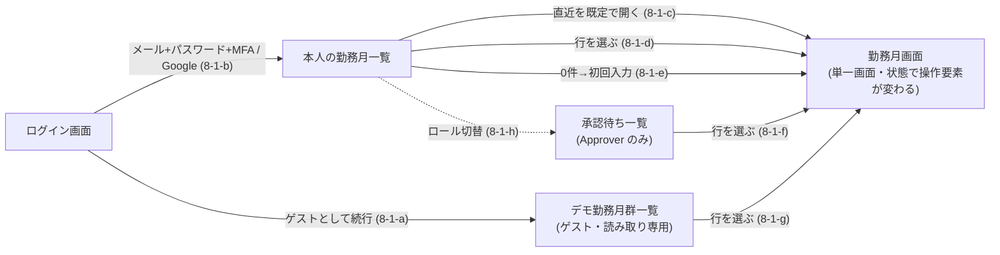

# デザインシステム — トークン・共通コンポーネント・画面遷移

Issue #53 の仕様。**ADR 0015 が「`docs/specs/` に落とす」と定めたデザインの決定（採用トークン・コンポーネント一覧・画面遷移）を、受け入れ条件として固定する。**

**採用手段の決定（なぜ Claude Design か・なぜローカルを正とするか）は ADR 0015 が持ち、本仕様へ書き写さない**（ADR 0004）。**業務ルール・状態遷移・ユビキタス言語も書き写さない。** 正解は `docs/domain/ubiquitous-language.md` と各業務仕様・各 UI 仕様にあり、本仕様はそれらを参照して「**トークンと共通コンポーネントが満たすべき形**」だけを定める。

- **前提 ADR**: 0015（デザインシステムの手段）／0013・0014（AWS ネイティブ・BFF）／0016（認証・ロール）／0007 §5（Vitest）／**0020（Web のテストに DOM 検証ライブラリを追加する。D-1 の決定本文）**
- **前提仕様**: `web-app-scaffold.md` AC-1-5（コンポーネントの配置先。**人間が 2026-08-14 に承認した決定であり、本仕様は再決定しない**）

## 決定の所在（誰が決めたか）

| 対象 | 決定者 | 備考 |
|---|---|---|
| デザインシステムの構築手段・ローカルを正とする運用 | **人間**（ADR 0015） | 本仕様は参照のみ |
| コンポーネントの配置先 `apps/web/src/components/` | **人間**（`web-app-scaffold.md` AC-1-5） | 本仕様は参照のみ。再提案しない |
| 画面・操作可否・到達手段・カレンダー・時分入力・並び順等 | **人間**（各 UI 仕様の「確定事項」） | 本仕様は導出のみ。新たな画面・操作を足さない |
| コンポーネントのレンダリング検証手段（DOM 検証ライブラリの追加可否） | **人間**（ADR 0020。2026-09-16） | **決定の本文・理由・代替案は ADR 0020 が持つ。** 本仕様は参照し、Issue #53 に効く受け入れ条件（D-1）だけを持つ。本仕様は再決定しない |
| **散文で書かれた出力・a11y の要求をテスト対象にすること**（AC-6 の DOM 契約 6-3-i〜6-11-i） | **人間**（2026-09-16） | 人間が「散文だけの要求を検査対象にする」と決定した。**AI が行ったのは、既にある要求を観測可能な形へ言い換えることだけ**であり、要求そのもの・props・表示文言を足していない。文字列を新たに定めたのは `AppHeader` のアプリ名のみで、これは `apps/web/src/app/layout.tsx` の `metadata.title` に既にある値の参照である（6-11-i） |
| **reviewer 往復1回目の指摘5件への対処方針**（`ErrorBanner` に固定の文字を持たせる＝6-7-i／`ConfirmDialog` の初期フォーカス＝6-9-iii／アプリ名を**テスト側の定数でピン留めする**＝10-6-c・11-13／AC-4-5 の可視リングを検査対象にする＝10-3-a／AC-6 の表が名指しするトークン割当を検査対象にする＝10-3-b。あわせて `RoleSwitcher` の複数配置＝6-3-iii） | **人間**（2026-09-16） | 5件いずれも**方針を人間が決めた** —— 「検査を足して解消する」「相互比較ではなくリテラルでピン留めする」「props を増やさない」。**AI が行ったのは条文化と、`ErrorBanner` の固定文字に `エラー` という一般語を選んだことだけ**である。**語の選定は AI の起案**であり、この表に承認が付いてもその事実は消えない（差し替えるときは人間の判断で語を置き換える）。**props は1つも増えていない**（下の行の承認済みの表のまま） |
| **採用トークンの名称と値・共通コンポーネントの一覧と props**（AC-2 / AC-5 / AC-6） | **AI が起案し、人間が承認**（2026-09-16） | 起案は ADR 0015 がデザイン工程へ委譲した範囲として **AI（本仕様）** が行った。**人間が 2026-09-16 に AC-2 / AC-5 / AC-6 を承認した**ため、色トークン17点・共通コンポーネント11点・props は**そのままテストの期待値として使ってよい**。差し替えるときは人間の判断で表の値を置き換える（AC の構造は変えない） |

**この表は「AI が決めてよい」範囲を広げるための表ではなく、どこまでが人間の決定かを取り違えないための表である。** 最終行は「AI の起案に人間の承認が付いた」状態を表しており、**起案者が AI であった事実は承認によって消えない** —— 値の妥当性を疑う場面では、それが AI の起案であることを前提に人間へ差し替えを諮る。業務ルール・ドメイン用語・画面の増減は、承認の有無にかかわらず本仕様では決めない（AC-7）。

---

## スコープ

- **デザイントークン**（CSS カスタムプロパティ）の名称・値・定義場所（AC-1〜AC-4）
- **共通コンポーネントの一覧**と、各コンポーネントの公開 props・状態・アクセシビリティ属性（AC-5・AC-6）
- **画面遷移**の導出図（既存 UI 仕様の AC から辺を導き、出典を併記する。AC-8）
- **Claude Design との同期運用の受け入れ条件**（ローカルを正とすること／外向き操作の条件。AC-9）

### 非スコープ

| 対象 | いつ / どこで |
|---|---|
| **各画面そのものの実装**（ログイン画面・勤務月一覧・勤務月画面・入力フォーム・締め・承認の画面） | 後続の画面 Issue。本 Issue が作るのは画面から使われる部品とトークンのみ |
| **画面固有の合成コンポーネント**（日次実績のカレンダー、勤務月一覧の表、勤務月サマリ等） | 同上（AC-5-3 が境界を定める） |
| **URL / ルート設計**（どのパスがどの画面か）・Route Handler の追加 | 後続の画面 Issue。AC-8 は画面の単位と遷移だけを定め、パスを固定しない |
| **コンポーネントのカタログ画面・Storybook の導入** | 本 Issue では作らない（ADR 0015「後で併用も可能」を維持。プレビューは Claude Design 側が担う） |
| **`apps/web/src/app/` 配下の既存の暫定表示の置き換え** | 画面 Issue。AC-2-4 の色リテラル禁止の検査対象は `src/components/` 配下に限る（AC-11-4） |
| **BFF 応答型・データ取得** | 画面 Issue／`domain-api-http-contract.md`・`bff-auth-termination.md` |
| **超過／不足に色で良し悪しを与えること** | **行わない。** 「不足＝悪い」等の価値づけは業務側の判断であり、デザイン工程が決めてよい範囲を超える（AC-2-3） |

---

## 前提（P）

| # | 前提 | 出典 |
|---|---|---|
| P-1 | ローカル（リポジトリ内）のコンポーネント成果物が**正**であり、Claude Design 側はミラー／プレビューである。同期は**1コンポーネントずつの増分**で行う | ADR 0015 決定 |
| P-2 | コンポーネントの配置先は **`apps/web/src/components/`**（`ui_kits/` は採らない） | `web-app-scaffold.md` AC-1-5（人間決定） |
| P-3 | `apps/web` は Tailwind CSS v4 を使い、トークンは `apps/web/src/app/globals.css` の `:root` と `@theme inline` で定義する構成である。本仕様はこの構成を変えずにトークンを足す | `web-app-scaffold.md` AC-1-4 |
| P-4 | 勤務月の状態は `Draft` / `PendingApproval` / `Approved` の3値、ロールは `Engineer` / `Approver`。日本語の呼称は「下書き」「締め済」「承認済」「技術者」「承認者」 | `docs/domain/ubiquitous-language.md` |
| P-5 | 「提供しない」操作は**非表示で統一**する（非活性表示を採らない。人間決定 Q8） | `work-month-screen-ui.md` AC-3 |
| P-6 | Web のテストランナーは Vitest。ライブラリの追加可否は「必要になった Issue で判断する」として保留されていたが、**本 Issue がその「必要になった Issue」に当たり、人間が 2026-09-16 に DOM 検証ライブラリの追加を決定した（ADR 0020）。** 追加はその決定が挙げた範囲に限り、**アサーション／モックのライブラリは引き続き追加しない** | ADR 0007 §5／**ADR 0020**／`web-app-scaffold.md` AC-3-5／本仕様 D-1 |
| P-7 | 一覧の1ページあたりの件数は**仕様で固定しない**（人間決定・旧 N-3） | `work-month-listing-ui.md` AC-4-2 |

---

## 決定（D）— かつての未決点と、その決着

**本節に未決点は残っていない。** 本仕様が起案時に抱えていた唯一の未決点（U-1「コンポーネントのレンダリング検証手段」）は、下記のとおり人間の決定で決着し、AC-10・AC-11 へ畳み込まれた。

### D-1. コンポーネントのレンダリング検証手段 — 決定は ADR 0020 が持つ

**この決定の本文・採用理由・検討した代替案（(b) 静的レンダリング／(c) DOM 検証を行わない）は `docs/adr/0020-dom-testing-library-for-web-tests.md` にある。本仕様へ書き写さない**（ADR 0004）。ADR 0020 は **ADR 0007 を置換せず補完する**（Go 側の制約は変わらない）。

本節が持つのは、その決定が **Issue #53 の実装に課す受け入れ条件**だけである。

| 項目 | 内容 |
|---|---|
| 決定 | **人間**が 2026-09-16 に、`apps/web` のテストへ DOM 検証ライブラリを追加すると決定した（AI の仮置き・AI の推測ではない） |
| 決定の記録先 | **ADR 0020**（Issue コメント・PR 本文で終わらせない。ADR 0004） |
| 本仕様の立場 | 参照のみ。**再決定しない。** 手段を変える判断は ADR 0020 の置換にあたる |

**決定の帰結（本仕様が持つ要求）**

| # | 要求 |
|---|---|
| D-1-1 | 追加する依存は **`@testing-library/react` / `@testing-library/dom` / `jsdom` の3点に限る。** `@testing-library/user-event` を入れない。これ以外のアサーション／モックのライブラリを入れない姿勢（`web-app-scaffold.md` AC-3-5）は、この3点を除いて維持する。**3点の外へ広げる判断は人間の承認事項**であり、実装工程が自ら足さない（広げるときは ADR 0020 の置換にあたる） |
| D-1-2 | **Vitest のグローバル設定（`apps/web/vitest.config.mts`）の `environment` は `"node"` のままとする。** DOM 環境は、コンポーネントのテストファイル側に `@vitest-environment jsdom` のドックブロックを置いて**そのファイルにのみ**与える。グローバルを `jsdom` へ変えると、`auth-handlers` / `jwt-verifier` / `rate-limit` 等の既存テストが前提としている Node 環境を変えてしまう |
| D-1-3 | 本決定は **AC の中身を変えない。** AC-6 は観測可能な出力として書かれており、手段が確定したことで AC-6 の出力側が Red を踏めるようになっただけである（AC-10-6・AC-11-7） |
| D-1-4 | **導入するバージョンを本仕様の条文に書かない**（特定時点の実測を仕様へ埋め込まない。`docs/rules/development-process.md`）。pin の現況は `apps/web/package.json` が持つ |

---

## 受け入れ条件（AC）

| AC | 主題 | 主に効く工程 |
|---|---|---|
| AC-1 | トークンの定義場所と形式 | tester・implementer |
| AC-2 | セマンティック色トークンの名称と値 | tester・implementer |
| AC-3 | コントラスト比の下限 | tester・implementer |
| AC-4 | タイポグラフィ・余白・角丸・フォーカス（独自スケールを作らない） | tester・implementer |
| AC-5 | 共通コンポーネントの一覧と境界 | tester・implementer・reviewer |
| AC-6 | 各コンポーネントの公開 props と a11y 属性 | tester・implementer |
| AC-7 | 業務判断をコンポーネントへ持ち込まない | implementer・reviewer |
| AC-8 | 画面遷移（導出図） | reviewer |
| AC-9 | Claude Design との同期運用 | reviewer |
| AC-10 | 検証手段 — どの AC を何で測るか | tester |
| AC-11 | 限界 — 緑が意味しないこと | reviewer |

### AC-1. トークンの定義場所と形式

| # | 要求 |
|---|---|
| 1-1 | トークンは **`apps/web/src/app/globals.css` の1箇所**で定義する。コンポーネントのファイル・`tailwind.config.*`・別の CSS ファイルへ分散させない（P-3。定義が2箇所にあると「正」が二重化する） |
| 1-2 | **素の値は `:root` に `--<名前>` として置き**、暗色は `@media (prefers-color-scheme: dark)` の `:root` で**同名のトークンを上書き**する。`prefers-color-scheme` 以外の切替手段（クラス付与・JS）を本 Issue で導入しない |
| 1-3 | **Tailwind から参照するためのマッピングを `@theme inline` に置く。** AC-2 の各色トークン `--X` に対し `--color-X: var(--X)` を定義する（`bg-X` / `text-X` / `border-X` が使えること） |
| 1-4 | AC-2 の表に**無いトークンを増やさない**。必要になったら本仕様の表を更新してから足す（トークンが増える経路を仕様の外に作らない） |
| 1-5 | 色の値は **6桁の16進表記（`#rrggbb`、小文字）**で書く。`rgb()` / `hsl()` / 名前付き色を混ぜない（値の一致を機械比較できる形に揃える） |

### AC-2. セマンティック色トークンの名称と値

**名称は用途（セマンティクス）で付け、色名で付けない**（`--zinc-50` のような色名トークンを作らない。暗色で意味が反転するため）。

| # | トークン | 明色（`:root`） | 暗色（`prefers-color-scheme: dark`） | 用途 |
|---|---|---|---|---|
| 2-1-a | `--background` | `#ffffff` | `#0a0a0a` | ページ地色 |
| 2-1-b | `--foreground` | `#171717` | `#ededed` | 既定の文字色 |
| 2-1-c | `--surface` | `#f8fafc` | `#171717` | 区画（`Card`）の地色 |
| 2-1-d | `--surface-foreground` | `#171717` | `#ededed` | 区画の上の文字色 |
| 2-1-e | `--muted-foreground` | `#52525b` | `#a1a1aa` | 補助テキスト（説明・空状態の本文） |
| 2-1-f | `--border` | `#71717a` | `#a1a1aa` | 入力欄・区画の境界線 |
| 2-1-g | `--primary` | `#1d4ed8` | `#93c5fd` | 主要操作（`Button` の `primary`） |
| 2-1-h | `--primary-foreground` | `#ffffff` | `#0a0a0a` | `--primary` の上の文字色 |
| 2-1-i | `--danger` | `#b91c1c` | `#fca5a5` | エラー表示・破壊的操作（`Button` の `danger`・`ErrorBanner`・`FieldError`） |
| 2-1-j | `--danger-foreground` | `#ffffff` | `#0a0a0a` | `--danger` の上の文字色 |
| 2-1-k | `--focus-ring` | `#1d4ed8` | `#93c5fd` | キーボードフォーカスの可視リング |
| 2-1-l | `--state-draft` | `#e4e4e7` | `#3f3f46` | 状態バッジ `Draft`（下書き）の地色 |
| 2-1-m | `--state-draft-foreground` | `#27272a` | `#f4f4f5` | 同・文字色 |
| 2-1-n | `--state-pending-approval` | `#fef3c7` | `#78350f` | 状態バッジ `PendingApproval`（締め済）の地色 |
| 2-1-o | `--state-pending-approval-foreground` | `#78350f` | `#fef3c7` | 同・文字色 |
| 2-1-p | `--state-approved` | `#dcfce7` | `#14532d` | 状態バッジ `Approved`（承認済）の地色 |
| 2-1-q | `--state-approved-foreground` | `#14532d` | `#dcfce7` | 同・文字色 |

| # | 要求 |
|---|---|
| 2-2 | **上表の17トークンすべてが、明色・暗色の両方で定義されていること。** 片方だけの定義を許さない（暗色で未定義のトークンは明色の値を引き継ぎ、コントラストが崩れる） |
| 2-3 | **超過（`Excess`）／不足（`Shortfall`）専用の色トークンを定義しない。** 数値は既定の文字色で表示する。色で良し悪しを表すことは業務上の価値づけであり、本仕様では決めない（非スコープ表） |
| 2-4 | **共通コンポーネントの実装（`apps/web/src/components/**`）に生の色を書かない。** 16進・`rgb()`・Tailwind のパレットユーティリティ（`bg-zinc-50`・`text-blue-600` 等）を含めない。色は上表のトークン経由のユーティリティ（`bg-primary`・`text-muted-foreground` 等）でのみ参照する |
| 2-5 | 状態バッジの3トークン組（`draft` / `pending-approval` / `approved`）は**互いに異なる値**であること（`work-month-screen-ui.md` AC-2-1「3値を互いに区別できる」の色側の担保） |

### AC-3. コントラスト比の下限

**判定は上表の16進値から計算する**（WCAG 2.1 の相対輝度・コントラスト比の定義に従う）。明色・暗色の**両モードで**満たすこと。

| # | 前景 / 背景の組 | 下限 |
|---|---|---|
| 3-1 | `--foreground` / `--background` | **4.5:1** |
| 3-2 | `--surface-foreground` / `--surface` | **4.5:1** |
| 3-3 | `--muted-foreground` / `--background` | **4.5:1** |
| 3-4 | `--primary-foreground` / `--primary` | **4.5:1** |
| 3-5 | `--danger-foreground` / `--danger` | **4.5:1** |
| 3-6 | `--danger` / `--background`（エラー文言を地色の上に置く場合） | **4.5:1** |
| 3-7 | `--state-<状態>-foreground` / `--state-<状態>`（3組すべて） | **4.5:1** |
| 3-8 | `--border` / `--background`（境界線は非テキスト要素） | **3:1** |
| 3-9 | `--focus-ring` / `--background`（フォーカスリングは非テキスト要素） | **3:1** |

**3-10**: 値を差し替えるときは、差し替えた値でこの表を再計算して満たすこと。**下限そのものを下げない**（下げる判断は人間の承認事項）。

### AC-4. タイポグラフィ・余白・角丸・フォーカス

**独自のスケールを作らない。** Tailwind の既定スケールを使い、重複した定義を持たない（トークンが増えるほど「どれを使うか」の判断が要り、一貫性は下がる）。

| # | 要求 |
|---|---|
| 4-1 | `@theme` / `@theme inline` で **`--spacing-*` / `--text-*` / `--radius-*` を再定義しない**（Tailwind 既定を使う） |
| 4-2 | **`globals.css` の `body` に `font-family` を直接書かない。** Tailwind の既定 `--font-sans` に従う |
| 4-3 | **外部フォント配信への依存を持たない。** `globals.css` に `@import url(` を書かず、`next/font/google` を使わない（実行時・ビルド時の外向き依存を増やさない。`docs/rules/cost-guardrails.md`） |
| 4-4 | 共通コンポーネントが使う角丸ユーティリティは **`rounded-md` のみ**。`rounded-full` / `rounded-lg` 等を混在させない |
| 4-5 | **すべての対話要素**（`button` / `input` / リンク）は、キーボードフォーカス時に `--focus-ring` を用いた**可視のリング**を持つ（`focus-visible:` 系のユーティリティで指定する）。**リングが有ることを主張する検査は 10-3-a が持つ**（4-6 の「消す指定を書かない」＝不在の検査とは別の検査であり、不在の検査だけでは 4-5 を担保できない） |
| 4-6 | 共通コンポーネントの実装に、**フォーカスリングを消す指定（`outline-none` 等）を代替のリング指定なしで書かない** |

### AC-5. 共通コンポーネントの一覧と境界

| # | コンポーネント | ファイル | 使われる画面 | 導出元（既存 AC） |
|---|---|---|---|---|
| 5-1-a | `AppHeader` | `app-header.tsx` | 全画面 | `login-ui.md` AC-6-1（「ヘッダー等に」置く） |
| 5-1-b | `RoleSwitcher` | `role-switcher.tsx` | 全画面（ログイン中のみ） | `login-ui.md` AC-6-1・6-5 |
| 5-1-c | `StatusBadge` | `status-badge.tsx` | 勤務月画面・各一覧 | `work-month-screen-ui.md` AC-1-2・AC-2／`work-month-listing-ui.md` AC-1-2 |
| 5-1-d | `Button` | `button.tsx` | 全画面 | `work-month-screen-ui.md` AC-1-7（操作領域）／`monthly-closing-ui.md` AC-1／`approval-ui.md` AC-1 |
| 5-1-e | `Card` | `card.tsx` | 勤務月画面・各一覧 | `work-month-screen-ui.md` AC-1（画面骨格の各要素の区画） |
| 5-1-f | `NumberField` | `number-field.tsx` | 勤務月画面（入力フォーム） | `daily-record-entry-ui.md` AC-3-2（時・分の数値入力。人間決定 Q5） |
| 5-1-g | `FieldError` | `field-error.tsx` | 勤務月画面（入力フォーム） | `daily-record-entry-ui.md` AC-4／`work-month-screen-ui.md` AC-6-1 |
| 5-1-h | `ErrorBanner` | `error-banner.tsx` | 全画面 | `work-month-screen-ui.md` AC-6-3／`work-month-listing-ui.md` AC-7-3／`login-ui.md` AC-7 |
| 5-1-i | `EmptyState` | `empty-state.tsx` | 各一覧・勤務月画面 | `work-month-listing-ui.md` AC-7-1・7-2／`daily-record-entry-ui.md` AC-2-1 |
| 5-1-j | `ConfirmDialog` | `confirm-dialog.tsx` | 勤務月画面（締め） | `monthly-closing-ui.md` AC-2（「具体的表現（モーダル等）はデザイン工程が担う」） |
| 5-1-k | `Pagination` | `pagination.tsx` | 各一覧 | `work-month-listing-ui.md` AC-4-2 |

| # | 要求 |
|---|---|
| 5-2 | **1コンポーネント1ファイル**とし、ファイル名は上表のとおり（kebab-case）。`index.ts` で再輸出するバレルファイルを作らない。**1ファイル＝増分同期の単位**である（ADR 0015「1コンポーネントずつの増分」） |
| 5-3 | **上表に無いコンポーネントを本 Issue で作らない。** とくに次は**画面固有の合成**であり、後続の画面 Issue が持つ —— 日次実績のカレンダー（`daily-record-entry-ui.md` AC-1-4）、勤務月一覧の表（`work-month-listing-ui.md` AC-1-2）、勤務月サマリ（`work-month-screen-ui.md` AC-1-3〜1-5）、ログイン方式の一覧（`login-ui.md` AC-1-1） |
| 5-4 | **境界の判定基準**: 共通コンポーネントは (i) データ取得（BFF 呼び出し）を行わず、(ii) 状態遷移（締め・承認・差戻し）を自ら実行せず、(iii) 特定画面のレイアウトに固有でないもの。3つのいずれかを欠くものは画面 Issue 側へ置く |
| 5-5 | 共通コンポーネントから **`fetch` / Route Handler の呼び出しを行わない**（5-4(i) の機械的な形。`docs/rules/architecture.md` の BFF 一方通行を部品側で破らない） |

### AC-6. 各コンポーネントの公開 props と a11y 属性

**表の「公開 props」は網羅である。** 表に無い props（とくに `role` / 勤務月の状態を受けて自ら可否を判定する props）を足さない（AC-7）。ネイティブ要素の標準属性の透過（`...rest`）は妨げない。

| # | コンポーネント | 公開 props | 出力・a11y の要求 |
|---|---|---|---|
| 6-1 | `StatusBadge` | `state: "Draft" \| "PendingApproval" \| "Approved"` の**1つのみ** | 日本語ラベルを**文字として**出す（`Draft`→`下書き`／`PendingApproval`→`締め済`／`Approved`→`承認済`。P-4）。地色・文字色は `--state-*` を使う。**色だけで区別させない**（`work-month-screen-ui.md` AC-2-1）。**操作者の種別を受け取らないことにより、誰が見ても同一の表示になる**（同 AC-2-2 の構造的な担保） |
| 6-2 | `Button` | `variant?: "primary" \| "secondary" \| "danger"`（既定 `secondary`）、`children`、および `button` の標準属性 | `<button>` を出力し、`type` の既定を `"button"` にする（フォーム内での意図しない送信を防ぐ）。`disabled` は**多重送信の抑止にのみ**使う（AC-7-2）。`variant` ごとに使うトークンは `primary`→`--primary`/`--primary-foreground`、`danger`→`--danger`/`--danger-foreground`、`secondary`→`--surface`/`--surface-foreground`+`--border` |
| 6-3 | `RoleSwitcher` | `role: Role`、`onChange: (role: Role) => void` | 型 `Role` は **`apps/web/src/lib/role-cookie.ts` の既存の型を輸入して使う**（リテラル union を再定義しない）。選択肢は**ちょうど2つ**（`Engineer`→`技術者`／`Approver`→`承認者`。P-4）。グループにアクセシブル名を与える（6-3-i）。**現在のロールが表示から判別できること**（6-3-ii）。**同一文書に複数置いても、各インスタンスが独立したグループとして振る舞うこと**（6-3-iii）。ゲストへ出すか否かは呼び出し側が決める（`login-ui.md` AC-6-5。本コンポーネントは「ゲスト」を表す値を持たない） |
| 6-4 | `Card` | `children`、`title?: ReactNode` | 地色 `--surface`、文字色 `--surface-foreground`、境界線 `--border`。`title` があるときは見出し要素として出す |
| 6-5 | `NumberField` | `id`、`label: string`、`value: number \| ""`、`onChange`、`min?: number`、`max?: number`、`step?: number`、`errorId?: string`、`invalid?: boolean` | `<input type="number">` を出力し、`label` を `<label for>` で結びつける。`min` / `max` / `step` を**既定値として内蔵しない**（値域は `daily-record-entry.md` AC-3 が持つ。AC-7-1）。`invalid` のとき `aria-invalid="true"` を付け、`errorId` があれば `aria-describedby` で結ぶ |
| 6-6 | `FieldError` | `id`、`children` | `id` を持つ要素として出力し、`role="alert"` を付ける。文字色は `--danger`。**文言を内蔵しない**（理由の文言は呼び出し側が渡す。AC-7-1） |
| 6-7 | `ErrorBanner` | `children`、`onRetry?: () => void` | `role="alert"` を付ける。`--danger` を用い、**色以外にも文字で「エラーである」ことが分かる**こと —— そのために**固定の文字を1つだけ**持つ（見出し相当の短い語であり、`children` が担う理由文とは別の層。文字列と観測可能な形は 6-7-i）。`onRetry` があるとき再試行の `Button` を出す（`login-ui.md` AC-7-1「再試行できる」） |
| 6-8 | `EmptyState` | `title: string`、`description?: string`、`action?: ReactNode` | 文字で空であることを示す。`action` は導線（`work-month-listing-ui.md` AC-7-1「初回入力の導線」）を呼び出し側から受け取る |
| 6-9 | `ConfirmDialog` | `open: boolean`、`title: string`、`description: ReactNode`、`confirmLabel: string`、`confirmVariant?: "primary" \| "danger"`、`onConfirm: () => void`、`onCancel: () => void` | `open` が偽のとき**何も出力しない**。真のとき `role="dialog"` と `aria-modal="true"` を持ち、`title` を `aria-labelledby` で結ぶ。**Esc キーと取消操作は `onCancel` を呼び、`onConfirm` を呼ばない**（`monthly-closing-ui.md` AC-2-3「状態を変えない」の UI 側の担保。取消操作の観測可能な形は 6-9-i、確定操作は 6-9-ii）。**`open` が真になったとき、ダイアログへ初期フォーカスを当てる**（Esc の受け口をフォーカスの外に置かない＝キーボードの Esc が実ブラウザでもダイアログへ届く形にする。観測可能な形は 6-9-iii）。**取り消せない旨の文言を内蔵しない**（`description` として呼び出し側が渡す。AC-7-1） |
| 6-10 | `Pagination` | `page: number`（1 始まり）、`pageCount: number`、`onPageChange: (page: number) => void` | `<nav>` にアクセシブル名を与える。先頭ページで「前へ」、末尾ページで「次へ」を**押せない形にする**（この非活性は操作可否ではなく範囲外の入力の抑止であり、AC-7-2 の対象外）。**1ページあたりの件数を props に持たず、既定値も持たない**（P-7。仕様で固定しないという人間決定を部品側で破らない） |
| 6-11 | `AppHeader` | `right?: ReactNode` | `<header>` を出力し、アプリ名（**`effort-tracker`**）を見出しとして含む（6-11-i）。`right` に `RoleSwitcher` 等を差し込めること。**`RoleSwitcher` を内蔵しない**（ログイン状態・ロール保持の判定を部品が持たないため。AC-7-2／`login-ui.md` AC-6-5） |

**上表が名指しした色トークンの割当（6-1 / 6-2 / 6-4 / 6-6 / 6-7）は検査対象である**（手段は 10-3-b）。**すべての対話要素が持つべき可視のフォーカスリング（AC-4-5）も検査対象である**（手段は 10-3-a）。どちらも「表・条文が名指しした割当が、名指しされた対象へ当たっていること」だけを見るものであり、クラス名の付き方そのものは検査しない（境界は AC-11-7）。

#### AC-6 の DOM 契約 — 散文の要求を観測可能な形にする

**本節は上表の「出力・a11y の要求」列に散文で書かれていた要求を、DOM から観測できる形へ言い換えたものである。props を1つも増減しない。** 上表の公開 props は人間が 2026-09-16 に承認した内容のままである（「決定の所在」表）。

**ただし 6-3-iii・6-7-i・6-9-iii の3件は、言い換えに留まらず要求を具体化している** —— それぞれ「同一文書に複数置いてもグループが独立すること」「固定の文字を1つ持つこと（およびその文字列）」「`open` が真になったときの初期フォーカス」である。**3件はいずれも人間が 2026-09-16 に決定した対処**であり（「決定の所在」表）、AI が推測で足したものではない。**3件とも props を増やさず、業務ルール・業務文言・画面の増減には触れない。**

**固定するのは ARIA 上の意味であって、要素の種類ではない。** ネイティブ要素で満たしても `role` 属性を付けた自作要素で満たしてもよい（タグ名・入れ子・クラス名は AC-11-7 のとおり検査対象外）。

| # | 対象 | 観測可能な契約 |
|---|---|---|
| 6-3-i | `RoleSwitcher` のグループ | 2つの選択肢を包む**単一の要素**が `radiogroup` のロールで問い合わせられ、かつ**空でないアクセシブル名**を持つこと。**名の文字列は本仕様で固定しない**（`aria-label` / `aria-labelledby` のいずれで与えてもよい。AC-11-12）。単一選択のグループとして公開する形を採るのは、AC-6-3 が求める「グループである」「グループが名を持つ」「現在値が判別できる」の3つを、ARIA の標準的な組み合わせで同時に満たせるためである |
| 6-3-ii | `RoleSwitcher` の現在値 | 選択肢が `radio` のロールで**ちょうど2つ**問い合わせられ、そのアクセシブル名が `技術者` / `承認者` であること（P-4）。**`role` props に対応する側だけが「選択済み」として公開され**（`checked` / `aria-checked` が真）、他方は選択済みでないこと。`role="Engineer"` のとき選択済みは `技術者`、`role="Approver"` のとき `承認者` |
| 6-3-iii | `RoleSwitcher` の複数配置 | **同一文書に `RoleSwitcher` を2つ描画しても、各インスタンスの選択肢が互いに独立したグループとして振る舞うこと。** 観測可能な形: 一方に `role="Engineer"`、他方に `role="Approver"` を与えて同時に描画したとき、**それぞれの `radiogroup` の内側で、対応する側だけが選択済み**であること（＝一方のインスタンスの選択が、他方の選択を解除しない）。ネイティブの `<input type="radio">` で満たす場合、グループ名（`name`）はインスタンスごとに異なる必要があるが、**その文字列は本仕様で固定しない**（一意であることだけを求める）。**独立性はコンポーネントの内側で得る**（AC-6 の props 表に対応する props が無く、増やさない。呼び出し側に一意な名の指定を課さない） |
| 6-3-iv | `RoleSwitcher` の `onChange` | **選択済みでない側の `radio` を選択する操作を発火させると、`onChange` がちょうど1回呼ばれること。** 引数は**その選択肢に対応する `Role` の値**である（`技術者`→`Engineer` / `承認者`→`Approver`。P-4・6-3-ii の対応）。**`role` props が `Engineer` のときと `Approver` のときの両方で満たす** —— 片方の向きだけを満たす実装（引数として常に同じ値を渡す実装）が契約を満たしたことにならない形にする。引数は**呼び出し側が次に `role` props へ渡すべき値**であって、コンポーネントが保持した内部状態ではない（選択済みとして公開されるのは `role` props が指す側である。6-3-ii）。**既に選択済みの側を発火させたときの挙動は本仕様で定めない**（AC-11-19） |
| 6-5-i | `NumberField` の `onChange` | **入力欄の値が変わる操作を発火させると、`onChange` がちょうど1回呼ばれること。** 引数は (i) 入力文字列が**空でないとき、その文字列が表す数値**、(ii) **空文字のとき空文字 `""`** である。これは `value` props の型 `number \| ""`（AC-6-5）と対応する —— 呼び出し側が受け取った値をそのまま `value` へ戻せる形にするための契約である。**値域（`min` / `max`）を引数の期待値に持ち込まない** —— 値域の内か外かで引数を変える（丸める・弾く）ことを求めず、値域そのものは呼び出し側が持つ（`daily-record-entry.md` AC-3。AC-7-1） |
| 6-7-i | `ErrorBanner` の種別表示 | `role="alert"` で問い合わせられる要素の内側に、**テキストが `エラー` と完全に一致する要素**が存在すること。この文字は **`children` に依存せず常に出る**（`エラー` を含まない理由文を `children` に渡しても読めること）。**理由文とは別の層**であり、`children` の文言と同じ要素に混ぜない。**この文字列は props で差し替えられない**（AC-6 の props 表に対応する props が無く、増やさない）。`--danger` の色（AC-6-7）と合わせて、**色を知覚できない利用者にも「エラーである」ことが文字で伝わる**形にするための契約である |
| 6-7-ii | `ErrorBanner` の `onRetry` | **`onRetry` を与えて描画したときに出る再試行のボタンを押すと、`onRetry` がちょうど1回呼ばれること**（AC-6-7「`onRetry` があるとき再試行の `Button` を出す」の、呼び出し側から観測できる形）。**ボタンのラベル文字列を期待値に持たない** —— 11-17 のとおり本仕様は再試行のラベル文字列を固定しておらず（6-7-i が固定するのは種別表示の `エラー` であって再試行のラベルではない）、識別は `role="alert"` の要素の内側のボタンとして**名を指定せずに**行う |
| 6-9-i | `ConfirmDialog` の取消操作 | `open` が真のとき、**コンポーネント自身が出すボタンはちょうど2つ**。うち1つはアクセシブル名が `confirmLabel` と一致する**確定の操作**であり、**残る1つが取消の操作**である。取消の操作を押すと `onCancel` がちょうど1回呼ばれ、`onConfirm` は呼ばれないこと。**取消の操作のラベル文字列を本仕様で固定しない** —— 上表に対応する props（`cancelLabel` に当たるもの）が無く、`AppHeader` のアプリ名における `metadata.title` のような既存の参照先も無いため、文字列を仕様へ書けば `docs/` と実装に別々の正解ができる（AC-11-11）。呼び出し側が `description` にボタンを含めた場合は「ちょうど2つ」の対象外であり、検査は含めない入力で行う |
| 6-9-ii | `ConfirmDialog` の確定操作 | 確定の操作（アクセシブル名が `confirmLabel` と一致するボタン）を押すと `onConfirm` がちょうど1回呼ばれ、`onCancel` は呼ばれないこと |
| 6-9-iii | `ConfirmDialog` の初期フォーカス | **`open` が真で描画された時点で、フォーカスがダイアログの内側にあること。** 判定は「`role="dialog"` の要素が、フォーカスを持つ要素（`document.activeElement`）と**同一であるか、それを内包している**こと」で行う（ダイアログ自身へ当てても、内部の要素へ当ててもよい。**どの要素へ当てるかは固定しない**）。**`open` を偽で描画したあと真へ変えた場合も同じ**（初期描画・再描画の両方で満たす）。この契約が要るのは、`Esc` の受け口がダイアログ配下にあるため、**フォーカスがダイアログの外にあると実ブラウザで `Esc` が届かない**からである（6-9-i の取消と同じ帰結を、キーボードでも得られる形にする）。**フォーカスを当てる手段は props を増やさずコンポーネントの内側で得る**（AC-6 の props 表を変えない） |
| 6-10-i | `Pagination` の `onPageChange` | **「前へ」に当たる操作を発火させると `onPageChange` がちょうど1回呼ばれ、引数が現在の `page` より小さい値であること。「次へ」に当たる操作では、引数が現在の `page` より大きい値であること。** **具体的なページ番号を期待値に持たない**（読むのは `page` との大小関係だけである。特定の `page` / `pageCount` の組に依存した数値を仕様へ書かない）。**押せない状態（先頭ページの「前へ」・末尾ページの「次へ」）で発火しないことは AC-6-10 が既に持つ要求**であり、本条文は重ねて述べない。**「前へ」と「次へ」の識別手段は本仕様で固定しない** —— たとえば `page` / `pageCount` の境界で押せない形になる側から識別してよい（`page` が先頭のとき押せない側が「前へ」、`page` が末尾のとき押せない側が「次へ」。AC-6-10）。識別を表示文言に依存させないことで、ラベルの表記が検査の期待値にならない（限界は AC-11-20） |
| 6-10-ii | `Pagination` の方向ボタンのアクセシブル名 | **`page` / `pageCount` の境界での抑止（AC-6-10）に用いる2つの方向の操作は、いずれも空でないアクセシブル名を持つこと。** **名の具体的な文字列は本仕様で固定しない** —— 固定は AC-6 の表と同格の決定であり人間の承認事項である（11-16 / 11-20 と同じ理由）。したがって読むのは「空でないこと」だけであり、**どちらの操作がどちらの向きであるかは名から読まない**（識別手段を固定しない 6-10-i を本条文は変えない）。**これは 6-10-i / 11-20 が固定しないと述べている「ラベルの文言・アイコンの向き・配置」とは別の事柄である** —— 文言を固定しないことと、支援技術の利用者に操作の存在が伝わることは両立する。**アイコンのみの実装を禁じるものではなく**、`aria-label` 等で名を与えれば足りる。検査手段は 10-6-k、限界は 11-27 |
| 6-11-i | `AppHeader` のアプリ名 | `<header>` の内側の見出し要素のテキストが **`effort-tracker`** と一致すること。**この文字列は `apps/web/src/app/layout.tsx` の `metadata.title` と同一である** —— アプリ名の正解を2箇所に作らないため、片方だけを変えることを許さず、変えるときは両方を同時に変える（検査は AC-10-6、限界は AC-11-13）。**突き合わせは相互比較（見出しのテキストと `metadata.title` を互いに比べる形）では行わない。** テスト側に**定数を1つ**置き、見出しのテキストと `metadata.title` の**双方をその定数へ**突き合わせる（10-6-c）。**この定数は正解の写しではなく、本条文が定めた値をテストへピン留めしたものである** —— 正解は本条文が持ち、実装（見出し・`metadata.title`）はそれに従う関係であって、`docs/` の外に正解が増えるわけではない。相互比較を採らないのは、**両方を同時に書き換える一括改名を素通ししてしまう**ためであり、この検査が捕まえたい失敗モードがちょうどその形だからである。**見出しのレベル（`h1`〜`h6`）は固定しない**（AC-11-7） |

**6-3-i / 6-3-ii / 6-3-iii / 6-9-i の識別は、テストライブラリの `ByRole` クエリの `name` / `checked` オプションで行う。** アクセシブル名を算出するために `dom-accessibility-api` 等を直接輸入しない（D-1-1 の3点を超える依存を足さない）。

**6-7-i が定める `エラー` は、業務語彙ではなく一般語として選んだものである。** `docs/domain/ubiquitous-language.md` に「エラー」に当たる語は無く、勤務月の状態・ロール・精算のいずれの語でもないため、**ユビキタス言語へ新しい業務語を持ち込むものではない**（AC-7-4 が禁じているのは、状態・ロール等の業務語に別表記を与えることである）。**選定は AI の起案**であり（「決定の所在」表）、語を差し替える判断は人間が行う。既に `ErrorBanner` は `role="alert"` を持つが、**ロールは支援技術側の意味づけであって画面上の文字ではない**ため、AC-6-7 の「色以外にも**文字で**分かる」を満たすには表示される語が要る。

### AC-7. 業務判断をコンポーネントへ持ち込まない

| # | 要求 |
|---|---|
| 7-1 | **共通コンポーネントに業務ルールの値・文言を内蔵しない。** 稼働時間の値域（`daily-record-entry.md` AC-3）、丸め規則、締めが取り消せない旨の文言、エラーの理由文は、すべて呼び出し側から渡す。部品が業務ルールの写しを持つと、正解が `docs/specs/` の外に増える（ADR 0004） |
| 7-2 | **状態×ロールの操作可否を共通コンポーネントが判定しない。** 可否は呼び出し側の条件レンダリングで表し、「提供しない」は**非表示**にする（P-5）。したがって共通コンポーネントは勤務月の状態・操作者種別を受け取る props を持たない（AC-6 の props 表が網羅である理由） |
| 7-3 | **可否を非活性（`disabled` / `aria-disabled`）で表さない。** `disabled` の使用は多重送信の抑止（AC-6-2）と入力範囲外の抑止（AC-6-10）に限る |
| 7-4 | **ユビキタス言語に無い語をコンポーネント名・props 名・表示文言に導入しない。** 状態・ロールの表記は P-4 に従う（`Closed`・`承認待ち` 等の別表記を使わない） |

### AC-8. 画面遷移（導出図）

**この図は導出であり、正解は各辺の出典 AC にある。** 出典と食い違ったときは**出典側が正**であり、本図を直す。**出典を持たない辺を足さない**（足す＝画面の増設であり、人間の決定が要る）。

| # | 辺 | 出典 |
|---|---|---|
| 8-1-a | ログイン画面 →（ゲストとして続行）→ デモ勤務月群一覧 | `login-ui.md` AC-1-1(a)・AC-4-1・4-3／`work-month-listing-ui.md` AC-3-1 |
| 8-1-b | ログイン画面 →（メール+パスワード+MFA / Google OIDC）→ 本人の勤務月一覧 | `login-ui.md` AC-1-1(b)(c)／`work-month-listing-ui.md` AC-1-1 |
| 8-1-c | 本人の勤務月一覧 →（直近を既定で開く）→ 勤務月画面 | `work-month-listing-ui.md` AC-6-1・6-3 |
| 8-1-d | 本人の勤務月一覧 →（行を選ぶ）→ 勤務月画面 | `work-month-listing-ui.md` AC-5-1 |
| 8-1-e | 本人の勤務月一覧（0件）→（初回入力の導線）→ 勤務月画面（空状態） | `work-month-listing-ui.md` AC-6-2・7-1／`daily-record-entry-ui.md` AC-2-1・2-2 |
| 8-1-f | 承認待ち一覧 →（行を選ぶ）→ 勤務月画面 | `work-month-listing-ui.md` AC-5-1・2-5 |
| 8-1-g | デモ勤務月群一覧 →（行を選ぶ）→ 勤務月画面（全操作を非表示） | `work-month-listing-ui.md` AC-3-2／`work-month-screen-ui.md` AC-3 ゲスト行 |
| 8-1-h | ロール切替（`AppHeader`）→ 承認待ち一覧への導線の有無が変わる | `login-ui.md` AC-6-2／`work-month-listing-ui.md` AC-2-1・2-4 |

| # | 要求 |
|---|---|
| 8-2 | **勤務月画面は単一である。** 状態（`Draft` / `PendingApproval` / `Approved`）で操作要素が変わるだけで、状態ごとに別画面へ遷移しない（`work-month-screen-ui.md` AC-7）。**状態遷移図を本仕様に複製しない**（正解は同 AC-7 とユビキタス言語） |
| 8-3 | **承認済の横断一覧・技術者の横断ビューに当たる画面を図へ足さない**（`approval.md` AC-8-2／`work-month-listing-ui.md` AC-8-1・8-2） |
| 8-4 | **URL / ルートを本仕様で固定しない**（非スコープ表）。図が定めるのは画面の単位と遷移の有無だけである |

### AC-9. Claude Design との同期運用

| # | 要求 |
|---|---|
| 9-1 | **正解の実体はローカル（`apps/web/src/components/`）である**（P-1・P-2）。Claude Design 側の内容が食い違ったら、**ローカルを正としてミラー側を直す** |
| 9-2 | **外向きの操作（Claude Design のプロジェクト作成・`DesignSync` による同期）は、人間の明示指示があってから実行する。** 仕様工程・テスト工程は実行しない |
| 9-3 | 同期は**1コンポーネントずつの増分**で行う。丸ごと置換しない（ADR 0015 決定） |
| 9-4 | 同期のために**資格情報・トークンをリポジトリへ置かない**（`docs/rules/security.md`）。同期の可否がローカルのテスト・Lint の結果を左右しないこと（同期できない環境でもローカル成果物だけで `make verify` が通る） |
| 9-5 | 同期を行った事実・対象を残す場合も、**決定そのものは本仕様に置く。** Issue コメント・PR 本文へ仕様を書き写さない（ADR 0004） |

### AC-10. 検証手段 — どの AC を何で測るか

| # | 対象 | 手段 | 機械検査するか |
|---|---|---|---|
| 10-1 | AC-1 / AC-2 / AC-4-1〜4-3 | `apps/web/src/app/globals.css` を読み、トークン名・値・定義ブロック（`:root` / dark / `@theme inline`）の有無を突き合わせる | する |
| 10-2 | AC-3 | **`apps/web/src/app/globals.css` から各トークンの16進値を読み**、相対輝度とコントラスト比を計算して下限と比較する（計算は外部ライブラリを使わずテスト内で行う）。**これが AC-3 柱書の「上表の16進値から計算する」と等価なのは、10-1 が AC-2 の表の17トークンの明色・暗色の値を逐語のリテラル期待値として `globals.css` へピン留めしているためである** —— 表と `globals.css` が一致していることを 10-1 が強制する結果、どちらから読んでも同じ値になる。**したがってこの等価性は 10-1 が緑であることに依存する** —— 10-1 が落ちている間、本検査は表の値ではなく `globals.css` の現在値についてのコントラストを測っていることになる（表を満たさない値であっても、その値が下限を満たせば本検査は緑になりうる） | する |
| 10-3 | AC-2-4 / AC-4-4 / AC-4-6 / AC-5-5（**禁じた表現の不在**） | `apps/web/src/components/` 配下の実装ファイル（`*.test.tsx` を除く）を読み、禁じた表現（生の色・`rounded-md` 以外の角丸・代替なしの `outline-none`・`fetch`）の不在を検査する。**対象ファイルの集合は 10-4 と同じ集合**（`apps/web/src/components/` 直下の `*.tsx` から `*.test.tsx` を除いたもの）**とし、1件も読めなかったときは失敗とする**（読み取りが空振りしたまま緑にならないようにする）。**列挙の手段は問わない** —— ディレクトリ走査でも、AC-5-1 の表のファイル名を逐語で列挙する形でもよい。**両者が同じ集合になることは 10-4 が強制する**（10-4 が「表と `components/` 直下の `*.tsx` の集合が過不足なく一致すること」を課しているため）。**ただし逐語列挙を採る場合、本検査のカバレッジは 10-4 が緑であることに依存する** —— 10-4 が落ちている間（表に無い `*.tsx` が置かれている間）、本検査はその新規ファイルを読み落としうる。**この検査が担保するのは「書いてはならないものが無い」ことだけであり、「有るべきものが有る」ことは示さない** —— AC-4-5（可視のリングが有ること）は 10-3-a が、AC-6 の表が名指しするトークン割当は 10-3-b が持つ。**なお、禁じた表現のうち Tailwind のパレットユーティリティについて、本検査が読む接頭辞の集合は 10-3-c が定める**（本欄の「生の色」の一部を具体化したものであり、新たな要求ではない） | する |
| 10-3-a | **AC-4-5**（可視のフォーカスリングが**有る**こと） | **AC-5-1 の共通コンポーネントのうち、対話要素（`button` / `input` / リンク）を出力するものすべてを描画し**（`ConfirmDialog` は `open` を真に、`ErrorBanner` は `onRetry` を与えるなど、**対話要素が出る条件で**描画する。props は AC-6 の表の範囲で与える）、**出力に含まれる対話要素の1つ1つ**について、その `class` に (i) フォーカス可視時にリングを与えるユーティリティ（`focus-visible:ring-` で始まるもの）と (ii) リング色として `--focus-ring` を指すユーティリティ（`ring-focus-ring`。AC-1-3 のマッピング）の**両方**が現れることを読む。**1要素でも欠けたら落ちる形にする**（「ファイルのどこかに1件でも現れれば緑」「コンポーネントに1つでもあれば緑」としない）。リングの幅・オフセット等、条文が名指ししていないユーティリティは検査しない（AC-11-7） | する |
| 10-3-b | **AC-6 の表が名指しするトークン割当**（6-1 / 6-2 / 6-4 / 6-6 / 6-7） | 各コンポーネントを描画し、**表が名指しした対象要素**の `class` に、該当トークン `--X` を指すユーティリティ（`bg-X` / `text-X` / `border-X`。AC-1-3 のマッピング）が現れることを読む。**`Button` は `variant` の3値すべてで描画し、それぞれが自分の組だけを持つこと**（`primary` は `--primary` / `--primary-foreground`、`danger` は `--danger` / `--danger-foreground`、`secondary` は `--surface` / `--surface-foreground` + `--border`）を、**他の `variant` の組のトークンが現れないこと**と合わせて読む（**割当の取り違えが緑にならない形にする**）。`StatusBadge` は3状態すべてで描画し、状態ごとに対応する `--state-*` の組だけが現れることを読む。`Card` は `--surface` / `--surface-foreground` / `--border`、`FieldError` は `--danger` を読む。**`ErrorBanner`（6-7）は `role="alert"` で問い合わせられる要素の `class` に、`--danger` を指すユーティリティ（`bg-danger` / `text-danger` / `border-danger` のいずれか）が少なくとも1つ現れることを読む** —— AC-6 の表の 6-7 は「`--danger` を用い」としか書いておらず、**どの CSS プロパティ（地色・文字色・境界線）へ当てるかを名指ししていない**ため、本検査もプロパティを名指ししない（読む粒度と、そこから残る穴は AC-11-21）。**読むのは「どのトークンがどの要素へ当たっているか」だけ**であり、クラス名の付き方（名指しされていないクラスの有無・順序・命名、レイアウトのためのユーティリティ）は検査しない（境界は AC-11-7） | する |
| 10-3-c | **AC-2-4 のうち Tailwind のパレットユーティリティ**（10-3 が読む「生の色」のこの部分について、**検査対象とする接頭辞の集合**を定める） | 対象ファイルの集合は 10-3 と同じとし、そのテキストに**「接頭辞 + `-` + 色名（+ `-` + シェード）」が直に連なる形**が現れないことを読む。**検査対象とする接頭辞は次の17種であり、条文の字面に逐語で列挙する** —— `bg` / `text` / `border` / `ring` / `ring-offset` / `outline` / `accent` / `caret` / `decoration` / `divide` / `fill` / `stroke` / `from` / `via` / `to` / `shadow` / `placeholder`。**`from` / `via` / `to` はグラデーションの3点セットであり、1つだけを塞ぐと残る2つを使った同じ違反が素通りするため、必ず3つを揃える。** **`fill` / `stroke` も SVG の塗りと線の対であり、同じ理由で両方を揃える。** 色名の側（シェードを持つ22色 + `black` / `white`）の扱いは変えない —— **本条文は色名を逐語では列挙しない**（既存の検査が既に持っており、漏れていたのは接頭辞の側である）。**この17種のリストは、本条文の字面とテストの実装が逐語で対応すること** —— テストが本条文を書き換えずに接頭辞を増減させない（増減は本条文の変更を伴う）。**この検査に残る穴は次の3つである** —— (i) **方向・軸つきの派生形は対象外である**（`border-t-red-500` / `border-x-red-500` / `divide-x-red-500` のように、接頭辞と色名の間に方向・軸のセグメントが挟まる形。本検査が読むのは接頭辞と色名が直に連なる形だけである）、(ii) **任意値記法**（`bg-[#ff0000]` / `bg-[rgb(0,0,0)]`）**は本検査の対象ではない** —— 16進・`rgb()` の形は 10-3 が持つ別の検査が拾うが、そのどちらの形でもない任意値はいずれの検査も拾わない、(iii) 対象ファイルの範囲の限界は 11-4 のとおりである。**一方、バリアント接頭辞つきの形**（`hover:bg-red-500` / `dark:border-zinc-50` 等）**は対象に含まれる** —— 接頭辞の直前が非単語文字となり単語境界が成立するためである | する |
| 10-3-d | **10-3-c の接頭辞リストの、条文とテストの逐語対応**（10-3-c 末尾「この17種のリストは、本条文の字面とテストの実装が逐語で対応すること」の検査手段。**新たな要求ではなく、既にある要求を機械検査へ落とすものである**） | **`docs/specs/design-system.md` の 10-3-c の字面から接頭辞の列を抽出し**、10-3-c を実装した検査が持つ接頭辞の列と**順序を含めて**突き合わせる。**抽出の元は本条文の字面であり、テスト側に書かれた期待値の写しではない** —— テストが本条文を書き換えずに接頭辞を増減させられないようにするのが目的だからである（写しを相手にすると、テストが自分の期待値どうしを比べるだけになる）。**どちらかの側の抽出結果が0件のときは失敗とする** —— 両側が空の列になると空どうしが一致して素通りするためであり、**0件ヒットどうしの一致は一致ではない。** **抽出の具体的な手段（正規表現・パーサ・条文の読み取り方）は本仕様で固定しない**（10-3〜10-3-c と同様にテストの実装へ委ねる）。ただし**「順序を含めて突き合わせること」と「どちらかが0件なら失敗とすること」の2点は要求として固定する。** **残る穴は、本条文の字面とテストの実装を同時に書き換える変更である** —— 片側だけの変更は落ちるが、両側を揃えて変えたものは落ちない。これは **11-13** が `AppHeader` のアプリ名について述べている型（「残る穴は、テストの定数まで併せて書き換える改名である」）と同じ構造であり、そこは本条文とレビューで守る | する |
| 10-3-e | **10-3-c の検査の判別力**（色名・シェードの軸と、**一致すべきでない形**。**新たな要求ではなく、10-3-c と 11-24 / 11-25 が既に述べていることを機械検査へ落とすものである**） | 10-3-c を実装した検査が組み立てるパターンそのものを対象に、**一致する側と一致しない側の両方**を読む。**一致する側** —— 接頭辞を1つ固定し、**シェードを持つ色すべてについて「接頭辞 + `-` + 色名 + `-` + シェード」が一致すること**、**シェードを持たない色すべてについて「接頭辞 + `-` + 色名」が一致すること**、および**シェードの桁の境界**（2桁・3桁は一致し、1桁・4桁は一致しない）を読む。**色名の集合そのものは 10-3-c が逐語で列挙しないため、条文の字面から読むのは件数（「シェードを持つ22色」）と、字面に挙がっている語（`black` / `white`）だけである** —— シェードを持つ色の側は、検査が持つ集合の要素数を条文の件数と突き合わせる。**一致しない側** —— AC-2 のトークンを参照する形（`bg-primary` / `border-border` / `ring-focus-ring`）、**AC-2 のトークン名に数値シェードを足した形**（`bg-primary-500`。色名の側を「語 + `-` + 2〜3桁の数値」という*形*だけで判定すると一致してしまうため、色名の集合の**要素**が判別に効くことを読む）、**11-24 が「落ちない」と宣言している方向・軸つきの形**（`border-t-red-500`）、**11-25 が「落ちない」と宣言している任意値の形**（`bg-[oklch(70%_0.1_20)]`）が、いずれも**一致しないこと**。これにより、条文・接頭辞の定数・10-3-d を無傷のまま**検査の組み立てだけをより広い形・より狭い形へ差し替える変更**が落ちる。**抽出結果が0件のときは失敗とする**（10-3-d と同じ理由。0件ヒットどうしの一致は一致ではない）。**抽出・検査の具体的な手段は本仕様で固定しない。** 残る穴は **11-26** のとおり | する |
| 10-3-f | **10-3 / 10-3-c の走査経路の判別力**（**禁じた表現を実ファイルのテキストへ当てる経路**。**新たな要求ではなく、10-3 の「不在を検査する」と 10-3-c の「そのテキストに…現れないことを読む」を機械検査へ落とすものである**） | 10-3 が読む5つの形（**16進** / **`rgb()` / `hsl()` の関数記法** / **パレットユーティリティ** / **`rounded-md` 以外の角丸** / **`fetch`**）のそれぞれについて、**違反を1つ含む複数行のテキスト**（違反でない行を前後に伴い、違反がテキストの先頭・末尾のいずれでもない位置にあるもの）を、**実ファイルに当てるのと同じ手段**で読み、**検出できること**を読む。**加えて、走査対象として読んだテキストが1文字も無いときは失敗とする**（10-3 の「1件も読めなかったときは失敗とする」と同型。あちらが数えるのは**ファイルの件数**であり、ここで数えるのは**読んだテキストの長さ**である）。**さらに、5つの形のうち少なくとも1つは、対照の担い手を検査自身が組み立てたテキストではなく実ファイルから読んだテキストそのものとし**（読んだテキストの**末尾**へ違反を1つだけ足したものを同じ手段で読み、検出されることを読む）**、不在の主張と同じ1回の走査でこれを読む** —— 対照を検査自身のテキストだけで持つと、**実ファイル側の走査対象だけを切り落とす変異**（引数を丸ごと切る形・先頭の一定文字数だけを残す形）が対照に触れないまま生き残る。**不在の主張（「…が現れないことを読む」）は走査経路が壊れると空虚に真になるため、陽性対照を欠いた緑は何も意味しない** —— これにより、条文・接頭辞の定数・10-3-d / 10-3-e を無傷のまま、**パターンをテキスト全体に係るアンカーへ差し替える／走査対象のテキストを切り落とす／個々のパターンを決して一致しない形へ差し替える**変更が落ちる。**陽性対照に与えるテキストの具体的な内容と、検査の具体的な手段は本仕様で固定しない。** 残る穴は **11-28** / **11-29** のとおり | する |
| 10-4 | AC-5-1 / AC-5-2 | `apps/web/src/components/` 直下の **`*.tsx`（`*.test.tsx` を除く）の集合**が表と**過不足なく**一致することを検査する（表に無い `*.tsx` の存在も違反。テストファイルと `.gitkeep` 等の非 `*.tsx` は対象外）。あわせて **`index.ts` / `index.tsx`（バレル）が存在しないこと**を検査する | する |
| 10-5 | AC-6 の props 契約（型） | `npx tsc --noEmit`（`make lint-web` が呼ぶ）。禁じた props を渡すコードが型エラーになることを、`@ts-expect-error` を用いた型テストで示す | する（型検査） |
| 10-6 | AC-6 の出力・a11y 属性 | **`@testing-library/react` でレンダリングし、DOM を検証する**（D-1）。テストファイルの先頭に `@vitest-environment jsdom` のドックブロックを置き、そのファイルにのみ DOM 環境を与える（D-1-2）。AC-6 の表が名指しした属性（`role` / `aria-modal` / `aria-invalid` / `aria-describedby` / `aria-labelledby` / `type` / `label` と入力欄の結び付き）とラベル文字列を DOM から読み、表と突き合わせる。`ConfirmDialog` の Esc（AC-6-9）は `keydown` イベントを発火させ、`onCancel` が呼ばれ `onConfirm` が呼ばれないことを検証する。**あわせて「AC-6 の DOM 契約」の 6-3-i・6-3-ii・6-3-iii・6-3-iv・6-5-i・6-7-i・6-7-ii・6-9-i・6-9-ii・6-9-iii・6-10-i・6-11-i を検査する**（下記 10-6-a〜j。10-6-f は AC-6-10 の `<nav>` のアクセシブル名を読み、10-6-g〜j はコールバック props の呼び出し契約を読む） | する |

| 10-7 | AC-7 / AC-8 / AC-9 | レビューでの突き合わせ | **しない**（AC-11） |

**10-6-a（`RoleSwitcher`）**: `radiogroup` のロールと**空でないアクセシブル名**で問い合わせられること（名の文字列は突き合わせない）。`radio` がちょうど2つで、そのアクセシブル名が `技術者` / `承認者` であること。`role` props を `Engineer` / `Approver` の**両方**で描画し、それぞれ対応する側だけが選択済みであることを読む。**さらに 6-3-iii として、同一の描画に2つ並べ**（一方に `Engineer`、他方に `Approver` を与える）、`radiogroup` が2つ問い合わせられること、**各 `radiogroup` の内側でそれぞれ対応する側だけが選択済み**であることを読む。**ただしこの独立性の観測は、グループ名（`name`）が全インスタンスで固定であっても落ちない** —— React の制御された `input`（`checked` + `onChange`）が jsdom 上で選択状態を復元し、ネイティブ radio の相互排他が観測に現れないためである。したがって**独立性の観測だけでは、6-3-iii が求める `name` の一意性を判別できない**。**そこで `name` を直接読む検査を併せて課す** —— 上記の2つ並べた描画において、`radio` がネイティブの `<input type="radio">` で実装されている場合、**各 `radiogroup` の内側の `radio` が持つ `name` 属性**を読み、**一方の `radiogroup` の `radio` が持つ `name` が、他方の `radiogroup` のいずれの `radio` の `name` とも一致しない**ことを検査する。**あわせて、各 `radiogroup` の内側では `name` が単一であること**（＝同一インスタンスの2つの `radio` が同じ `name` を共有すること）**も読む。** これは**要求の追加ではなく検査手段の補完**である —— 6-3-iii が「グループ名（`name`）はインスタンスごとに異なる」と書く以上、同一インスタンス内の2つの `radio` が同じ `name` を共有することは既に含意されており、ここで読まなければ **`radio` ごとに別の `name` を与える実装**（ネイティブ radio の排他グループが実ブラウザで成立しない形）**が素通りする**。**期待値に具体的な `name` の文字列を持たせない**（6-3-iii がその文字列を固定していないため、読むのは「グループ間で互いに異なること」と「グループ内で単一であること」だけである）。

**10-6-b（`ConfirmDialog`）**: `description` にボタンを含めない入力で描画し、ダイアログ内のボタンがちょうど2つであることを読む。アクセシブル名が `confirmLabel` と一致しない側を `click` で発火させ、`onCancel` が1回・`onConfirm` が0回であることを検証する。一致する側では逆（`onConfirm` が1回・`onCancel` が0回）。**取消側のラベル文字列は期待値に持たない**（6-9-i）。

**10-6-c（`AppHeader`）**: `<header>` 内の見出しのテキストと、`apps/web/src/app/layout.tsx` の `metadata.title` の**双方**を、**同一の期待値 `effort-tracker`** に対して突き合わせる（輸入・ファイル読み取りのいずれの手段でもよい）。**どちらか片方だけが変わったときに落ちる形にする**（6-11-i。両方を同時に変えた場合は緑のまま通る。AC-11-13）。

**10-6-d（`ErrorBanner`）**: `エラー` を含まない理由文を `children` に渡して描画し、`role="alert"` の要素の内側に**テキストが `エラー` と完全に一致する要素**が在ることを読む（6-7-i）。`children` の理由文がその要素のテキストに混ざらないこと（＝完全一致で問い合わせられること）が、「理由文とは別の層」の観測可能な形である。`onRetry` を与えない描画でも満たすこと。

**10-6-e（`ConfirmDialog` の初期フォーカス）**: `open` を真にして描画し、`role="dialog"` の要素が `document.activeElement` と同一であるか、それを `contains` することを読む（6-9-iii）。**`open` を偽で描画したのち真へ更新する経路でも同じことを読む**（初期描画・再描画の両方）。**どの要素にフォーカスが在るかは期待値に持たない**（ダイアログ自身でも内部の要素でもよい。6-9-iii）。

**10-6-f（`Pagination` の `<nav>`）**: `Pagination` を描画し、**`navigation` のロールと空でないアクセシブル名で問い合わせられること**を読む（AC-6-10「`<nav>` にアクセシブル名を与える」）。**名の文字列は期待値に持たない —— 空でないことだけを読む**（6-3-i / 10-6-a と同じ形）。名の文言を仕様で固定しないのは、**それが AC-6 の表と同格の決定であり人間の承認事項**だからである（限界は AC-11-16）。

**10-6-g（`RoleSwitcher` の `onChange`）**: `role` props を `Engineer` にして描画し、選択済みでない側（`承認者`）の `radio` へ **`fireEvent`** で選択の変化を発火させ、`onChange` が**1回だけ**呼ばれ、その引数が `Approver` であることを読む。**`role` props を `Approver` にした描画でも同じことを読む**（`技術者` を発火させ、引数が `Engineer` であること）。**両向きを読む**ことで、引数として常に同じ値を渡す実装が緑にならない（6-3-iv）。イベントの発火は `fireEvent`（`@testing-library/dom` / `@testing-library/react` が提供するもの）で行い、**`@testing-library/user-event` を入れない**（D-1-1。合成イベントに留まる限界は AC-11-18）。呼び出しの回数と引数の記録手段は本仕様で固定しない（Vitest 標準の範囲で行い、**新たな依存を足さない**。D-1-1／`web-app-scaffold.md` AC-3-5）。

**10-6-h（`NumberField` の `onChange`）**: `NumberField` を描画し、入力欄へ **`fireEvent`** で値の変化を発火させ、`onChange` が**1回だけ**呼ばれることと、その引数を読む（6-5-i）。**空でない入力文字列**を与えた場合は、引数が**その文字列が表す数値**（型として `number`）であること。**空文字**を与えた場合は、引数が**空文字 `""`** であること。**`min` / `max` を与えない描画で行い、値域に依存した期待値を持たない**（AC-7-1）。

**10-6-i（`ErrorBanner` の `onRetry`）**: `onRetry` を与えて描画し、`role="alert"` の要素の内側のボタンを**名を指定せずに**問い合わせて **`fireEvent`** の `click` で発火させ、`onRetry` が**1回だけ**呼ばれることを読む（6-7-ii）。**ラベル文字列を期待値に持たない**（11-17）。

**10-6-j（`Pagination` の `onPageChange`）**: **先頭でも末尾でもない `page`**（`1 < page < pageCount` となる `page` / `pageCount` の組）で描画し、「前へ」に当たる操作と「次へ」に当たる操作をそれぞれ **`fireEvent`** の `click` で発火させ、`onPageChange` が**1回だけ**呼ばれることと、**引数が `page` より小さい／大きい**ことを読む（6-10-i）。**引数を特定のページ番号と突き合わせない** —— 読むのは描画に与えた `page` との大小関係だけである。**「前へ」「次へ」の識別手段は本仕様で固定しない**（6-10-i。限界は AC-11-20）。押せない状態で発火しないことは AC-6-10 の検査（10-6）が持ち、本検査は重ねない。

**10-6-k（`Pagination` の方向ボタンのアクセシブル名）**: `Pagination` を描画し、**`button` のロールと空でないアクセシブル名で問い合わせられる要素が、2つ以上あること**を読む（6-10-ii）。**名の文字列は期待値に持たない —— 空でないことだけを読む**（6-3-i / 10-6-a / 10-6-f と同じ形）。**2つ以上とするのは、AC-6-10 が名指す2つの方向の操作が別々に問い合わせられることを担保するためであり、「ちょうど2つ」を要求しない** —— ページ番号のボタンを出す実装を本仕様は禁じていない（「ちょうど2つ」を書いているのは `ConfirmDialog` の 6-9-i だけである）。**10-6-f / 10-6-j がボタンを問い合わせる際にこの条件を併せて用いてよい** —— 名を持たないボタンがあると、6-10-i が許す「押せない形になる側から識別する」手順で対象を取り違えるためである。限界は 11-27

**10-6-l（`Pagination` の境界で押せなくなるボタンの同定）**: `Pagination` を **先頭**（`page` が 1）と**末尾**（`page` が `pageCount`）で、**`1 < pageCount` となる組**で描画し、**`button` のロールで問い合わせられる要素の全体**（アクセシブル名の有無で絞り込まない）のうち **`disabled` なものがちょうど1つ**であり、かつ**その1つが空でないアクセシブル名を持つ**ことを読む（6-10 / 6-10-ii / 7-3）。**「ちょうど1つ」は新たな要求ではなく、7-3 が `disabled` の使用を「多重送信の抑止（6-2）と入力範囲外の抑止（6-10）に限る」と述べ、6-10 が名指す範囲外の入力が各境界で1方向だけであることから従う** —— したがって、境界で他のボタンを `disabled` にする実装は 7-3 に反する（`pageCount` が 1 の組は両方向が同時に範囲外となるため、本検査の対象外とする）。**名の文字列は期待値に持たない —— 空でないことだけを読む**（10-6-k と同じ形）。これにより、**方向ボタンを無名にしたうえで境界で別の名を持つボタンを `disabled` にする実装**（11-27 が挙げる形）が落ちる。限界は **11-30**

**10-8**: テストは `apps/web` 配下に置き、watch せず終了する（`web-app-scaffold.md` AC-2-2・AC-3-6）。**現在時刻・ロケール・ネットワークに依存させない**（同 AC-6-3・6-4）。

**10-9**: **DOM 環境を与える範囲は、共通コンポーネントのテストファイルに限る**（D-1-2）。**10-3-a / 10-3-b も DOM へ描画して `class` を読むため、10-6 と同じ扱いとする**（そのテストファイルにもドックブロックを置く。実装ファイルのテキストを読む 10-3 は DOM を要さない）。既存の Node 環境のテスト（Route Handler・JWT 検証・レート制限等）の実行環境を変えない。ドックブロックの付け忘れは、そのファイルのテストが DOM 不在で落ちることで露見するが、**逆向き（グローバル設定を `jsdom` へ変えてしまうこと）を禁じる機械検査は無い**（AC-11-10）。

### AC-11. 限界 — 緑が意味しないこと

| # | 内容 |
|---|---|
| 11-1 | **トークンが定義され、コントラストの下限を満たすことは、画面が使いやすいことを意味しない。** 見た目・レイアウトの妥当性はハーネスの外にある（`web-app-scaffold.md` AC-10-7 と同型） |
| 11-2 | **「ローカルが正」であることは機械検査しない。** Claude Design 側との乖離（AC-9-1）を検出する手段は無く、規律で守る（ADR 0015 のトレードオフ「デザインの正の二重化リスク」） |
| 11-3 | **AC-7 は大部分が機械検査されない。** 「業務ルールを内蔵していない」ことは props の型（AC-6）と実装の目視で見るに留まる。値域の既定値を内蔵しても型は通る |
| 11-4 | **AC-2-4 の色リテラル禁止の検査対象は `src/components/` 配下に限る。** `src/app/` 配下の画面がトークンを使うかは本 Issue では検査しない（画面は後続 Issue。非スコープ表） |
| 11-5 | **本 Issue の完了は「部品とトークンが揃った」ことであり、MVP の画面が動くことを意味しない。** 画面の実装は後続 Issue が持つ |
| 11-6 | **アクセシビリティの担保は AC-6 が名指しした属性と AC-3 のコントラストに限る。** 支援技術での実利用・キーボード操作の網羅・WCAG 全体への適合を主張しない |
| 11-7 | **AC-6 の出力側（a11y 属性・ラベル文字列）は D-1 により機械検査の対象になった**（AC-10-6）。**ただし検査されるのは、AC-6 の表と「AC-6 の DOM 契約」（6-3-i・6-3-ii・6-3-iii・6-3-iv・6-5-i・6-7-i・6-7-ii・6-9-i〜6-9-iii・6-10-i・6-11-i）が名指しした属性・文字列・挙動・コールバックの呼び出し、表が名指しした色トークンの割当（10-3-b。対象は 6-1 / 6-2 / 6-4 / 6-6 / 6-7）、および AC-4-5 の可視リング（10-3-a）だけである。** 表に書かれていない出力（DOM 構造の妥当性、見出しレベルの階層、フォーカス順序）は検査されない。**クラス名については「表・条文が名指しした割当は検査する／クラス名の付き方は検査しない」が境界である** —— どのトークンがどの要素へ当たっているか（10-3-b）とリングの有無（10-3-a）は読むが、**名指しされていないクラスの有無・順序・命名、レイアウトのためのユーティリティ、そのクラスが実ブラウザで意図した見えを与えるか**（11-8）は検査されない。**緑は「AC-6 の表を満たした」ことのみを意味し、コンポーネントがアクセシブルであることを意味しない**（11-6・11-8・11-9） |
| 11-8 | **`jsdom` はブラウザではない。** レンダリング検証が緑でも、実ブラウザでの表示・レイアウト・CSS の適用結果（コントラストやフォーカスリングの実際の見え方）・支援技術の実際の読み上げは検証されない。AC-3 のコントラストは AC-2 の16進値からの計算であって（AC-10-2）、画面上の実測ではない |
| 11-9 | **キーボード操作・ポインタ操作の検証は、テストから発火した合成イベントに留まる。** `@testing-library/user-event` を入れない（D-1-1）ため、実ブラウザのイベント順序・IME の挙動は再現されない。`ConfirmDialog` の取消／確定（6-9-i・6-9-ii）は合成の `click` であり、**実際に押下できること**（重なり・不可視・`pointer-events` 等で押せない状態でないこと）は依然として検証されない。**一方、`open` が真のときフォーカスがダイアログの内側に在ることは契約として検査されるため**（6-9-iii・10-6-e）、**`Esc` の受け口がフォーカスの外にあって実ブラウザで届かない、という形は排除される。** ただしこのフォーカスの検証は `jsdom` 上の `document.activeElement` であって実ブラウザのフォーカス挙動そのものではなく（11-8）、**フォーカスの閉じ込め（ダイアログ外への `Tab` 移動の抑止）・閉じた後の復帰先・フォーカス順序は検査しない。** 検証するのは AC-6 と DOM 契約が名指しした挙動に限り、**キーボード操作・ポインタ操作の網羅は主張しない**（11-6） |
| 11-10 | **「既存テストの環境を変えない」（D-1-2）はファイル単位の規律である。** Vitest のグローバル設定を `jsdom` へ変える変更を機械的に禁じる検査は無く、Web には `check-domain-deps` に相当する依存検査も無い（`web-app-scaffold.md` AC-10-2）。追加する依存を3点に限ること（D-1-1）も同様に機械検査されない |
| 11-11 | **`ConfirmDialog` の取消操作は「確定でない方のボタン」としてのみ識別される**（6-9-i）。ラベル文字列は仕様で固定せず検査もしないため、**取消であると利用者に伝わる文言かどうかは機械検査されない。** 文言を仕様で固定するには `cancelLabel` に当たる props の追加が要り、それは AC-6 の props 表の変更（人間の承認事項）である |
| 11-12 | **`RoleSwitcher` のグループのアクセシブル名は「空でないこと」しか検査されない**（6-3-i）。名の文言が適切か・支援技術の利用者に何のグループか伝わるかは検査されない |
| 11-13 | **`AppHeader` のアプリ名と `metadata.title` の同一性は、テスト側の定数1つへ双方を突き合わせることで担保される**（6-11-i・10-6-c）。**片方だけを変えても、両方を同時に変えてもテストは落ちる** —— 定数は実装から独立した期待値のピンであり、実装側の改名に追随しないためである。**残る穴は、テストの定数まで併せて書き換える改名である。** テストが自分の期待値の書き換えを内側から検出する手段は無く、そこは本条文（6-11-i「正解は本条文が持つ」）とレビューで守る。アプリ名そのものの妥当性・表示位置は検査されない |
| 11-14 | **`ErrorBanner` の固定文字（6-7-i）は「その語が出ていること」しか検査されない。** 語が利用者に事態を正しく伝えるか、`children` の理由文と合わせて読める配置か、支援技術で `role="alert"` の読み上げと重複しないかは検査されない。**語の妥当性は人間の判断事項**であり、差し替えは「決定の所在」表の手順による |
| 11-15 | **`RoleSwitcher` の独立性の観測（6-3-iii・10-6-a）は、`name` の一意性を含意しない。** jsdom 上では React の制御された `input`（`checked` + `onChange`）が選択状態を復元するため、`name` が全インスタンスで固定でも「対応する側だけが選択済み」は成立する。**この失敗モードを捕まえているのは `name` を直接読む検査だけ**であり、独立性の観測ではない（実ブラウザでの排他の挙動そのものは 11-8 の通り検査対象外）。**また `name` を読む検査はネイティブの `<input type="radio">` を前提とする** —— 6-3-iii は独立性の担保手段を固定していないため、ネイティブ radio 以外の手段で満たす実装へ変えた場合、この検査は対象を失う（そのときは当該手段に応じた検査を 10-6-a へ足す必要がある） |
| 11-16 | **`Pagination` の `<nav>` のアクセシブル名は「空でないこと」しか検査されない**（AC-6-10・10-6-f）。**11-12（`RoleSwitcher` のグループのアクセシブル名）と同型**であり、名の文言が適切か・支援技術の利用者に「何のための操作群か」が伝わるかは検査されない。**名の文字列は本仕様で固定しない** —— 固定することは AC-6 の表と同格の決定であり、人間の承認事項である |
| 11-17 | **`ErrorBanner` の再試行ボタンのラベル文言は本仕様で固定せず、検査もしない**（**11-11 と同型**）。AC-6 の表（6-7）も DOM 契約 6-7-i も再試行のラベル文字列を固定していない —— **6-7-i が固定するのは種別表示の `エラー` であって、再試行のラベルではない。** 検査（10-6-d ほか `ErrorBanner` の検査）は名を指定せずにボタンを問い合わせるため、**再試行であると利用者に伝わる文言かどうかは機械検査されない。** 呼び出し側が差し替えられる形で文言を定めるには `retryLabel` に当たる props の追加が要り、それは AC-6 の props 表の変更（人間の承認事項）である |
| 11-18 | **コールバック props の呼び出し契約（6-3-iv・6-5-i・6-7-ii・6-10-i）の検査は、テストから発火した合成イベントに留まる**（**11-9 と同型**。10-6-g〜j は `fireEvent` を用い、`@testing-library/user-event` を入れない。D-1-1）。したがって**実ブラウザで実際に押下・入力できること**（重なり・不可視・`pointer-events` 等で操作できない状態でないこと）、**イベントの順序・IME を挟んだ入力の挙動**は検査されない。緑が意味するのは「その合成イベントを受けたとき、名指しした回数と引数でコールバックが呼ばれる」ことだけである |
| 11-19 | **`RoleSwitcher` の `onChange`（6-3-iv）について検査されるのは、選択済みでない側を発火させたときの回数と引数だけである。** **既に選択済みの側を発火させたときの挙動は本仕様が定めず、検査もしない。** また `onChange` を経た値が呼び出し側で `role` props へ戻されること（ロールが実際に切り替わること）は本コンポーネントの外にあり、本仕様の対象ではない（`login-ui.md` AC-6-1 の画面側が持つ） |
| 11-20 | **`Pagination` の「前へ」「次へ」を識別する手段を本仕様は固定していない**（6-10-i）。検査（10-6-j）は `page` との大小関係だけを読むため、**どちらの操作がどちらの向きであると利用者に伝わるか**（ラベルの文言・アイコンの向き・配置）は機械検査されない。**11-16（`<nav>` のアクセシブル名）と同じ理由**であり、文言を仕様で固定することは AC-6 の表と同格の決定＝人間の承認事項である |
| 11-21 | **`ErrorBanner` の `--danger` 割当（10-3-b）は「`role="alert"` の要素の `class` に `--danger` を指すユーティリティが少なくとも1つ現れること」しか検査されない。** AC-6 の表の 6-7 が「`--danger` を用い」としか書かず、**どの CSS プロパティへ当てるかを名指ししていない**ためである。したがって**地色・文字色・境界線のどれに当てるかの取り違え**（たとえば文字色のつもりが境界線だけに当たっている形）は捕まらない。**検査を強めるには AC-6 の表の 6-7 に当てる先を書き足す必要があり、それは表の変更＝人間の承認事項である**（AI が推測で粒度を足さない）。実ブラウザでの見え方が検査されないことは 11-8 のとおりである |
| 11-22 | **AC-5-4 の境界の判定基準のうち、機械検査されるのは (i) だけである。** (i)（データ取得を行わない）は 5-5 が機械的な形（`fetch` / Route Handler の呼び出しを行わない）として持ち、10-3 がその不在を読む —— **ただし 10-3 が読むのは `fetch` の呼び出しの不在であって、BFF を呼ぶあらゆる形ではない。** **(ii)（状態遷移 —— 締め・承認・差戻し —— を自ら実行しない）と (iii)（特定画面のレイアウトに固有でない）には検査手段が無い。** 10-4 が読むのは `components/` 直下の `*.tsx` の集合が AC-5-1 の表と過不足なく一致することであって、**表に在るコンポーネントの中身**が (ii)(iii) を満たすことではない。(ii) は AC-7（業務ルールを内蔵しない）と隣接するが、そちらも大部分が機械検査されない（11-3）。**担保は本条文の明文化と人間のレビューに留まる** —— 10-7 が AC-7 / AC-8 / AC-9 を「レビューでの突き合わせ・機械検査しない」としているのと同じ扱いである |
| 11-23 | **AC-1-2 後段（`prefers-color-scheme` 以外の切替手段 —— クラス付与・JS —— を本 Issue で導入しない）は機械検査されない。** 10-1 が読むのは `globals.css` のトークン名・値と定義ブロック（`:root` / dark / `@theme inline`）の**有無**であって、**それ以外の切替手段が導入されていないこと**ではない。10-3 の禁じた表現の検査も、対象は `components/` 配下の実装ファイルであり（11-4）、読むのは生の色・`rounded-md` 以外の角丸・代替なしの `outline-none`・`fetch` に限られる。したがって**クラス付与や JS による切替を足しても、既存の検査は落ちない。** **担保は本条文の明文化と人間のレビューに留まる**（**11-22 と同型**）。**AC-1-2 前段**（素の値を `:root` に置き、`@media (prefers-color-scheme: dark)` の `:root` で同名のトークンを上書きすること）**は 10-1 が持つ** |
| 11-24 | **AC-2-4（共通コンポーネントの実装に生の色を書かない）のうち、接頭辞と色名の間に方向・軸のセグメントが挟まる形は機械検査されない**（**10-3-c が自ら挙げる穴 (i)**）。10-3-c が読むのは「接頭辞 + `-` + 色名（+ シェード）」が**直に連なる**形だけであるため、`border-t-red-500` / `border-x-red-500` / `divide-x-red-500` のような派生形は検出されない —— **`components/` 直下の実装ファイル（たとえば `card.tsx`）へこの形を書き足しても、10-3 / 10-3-c のいずれも落ちない。** したがって**これらの検査の緑は、方向・軸つきのパレットユーティリティが無いことを意味しない。** **検査を強めるには誤検知との切り分けが要る** —— `border-t-border` のように方向・軸のセグメントの後ろへ AC-2 の表のトークンを置く形（AC-1-3 のマッピング）は AC-2-4 に**適合している**のに対し、10-3-c は「本条文は色名を逐語では列挙しない」としているため、色名の側を列挙せずに派生形だけを塞ぐと適合する形まで落ちる。**どこまで塞ぐかは 10-3-c の字面（読む形の定義）の変更を伴い、AI が推測で足さない。** **担保は本条文の明文化と人間のレビューに留まる**（**11-22 / 11-23 と同型**） |
| 11-25 | **AC-2-4 のうち、任意値記法（角括弧 `bg-[…]` で値を直に書く形）は機械検査されない**（**10-3-c が自ら挙げる穴 (ii)**）。10-3-c が読むのは接頭辞と色名が直に連なる形であり、角括弧の中身はその形に当たらない。**16進（`#` を持つ形）と `rgb()` / `hsl()` の関数記法は 10-3 が持つ別の検査が拾う**（10-3 の「禁じた表現（生の色…）の不在」。AC-2-4 が名指しするのは 16進・`rgb()` である）**が、そのどちらの形でもない任意値 —— `bg-[oklch(70%_0.1_20)]` や `color-mix()` を用いる形 —— はいずれの検査も拾わない** —— **`components/` 直下の実装ファイル（たとえば `card.tsx`）へ書き足しても 10-3 / 10-3-c のいずれも落ちない。** したがって**これらの検査の緑は、任意値記法による生の色が無いことを意味しない。** **検査を強めるには角括弧の中身を色として解釈する判定が要り、それは 10-3-c の字面（読む形の定義）の変更を伴う。** **担保は本条文の明文化と人間のレビューに留まる**（**11-22 / 11-23 と同型**）。対象ファイルの範囲そのものの限界は 11-4 のとおりである |
| 11-26 | **10-3-e が条文の字面へ突き合わせるのは色名の集合の「件数」までであり、要素そのものは固定されない** —— 10-3-c が「本条文は色名を逐語では列挙しない」としているため、突き合わせる相手が条文に無い（シェードを持たない `black` / `white` は字面に挙がっているため要素まで突き合わせられる）。したがって**件数を保ったまま色名を1つ別の語へ入れ替える変更は落ちない** —— 入れ替えで外れた色を使った生の色は、`components/` 直下の実装ファイルへ書き足しても検出されない。**要素まで固定するには 10-3-c が色名を逐語で列挙する必要があり、それは同条文の字面の変更を伴うため AI が推測で足さない。** **担保は本条文の明文化と人間のレビューに留まる**（**11-13 および 10-3-d 末尾と同型**） |
| 11-27 | **6-10-ii / 10-6-k が読むのは方向ボタンのアクセシブル名が「空でないこと」だけである。** **11-16（`<nav>` の名）・11-12（`RoleSwitcher` のグループの名）と同型**であり、名の文言が操作の向きを正しく伝えるか（「前へ」と「次へ」が入れ替わっていないか、アイコンの向きと一致するか）は検査されない —— **向きの対応は 11-20 のとおり機械検査されない。** また **`aria-hidden` を付けたアイコンだけを内容とするボタンに `aria-label` を与え忘れた実装は 10-6-k が落とすが、名の文言が空白のみでない限り内容の妥当性は問わない。** **さらに、10-6-k 単体では「空でない名を持つボタンが2つ以上ある」ことしか読まないため、方向ボタン自身が名を持つことは固定されない** —— 名を持つボタン（ページ番号等）が別に2つあれば 10-6-k は通る。**方向ボタンの名は 10-6-f / 10-6-j が併せて読む** —— 6-10-i が許す「押せない形になる側から識別する」手順は名を持つボタンの中から対象を取るため、方向ボタンが無名だと境界で押せないボタンがちょうど1つに定まらず落ちる。**10-6-k / 10-6-f / 10-6-j だけでは、方向ボタンを無名にしたうえで、境界で別の名を持つボタンを `disabled` にする実装が残る** —— この形は3つのいずれも落とさない。**この穴は 10-6-l が落とす** —— 各境界で `button` のロールを持つ要素**全体**のうち `disabled` なものがちょうど1つであり、それが空でない名を持つことを読む形であり、**7-3 が `disabled` の使用を 6-2 と 6-10 に限っていることから従うため、新たな要求を加えていない。** **名の文言そのものは依然として検査されない** —— 残る穴は **11-30** のとおり。**担保はここまでの検査と、本条文の明文化と人間のレビューである** |
| 11-28 | **10-3-f の陽性対照が読むのは「パターンをテキストへ当てる経路」までであり、「正しいファイルを読めていること」は示さない** —— 対照のテキストは検査が自ら組み立てたものであるため、実ファイルの読み取り（対象ファイルの集合・パスの組み立て）が誤っていても対照は緑のままである。**そちらの担保は 10-3 の「1件も読めなかったときは失敗とする」と 10-4（表と `components/` 直下の `*.tsx` の集合の一致）に依存する** —— したがって**10-3-f の緑は、実ファイルを読めていることを意味しない。** また**10-3-f は違反を1つ含むテキストで読むため、同じテキスト内の2件目以降を報告するか（最初の一致で止まるか）は固定しない。** **担保は本条文の明文化と人間のレビューに留まる**（**11-4 と同型**） |
| 11-29 | **10-3-f が実ファイルのテキストを担い手にする対照を要求しても、「1本の主張の引数だけを切り落とす変異」はその主張自身では落ちない** —— 一般に、ある主張の引数のみを狙う変異は**別の主張で落とすほかない**。実ファイルのテキストを担い手にした対照は、対照と同じ1回の走査に乗る4つの形（`rgb()` / `hsl()`・パレットユーティリティ・`rounded-md` 以外の角丸・`fetch`）についてはこれを満たすが、**対照そのものに用いた形（16進の色）の不在だけは、実ファイルのテキストを担い手にする主張が1本しか無いため、その1本の引数を切る変異が残る** —— 対照が16進の色を必ず検出させてしまい、実ファイル由来の16進の色を同じ主張で読めないからである。**担保は本条文の明文化と人間のレビューに留まる** |
| 11-30 | **10-6-l が読むのは「境界で押せなくなるボタンが1つに定まり、それが空でない名を持つこと」までであり、その1つが「前へ」「次へ」に当たる操作であることは示さない** —— 名の文言を読まないためである（**11-20 / 11-27 と同型**）。したがって、**境界で押せなくなる名付きのボタンが方向操作でない実装**（例: 「最初へ」「最後へ」だけを置き、`page` の1つ隣へ移る操作を持たない実装）は落とせない —— 6-10-i / 10-6-j が読むのは**引数が `page` より小さい／大きいこと**だけであり、`page` の1つ隣であることは **11-18** のとおり固定されないためである。**担保は本条文の明文化と人間のレビューに留まる** |
