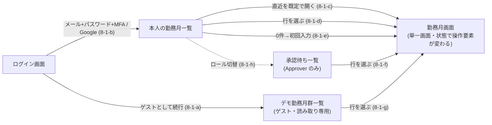

# デザインシステム — トークン・共通コンポーネント・画面遷移

Issue #53 の仕様。**ADR 0015 が「`docs/specs/` に落とす」と定めたデザインの決定（採用トークン・コンポーネント一覧・画面遷移）を、受け入れ条件として固定する。**

**採用手段の決定（なぜ Claude Design か・なぜローカルを正とするか）は ADR 0015 が持ち、本仕様へ書き写さない**（ADR 0004）。**業務ルール・状態遷移・ユビキタス言語も書き写さない。** 正解は `docs/domain/ubiquitous-language.md` と各業務仕様・各 UI 仕様にあり、本仕様はそれらを参照して「**トークンと共通コンポーネントが満たすべき形**」だけを定める。

- **前提 ADR**: 0015（デザインシステムの手段）／0013・0014（AWS ネイティブ・BFF）／0016（認証・ロール）／0007 §5（Vitest）
- **前提仕様**: `web-app-scaffold.md` AC-1-5（コンポーネントの配置先。**人間が 2026-08-14 に承認した決定であり、本仕様は再決定しない**）

## 決定の所在（誰が決めたか）

| 対象 | 決定者 | 備考 |
|---|---|---|
| デザインシステムの構築手段・ローカルを正とする運用 | **人間**（ADR 0015） | 本仕様は参照のみ |
| コンポーネントの配置先 `apps/web/src/components/` | **人間**（`web-app-scaffold.md` AC-1-5） | 本仕様は参照のみ。再提案しない |
| 画面・操作可否・到達手段・カレンダー・時分入力・並び順等 | **人間**（各 UI 仕様の「確定事項」） | 本仕様は導出のみ。新たな画面・操作を足さない |
| コンポーネントのレンダリング検証手段（DOM 検証ライブラリの追加可否） | **人間**（D-1。2026-09-16） | 本仕様が決定の記録を持つ。本仕様は再決定しない |
| **採用トークンの名称と値・共通コンポーネントの一覧と props**（AC-2 / AC-5 / AC-6） | **AI が起案し、人間が承認**（2026-09-16） | 起案は ADR 0015 がデザイン工程へ委譲した範囲として **AI（本仕様）** が行った。**人間が 2026-09-16 に AC-2 / AC-5 / AC-6 を承認した**ため、色トークン17点・共通コンポーネント11点・props は**そのままテストの期待値として使ってよい**。差し替えるときは人間の判断で表の値を置き換える（AC の構造は変えない） |

**この表は「AI が決めてよい」範囲を広げるための表ではなく、どこまでが人間の決定かを取り違えないための表である。** 最終行は「AI の起案に人間の承認が付いた」状態を表しており、**起案者が AI であった事実は承認によって消えない** —— 値の妥当性を疑う場面では、それが AI の起案であることを前提に人間へ差し替えを諮る。業務ルール・ドメイン用語・画面の増減は、承認の有無にかかわらず本仕様では決めない（AC-7）。

---

## スコープ

- **デザイントークン**（CSS カスタムプロパティ）の名称・値・定義場所（AC-1〜AC-4）
- **共通コンポーネントの一覧**と、各コンポーネントの公開 props・状態・アクセシビリティ属性（AC-5・AC-6）
- **画面遷移**の導出図（既存 UI 仕様の AC から辺を導き、出典を併記する。AC-8）
- **Claude Design との同期運用の受け入れ条件**（ローカルを正とすること／外向き操作の条件。AC-9）

### 非スコープ

| 対象 | いつ / どこで |
|---|---|
| **各画面そのものの実装**（ログイン画面・勤務月一覧・勤務月画面・入力フォーム・締め・承認の画面） | 後続の画面 Issue。本 Issue が作るのは画面から使われる部品とトークンのみ |
| **画面固有の合成コンポーネント**（日次実績のカレンダー、勤務月一覧の表、勤務月サマリ等） | 同上（AC-5-3 が境界を定める） |
| **URL / ルート設計**（どのパスがどの画面か）・Route Handler の追加 | 後続の画面 Issue。AC-8 は画面の単位と遷移だけを定め、パスを固定しない |
| **コンポーネントのカタログ画面・Storybook の導入** | 本 Issue では作らない（ADR 0015「後で併用も可能」を維持。プレビューは Claude Design 側が担う） |
| **`apps/web/src/app/` 配下の既存の暫定表示の置き換え** | 画面 Issue。AC-2-4 の色リテラル禁止の検査対象は `src/components/` 配下に限る（AC-11-4） |
| **BFF 応答型・データ取得** | 画面 Issue／`domain-api-http-contract.md`・`bff-auth-termination.md` |
| **超過／不足に色で良し悪しを与えること** | **行わない。** 「不足＝悪い」等の価値づけは業務側の判断であり、デザイン工程が決めてよい範囲を超える（AC-2-3） |

---

## 前提（P）

| # | 前提 | 出典 |
|---|---|---|
| P-1 | ローカル（リポジトリ内）のコンポーネント成果物が**正**であり、Claude Design 側はミラー／プレビューである。同期は**1コンポーネントずつの増分**で行う | ADR 0015 決定 |
| P-2 | コンポーネントの配置先は **`apps/web/src/components/`**（`ui_kits/` は採らない） | `web-app-scaffold.md` AC-1-5（人間決定） |
| P-3 | `apps/web` は Tailwind CSS v4 を使い、トークンは `apps/web/src/app/globals.css` の `:root` と `@theme inline` で定義する構成である。本仕様はこの構成を変えずにトークンを足す | `web-app-scaffold.md` AC-1-4 |
| P-4 | 勤務月の状態は `Draft` / `PendingApproval` / `Approved` の3値、ロールは `Engineer` / `Approver`。日本語の呼称は「下書き」「締め済」「承認済」「技術者」「承認者」 | `docs/domain/ubiquitous-language.md` |
| P-5 | 「提供しない」操作は**非表示で統一**する（非活性表示を採らない。人間決定 Q8） | `work-month-screen-ui.md` AC-3 |
| P-6 | Web のテストランナーは Vitest。ライブラリの追加可否は「必要になった Issue で判断する」として保留されていたが、**本 Issue がその「必要になった Issue」に当たり、人間が 2026-09-16 に DOM 検証ライブラリの追加を決定した（D-1）。** 追加はその決定が挙げた範囲に限り、**アサーション／モックのライブラリは引き続き追加しない** | ADR 0007 §5／`web-app-scaffold.md` AC-3-5／本仕様 D-1 |
| P-7 | 一覧の1ページあたりの件数は**仕様で固定しない**（人間決定・旧 N-3） | `work-month-listing-ui.md` AC-4-2 |

---

## 決定（D）— かつての未決点と、その決着

**本節に未決点は残っていない。** 本仕様が起案時に抱えていた唯一の未決点（U-1「コンポーネントのレンダリング検証手段」）は、下記のとおり人間の決定で決着し、AC-10・AC-11 へ畳み込まれた。

### D-1. コンポーネントのレンダリング検証手段 — 2026-09-16 の決定（案 (a)）

| 項目 | 内容 |
|---|---|
| 決定日 | 2026-09-16 |
| 決定者 | **人間**（AI の仮置き・AI の推測ではない） |
| 採った案 | **案 (a)** — `@testing-library/react` + DOM 環境（`jsdom`）を導入し、コンポーネントのレンダリング・a11y 属性・キーボード操作を機械検査する |
| 採用理由（人間の言） | 「**AC-6 の a11y 属性と `ConfirmDialog` の Esc キー（AC-6-9）を機械検査できる唯一の案であり、このリポジトリが繰り返し塞いできた『規律頼み』を避けるため**」 |
| 採らなかった案 | (b) `react-dom/server` の静的レンダリング／(c) DOM 検証を行わない（いずれも下表） |
| 記録先 | **本仕様**（Issue コメント・PR 本文で終わらせない。ADR 0004） |

**判断の経緯 — AI が3案を並べ、人間が (a) を選んだ。** 起案時に提示した比較は次のとおりで、選択そのものは人間が行っている（技術選定は人間の決定事項。`docs/rules/responsibility.md`）。

| 案 | 内容 | 代償 | 採否 |
|---|---|---|---|
| (a) | `@testing-library/react` + DOM 環境（`jsdom` 等）を導入し、Vitest の環境設定を与える | 依存が増える。ADR 0007 が Go 側で採った「ライブラリを足さない」姿勢と Web 側の姿勢がずれる（ずれを承知で決めるなら記録が要る） | **採用**（人間・2026-09-16） |
| (b) | **依存を増やさず**、既存の `react-dom`（`react-dom/server` の静的レンダリング）で出力 HTML を検証する | クリック・キーボード操作（AC-6 の `ConfirmDialog` の Esc 等）を検証できない。検証できない項目は限界として固定する必要がある | 不採用 |
| (c) | DOM 検証を行わず、CSS・型・純関数の検査だけに限る | AC-6 の a11y 属性が機械検査されなくなる（規律頼みになる） | 不採用 |

案 (a) の代償として挙げた「Go 側（ADR 0007）と Web 側の姿勢のずれ」は、**本節をその記録として扱う。** この決定を ADR としても残すか否かは人間の判断事項であり、**本仕様は ADR を起案しない**（本仕様は決定の事実と範囲だけを持つ）。

**決定の帰結（本仕様が持つ要求）**

| # | 要求 |
|---|---|
| D-1-1 | 追加する依存は **`@testing-library/react` / `@testing-library/dom` / `jsdom` の3点に限る。** `@testing-library/user-event` を入れない。これ以外のアサーション／モックのライブラリを入れない姿勢（`web-app-scaffold.md` AC-3-5）は、この3点を除いて維持する。**3点の外へ広げる判断は人間の承認事項**であり、実装工程が自ら足さない |
| D-1-2 | **Vitest のグローバル設定（`apps/web/vitest.config.mts`）の `environment` は `"node"` のままとする。** DOM 環境は、コンポーネントのテストファイル側に `@vitest-environment jsdom` のドックブロックを置いて**そのファイルにのみ**与える。グローバルを `jsdom` へ変えると、`auth-handlers` / `jwt-verifier` / `rate-limit` 等の既存テストが前提としている Node 環境を変えてしまう |
| D-1-3 | 本決定は **AC の中身を変えない。** AC-6 は観測可能な出力として書かれており、手段が確定したことで AC-6 の出力側が Red を踏めるようになっただけである（AC-10-6・AC-11-7） |
| D-1-4 | **導入するバージョンを本仕様の条文に書かない**（特定時点の実測を仕様へ埋め込まない。`docs/rules/development-process.md`）。pin の現況は `apps/web/package.json` が持つ |

---

## 受け入れ条件（AC）

| AC | 主題 | 主に効く工程 |
|---|---|---|
| AC-1 | トークンの定義場所と形式 | tester・implementer |
| AC-2 | セマンティック色トークンの名称と値 | tester・implementer |
| AC-3 | コントラスト比の下限 | tester・implementer |
| AC-4 | タイポグラフィ・余白・角丸・フォーカス（独自スケールを作らない） | tester・implementer |
| AC-5 | 共通コンポーネントの一覧と境界 | tester・implementer・reviewer |
| AC-6 | 各コンポーネントの公開 props と a11y 属性 | tester・implementer |
| AC-7 | 業務判断をコンポーネントへ持ち込まない | implementer・reviewer |
| AC-8 | 画面遷移（導出図） | reviewer |
| AC-9 | Claude Design との同期運用 | reviewer |
| AC-10 | 検証手段 — どの AC を何で測るか | tester |
| AC-11 | 限界 — 緑が意味しないこと | reviewer |

### AC-1. トークンの定義場所と形式

| # | 要求 |
|---|---|
| 1-1 | トークンは **`apps/web/src/app/globals.css` の1箇所**で定義する。コンポーネントのファイル・`tailwind.config.*`・別の CSS ファイルへ分散させない（P-3。定義が2箇所にあると「正」が二重化する） |
| 1-2 | **素の値は `:root` に `--<名前>` として置き**、暗色は `@media (prefers-color-scheme: dark)` の `:root` で**同名のトークンを上書き**する。`prefers-color-scheme` 以外の切替手段（クラス付与・JS）を本 Issue で導入しない |
| 1-3 | **Tailwind から参照するためのマッピングを `@theme inline` に置く。** AC-2 の各色トークン `--X` に対し `--color-X: var(--X)` を定義する（`bg-X` / `text-X` / `border-X` が使えること） |
| 1-4 | AC-2 の表に**無いトークンを増やさない**。必要になったら本仕様の表を更新してから足す（トークンが増える経路を仕様の外に作らない） |
| 1-5 | 色の値は **6桁の16進表記（`#rrggbb`、小文字）**で書く。`rgb()` / `hsl()` / 名前付き色を混ぜない（値の一致を機械比較できる形に揃える） |

### AC-2. セマンティック色トークンの名称と値

**名称は用途（セマンティクス）で付け、色名で付けない**（`--zinc-50` のような色名トークンを作らない。暗色で意味が反転するため）。

| # | トークン | 明色（`:root`） | 暗色（`prefers-color-scheme: dark`） | 用途 |
|---|---|---|---|---|
| 2-1-a | `--background` | `#ffffff` | `#0a0a0a` | ページ地色 |
| 2-1-b | `--foreground` | `#171717` | `#ededed` | 既定の文字色 |
| 2-1-c | `--surface` | `#f8fafc` | `#171717` | 区画（`Card`）の地色 |
| 2-1-d | `--surface-foreground` | `#171717` | `#ededed` | 区画の上の文字色 |
| 2-1-e | `--muted-foreground` | `#52525b` | `#a1a1aa` | 補助テキスト（説明・空状態の本文） |
| 2-1-f | `--border` | `#71717a` | `#a1a1aa` | 入力欄・区画の境界線 |
| 2-1-g | `--primary` | `#1d4ed8` | `#93c5fd` | 主要操作（`Button` の `primary`） |
| 2-1-h | `--primary-foreground` | `#ffffff` | `#0a0a0a` | `--primary` の上の文字色 |
| 2-1-i | `--danger` | `#b91c1c` | `#fca5a5` | エラー表示・破壊的操作（`Button` の `danger`・`ErrorBanner`・`FieldError`） |
| 2-1-j | `--danger-foreground` | `#ffffff` | `#0a0a0a` | `--danger` の上の文字色 |
| 2-1-k | `--focus-ring` | `#1d4ed8` | `#93c5fd` | キーボードフォーカスの可視リング |
| 2-1-l | `--state-draft` | `#e4e4e7` | `#3f3f46` | 状態バッジ `Draft`（下書き）の地色 |
| 2-1-m | `--state-draft-foreground` | `#27272a` | `#f4f4f5` | 同・文字色 |
| 2-1-n | `--state-pending-approval` | `#fef3c7` | `#78350f` | 状態バッジ `PendingApproval`（締め済）の地色 |
| 2-1-o | `--state-pending-approval-foreground` | `#78350f` | `#fef3c7` | 同・文字色 |
| 2-1-p | `--state-approved` | `#dcfce7` | `#14532d` | 状態バッジ `Approved`（承認済）の地色 |
| 2-1-q | `--state-approved-foreground` | `#14532d` | `#dcfce7` | 同・文字色 |

| # | 要求 |
|---|---|
| 2-2 | **上表の17トークンすべてが、明色・暗色の両方で定義されていること。** 片方だけの定義を許さない（暗色で未定義のトークンは明色の値を引き継ぎ、コントラストが崩れる） |
| 2-3 | **超過（`Excess`）／不足（`Shortfall`）専用の色トークンを定義しない。** 数値は既定の文字色で表示する。色で良し悪しを表すことは業務上の価値づけであり、本仕様では決めない（非スコープ表） |
| 2-4 | **共通コンポーネントの実装（`apps/web/src/components/**`）に生の色を書かない。** 16進・`rgb()`・Tailwind のパレットユーティリティ（`bg-zinc-50`・`text-blue-600` 等）を含めない。色は上表のトークン経由のユーティリティ（`bg-primary`・`text-muted-foreground` 等）でのみ参照する |
| 2-5 | 状態バッジの3トークン組（`draft` / `pending-approval` / `approved`）は**互いに異なる値**であること（`work-month-screen-ui.md` AC-2-1「3値を互いに区別できる」の色側の担保） |

### AC-3. コントラスト比の下限

**判定は上表の16進値から計算する**（WCAG 2.1 の相対輝度・コントラスト比の定義に従う）。明色・暗色の**両モードで**満たすこと。

| # | 前景 / 背景の組 | 下限 |
|---|---|---|
| 3-1 | `--foreground` / `--background` | **4.5:1** |
| 3-2 | `--surface-foreground` / `--surface` | **4.5:1** |
| 3-3 | `--muted-foreground` / `--background` | **4.5:1** |
| 3-4 | `--primary-foreground` / `--primary` | **4.5:1** |
| 3-5 | `--danger-foreground` / `--danger` | **4.5:1** |
| 3-6 | `--danger` / `--background`（エラー文言を地色の上に置く場合） | **4.5:1** |
| 3-7 | `--state-<状態>-foreground` / `--state-<状態>`（3組すべて） | **4.5:1** |
| 3-8 | `--border` / `--background`（境界線は非テキスト要素） | **3:1** |
| 3-9 | `--focus-ring` / `--background`（フォーカスリングは非テキスト要素） | **3:1** |

**3-10**: 値を差し替えるときは、差し替えた値でこの表を再計算して満たすこと。**下限そのものを下げない**（下げる判断は人間の承認事項）。

### AC-4. タイポグラフィ・余白・角丸・フォーカス

**独自のスケールを作らない。** Tailwind の既定スケールを使い、重複した定義を持たない（トークンが増えるほど「どれを使うか」の判断が要り、一貫性は下がる）。

| # | 要求 |
|---|---|
| 4-1 | `@theme` / `@theme inline` で **`--spacing-*` / `--text-*` / `--radius-*` を再定義しない**（Tailwind 既定を使う） |
| 4-2 | **`globals.css` の `body` に `font-family` を直接書かない。** Tailwind の既定 `--font-sans` に従う |
| 4-3 | **外部フォント配信への依存を持たない。** `globals.css` に `@import url(` を書かず、`next/font/google` を使わない（実行時・ビルド時の外向き依存を増やさない。`docs/rules/cost-guardrails.md`） |
| 4-4 | 共通コンポーネントが使う角丸ユーティリティは **`rounded-md` のみ**。`rounded-full` / `rounded-lg` 等を混在させない |
| 4-5 | **すべての対話要素**（`button` / `input` / リンク）は、キーボードフォーカス時に `--focus-ring` を用いた**可視のリング**を持つ（`focus-visible:` 系のユーティリティで指定する） |
| 4-6 | 共通コンポーネントの実装に、**フォーカスリングを消す指定（`outline-none` 等）を代替のリング指定なしで書かない** |

### AC-5. 共通コンポーネントの一覧と境界

| # | コンポーネント | ファイル | 使われる画面 | 導出元（既存 AC） |
|---|---|---|---|---|
| 5-1-a | `AppHeader` | `app-header.tsx` | 全画面 | `login-ui.md` AC-6-1（「ヘッダー等に」置く） |
| 5-1-b | `RoleSwitcher` | `role-switcher.tsx` | 全画面（ログイン中のみ） | `login-ui.md` AC-6-1・6-5 |
| 5-1-c | `StatusBadge` | `status-badge.tsx` | 勤務月画面・各一覧 | `work-month-screen-ui.md` AC-1-2・AC-2／`work-month-listing-ui.md` AC-1-2 |
| 5-1-d | `Button` | `button.tsx` | 全画面 | `work-month-screen-ui.md` AC-1-7（操作領域）／`monthly-closing-ui.md` AC-1／`approval-ui.md` AC-1 |
| 5-1-e | `Card` | `card.tsx` | 勤務月画面・各一覧 | `work-month-screen-ui.md` AC-1（画面骨格の各要素の区画） |
| 5-1-f | `NumberField` | `number-field.tsx` | 勤務月画面（入力フォーム） | `daily-record-entry-ui.md` AC-3-2（時・分の数値入力。人間決定 Q5） |
| 5-1-g | `FieldError` | `field-error.tsx` | 勤務月画面（入力フォーム） | `daily-record-entry-ui.md` AC-4／`work-month-screen-ui.md` AC-6-1 |
| 5-1-h | `ErrorBanner` | `error-banner.tsx` | 全画面 | `work-month-screen-ui.md` AC-6-3／`work-month-listing-ui.md` AC-7-3／`login-ui.md` AC-7 |
| 5-1-i | `EmptyState` | `empty-state.tsx` | 各一覧・勤務月画面 | `work-month-listing-ui.md` AC-7-1・7-2／`daily-record-entry-ui.md` AC-2-1 |
| 5-1-j | `ConfirmDialog` | `confirm-dialog.tsx` | 勤務月画面（締め） | `monthly-closing-ui.md` AC-2（「具体的表現（モーダル等）はデザイン工程が担う」） |
| 5-1-k | `Pagination` | `pagination.tsx` | 各一覧 | `work-month-listing-ui.md` AC-4-2 |

| # | 要求 |
|---|---|
| 5-2 | **1コンポーネント1ファイル**とし、ファイル名は上表のとおり（kebab-case）。`index.ts` で再輸出するバレルファイルを作らない。**1ファイル＝増分同期の単位**である（ADR 0015「1コンポーネントずつの増分」） |
| 5-3 | **上表に無いコンポーネントを本 Issue で作らない。** とくに次は**画面固有の合成**であり、後続の画面 Issue が持つ —— 日次実績のカレンダー（`daily-record-entry-ui.md` AC-1-4）、勤務月一覧の表（`work-month-listing-ui.md` AC-1-2）、勤務月サマリ（`work-month-screen-ui.md` AC-1-3〜1-5）、ログイン方式の一覧（`login-ui.md` AC-1-1） |
| 5-4 | **境界の判定基準**: 共通コンポーネントは (i) データ取得（BFF 呼び出し）を行わず、(ii) 状態遷移（締め・承認・差戻し）を自ら実行せず、(iii) 特定画面のレイアウトに固有でないもの。3つのいずれかを欠くものは画面 Issue 側へ置く |
| 5-5 | 共通コンポーネントから **`fetch` / Route Handler の呼び出しを行わない**（5-4(i) の機械的な形。`docs/rules/architecture.md` の BFF 一方通行を部品側で破らない） |

### AC-6. 各コンポーネントの公開 props と a11y 属性

**表の「公開 props」は網羅である。** 表に無い props（とくに `role` / 勤務月の状態を受けて自ら可否を判定する props）を足さない（AC-7）。ネイティブ要素の標準属性の透過（`...rest`）は妨げない。

| # | コンポーネント | 公開 props | 出力・a11y の要求 |
|---|---|---|---|
| 6-1 | `StatusBadge` | `state: "Draft" \| "PendingApproval" \| "Approved"` の**1つのみ** | 日本語ラベルを**文字として**出す（`Draft`→`下書き`／`PendingApproval`→`締め済`／`Approved`→`承認済`。P-4）。地色・文字色は `--state-*` を使う。**色だけで区別させない**（`work-month-screen-ui.md` AC-2-1）。**操作者の種別を受け取らないことにより、誰が見ても同一の表示になる**（同 AC-2-2 の構造的な担保） |
| 6-2 | `Button` | `variant?: "primary" \| "secondary" \| "danger"`（既定 `secondary`）、`children`、および `button` の標準属性 | `<button>` を出力し、`type` の既定を `"button"` にする（フォーム内での意図しない送信を防ぐ）。`disabled` は**多重送信の抑止にのみ**使う（AC-7-2）。`variant` ごとに使うトークンは `primary`→`--primary`/`--primary-foreground`、`danger`→`--danger`/`--danger-foreground`、`secondary`→`--surface`/`--surface-foreground`+`--border` |
| 6-3 | `RoleSwitcher` | `role: Role`、`onChange: (role: Role) => void` | 型 `Role` は **`apps/web/src/lib/role-cookie.ts` の既存の型を輸入して使う**（リテラル union を再定義しない）。選択肢は**ちょうど2つ**（`Engineer`→`技術者`／`Approver`→`承認者`。P-4）。グループにアクセシブル名を与える（`aria-label` 等）。**現在のロールが表示から判別できること**。ゲストへ出すか否かは呼び出し側が決める（`login-ui.md` AC-6-5。本コンポーネントは「ゲスト」を表す値を持たない） |
| 6-4 | `Card` | `children`、`title?: ReactNode` | 地色 `--surface`、文字色 `--surface-foreground`、境界線 `--border`。`title` があるときは見出し要素として出す |
| 6-5 | `NumberField` | `id`、`label: string`、`value: number \| ""`、`onChange`、`min?: number`、`max?: number`、`step?: number`、`errorId?: string`、`invalid?: boolean` | `<input type="number">` を出力し、`label` を `<label for>` で結びつける。`min` / `max` / `step` を**既定値として内蔵しない**（値域は `daily-record-entry.md` AC-3 が持つ。AC-7-1）。`invalid` のとき `aria-invalid="true"` を付け、`errorId` があれば `aria-describedby` で結ぶ |
| 6-6 | `FieldError` | `id`、`children` | `id` を持つ要素として出力し、`role="alert"` を付ける。文字色は `--danger`。**文言を内蔵しない**（理由の文言は呼び出し側が渡す。AC-7-1） |
| 6-7 | `ErrorBanner` | `children`、`onRetry?: () => void` | `role="alert"` を付ける。`--danger` を用い、**色以外にも文字で「エラーである」ことが分かる**こと。`onRetry` があるとき再試行の `Button` を出す（`login-ui.md` AC-7-1「再試行できる」） |
| 6-8 | `EmptyState` | `title: string`、`description?: string`、`action?: ReactNode` | 文字で空であることを示す。`action` は導線（`work-month-listing-ui.md` AC-7-1「初回入力の導線」）を呼び出し側から受け取る |
| 6-9 | `ConfirmDialog` | `open: boolean`、`title: string`、`description: ReactNode`、`confirmLabel: string`、`confirmVariant?: "primary" \| "danger"`、`onConfirm: () => void`、`onCancel: () => void` | `open` が偽のとき**何も出力しない**。真のとき `role="dialog"` と `aria-modal="true"` を持ち、`title` を `aria-labelledby` で結ぶ。**Esc キーと取消操作は `onCancel` を呼び、`onConfirm` を呼ばない**（`monthly-closing-ui.md` AC-2-3「状態を変えない」の UI 側の担保）。**取り消せない旨の文言を内蔵しない**（`description` として呼び出し側が渡す。AC-7-1） |
| 6-10 | `Pagination` | `page: number`（1 始まり）、`pageCount: number`、`onPageChange: (page: number) => void` | `<nav>` にアクセシブル名を与える。先頭ページで「前へ」、末尾ページで「次へ」を**押せない形にする**（この非活性は操作可否ではなく範囲外の入力の抑止であり、AC-7-2 の対象外）。**1ページあたりの件数を props に持たず、既定値も持たない**（P-7。仕様で固定しないという人間決定を部品側で破らない） |
| 6-11 | `AppHeader` | `right?: ReactNode` | `<header>` を出力し、アプリ名を見出しとして含む。`right` に `RoleSwitcher` 等を差し込めること。**`RoleSwitcher` を内蔵しない**（ログイン状態・ロール保持の判定を部品が持たないため。AC-7-2／`login-ui.md` AC-6-5） |

### AC-7. 業務判断をコンポーネントへ持ち込まない

| # | 要求 |
|---|---|
| 7-1 | **共通コンポーネントに業務ルールの値・文言を内蔵しない。** 稼働時間の値域（`daily-record-entry.md` AC-3）、丸め規則、締めが取り消せない旨の文言、エラーの理由文は、すべて呼び出し側から渡す。部品が業務ルールの写しを持つと、正解が `docs/specs/` の外に増える（ADR 0004） |
| 7-2 | **状態×ロールの操作可否を共通コンポーネントが判定しない。** 可否は呼び出し側の条件レンダリングで表し、「提供しない」は**非表示**にする（P-5）。したがって共通コンポーネントは勤務月の状態・操作者種別を受け取る props を持たない（AC-6 の props 表が網羅である理由） |
| 7-3 | **可否を非活性（`disabled` / `aria-disabled`）で表さない。** `disabled` の使用は多重送信の抑止（AC-6-2）と入力範囲外の抑止（AC-6-10）に限る |
| 7-4 | **ユビキタス言語に無い語をコンポーネント名・props 名・表示文言に導入しない。** 状態・ロールの表記は P-4 に従う（`Closed`・`承認待ち` 等の別表記を使わない） |

### AC-8. 画面遷移（導出図）

**この図は導出であり、正解は各辺の出典 AC にある。** 出典と食い違ったときは**出典側が正**であり、本図を直す。**出典を持たない辺を足さない**（足す＝画面の増設であり、人間の決定が要る）。

| # | 辺 | 出典 |
|---|---|---|
| 8-1-a | ログイン画面 →（ゲストとして続行）→ デモ勤務月群一覧 | `login-ui.md` AC-1-1(a)・AC-4-1・4-3／`work-month-listing-ui.md` AC-3-1 |
| 8-1-b | ログイン画面 →（メール+パスワード+MFA / Google OIDC）→ 本人の勤務月一覧 | `login-ui.md` AC-1-1(b)(c)／`work-month-listing-ui.md` AC-1-1 |
| 8-1-c | 本人の勤務月一覧 →（直近を既定で開く）→ 勤務月画面 | `work-month-listing-ui.md` AC-6-1・6-3 |
| 8-1-d | 本人の勤務月一覧 →（行を選ぶ）→ 勤務月画面 | `work-month-listing-ui.md` AC-5-1 |
| 8-1-e | 本人の勤務月一覧（0件）→（初回入力の導線）→ 勤務月画面（空状態） | `work-month-listing-ui.md` AC-6-2・7-1／`daily-record-entry-ui.md` AC-2-1・2-2 |
| 8-1-f | 承認待ち一覧 →（行を選ぶ）→ 勤務月画面 | `work-month-listing-ui.md` AC-5-1・2-5 |
| 8-1-g | デモ勤務月群一覧 →（行を選ぶ）→ 勤務月画面（全操作を非表示） | `work-month-listing-ui.md` AC-3-2／`work-month-screen-ui.md` AC-3 ゲスト行 |
| 8-1-h | ロール切替（`AppHeader`）→ 承認待ち一覧への導線の有無が変わる | `login-ui.md` AC-6-2／`work-month-listing-ui.md` AC-2-1・2-4 |

| # | 要求 |
|---|---|
| 8-2 | **勤務月画面は単一である。** 状態（`Draft` / `PendingApproval` / `Approved`）で操作要素が変わるだけで、状態ごとに別画面へ遷移しない（`work-month-screen-ui.md` AC-7）。**状態遷移図を本仕様に複製しない**（正解は同 AC-7 とユビキタス言語） |
| 8-3 | **承認済の横断一覧・技術者の横断ビューに当たる画面を図へ足さない**（`approval.md` AC-8-2／`work-month-listing-ui.md` AC-8-1・8-2） |
| 8-4 | **URL / ルートを本仕様で固定しない**（非スコープ表）。図が定めるのは画面の単位と遷移の有無だけである |

### AC-9. Claude Design との同期運用

| # | 要求 |
|---|---|
| 9-1 | **正解の実体はローカル（`apps/web/src/components/`）である**（P-1・P-2）。Claude Design 側の内容が食い違ったら、**ローカルを正としてミラー側を直す** |
| 9-2 | **外向きの操作（Claude Design のプロジェクト作成・`DesignSync` による同期）は、人間の明示指示があってから実行する。** 仕様工程・テスト工程は実行しない |
| 9-3 | 同期は**1コンポーネントずつの増分**で行う。丸ごと置換しない（ADR 0015 決定） |
| 9-4 | 同期のために**資格情報・トークンをリポジトリへ置かない**（`docs/rules/security.md`）。同期の可否がローカルのテスト・Lint の結果を左右しないこと（同期できない環境でもローカル成果物だけで `make verify` が通る） |
| 9-5 | 同期を行った事実・対象を残す場合も、**決定そのものは本仕様に置く。** Issue コメント・PR 本文へ仕様を書き写さない（ADR 0004） |

### AC-10. 検証手段 — どの AC を何で測るか

| # | 対象 | 手段 | 機械検査するか |
|---|---|---|---|
| 10-1 | AC-1 / AC-2 / AC-4-1〜4-3 | `apps/web/src/app/globals.css` を読み、トークン名・値・定義ブロック（`:root` / dark / `@theme inline`）の有無を突き合わせる | する |
| 10-2 | AC-3 | AC-2 の表の16進値から相対輝度とコントラスト比を計算し、下限と比較する（計算は外部ライブラリを使わずテスト内で行う） | する |
| 10-3 | AC-2-4 / AC-4-4〜4-6 / AC-5-5 | `apps/web/src/components/` 配下の実装ファイル（`*.test.tsx` を除く）を読み、禁じた表現（生の色・`rounded-md` 以外の角丸・代替なしの `outline-none`・`fetch`）の不在を検査する | する |
| 10-4 | AC-5-1 / AC-5-2 | `apps/web/src/components/` 直下の **`*.tsx`（`*.test.tsx` を除く）の集合**が表と**過不足なく**一致することを検査する（表に無い `*.tsx` の存在も違反。テストファイルと `.gitkeep` 等の非 `*.tsx` は対象外）。あわせて **`index.ts` / `index.tsx`（バレル）が存在しないこと**を検査する | する |
| 10-5 | AC-6 の props 契約（型） | `npx tsc --noEmit`（`make lint-web` が呼ぶ）。禁じた props を渡すコードが型エラーになることを、`@ts-expect-error` を用いた型テストで示す | する（型検査） |
| 10-6 | AC-6 の出力・a11y 属性 | **`@testing-library/react` でレンダリングし、DOM を検証する**（D-1）。テストファイルの先頭に `@vitest-environment jsdom` のドックブロックを置き、そのファイルにのみ DOM 環境を与える（D-1-2）。AC-6 の表が名指しした属性（`role` / `aria-modal` / `aria-invalid` / `aria-describedby` / `aria-labelledby` / `type` / `label` と入力欄の結び付き）とラベル文字列を DOM から読み、表と突き合わせる。`ConfirmDialog` の Esc（AC-6-9）は `keydown` イベントを発火させ、`onCancel` が呼ばれ `onConfirm` が呼ばれないことを検証する | する |
| 10-7 | AC-7 / AC-8 / AC-9 | レビューでの突き合わせ | **しない**（AC-11） |

**10-8**: テストは `apps/web` 配下に置き、watch せず終了する（`web-app-scaffold.md` AC-2-2・AC-3-6）。**現在時刻・ロケール・ネットワークに依存させない**（同 AC-6-3・6-4）。

**10-9**: **DOM 環境を与える範囲は、共通コンポーネントのテストファイルに限る**（D-1-2）。既存の Node 環境のテスト（Route Handler・JWT 検証・レート制限等）の実行環境を変えない。ドックブロックの付け忘れは、そのファイルのテストが DOM 不在で落ちることで露見するが、**逆向き（グローバル設定を `jsdom` へ変えてしまうこと）を禁じる機械検査は無い**（AC-11-10）。

### AC-11. 限界 — 緑が意味しないこと

| # | 内容 |
|---|---|
| 11-1 | **トークンが定義され、コントラストの下限を満たすことは、画面が使いやすいことを意味しない。** 見た目・レイアウトの妥当性はハーネスの外にある（`web-app-scaffold.md` AC-10-7 と同型） |
| 11-2 | **「ローカルが正」であることは機械検査しない。** Claude Design 側との乖離（AC-9-1）を検出する手段は無く、規律で守る（ADR 0015 のトレードオフ「デザインの正の二重化リスク」） |
| 11-3 | **AC-7 は大部分が機械検査されない。** 「業務ルールを内蔵していない」ことは props の型（AC-6）と実装の目視で見るに留まる。値域の既定値を内蔵しても型は通る |
| 11-4 | **AC-2-4 の色リテラル禁止の検査対象は `src/components/` 配下に限る。** `src/app/` 配下の画面がトークンを使うかは本 Issue では検査しない（画面は後続 Issue。非スコープ表） |
| 11-5 | **本 Issue の完了は「部品とトークンが揃った」ことであり、MVP の画面が動くことを意味しない。** 画面の実装は後続 Issue が持つ |
| 11-6 | **アクセシビリティの担保は AC-6 が名指しした属性と AC-3 のコントラストに限る。** 支援技術での実利用・キーボード操作の網羅・WCAG 全体への適合を主張しない |
| 11-7 | **AC-6 の出力側（a11y 属性・ラベル文字列）は D-1 により機械検査の対象になった**（AC-10-6）。**ただし検査されるのは AC-6 の表が名指しした属性・文字列・挙動だけである。** 表に書かれていない出力（DOM 構造の妥当性、見出しレベルの階層、フォーカス順序、クラス名の付き方）は検査されない。**緑は「AC-6 の表を満たした」ことのみを意味し、コンポーネントがアクセシブルであることを意味しない**（11-6・11-8・11-9） |
| 11-8 | **`jsdom` はブラウザではない。** レンダリング検証が緑でも、実ブラウザでの表示・レイアウト・CSS の適用結果（コントラストやフォーカスリングの実際の見え方）・支援技術の実際の読み上げは検証されない。AC-3 のコントラストは AC-2 の16進値からの計算であって（AC-10-2）、画面上の実測ではない |
| 11-9 | **キーボード操作の検証は、テストから発火した合成イベントに留まる。** `@testing-library/user-event` を入れない（D-1-1）ため、実ブラウザのイベント順序・フォーカス移動・IME の挙動は再現されない。検証するのは AC-6 が名指しした挙動（`ConfirmDialog` の Esc 等）に限り、**キーボード操作の網羅は主張しない**（11-6） |
| 11-10 | **「既存テストの環境を変えない」（D-1-2）はファイル単位の規律である。** Vitest のグローバル設定を `jsdom` へ変える変更を機械的に禁じる検査は無く、Web には `check-domain-deps` に相当する依存検査も無い（`web-app-scaffold.md` AC-10-2）。追加する依存を3点に限ること（D-1-1）も同様に機械検査されない |
