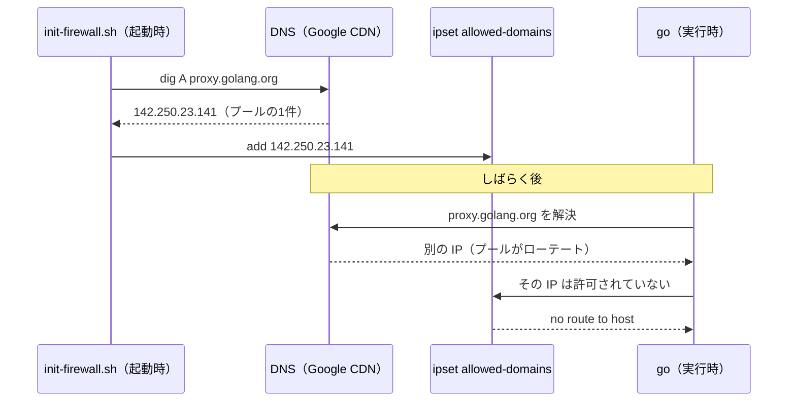

# devcontainer の Go モジュール取得方針 — ビルド時に温め、実行時には取りに行かない

Issue #66 の仕様。**devcontainer 内で Go モジュールの実行時取得が成立しない**という現況の原因・方針・限界を `docs/` に確定させ、あわせて **`.devcontainer/Dockerfile` の `ARG` pin と `services/api/go.mod` の `require` の乖離を機械検査**する。

現在この根拠は **Dockerfile のコメントとコミットメッセージにしか無い**（PR #68 / `63e483f`）。コミットメッセージは検索されず、Dockerfile のコメントは Dockerfile を開いた者にしか届かない。**正解は常に `docs/` にある**（ADR 0004）という運用に対して、ここだけが例外になっている。本仕様がその正解の置き場所である。

**新しい技術選定を行わない。** 採用済みの方式（ビルド時の事前取得）を追認して記述し、機械検査を1本足すだけである。ハーネス側の検査追加は ADR 0010 の範囲であり、本仕様で ADR は起こさない。**allowlist の拡張・`GOSUMDB` / `GOPROXY` の既定変更・vendoring のいずれかを採る場合は、本仕様ではなく新しい人間の決定（技術選定の変更なら ADR）が要る**（AC-2）。

---

## スコープ

- 原因・方針・不採用案の記録（P-1〜P-3 と AC-1 / AC-2）
- 実態と食い違っている既存 docs の是正（`docs/harness/verification-loop.md`・`docs/rules/commands.md`。AC-3 / AC-4）
- pin 乖離の機械検査とその登録（AC-5〜AC-9）
- 検査の限界の固定（AC-10）

### 非スコープ

- **`.devcontainer/init-firewall.sh` の allowlist の変更**（追加・削除いずれも）
- **`.devcontainer/Dockerfile` の取得方式・`ARG` の値の変更**（本仕様が求めるのは参照コメント1行のみ。AC-1-4）
- **`GOSUMDB` / `GOPROXY` の既定の変更**（`GOSUMDB=off` は不採用。AC-2）
- **vendoring（`go mod vendor`）・モジュールプロキシの自前運用・DNS 追随による ipset の常駐更新**（AC-2）
- **Go 本体のバージョン整合の検査**（`COPY --from=golang:X` と `go.mod` の `go` ディレクティブ。AC-10-5）
- **npm 等、Go 以外のエコシステムの依存**（`apps/web` は Issue #9 でスキャフォールド済みになったが、本仕様の検査は Go の pin だけを見る。AC-10-6）

---

## 前提（P）

### P-1. 実測（2026-08-14、本 devcontainer 内）

| # | 測ったこと | 結果 |
|---|---|---|
| 1-a | `go get github.com/google/uuid@v1.6.0` | `dial tcp 142.250.23.141:443: connect: no route to host`（**実行時取得は成立しない**） |
| 1-b | `dig +short A sum.golang.org` | `142.251.23.141`（A レコード1件のみ） |
| 1-c | `dig +short A proxy.golang.org` | `142.250.23.141`（A レコード1件のみ） |
| 1-d | `GOPROXY=off` で `services/api` の `go build ./...` | 成功 |
| 1-e | `GOPROXY=off` で `go mod verify` | `all modules verified` |

**1-d / 1-e は「ビルド時に温めた `GOMODCACHE` が実行時の解決を賄えている」ことと、「チェックサム検証が有効なまま成立している」ことの両方を示す。** `GOSUMDB=off` を採る必要が無いのは、この2つの実測による。

### P-2. 原因 — 起動時スナップショットと接続先のずれ

`.devcontainer/init-firewall.sh` の該当ループ（84-107 行付近）は、**コンテナ起動時に `dig` が返した A レコードだけを ipset に追加する**。`proxy.golang.org` / `sum.golang.org` は Google の CDN 上にあり、A レコードを1件ずつ、プールから入れ替えながら返す。したがって起動時に固定した IP と、その後に実際の接続先となる IP が一致しない。

GitHub は Meta API の **CIDR レンジ**を丸ごと許可しているため `gh` / `git` は安定する。**Go モジュールだけがこの穴に落ちる**のは、単一 IP のスナップショットで許可しているためである。

**allowlist に2ホストが入っていること自体は誤りではない。** `sudo /usr/local/bin/init-firewall.sh` を引き直した直後は当たりを引いて通ることがある。ただし**当たり外れがある経路は決定的でなく**（`docs/harness/verification-loop.md` のハーネスの性質1）、これを常用手段にしない。

### P-3. 採用済みの方式（人間の決定 2026-08-14 — 現状追認）

`.devcontainer/Dockerfile`（109-147 行付近）が、**ファイアウォール未適用のビルド時に `GOMODCACHE` を温める**。`ARG PGX_VERSION` / `ARG AWS_LAMBDA_GO_VERSION` / `ARG GO_CMP_VERSION` で版を固定し、使い捨てモジュールで `go get` してから `go mod download all` する。キャッシュはイメージのレイヤーに残り、実行時はネットワーク無しで解決される。

**この方式の帰結が本仕様の主題である。**

1. **実行時のモジュール取得は成立しない前提で作業する。** `go get` が通らないのは環境の不調ではなく仕様である
2. **依存の追加・更新は「`go.mod` を先に直す → Dockerfile の `ARG` を追随させる → devcontainer をリビルドする」**の順で行う
3. **`ARG` は二重管理である。** 正解の実体は `services/api/go.mod` 側であり、`ARG` は温めるための追随側にすぎない。二重管理である以上、**放置すれば必ずずれる**。ずれた状態はリビルドするまで顕在化せず、リビルドした人の手元でだけ壊れる。だから機械検査を置く（AC-5 以降）

---

## 受け入れ条件（AC）

| AC | 主題 | 主に効く工程 |
|---|---|---|
| AC-1 | 原因・方針・帰結を `docs/` 側に確定させ、参照で張る | implementer・reviewer |
| AC-2 | 採らなかった案とその理由を記録する | implementer・reviewer |
| AC-3 | `docs/harness/verification-loop.md` の実態と食い違う記述を直す | implementer・reviewer |
| AC-4 | `docs/rules/commands.md` に規約本文だけを簡潔に足す | implementer・reviewer |
| AC-5 | 乖離検査は純粋なフィルタとして書く（対象・入力・置き場所） | tester・implementer |
| AC-6 | 判定条件 — 対応の導出・direct/indirect・比較規則 | tester・implementer |
| AC-7 | verdict と出力契約（判定表） | tester・implementer |
| AC-8 | fixture — 違反側が Red になることを固定する | tester・implementer |
| AC-9 | 登録（make / CI / verification-loop の2表 / commands.md） | implementer・reviewer |
| AC-10 | 検査の限界 | reviewer |

### AC-1. 原因・方針・帰結の記録

| # | 要求 |
|---|---|
| 1-1 | **本仕様が原因・方針・帰結の正解の置き場所である。** P-1（実測）・P-2（原因）・P-3（方式と帰結）を、コミットメッセージ・Issue コメント・PR コメントへ書き写さない（ADR 0004） |
| 1-2 | 原因の記述は「**起動時に `dig` が返した A レコードだけを ipset に追加する**」と「**両ホストが IP をローテートする**」の2点を含む。「ファイアウォールに阻まれている」だけで止めない。前者だけでは allowlist へ足せば直るように読め、後者だけでは何を足しても直らない理由が分からない |
| 1-3 | 方針の記述は「**ビルド時に `GOMODCACHE` を温める**」「**実行時には取りに行かない**」「**`GOSUMDB` は既定のまま**（P-1 の 1-e が根拠）」の3点を含む |
| 1-4 | `.devcontainer/Dockerfile` の事前取得ブロック（109 行付近のコメント）へ、**本仕様へのパス参照を1行だけ足す**。`ARG` の値・`RUN` の内容・取得方式は変更しない。既存コメントの説明本文は残してよいが、**今後の加筆は本仕様側へ行い、Dockerfile のコメントを第2の正解にしない** |
| 1-5 | `.devcontainer/init-firewall.sh` は**変更しない**。allowlist から2ホストを削らないこと（P-2 末尾の理由。削除は挙動を変える判断であり、現状追認の決定に含まれない） |

### AC-2. 採らなかった案

**次の案はいずれも採らない。** 記録は本仕様に置き、他所へ書き写さない。**覆すには人間の決定が要り、技術選定の変更に当たるものは ADR が要る**（`docs/rules/responsibility.md`）。

| # | 案 | 採らない理由 |
|---|---|---|
| 2-1 | allowlist に Google の IP レンジ（CIDR）を追加する | プールの正確なレンジは公開されておらず、開けるとすれば Google の広大な共有空間になる。egress 制限という `init-firewall.sh` の目的に対して代償が大きすぎる。`.actions` レンジを丸ごと許可しなかった判断（`docs/harness/verification-loop.md`）と同型 |
| 2-2 | `GOSUMDB=off`（必要なら `GOPROXY=direct` と併用） | チェックサム透明性ログの検証を捨てることになる。**P-1 の 1-e で検証は成立している**以上、捨てる理由が無い。検証の迂回はセキュリティ規約の姿勢（`docs/rules/security.md`）とも合わない |
| 2-3 | `GOPROXY` を自前のモジュールプロキシ（Athens 等）へ向ける | 運用対象と外部依存が増える。$5 のコストガードレール（`docs/rules/cost-guardrails.md`）と釣り合わない |
| 2-4 | vendoring（`go mod vendor` + `-mod=vendor`） | 実行時取得を不要にできるが、リポジトリに `vendor/` を抱えて差分の見通しが落ちる。**ビルド時キャッシュが実測で機能している**（P-1 の 1-d）以上、追加の複雑さに見合わない |
| 2-5 | DNS を監視して ipset を追随更新する | 起動時に1度走るだけという `init-firewall.sh` の単純さを壊し、常駐処理を持ち込む。壊れたときにコンテナの通信全体を巻き込む |
| 2-6 | 取得が要るたび `sudo /usr/local/bin/init-firewall.sh` を引き直す運用を**恒久手段**にする | 当たり外れがあり決定的でない（ハーネスの性質1）。**逃げ道としては残る**が、これを前提に依存追加の手順を組まない |

### AC-3. `docs/harness/verification-loop.md` の是正

**現行 47 行（「実行環境の前提」節）は実測と食い違う。** 「Go モジュールの取得のみ、allowlist に `proxy.golang.org` と `sum.golang.org` を追加して対応している」は、**実行時の取得が通っているかのように読める**。P-1 の 1-a はこれを否定する。

| # | 要求 |
|---|---|
| 3-1 | **「実行時にモジュールを取得できる」と読める記述を残さない。** allowlist に2ホストが入っている事実は書いてよいが、**追加されるのは起動時に `dig` が返した A レコードのみ**であり、**実行時の取得は成立しないのが既定**（実測日を添える）であることを同じ段落で明示する |
| 3-2 | 実際にモジュールを解決している仕組み（**Dockerfile のビルド時事前取得 = `GOMODCACHE` の温め**）を書く。ツールチェーンをビルド時に入れる既存の記述と同じ理由づけの延長として読める形にする |
| 3-3 | **「`GOSUMDB` を有効なまま運用でき、`GOSUMDB=off` を採っていない」という主張は維持する。** ただし根拠を「allowlist で2ホストを許可しているから」から「**ビルド時に検証込みで取得しているから**（`go mod verify` = `all modules verified`）」へ差し替える |
| 3-4 | 依存追加の**手順本文をここに書かない**。手順の正解は `docs/rules/commands.md`（AC-4）、根拠の正解は本仕様であり、**本仕様へのリンクを張る**（ADR 0004） |
| 3-5 | 同節の他の記述（ツールチェーンをビルド時に導入する・`go.dev` / `storage.googleapis.com` / `releases.hashicorp.com` が許可されていない・CI ログの取得・バージョン固定の注記）は**変えない** |
| 3-6 | **文面そのものの確定は実装工程でよい。** 受け入れ基準は「この節を読んだ者が『実行時に `go get` できる』と誤解しないこと」と、3-1〜3-4 の要素がそろっていることである |

### AC-4. `docs/rules/commands.md` への追記

`docs/rules/` は CLAUDE.md から `@import` され**毎回読まれる**。肥大化は「毎回読まれるトークン量」で測る（CLAUDE.md）。

| # | 要求 |
|---|---|
| 4-1 | 追記は既存の blockquote（「ツールチェーンは devcontainer のビルド時に導入される」）の中か直後に置き、**3行以内**に収める |
| 4-2 | 内容は規約本文だけとする: **Go の依存を追加・更新するときは `services/api/go.mod` を先に直し、`.devcontainer/Dockerfile` の `ARG` pin を追随させ、devcontainer をリビルドする。実行時のモジュール取得は成立しない** |
| 4-3 | **理由（IP ローテート・ipset のスナップショット・実測値）を書かない。** 参照は本仕様への1本だけとする（ADR 0004。理由の本文は仕様側にある） |
| 4-4 | 同ファイルの表の `make verify` 行の列挙を、**Makefile の `verify` の依存と一致させる**（AC-9-1 で `check-go-module-pins` が加わるため。現状の列挙は既に実体とずれている） |
| 4-5 | **表へ新規の行を足さない。** 新ターゲットは `verify` / `test` に含まれるため、「作業の区切りで必ず実行する」コマンドは増えない。ここで行を増やすと、毎回読まれるトークンだけが増える |

### AC-5. 乖離検査 — 対象と入力

| # | 要求 |
|---|---|
| 5-1 | 検査本体を **`.github/scripts/check-go-module-pins.sh`** に置く。**第1引数に Dockerfile のパス、第2引数に `go.mod` のパス**を取る。既定値（`.devcontainer/Dockerfile` / `services/api/go.mod`）を持ってよいが、**引数で差し替えられること**が要件である |
| 5-2 | **stdin と引数以外の入力を持たない純粋なフィルタとする。** ネットワークアクセス・`git`・`go` コマンドの呼び出しを内包しない（`.github/scripts/check-review-trail.sh` / `.claude/hooks/check-prompt-entry.sh` と同じ作法） |
| 5-3 | **`go` コマンドを使わないことは必須要件である。** CI の `scripts` ジョブは checkout しかせず Go をセットアップしない（`.github/workflows/ci.yml`）。`go list` / `go mod edit -json` に依存すると、そのジョブでは動かないか、ジョブ側に Go のセットアップという新しい前提を作ることになる。**テキストとして読む** |
| 5-4 | 入力の内容を**シェルへ展開しない**。ファイル中に `"` / `` ` `` / `$(` を含む行があっても評価しない（`docs/specs/issue-command.md` AC-10-1 と同じ理由） |
| 5-5 | 置き場所を `.github/scripts` にするのは、**CI から呼ばれるチェッカの置き場所**だからである。`.claude/` 配下（hooks / scripts / skills）は Claude Code のハーネス資産であり対象種別が違う。**Makefile のコメント区分と実体をずらさない**（AC-9-2） |

### AC-6. 判定条件

**解釈の余地なく決まる形だけで判定する。**

| # | 要求 |
|---|---|
| 6-1 | **モジュールパスと `ARG` 名の対応は、Dockerfile 内の `go get` 行から導く。** スクリプトに対応表をハードコードしない。ハードコードすると `go.mod` / Dockerfile に次ぐ**第3の情報源**が生まれ、それ自体が黙ってドリフトする |
| 6-2 | 対応の抽出形式は **`go get "<モジュールパス>@${<ARG名>}"`** に一致する行とする。行頭・行末の空白、末尾の `;` `\` は許す。**`#` で始まる行（コメント）は対象にしない。** コメント以外に `go get` を含みこの形式に一致しない行が1つでもあれば `INDETERMINATE`（黙って無視しない） |
| 6-3 | `<ARG名>` の値は**同一 Dockerfile 内の `ARG <ARG名>=<値>`** から解決する。対応する `ARG` 行が無い場合、および同名の `ARG` 行が2つ以上ある場合は `INDETERMINATE`（後勝ち・先勝ちを推測しない） |
| 6-4 | `go.mod` 側は **direct require のみ**を対象にする。行末に `// indirect` を持つ require は対象外。`require ( ... )` のブロック形式と `require <path> <version>` の単一行形式の**両方**を読む |
| 6-5 | 版の比較は**文字列の完全一致**とする。`v` の有無・大文字小文字・`+incompatible` を正規化しない。吸収すると、形式が変わったときに静かに通る（`docs/specs/issue-command.md` AC-10-6 と同型） |
| 6-6 | **双方向で見る。** (a) Dockerfile が pin するモジュールが `go.mod` の direct require に無い、(b) `go.mod` の direct require に対応する pin が Dockerfile に無い、(c) 版が違う —— **いずれも違反**とする。とくに (b) は「**pin し忘れ**」であり、次にリビルドした人の手元でだけキャッシュが温まらない、という最も見つけにくい失敗を捕まえる |
| 6-7 | **対象ゼロを成功にしない。** pin の組が0件、または direct require が0件のときは成功を返さない（AC-7 の `NO_PIN` / `NO_REQUIRE`）。これは `check-domain-deps` の「検査対象が無い場合は失敗させる」と同じ扱いであり、未着手の `infra/terraform`（`lint-tf`）のような SKIP 対象ではない（`docs/harness/verification-loop.md`）。**スキャフォールド済みの `apps/web`（`lint-web` / `test-web`）は SKIP を持たず、対象が無ければ失敗する側**であり、本項と同じ扱いである |
| 6-8 | 判定に**行順・コメントの位置・ブロックの並び**を用いない。集合として比較する |

### AC-7. 出力契約と verdict

1行目に `VERDICT: <名前>`、2行目以降に `<キー>: <値>` を出す。人間・AI 向けの説明は **stderr** に出し、stdout は機械可読な verdict 専用にする。メッセージは日本語（ADR 0010 §G）。**終了コードは `0` / `1` / `3` のみを使い、`2` を使わない**（`2` は `UserPromptSubmit` hook の「ブロック」に予約されている。理由は `docs/specs/issue-command.md` AC-4）。

| # | 入力 | verdict | 詳細行 | 終了コード |
|---|---|---|---|---|
| 7-1 | 現行の `.devcontainer/Dockerfile` と `services/api/go.mod` | `OK` | 検査した組数 | 0 |
| 7-2 | pin の版と direct require の版が違う | `PIN_DRIFT` | `VERSION_MISMATCH: <module> dockerfile=<v> gomod=<v>` | 3 |
| 7-3 | direct require に対応する pin が Dockerfile に無い | `PIN_DRIFT` | `MISSING_PIN: <module> <version>` | 3 |
| 7-4 | Dockerfile が pin するモジュールが direct require に無い | `PIN_DRIFT` | `MODULE_NOT_REQUIRED: <module> <version>` | 3 |
| 7-5 | 違反が複数件・複数種類ある | `PIN_DRIFT`（1行） | **該当するすべての詳細行**。最初の1件で打ち切らない | 3 |
| 7-6 | `// indirect` の require に対応する pin が無い（他に違反なし） | `OK` | — | 0 |
| 7-7 | Dockerfile から pin の組が1つも取れない | `NO_PIN` | — | 1 |
| 7-8 | `go.mod` に direct require が1つも無い | `NO_REQUIRE` | — | 1 |
| 7-9 | コメント以外に、形式に一致しない `go get` 行がある（AC-6-2） | `INDETERMINATE` | `LINE: <行番号>` | 1 |
| 7-10 | `${<ARG名>}` に対応する `ARG` 行が無い / 同名が2つ以上ある（AC-6-3） | `INDETERMINATE` | `ARG: <ARG名>` | 1 |
| 7-11 | 引数のパスが存在しない・読めない | `INDETERMINATE` | `PATH: <パス>` | 1 |
| 7-12 | 引数が足りない（0個 / 1個） | `INDETERMINATE` | — | 1 |
| 7-13 | 入力に `"` / `` ` `` / `$(` を含む行がある | 判定を壊さない。**シェルで評価しない**（副作用ファイルが生成されないこと） | — | 入力に応じた値 |
| 7-14 | 入力が CRLF 改行 | 判定を壊さない（`\r` を版文字列へ混入させない） | — | 入力に応じた値 |

**7-7 〜 7-12 を `OK` に倒さない。** 読めなかったこと・対象が無かったことは、乖離が無いことを意味しない（`docs/harness/verification-loop.md`「検査対象を読めなかったことは、違反が無いことを意味しない」）。

**3種の違反を1つの verdict（`PIN_DRIFT`）に束ねるのは、複数件が同時に起きうるためである。** 種別は詳細行のキーで弁別する（AC-8-3）。

### AC-8. fixture — 違反側が Red になること

| # | 要求 |
|---|---|
| 8-1 | fixture を **`.github/scripts/test-check-go-module-pins.sh`** に置き、`make test-go-module-pins` で回す。**`check-go-module-pins.sh` が存在しなければ失敗する**（SKIP しない） |
| 8-2 | **AC-7 の表の各行に対応する fixture を持つ。** 判定基準は「**表の1行を実装から削ると、fixture が最低1件 Red になる**」こと（`docs/specs/orchestrator-entry-hook.md` AC-9 / `docs/specs/issue-command.md` AC-8-2 と同じ基準） |
| 8-3 | 判定は **終了コード・stdout の `VERDICT`・詳細行のキー**の3点で行う。`PIN_DRIFT` は3種の違反に共通のため、終了コードと verdict だけでは `VERSION_MISMATCH` と `MISSING_PIN` を弁別できない |
| 8-4 | fixture は入力ファイルを一時ディレクトリへ組み立てて渡す。**実ファイル（`.devcontainer/Dockerfile` / `services/api/go.mod`）を書き換えない** |
| 8-5 | fixture の入力を組み立てるとき、内容を**シェルへ展開しない**（クォートしたヒアドキュメント区切りを使う。`.claude/hooks/test-check-prompt-entry.sh` と同じ理由） |
| 8-6 | **通る側だけを検査しない。** 少なくとも 7-2 / 7-3 / 7-4 の各違反に対して、期待した詳細行キーで落ちることを固定する。通る側だけを見ると、検査が何も見ていなくても緑になる（`docs/specs/issue-command.md` AC-8-13 と同型） |
| 8-7 | 実ファイルに対する検査は fixture とは別ターゲット（`make check-go-module-pins`）とする。**`check-skills` / `test-skills` と同じ2本立て**であり、片方に合流させない |

### AC-9. 登録 — 4か所すべてを行う

| # | 要求 |
|---|---|
| 9-1 | `Makefile` に **`check-go-module-pins`**（実ファイル検査）と **`test-go-module-pins`**（fixture）を新設する。前者を `verify` の依存に、後者を `test` の依存に入れる |
| 9-2 | Makefile に**新しいコメント区分**を置き、`test-scripts` へ合流させない理由（対象種別が違う —— プロセス検査のチェッカではなく、**リポジトリ内の設定ファイル間の整合検査**である）を書く。既存区分の説明と実体をずらさない |
| 9-3 | CI は**新規ジョブを起こさず**、`.github/workflows/ci.yml` の**既存 `scripts` ジョブへ step を2つ追加**する。ジョブの `name:`（`Scripts (checker logic)`）を**変えない**。新規ジョブや `name:` の変更は ruleset `protect-main` の必須チェック再登録（人間のブラウザ操作）を要求し、登録漏れは「実行され緑になるがマージ条件ではない」という発見しにくい状態を生む（`docs/harness/verification-loop.md`「必須チェックへの登録」／`docs/specs/issue-command.md`「なぜ make ターゲットを分け、CI は既存ジョブへ相乗りさせるのか」） |
| 9-4 | `docs/harness/verification-loop.md` の**2つの表**を更新する: 「コマンド」表へ2ターゲットの行を足し、「CI の構成」表の `scripts` 行の「呼ぶもの」へ追記する。**実装コミットで同時に行う**（ターゲットが存在しない時点で行を足すと docs が虚偽になる。`docs/specs/issue-command.md` AC-8-4 と同じ） |
| 9-5 | `docs/rules/commands.md` の `verify` 行を実体と一致させる（AC-4-4） |
| 9-6 | 追加する CI step は **Go のセットアップを要求しない**（AC-5-3）。`scripts` ジョブへ `setup-go` を足す形にしない |

### AC-10. 限界 — この検査が担保しないこと

**以下は仕様どおりの限界であり、欠陥ではない。**

| # | 内容 |
|---|---|
| 10-1 | **ファイル間の整合しか見ない。イメージが再ビルドされたかは見ない。** `ARG` はビルド時にしか効かないため、pin を直しただけでリビルドしていないコンテナのキャッシュは温まっていない。**緑は「`go.mod` と Dockerfile が一致している」以上を意味しない** |
| 10-2 | **間接依存（`// indirect`）を見ない**（AC-6-4）。間接依存だけが上がった場合、キャッシュに無い版を要求して実行時に落ちうるが、この検査は検出しない。受け皿は Dockerfile 側の `go mod download all` と、失敗したときに `GOPROXY=off` で再現すること |
| 10-3 | **対応表を Dockerfile の `go get` 行から導く**（AC-6-1）ため、**その行の書式を変えると検査は `INDETERMINATE` で止まる**。安全側（黙って通らない側）に倒れているが、書式を変えるときは本仕様の AC-6-2 の更新が要る |
| 10-4 | **`replace` / `exclude` / `tool` ディレクティブと `go.sum` を見ない。** `replace` で差し替えられたモジュールについて、この検査の結果は実際に取得される版と対応しない |
| 10-5 | **Go 本体の版（`COPY --from=golang:X`）と `go.mod` の `go` ディレクティブの整合は対象外**（非スコープ）。`GOTOOLCHAIN=local` により実行時には失敗するが、この検査では検出しない |
| 10-6 | **Go 以外のエコシステム（npm 等）は対象外。** `apps/web` は Issue #9 でスキャフォールド済みになったが、npm の依存に対する同種の pin 整合検査は置いていない。実行時取得をめぐる同種の問題が npm 側で起きても本検査は検出せず、**本仕様をそのまま流用できない**（`docs/specs/web-app-scaffold.md` P-3 / AC-10-4） |
| 10-7 | **allowlist の2ホストは残るため、`sudo /usr/local/bin/init-firewall.sh` を引き直した直後は取得が通ることがある**（P-2 末尾）。「通ることがある」は「通る」ではない。**この経路を手順に組み込まない**（AC-2 の 2-6） |
| 10-8 | **`ARG` の版が「正しい」ことを保証しない。** 保証するのは `go.mod` と一致していることだけである。`go.mod` 側が誤っていれば、検査は誤った版を承認する（正解の実体は `go.mod`。P-3 の 3） |
| 10-9 | **CI ではこの問題が再現しない。** GitHub runner に egress 制限は無く、実行時にモジュールを取得できる。**壊れるのはローカルの devcontainer だけ**という非対称があり、CI が緑であることは「devcontainer でビルドできる」ことを意味しない |
| 10-10 | **人間がリビルドしないことは検出できない。** 依存を足して pin を直し、検査も緑になったが誰もリビルドしていない、という状態は artifact に残らない（`docs/harness/verification-loop.md`「artifact に残らないものは検査できない」と同型） |

**「この検査が通れば devcontainer でモジュールが解決できる」と読める AC を後から足さないこと。** 10-1 / 10-10 のとおり、通ったことの意味はファイル間の一致に限られる。

---

## 関連

- `docs/harness/verification-loop.md`: 実行環境の前提（AC-3 の是正対象）／対象ゼロの扱い／必須チェックへの登録／コマンド・CI の2表（AC-9-4）
- `docs/rules/commands.md`: 依存追加の手順の正解（AC-4）
- `docs/specs/issue-command.md`: 純粋なフィルタの作法、make ターゲットを分け CI は既存ジョブへ相乗りさせる理由、出力契約（AC-4 / AC-8）
- `docs/specs/orchestrator-entry-hook.md`: fixture の判定基準（表の1行を削ると Red になること）
- `docs/specs/skills.md` AC-5: 実対象の検査と fixture を2ターゲットに分ける先例（`check-skills` / `test-skills`）
- `docs/adr/0004-issue-docs-reference-model.md`: 正解は `docs/`、コミットメッセージ・Issue を正解にしない（AC-1）
- `docs/adr/0010-harness-engineering.md`: ハーネス検査の追加はこの範囲（本仕様で ADR を起こさない根拠）／§G 応答言語
- `docs/rules/security.md`: 検証の迂回（`GOSUMDB=off`）を採らない姿勢（AC-2 の 2-2）
