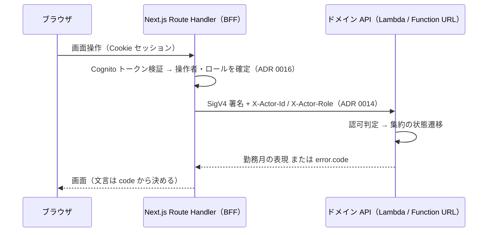

# ドメイン API の HTTP 契約 — 仕様

`services/api`（Lambda Function URL）が公開する **HTTP の契約**。MVP 3ユースケース（稼働実績の入力・編集／月次締め／承認申請・承認）と、それを支える参照系のエンドポイント・リクエスト／レスポンス DTO・エラー表現を定める。

**この契約は BFF（Next.js Route Handler、Issue #54）が参照・消費する唯一の実体である。** 契約の内容を Issue コメント・PR 本文・BFF 側のコードコメントへ書き写さない。参照はこのファイルへのリンクで行う（ADR 0004）。

**業務ルール（値域・丸め・未来日・締め可否・承認可否・自己承認排除・状態遷移）はこの仕様へ書き写さない。** 正解は `docs/specs/daily-record-entry.md` / `docs/specs/monthly-closing.md` / `docs/specs/approval.md` と `docs/domain/ubiquitous-language.md` にある。本仕様が決めるのは**その業務ルールを HTTP でどう表すか**だけである。実装設計（層への型配置・ポート）は `docs/specs/workmonth-implementation-design.md` が持つ。

- **決定者**: HTTP 表現の各決定は仕様工程（AI）。**業務ルールを新たに決めていない。** 業務仕様が答えを持たなかった論点（未生成の年月の締め・参照系の認可・操作者の伝達）は **2026-07-27 に人間が明示選択して確定**し、末尾「人間が確定させた決定」に残した。**未決の論点は無い**
- **日付**: 2026-07-27（人間の決定事項を反映）

---

## スコープ

- **対象**: エンドポイントの一覧（メソッド・パス）、操作者の伝達方法、リクエスト／レスポンスの JSON フィールド名と型、ステータスコード、エラーコードと判定順序、一覧の並び順・ページング
- **非対象**:
  - **業務ルールそのもの**（3業務仕様が持つ。参照のみ）
  - **BFF・ブラウザ側の実装**（Issue #54。本仕様は BFF が呼ぶ相手側の契約に閉じる）
  - **画面の受け入れ条件**（各 UI 仕様）
  - **SigV4 署名の実装方法**（ADR 0003 / 0014。`apps/web/src/lib/lambda-client.ts` に集約する。`docs/rules/architecture.md`）
  - **Cognito のトークン検証**（BFF で終端する。ADR 0016）

---

## 前提（P）— 確定事項（参照のみ、再定義しない）

| # | 前提 | 出典 |
|---|---|---|
| P-1 | Function URL は `authorization_type = "AWS_IAM"`。**呼べるのは SigV4 署名できる BFF のみ**で、ブラウザから直接到達する経路は構造的に存在しない | ADR 0003・0013・`docs/rules/architecture.md` |
| P-2 | エンドユーザー認証は **BFF で終端**する。ドメイン API はトークン検証をせず、BFF が確定させた操作者・ロールを受け取る | ADR 0016・`login-ui.md` AC-5 |
| P-3 | ロールは `Engineer` / `Approver` の2つ。ゲストは**未ログイン（未認証）**であり、状態を変える操作を持たない | ADR 0016・`docs/rules/scope.md`・`work-month-screen-ui.md` AC-3 |
| P-4 | 勤務月は `契約 × 年月` で一意。状態は `Draft` / `PendingApproval` / `Approved` | ユビキタス言語「勤務月の同一性」「状態遷移」 |
| P-5 | 勤務月は**初回入力時に暗黙生成**される。「月を開く」等の明示的な生成操作は存在しない | `daily-record-entry.md` D-6・AC-1-5 |
| P-6 | 超過／不足は**締め時に算出・保存**され、`Draft` では未確定 | `monthly-closing.md` D-2・AC-3／`work-month-screen-ui.md` AC-4-1 |
| P-7 | 承認済専用の横断一覧を設けない。承認者の到達手段は**承認待ち一覧**のみ | `approval.md` AC-8-2／`work-month-listing-ui.md` AC-2 |
| P-8 | 一覧は**対象年月の降順**・ページングあり。1ページの件数は仕様で固定しない | `work-month-listing-ui.md` AC-4 |

---

## 決定（D）— HTTP 表現

| # | 論点 | 決定 |
|---|---|---|
| D-1 | リソースの識別 | 勤務月は **`/work-months/{contractId}/{yearMonth}`** で識別する。代理キー（サロゲート ID）を導入しない（`契約 × 年月` で一意という P-4 をそのまま URL に写す） |
| D-2 | 操作者の伝達 | **リクエストヘッダ `X-Actor-Id` / `X-Actor-Role`** で伝える。両者は SigV4 の署名対象ヘッダに含める（署名済みのため経路上で改竄できない）。ゲストは**両ヘッダを送らない**（`Guest` というロール値を作らない）。**人間が 2026-07-27 に確定**（実装設計 D-9 の `port.Actor` と同じ決定） |
| D-3 | 稼働の量の表現 | 時・分の組 `{"hours": n, "minutes": n}` で表す。分は 0〜59。**小数・ISO 8601 duration・分の総和単一値を使わない**（UI が時・分で入出力し、値域の判定も時・分で行うため。`daily-record-entry.md` AC-3・`monthly-closing-ui.md`） |
| D-4 | 日付・年月の表現 | 対象日は `YYYY-MM-DD`、年月は `YYYY-MM`。**いずれもタイムゾーンを含めない**（暦日そのものを表す。当日判定は JST。`daily-record-entry.md` D-8） |
| D-5 | 日次の丸め値の返却 | 各稼働実績に**入力値**と**15分切り捨て後の寄与**の両方を含める。丸め規則を BFF / Web 側に再実装させないため（`daily-record-entry-ui.md` AC-1-2 の「整合」を BFF が計算せずに満たせる） |
| D-6 | 更新系の応答 | 入力・編集・削除・締め・承認・差戻しは、いずれも **更新後の勤務月の表現**を返す（BFF が再描画に使う。`work-month-screen-ui.md` AC-6-4 の「現在の状態を反映し直す」を1往復で満たす） |
| D-7 | 未生成の年月の取得 | 生成されていない `契約 × 年月` の取得は **404 にせず、空の下書き相当の表現**を返し、`generated: false` を添える（画面は「空状態と同じに見せる」。`daily-record-entry-ui.md` AC-2-2。かつ契約表示名・精算幅は常時表示が要る。`work-month-screen-ui.md` AC-1-1・AC-1-4） |
| D-8 | エラー表現 | `{"error": {"code": "...", "message": "..."}}`。**`code` が契約であり、利用者向け文言は BFF / UI が `code` から決める**（`message` は診断用。API は画面文言を持たない） |
| D-9 | 一覧の絞り込み | 単一のコレクション `GET /work-months` にクエリで絞り込む。**技術者を指定しない横断的な一覧は `state=PendingApproval` のときだけ許す**（承認済・下書きの横断一覧を構造的に不可能にする。P-7） |
| D-10 | API のバージョニング | **行わない**（消費者は BFF ただ1つ。ADR 0003 の一方通行）。パスに `/v1` 等を置かない |
| D-11 | 未生成の年月への**更新系**（締め・承認・差戻し） | **弾く（404 `WORK_MONTH_NOT_FOUND`）。** 締めを勤務月の生成契機にしない（`daily-record-entry.md` AC-1-5 を保つ）。`monthly-closing.md` D-6「空の勤務月は締められる」は**生成済みで実績0件の勤務月**を指すと確定した（同 D-6 の注記・AC-7-4）。**人間が 2026-07-27 に確定**。取得（D-7）とは扱いが異なることに注意 |
| D-12 | 参照系の認可 | **勤務月の取得（E-1）と `engineerId` 指定の一覧（E-2）は操作者で絞らない**（ゲストでも 200）。**承認待ち一覧（`engineerId` 省略 + `state=PendingApproval`）だけが `Approver` を要求する**。ゲスト＝閲覧のみ（`docs/rules/scope.md`・ADR 0016）というデモ公開の前提に沿う。**人間が 2026-07-27 に確定**（実装設計 AC-8-8〜AC-8-10 と同じ決定） |

---

## 受け入れ条件（AC）

| AC | 主題 | 主に効く工程 |
|---|---|---|
| AC-1 | 共通（ベース・ヘッダ・操作者の伝達） | tester・implementer・Issue #54 |
| AC-2 | 勤務月の取得（参照系） | tester・implementer・Issue #54 |
| AC-3 | 勤務月一覧（参照系） | tester・implementer・Issue #54 |
| AC-4 | 稼働実績の入力・編集（UC1） | tester・implementer |
| AC-5 | 稼働実績の削除（UC1） | tester・implementer |
| AC-6 | 締め（UC2） | tester・implementer |
| AC-7 | 承認（UC3） | tester・implementer |
| AC-8 | 差戻し（UC3） | tester・implementer |
| AC-9 | エラー表現・ステータスコード・判定順序 | tester・implementer・Issue #54 |
| AC-10 | 表現（JSON）の定義 | tester・implementer・Issue #54 |
| AC-11 | 限界 — 本契約が担保しないこと | reviewer |

### エンドポイント一覧

| # | メソッド | パス | 用途 | 出典 |
|---|---|---|---|---|
| E-1 | `GET` | `/work-months/{contractId}/{yearMonth}` | 勤務月1件の取得 | 参照系（`work-month-screen-ui.md`） |
| E-2 | `GET` | `/work-months` | 勤務月の一覧 | 参照系（`work-month-listing-ui.md`） |
| E-3 | `PUT` | `/work-months/{contractId}/{yearMonth}/daily-records/{date}` | 稼働実績の入力・編集 | UC1 |
| E-4 | `DELETE` | `/work-months/{contractId}/{yearMonth}/daily-records/{date}` | 稼働実績の削除 | UC1 |
| E-5 | `POST` | `/work-months/{contractId}/{yearMonth}/close` | 締め | UC2 |
| E-6 | `POST` | `/work-months/{contractId}/{yearMonth}/approve` | 承認 | UC3 |
| E-7 | `POST` | `/work-months/{contractId}/{yearMonth}/reject` | 差戻し | UC3 |



### AC-1. 共通（ベース・ヘッダ・操作者の伝達）

| # | 条件 | 期待 |
|---|---|---|
| 1-1 | ベースパス | Function URL のルート直下。プレフィックス（`/api`・`/v1` 等）を付けない（D-10） |
| 1-2 | リクエストの `Content-Type` | ボディを持つリクエスト（E-3）は `application/json`。異なる場合は **400 `INVALID_REQUEST`** |
| 1-3 | レスポンスの `Content-Type` | すべて `application/json; charset=utf-8`（エラー応答を含む） |
| 1-4 | 操作者ヘッダ | `X-Actor-Id`（利用者識別子）と `X-Actor-Role`（`Engineer` または `Approver`）。**両方そろって送るか、両方送らないか**のいずれか。片方だけは **400 `INVALID_REQUEST`** |
| 1-5 | `X-Actor-Role` の値 | `Engineer` / `Approver` のみ（ユビキタス言語の英語名。大文字小文字を含めて一致）。それ以外は **400 `INVALID_REQUEST`**。**`Guest` という値を設けない**（ゲストはヘッダ不在で表す。P-3・D-2。人間が確定） |
| 1-6 | ヘッダ不在（ゲスト） | 勤務月の取得（E-1）と `engineerId` 指定の一覧（E-2）は**許可**（200。D-12）。**承認待ち一覧**（E-2 で `engineerId` 省略）は **401 `UNAUTHENTICATED`**（`Approver` を要求するため。AC-3-2）。更新系（E-3〜E-7）はすべて **401 `UNAUTHENTICATED`**（ゲストは状態を変えられない。`work-month-screen-ui.md` AC-3 ゲスト行） |
| 1-7 | `X-Actor-Id` と技術者の突き合わせ | 「本人」判定は `X-Actor-Id` と**契約が指す技術者識別子**の一致で行う（`workmonth-implementation-design.md` AC-8）。両者は同一の識別子空間にある（Cognito が確定させた利用者識別子。ADR 0016） |
| 1-8 | 署名 | BFF は `X-Actor-Id` / `X-Actor-Role` を **SigV4 の署名対象ヘッダに含める**（D-2）。API 側は署名検証を IAM に委ねる（自前で検証しない。ADR 0003） |
| 1-9 | 複数ロールの同時保持 | 表現しない。1リクエストにつきロールは1つ（デモ用のロール切替。ADR 0016・`login-ui.md` AC-6） |
| 1-10 | `contractId` の書式 | 1〜64 文字の `A-Z a-z 0-9 _ -`。不一致は **400 `INVALID_REQUEST`** |
| 1-11 | 未定義のパス・メソッド | **404 `NOT_FOUND`**（メソッド不一致も 404 とし、405 を使い分けない） |

### AC-2. 勤務月の取得（E-1）

| # | 条件 | 期待 |
|---|---|---|
| 2-1 | 生成済みの勤務月 | **200**。勤務月の表現（AC-10-1）を返す |
| 2-2 | 未生成の `契約 × 年月`（契約は実在） | **200**。`generated: false`、`state: "Draft"`、`dailyRecords: []`、`totalHours: 0時間0分`、`excess`/`shortfall` は `null`、`settlementRange` は**契約が現在定める精算幅**（複写前の値。P-5・D-7） |
| 2-3 | 実在しない `contractId` | **404 `CONTRACT_NOT_FOUND`** |
| 2-4 | `yearMonth` の書式不正（`2026-13` 等） | **400 `INVALID_REQUEST`** |
| 2-5 | 操作者ヘッダの有無 | 取得は**操作者で絞り込まない**（D-12。人間が 2026-07-27 に確定）。ヘッダの有無・ロールにかかわらず同じ表現を返す。ゲスト（ヘッダ不在）でも **200**（デモ閲覧を成立させるため。`work-month-listing-ui.md` AC-3）。この分界の限界は AC-11-3 |
| 2-6 | `Draft` の超過／不足 | `excess`・`shortfall` はともに `null`（未確定。P-6）。**0 を返さない**（0 と未確定を混同させない） |
| 2-7 | `PendingApproval` / `Approved` | 締め時に確定した超過／不足を返す（`monthly-closing.md` AC-3／`approval.md` AC-5-2） |

### AC-3. 勤務月一覧（E-2）

クエリパラメータ: `engineerId`（文字列）／`state`（`Draft` / `PendingApproval` / `Approved`）／`limit`（1 以上の整数）／`offset`（0 以上の整数）。

| # | 条件 | 期待 |
|---|---|---|
| 3-1 | `engineerId` を指定 | **200**。その技術者が技術者である勤務月のみを返す（`work-month-listing-ui.md` AC-1-1）。`state` 併用可。**状態で自動的に除外しない**（承認済も含む。同 AC-1-3）。**操作者で絞らない**（`X-Actor-Id` と `engineerId` の一致を要求しない。ゲストでも 200。D-12。人間が確定） |
| 3-2 | `engineerId` を省略し `state=PendingApproval` | **200**。承認待ちの勤務月を技術者横断で返す（承認待ち一覧。同 AC-2-1）。**`X-Actor-Role: Approver` が必須**（参照系で唯一ロールを要求する。D-12）。ヘッダ不在は **401 `UNAUTHENTICATED`**、`Engineer` は **403 `FORBIDDEN_NOT_APPROVER`**（判定順序は AC-9） |
| 3-3 | `engineerId` を省略し `state` が `PendingApproval` 以外、または `state` も省略 | **400 `INVALID_REQUEST`**（承認済・下書きの横断一覧を提供しない。`approval.md` AC-8-2／横断ビュー非スコープ。D-9） |
| 3-4 | 並び順 | **対象年月の降順**（P-8）。同一年月内は `contractId` の昇順で安定させる（掛け持ちで同月に複数契約がありうるため。決定的な順序を保証する） |
| 3-5 | ページング | `limit` / `offset` で行う。応答に `total`（絞り込み後の総件数）・`limit`・`offset` を含める。**`limit` の既定値と上限は本契約で固定しない**（1ページの件数は仕様で固定しない。`work-month-listing-ui.md` AC-4-2） |
| 3-6 | `limit` が 0 以下・整数でない／`offset` が負・整数でない | **400 `INVALID_REQUEST`** |
| 3-7 | 該当0件 | **200** で `items: []`、`total: 0`（空は誤りではない。同 AC-7-1・AC-7-2） |
| 3-8 | 一覧に含まれるもの | **生成済みの勤務月のみ**（未生成の年月は行として現れない。P-5） |
| 3-9 | 行の内容 | 契約識別子・契約表示名・年月・状態（AC-10-2）。一覧では稼働実績・超過／不足を返さない（`work-month-listing-ui.md` AC-1-2・AC-2-3） |
| 3-10 | ゲスト向けデモ勤務月群 | **専用のエンドポイントを設けない。** BFF がデモ用の技術者識別子を `engineerId` に指定して本エンドポイントを呼ぶ（`work-month-listing-ui.md` AC-3）。デモデータの投入・日次リセットは本契約の対象外（`docs/rules/cost-guardrails.md`） |

### AC-4. 稼働実績の入力・編集（E-3）

リクエストボディ: `{"workingHours": {"hours": n, "minutes": n}}`

| # | 条件 | 期待 |
|---|---|---|
| 4-1 | 生成済み・`Draft`・本人・妥当な値 | **200**。当該日の実績を追加または上書きし、更新後の勤務月の表現を返す（D-6）。既にレコードのある日への送信は**編集**として扱う（`daily-record-entry.md` AC-2-3） |
| 4-2 | 未生成の `契約 × 年月` への入力 | **200**。当該 `契約 × 年月` の勤務月を**暗黙生成**し（契約から精算幅を複写）、実績を追加する（`daily-record-entry.md` AC-1-1・AC-1-2）。応答は `generated: true` |
| 4-3 | 操作者が本人でない（他の技術者・承認者） | **403 `FORBIDDEN_NOT_OWNER`**（`work-month-screen-ui.md` AC-3 の②③行）。**ロールは問わない**（本人であれば `Approver` でも許可。同④行） |
| 4-4 | 状態が `PendingApproval` / `Approved` | **409 `WORK_MONTH_NOT_EDITABLE`**（`daily-record-entry.md` AC-5-2・AC-5-3） |
| 4-5 | 稼働時間が値域外（負／24時間超／`minutes` が 0〜59 外） | **400 `WORKING_HOURS_OUT_OF_RANGE`**（同 AC-3。境界の正解は業務仕様が持つ） |
| 4-6 | `{date}` が JST の当日より後 | **400 `FUTURE_DATE_NOT_ALLOWED`**（同 AC-4・D-8） |
| 4-7 | `{date}` の年月が `{yearMonth}` と一致しない | **400 `DATE_OUT_OF_WORK_MONTH`**（同 AC-2-4） |
| 4-8 | `{date}` が暦上存在しない（`2026-02-30` 等）／書式不正 | **400 `INVALID_REQUEST`** |
| 4-9 | `workingHours` の欠落・型不一致 | **400 `INVALID_REQUEST`** |
| 4-10 | ボディの未知フィールド | **無視する**（エラーにしない）。開始・終了時刻や休憩時間の項目を契約に持たない（`daily-record-entry.md` D-2・D-3） |
| 4-11 | 実在しない `contractId` | **404 `CONTRACT_NOT_FOUND`** |
| 4-12 | 冪等性 | 同一の `PUT` を繰り返しても結果は同じ（1日1レコードの上書き。`daily-record-entry.md` D-1） |

### AC-5. 稼働実績の削除（E-4）

| # | 条件 | 期待 |
|---|---|---|
| 5-1 | 生成済み・`Draft`・本人・当該日にレコードあり | **200**。レコードを取り除き、更新後の勤務月の表現を返す。その日は以降「レコードのない日＝稼働なし」（`daily-record-entry.md` AC-5-4・D-5） |
| 5-2 | 当該日にレコードが無い | **200**（成功として扱う）。「レコードのない日」と「稼働ゼロ」を区別しない業務決定（同 D-5）の帰結であり、削除後の観測可能な状態は同一である |
| 5-3 | 未生成の `契約 × 年月` | **200**。勤務月を**生成せず**、空の表現（`generated: false`）を返す（明示的な生成契機を作らない。P-5）。**削除は D-11（未生成なら 404）の対象外**である。削除の観測可能な結果は 5-2 と同じ「その日にレコードが無い」であり、404 にする理由が無いため |
| 5-4 | 操作者が本人でない | **403 `FORBIDDEN_NOT_OWNER`** |
| 5-5 | 状態が `PendingApproval` / `Approved` | **409 `WORK_MONTH_NOT_EDITABLE`** |
| 5-6 | 実在しない `contractId` | **404 `CONTRACT_NOT_FOUND`** |
| 5-7 | ボディ | 取らない（送られても無視する） |

### AC-6. 締め（E-5）

| # | 条件 | 期待 |
|---|---|---|
| 6-1 | 生成済み・`Draft`・本人 | **200**。締めが成立し、超過／不足が確定した勤務月の表現を返す（`state: "PendingApproval"`、`excess` / `shortfall` は数値）。算出規則・境界は `monthly-closing.md` AC-4 が持つ |
| 6-2 | 状態が `PendingApproval` / `Approved` | **409 `INVALID_STATE_FOR_CLOSE`**（二重締め・終端。同 AC-1-2・AC-1-3） |
| 6-3 | 操作者が本人でない（他の技術者・承認者） | **403 `FORBIDDEN_NOT_OWNER`**（承認者の代行締めは無い。同 D-5・AC-2-2・AC-2-3） |
| 6-4 | 締めのタイミング | 月末・月途中を問わず受け付ける（月末制約を課さない。同 D-3・AC-1-4） |
| 6-5 | **生成済み**で稼働実績が0件（空月）／未入力日を含む月 | **締められる**（同 D-1・D-6・AC-7-1・AC-7-2）。未入力を理由に弾かない・警告を返さない |
| 6-6 | **未生成**の `契約 × 年月`（一度も入力されていない年月） | **404 `WORK_MONTH_NOT_FOUND`**（締めを生成契機にしない。P-5・`daily-record-entry.md` AC-1-5）。**人間が 2026-07-27 に確定**し、`monthly-closing.md` D-6 の「空の勤務月」は**生成済みで実績0件の月**（6-5）に限ると確定した（同 AC-7-4）。6-5 とは別物である |
| 6-7 | 締めの取り消し | **エンドポイントを設けない**（同 D-4・AC-6）。`PendingApproval` → `Draft` は差戻し（E-7）だけが起こす |
| 6-8 | ボディ | 取らない（送られても無視する） |

> **Issue #54（BFF / Web）への申し送り**: **未生成の月（`generated: false`）に締めボタンを提供しないのは BFF / Web 側の責務である。** ドメイン API は 404 `WORK_MONTH_NOT_FOUND` で弾くだけで、導線の抑止は行わない。`monthly-closing-ui.md` AC-5-2 の「空月でも締めボタンを提供する」は、`generated: true` かつ実績0件の月（6-5）を指す（`monthly-closing.md` AC-7-4）。**未生成の月に締めボタンを出すと、利用者から見て理由の分からない 404 になる。**

### AC-7. 承認（E-6）

| # | 条件 | 期待 |
|---|---|---|
| 7-1 | `PendingApproval`・`X-Actor-Role: Approver`・**本人でない** | **200**。`state: "Approved"` の表現を返す。総稼働時間・超過／不足は**締め時の値のまま**（`approval.md` AC-5-1・AC-5-2） |
| 7-2 | 状態が `Draft` / `Approved` | **409 `INVALID_STATE_FOR_APPROVE`**（同 AC-1-2・AC-1-3・AC-7-1） |
| 7-3 | `X-Actor-Role` が `Approver` でない | **403 `FORBIDDEN_NOT_APPROVER`**（同 AC-3-2） |
| 7-4 | `X-Actor-Role: Approver` かつ操作者がその勤務月の技術者本人 | **403 `FORBIDDEN_SELF_APPROVAL`**（同 D-4・AC-4-1。ロール切替によらず維持。ADR 0016） |
| 7-5 | 承認の成立に必要な人数 | **1人**（同 D-2・AC-3-3）。複数回の承認を求めない。「誰が承認したか」を応答に含めない（同 AC-5-4） |
| 7-6 | 未生成の `契約 × 年月` | **404 `WORK_MONTH_NOT_FOUND`**（D-11） |
| 7-7 | 承認の取り消し | **エンドポイントを設けない**（承認済は終端。同 AC-7-4・ユビキタス言語「状態遷移」） |
| 7-8 | ボディ | 取らない（送られても無視する） |

### AC-8. 差戻し（E-7）

| # | 条件 | 期待 |
|---|---|---|
| 8-1 | `PendingApproval`・`X-Actor-Role: Approver`・**本人でない** | **200**。`state: "Draft"` の表現を返す。`excess` / `shortfall` は **`null`（未確定）に戻る**（再締め時に改めて算出される。`approval.md` AC-6-3） |
| 8-2 | 状態が `Draft` / `Approved` | **409 `INVALID_STATE_FOR_REJECT`**（同 AC-2-2・AC-2-3・AC-7-2） |
| 8-3 | `X-Actor-Role` が `Approver` でない | **403 `FORBIDDEN_NOT_APPROVER`** |
| 8-4 | 操作者がその勤務月の技術者本人 | **403 `FORBIDDEN_SELF_APPROVAL`**（差戻しも自己承認と同様に扱う。同 D-4） |
| 8-5 | 差戻しの理由 | **リクエストに理由のフィールドを設けない**（差戻しは状態を戻すだけ。同 D-3・AC-6-4）。送られた未知フィールドは無視する |
| 8-6 | 差戻し回数 | 上限を設けず、応答にも含めない（同 AC-6-5） |
| 8-7 | 差戻し後の編集 | 以降 E-3 / E-4 が本人に対して 200 を返すようになる（`Draft` へ戻るため。同 AC-6-2） |
| 8-8 | 未生成の `契約 × 年月` | **404 `WORK_MONTH_NOT_FOUND`**（D-11） |

### AC-9. エラー表現・ステータスコード・判定順序

**エラーボディ**（すべてのエラー応答で共通）:

```json
{ "error": { "code": "INVALID_STATE_FOR_CLOSE", "message": "work month is not in Draft" } }
```

| # | 条件 | 期待 |
|---|---|---|
| 9-1 | 形 | `error.code`（文字列・下表のいずれか）と `error.message`（診断用の短い説明）。**フィールドを増やさない** |
| 9-2 | `code` の位置づけ | **`code` が契約である。** BFF / UI は `code` から利用者向け文言を決める（D-8。`work-month-screen-ui.md` AC-6-1 の「理由の提示」は BFF 側の責務） |
| 9-3 | `message` | 診断用。**利用者向け文言としてそのまま画面に出すことを前提にしない。** 機密・内部実装の詳細（SQL・スタックトレース等）を含めない（`docs/rules/security.md`） |

**エラーコードとステータスコード**:

| `code` | ステータス | 発生条件 | 業務仕様の出典 |
|---|---:|---|---|
| `INVALID_REQUEST` | 400 | パス・クエリ・ヘッダ・ボディの構文／型／書式が不正（AC-1-2・1-4・1-5・1-10、AC-2-4、AC-3-3・3-6、AC-4-8・4-9） | — |
| `WORKING_HOURS_OUT_OF_RANGE` | 400 | 稼働時間が値域外 | `daily-record-entry.md` AC-3 |
| `FUTURE_DATE_NOT_ALLOWED` | 400 | 対象日が JST の当日より後 | 同 AC-4・D-8 |
| `DATE_OUT_OF_WORK_MONTH` | 400 | 対象日が当該勤務月の年月に属さない | 同 AC-2-4 |
| `UNAUTHENTICATED` | 401 | 更新系（E-3〜E-7）または**承認待ち一覧**（AC-3-2）で操作者ヘッダが無い（ゲスト） | ADR 0016／`work-month-screen-ui.md` AC-3 |
| `FORBIDDEN_NOT_OWNER` | 403 | 入力・編集・削除・締めを本人以外が行った | `monthly-closing.md` AC-2／`work-month-screen-ui.md` AC-3 |
| `FORBIDDEN_NOT_APPROVER` | 403 | 承認・差戻し・承認待ち一覧を承認者ロール以外が行った | `approval.md` AC-3-2／`work-month-listing-ui.md` AC-2-4 |
| `FORBIDDEN_SELF_APPROVAL` | 403 | 承認・差戻しの操作者がその勤務月の技術者本人 | `approval.md` D-4・AC-4-1 |
| `CONTRACT_NOT_FOUND` | 404 | `contractId` が実在しない | — |
| `WORK_MONTH_NOT_FOUND` | 404 | 対象の勤務月が未生成（締め・承認・差戻し。D-11） | `monthly-closing.md` AC-7-4／`daily-record-entry.md` AC-1-5 |
| `NOT_FOUND` | 404 | 未定義のパス・メソッド | AC-1-11 |
| `WORK_MONTH_NOT_EDITABLE` | 409 | `Draft` 以外での入力・編集・削除 | `daily-record-entry.md` AC-5-2・AC-5-3 |
| `INVALID_STATE_FOR_CLOSE` | 409 | `Draft` 以外での締め | `monthly-closing.md` AC-1-2・AC-1-3 |
| `INVALID_STATE_FOR_APPROVE` | 409 | `PendingApproval` 以外での承認 | `approval.md` AC-1-2・AC-1-3 |
| `INVALID_STATE_FOR_REJECT` | 409 | `PendingApproval` 以外での差戻し | `approval.md` AC-2-2・AC-2-3 |
| `INTERNAL_ERROR` | 500 | 上記以外（永続化の失敗等） | — |

**判定順序**（複数の条件に該当する場合、**先に該当したものを返す**。テストが期待値を一意に決められるようにするための順序であり、業務ルールの優劣ではない）:

| 順 | 判定 | 例 |
|---:|---|---|
| 1 | 認証（更新系・承認待ち一覧での操作者ヘッダの有無） | ゲストが締めを実行 → 401。ゲストが承認待ち一覧を要求 → 401 |
| 2 | リクエストの構文・型・書式 | `yearMonth=2026-13` → 400 `INVALID_REQUEST` |
| 3 | 対象の実在（契約 → 勤務月） | 未生成の月への承認 → 404 |
| 4 | 認可（本人・ロール・自己承認） | 承認者ロールを持たない者が `Draft` を承認 → 403 |
| 5 | 状態 | 承認者が `Draft` を承認 → 409 |
| 6 | 業務バリデーション（値域・未来日・当該月外） | 本人が `Draft` に 25時間0分を入力 → 400 |

| # | 条件 | 期待 |
|---|---|---|
| 9-4 | 競合（他経路で状態が変わっていた） | 状態の検査で弾かれ 409 を返す。**部分的な更新を残さない**（更新は集約単位で原子的。`workmonth-implementation-design.md` AC-10-7）。BFF は 409 を受けて再取得する（`work-month-screen-ui.md` AC-6-4） |
| 9-5 | 版番号・ETag による楽観的排他 | **設けない**（`workmonth-implementation-design.md` AC-13-5） |
| 9-6 | 500 の応答 | `code: "INTERNAL_ERROR"` のみを返し、原因の詳細を含めない |

### AC-10. 表現（JSON）の定義

#### AC-10-1. 勤務月の表現（E-1・E-3〜E-7 の 200 応答）

```json
{
  "contractId": "ctr-0001",
  "contractDisplayName": "サンプル株式会社 / 基幹システム保守",
  "yearMonth": "2026-07",
  "state": "PendingApproval",
  "generated": true,
  "settlementRange": {
    "lowerBound": { "hours": 140, "minutes": 0 },
    "upperBound": { "hours": 180, "minutes": 0 }
  },
  "totalHours": { "hours": 180, "minutes": 15 },
  "excess": { "hours": 0, "minutes": 15 },
  "shortfall": { "hours": 0, "minutes": 0 },
  "dailyRecords": [
    {
      "date": "2026-07-01",
      "workingHours": { "hours": 8, "minutes": 50 },
      "roundedWorkingHours": { "hours": 8, "minutes": 45 }
    }
  ]
}
```

| フィールド | 型 | 説明 |
|---|---|---|
| `contractId` | string | 契約の識別子（AC-1-10） |
| `contractDisplayName` | string | **契約表示名**（人間可読。`work-month-screen-ui.md` AC-1-1・確定事項 Q9） |
| `yearMonth` | string | `YYYY-MM`（D-4） |
| `state` | string | `"Draft"` / `"PendingApproval"` / `"Approved"`（ユビキタス言語の英語名） |
| `generated` | boolean | 当該 `契約 × 年月` の勤務月が生成済みか（D-7・P-5） |
| `settlementRange.lowerBound` / `.upperBound` | 時分オブジェクト | 精算幅。生成済みなら**生成時に複写したスナップショット**、未生成なら契約が現在定める値（AC-2-2） |
| `totalHours` | 時分オブジェクト | 総稼働時間（各日を15分切り捨てて合計した値。`daily-record-entry.md` AC-6） |
| `excess` | 時分オブジェクト **または `null`** | 超過。`Draft` では `null`（未確定。P-6・AC-2-6） |
| `shortfall` | 時分オブジェクト **または `null`** | 不足。`Draft` では `null` |
| `dailyRecords` | 配列 | 稼働実績。**対象日の昇順**。レコードの無い日は要素として現れない（`daily-record-entry.md` D-5） |
| `dailyRecords[].date` | string | `YYYY-MM-DD`（D-4） |
| `dailyRecords[].workingHours` | 時分オブジェクト | **入力された値**（編集フォームの初期表示に使う。`daily-record-entry-ui.md` AC-5-1） |
| `dailyRecords[].roundedWorkingHours` | 時分オブジェクト | **15分切り捨て後の寄与**（総稼働時間との整合表示に使う。D-5・`daily-record-entry-ui.md` AC-1-2） |

**時分オブジェクト**: `{ "hours": 整数（0 以上）, "minutes": 整数（0〜59） }`（D-3）。**`null` を取りうるのは `excess` / `shortfall` のみ。**

#### AC-10-2. 一覧の表現（E-2 の 200 応答）

```json
{
  "items": [
    { "contractId": "ctr-0001", "contractDisplayName": "…", "yearMonth": "2026-07", "state": "PendingApproval" }
  ],
  "total": 42,
  "limit": 20,
  "offset": 0
}
```

| フィールド | 型 | 説明 |
|---|---|---|
| `items[]` | 配列 | 行。`contractId` / `contractDisplayName` / `yearMonth` / `state`（AC-3-9） |
| `total` | 整数 | 絞り込み後の総件数（ページング UI 用） |
| `limit` / `offset` | 整数 | 実際に適用された値（AC-3-5） |

#### AC-10-3. 表現に**含めないもの**

| # | 含めないもの | 出典 |
|---|---|---|
| 10-3-1 | **技術者・承認者の氏名／識別子**、「誰が承認したか」 | `approval.md` D-1・D-2・AC-5-4 |
| 10-3-2 | **差戻しの理由・差戻し回数** | 同 D-3・AC-6-4・AC-6-5 |
| 10-3-3 | **締め・承認の日時、操作の履歴** | `monthly-closing.md` AC-8-3（監査履歴は非スコープ） |
| 10-3-4 | **精算金額**（超過・不足は時間側の量のみ） | 同 AC-8-4 |
| 10-3-5 | **`Draft` における見込みの超過／不足** | `work-month-screen-ui.md` AC-4-5（確定事項 Q7） |

### AC-11. 限界 — 本契約が担保しないこと

**以下は仕様どおりであり、欠陥ではない。**

| # | 内容 |
|---|---|
| 11-1 | **業務ルールを本契約は持たない。** 値域・丸め・境界・締め可否・承認可否の正解は3業務仕様にある。本契約は「それを弾いたときに何を返すか」だけを固定する |
| 11-2 | **CORS・ブラウザからの直接呼び出しを想定しない**（`Access-Control-*` を返さない）。到達できるのは SigV4 署名できる BFF のみ（P-1・ADR 0003） |
| 11-3 | **参照系（E-1・E-2 の `engineerId` 指定）を操作者で絞らない**（AC-2-5・AC-3-1・D-12。**人間が確定した仕様**であり、実装の手抜きではない）。**他人の勤務月を BFF が取得することは API では防がれない。** 防御は「BFF しか到達できない」（P-1）と BFF 側の導線に依存する（`workmonth-implementation-design.md` AC-13-10） |
| 11-4 | **未生成の年月に対する締め・承認・差戻しを弾く**（404。D-11・AC-6-6。**人間が確定**）。未生成の月に締めボタンを出さないことは BFF / Web 側の責務であり、本契約は担保しない（AC-6 の申し送り） |
| 11-5 | **契約期間と対象年月の整合を検査しない**（**人間が確定**。契約の「期間」は業務仕様・ユビキタス言語のいずれにも定義が無く、検査は新しい業務ルールの追加になるため。`workmonth-implementation-design.md` AC-13-9）。帰結として、契約が実在すればどの年月に対しても入力・締め・承認が通る |
| 11-6 | **レート制限・冪等キー・リトライ制御を持たない。** 流量の一次防御は BFF（Route Handler）側（`docs/rules/cost-guardrails.md`） |
| 11-7 | **API のバージョニング・後方互換の保証をしない**（D-10）。契約の変更は本ファイルの更新と BFF の同時更新で行う |
| 11-8 | **デモデータの投入・日次リセットは対象外**（`docs/rules/cost-guardrails.md`）。ゲスト向けデモ勤務月群は AC-3-10 の呼び出しで得る |
| 11-9 | **OpenAPI 等のスキーマ生成物を正とはしない。** 本ファイルが契約の唯一の実体である（ADR 0004） |

---

## 人間が確定させた決定

業務仕様が答えを持たず、**推測で埋めなかった**論点は、**2026-07-27 に人間が明示選択して確定した**（Issue #51）。**未決の論点は残っていない。** 確定内容は上表の D と各 AC に反映済みであり、下表は「何を選び、何を退けたか」を残すためのものである（Issue コメントに書き写さない。ADR 0004）。

| # | 論点 | 確定した決定 | 退けた案 | 反映先 |
|---|---|---|---|---|
| 1 | **一度も入力されていない年月を締められるか。** `monthly-closing.md` D-6「空の勤務月は締められる」と `daily-record-entry.md` AC-1-5「入力以外の生成契機を設けない」のどちらに属するかが定まっていなかった | **締められない（404 `WORK_MONTH_NOT_FOUND`）。** あわせて `monthly-closing.md` D-6 の「空の勤務月」は**生成済みで実績0件の勤務月**を指すと確定した。UI は未生成の月に締めボタンを出さない（BFF / Web の責務） | (a) 締めを生成契機として認める（`daily-record-entry.md` AC-1-5 に例外を足す） (b) 未生成の月は締め前に必ず1件の入力が要る運用にする | D-11・AC-6-6・AC-11-4／`monthly-closing.md` D-6 の注記・AC-7-4／実装設計 AC-4-3・AC-7-9 |
| 2 | **参照系の認可。** 3業務仕様は参照の認可について AC を持たない | **勤務月の取得・`engineerId` 指定の一覧は絞らない。承認待ち一覧のみ `Approver` を要求する**（ゲスト＝閲覧のみというデモ公開の前提に沿う） | (a) 取得も「本人 or 承認者」に限る（ゲストのデモ閲覧をどう通すかの設計が要る） (b) API 側では一切判定せず、承認待ち一覧のロール要求も外す | D-12・AC-1-6・AC-2-5・AC-3-1・AC-3-2・AC-11-3／実装設計 AC-8-8〜AC-8-10 |
| 3 | **操作者ヘッダ名**（`X-Actor-Id` / `X-Actor-Role`）と**ゲストの表し方** | **ヘッダ2本のまま。ゲストは両ヘッダ不在**で表し、`Guest` というロール値を作らない（ロールは `Engineer` / `Approver` の2つのまま） | (a) ロール値に `Guest` を足す（ユビキタス言語への語の追加になる） (b) 操作者を BFF が署名した短命トークンで渡す（実装コストが増える） | D-2・AC-1-4〜AC-1-6／実装設計 D-9 |

> **実装設計側の論点も同日に確定済み**（`workmonth-implementation-design.md`「人間が確定させた決定」。集約が技術者を持つか・UC1 の操作名・Postgres ドライバ・契約期間の検査）。両ファイルに未決の Q は無い。**Postgres ドライバは pgx に確定し、ADR 0017 を起票した**（本契約には影響しない。HTTP の表現は変わらない）。
