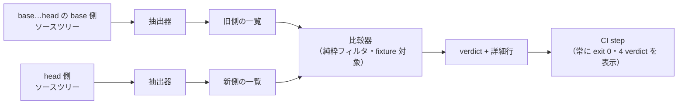

# 公開 API の差分を CI 警告として可視化する（Go）

Issue #93 の仕様。`services/api`（Go）の**新規エクスポート**と**エクスポート済みシンボルのシグネチャ変更**を検出し、既存の必須チェックジョブへ step として相乗りさせて**警告として表示する**（ブロックしない）。

**方針の決定は `docs/adr/0018-public-api-diff-warning-and-stop-condition.md` にある。** 関係するのは**決定1**（警告に留めブロックしない）・**決定4**（Go のみ）・**決定5**（ベースラインは PR の base…head。PR 文脈でなければ SKIP）・**決定6**（既存ジョブへ step を足す。終了コードを握り潰さず verdict へ写像し、step は常に 0 で終える。4つの verdict をすべて表示する）・**決定7**（純粋フィルタ + fixture + `go/parser` / `go/ast`。対象ゼロの扱いの分割表）・**決定8**（`Approved-API-Change:` trailer）と**「限界」節**である。

**本仕様は ADR 0018 の決定を書き写さない**（ADR 0004。決定の実体は ADR 側にある）。本仕様が持つのは、その決定を**テストに落とせる粒度へ落とした受け入れ条件**だけである。ADR と本仕様が食い違ったら **ADR が正**であり、そのときは本仕様を直す。

---

## 対象

| 項目 | 値 |
|---|---|
| 抽出器 | `go/parser` / `go/ast` で Go のソースツリーからエクスポート一覧を出力する Go プログラム（置き場所は **Q-1**） |
| 比較器 | `.github/scripts/check-public-api-diff.sh`（純粋なフィルタ。旧側・新側の一覧2ファイルを引数に取る） |
| fixture | `.github/scripts/test-check-public-api-diff.sh` |
| make ターゲット | `make test-public-api-diff`（`make test` の依存に入れる） |
| CI | `.github/workflows/ci.yml` の**既存ジョブ**へ step を追加する（新規ジョブを起こさない。どのジョブかは **Q-1**） |

### 3つの部品に分ける理由

**抽出（Go が要る）と比較（Go が要らない）を1本のスクリプトに混ぜない。**

- **比較器は Go にもネットワークにも `git` にも依存しない純粋なフィルタ**になり、入力2ファイルを差し替えるだけでローカルで完全実行でき、fixture で全 verdict を固定できる（ADR 0018 決定7-1・7-2）
- **抽出器は構文解析だけを行う**ので、依存解決もネットワークも要らず、ベース側ツリーに対してもそのまま動く（同 決定7-3）
- **`git` によるベースライン取得は CI step だけが持つ。** ここはローカルに検査対象（PR の base）が存在しないため原理的に fixture 化できず、その範囲を最小の1か所へ閉じ込める

---

## AC 索引

**一行趣旨は本文の要約であって仕様ではない。** 判定条件の実体は各 `### AC-N` の本文にある。

| AC | 一行趣旨 | 主に読む工程 |
|---|---|---|
| AC-1 | 比較器は純粋なフィルタである（入力・引数・禁止事項） | tester・implementer |
| AC-2 | エクスポート一覧のレコード書式 | tester・implementer |
| AC-3 | 抽出規則 — 何を公開 API と数え、どう正規化するか | tester・implementer |
| AC-4 | 比較規則 — キー・差分の3分類・verdict の決め方 | tester・implementer |
| AC-5 | 出力契約と verdict / 終了コード（判定表） | tester・implementer |
| AC-6 | fixture — 4ケースを固定し、違反側でも落ちることを固定する | tester・implementer |
| AC-7 | CI step の振る舞い（SKIP・終了コードの写像・4 verdict の表示・常に exit 0） | implementer・reviewer |
| AC-8 | 登録（Makefile / ci.yml / `docs/harness/verification-loop.md`） | implementer・reviewer |
| AC-9 | 限界 — この検査が担保しないこと | reviewer |

---

## 前提（P）

### P-1. 「公開 API」は互換性ではなく「新しい名前・新しい差し替え点」の代理指標である

**根拠は ADR 0018 の「コンテキスト」末尾にある。** `services/api` のパッケージはモジュール外から import されない。したがって本検査が数えるエクスポート集合は、互換性の指標ではなく**設計上の新しい名前の代理**である。

**この前提から2つの帰結が出る。本仕様の抽出規則（AC-3）はこれに従う。**

1. **`package main` を除外しない。** import できないことは、新しい名前でないことを意味しない
2. **`_test.go` は除外する。** テストの識別子は設計上の名前ではない

### P-2. 相乗り先は必須チェックである

step が非ゼロで終わればジョブが赤くなり、ADR 0018 決定1 が採らないと決めた「ブロック」が実現してしまう。**AC-7 の制約はすべてこの1点から出ている。**

---

## 未決（Q）— 人間の決定を要する

### Q-1. 抽出器の置き場所と、警告 step を置くジョブ

**ADR 0018 は決めていない。かつ、既存 docs の禁止条項と衝突しうる。** 実装工程は**この決定が下りるまで AC-8-8 に着手しない**。

衝突の内容は次の2つである。

- **`docs/specs/devcontainer-go-module-policy.md` AC-9-6** は「**`scripts` ジョブへ `setup-go` を足す形にしない**」と書いている。文の主語はその仕様が追加する step だが、字面は `scripts` ジョブ全体への禁止として読める。抽出器は `go/parser` を使う Go プログラムであり（ADR 0018 決定7-3）、警告 step を `scripts` ジョブに置けば Go のセットアップが要る
- **ADR 0018 決定6** は相乗り先を「既存 `scripts` ジョブ（表示名 `Scripts (checker logic)`）」と名指ししている。別ジョブへ置くことは決定6 の字面から外れる（決定6 の**理由**である「新規ジョブを起こさず ruleset への必須チェック追加登録を発生させない」は、`go` ジョブでも同様に満たされる）

| 案 | 抽出器の置き場所 | 警告 step のジョブ | 抽出器の lint / test | 追加で要る人間の決定 |
|---|---|---|---|---|
| (a) | `.github/scripts/extract-go-exports/`（`require` の無い独自 `go.mod`） | `scripts`（`setup-go` を追加） | 新規に用意する（`scripts` ジョブで Go が要る） | `devcontainer-go-module-policy.md` AC-9-6 の禁止文を「pin チェッカに限る」と明示し直すこと（**完了済み仕様の禁止の変更**） |
| (b) | `services/api/cmd/exportlist/` | `scripts`（`setup-go` を追加） | 既存の `make lint-api` / `make test-api`（`go` ジョブ）が無償で覆う | (a) と同じ ＋ **ハーネス資産をプロダクトモジュールへ置くこと**（ADR 0008 のディレクトリ構成に無い `cmd/` 用途） |
| (c) | `services/api/cmd/exportlist/` | **`go` ジョブ**（既に `setup-go` 済み。`scripts` と同じく必須チェックであり ruleset 操作は発生しない） | 同上 | **ADR 0018 決定6 の字面からの逸脱**を是認すること（`go` ジョブも既存ジョブであり、決定6 の理由は満たす） |
| (d) | いずれか | 抽出を `go` ジョブ、比較を `scripts` ジョブへ分け、一覧を artifact で受け渡す | — | 追加の失敗モード（artifact の受け渡し）を許容すること |

**(c) はどこにも新しい toolchain の前提を作らず、既存の禁止条項にも触れない。ただし ADR の字面から外れる。**（d）はジョブ間の受け渡しという新しい失敗モードを増やすため、本仕様は推奨しない。

**Q-1 が未決の間も、AC-1〜AC-7（比較器・抽出規則・出力契約・fixture・step の振る舞い）はすべて確定している。** tester の作業（AC-1〜AC-6）は Q-1 に依存しない。

---

## スコープ

- 抽出規則・比較規則・出力契約の確定（AC-2〜AC-5）
- 比較器と fixture（AC-1 / AC-6）
- CI step の振る舞いと登録（AC-7 / AC-8）
- 限界の固定（AC-9）

### 非スコープ

- **`Approved-API-Change:` trailer の検査・照合・強制**（ADR 0018 決定8 は書式を定めるが、本検査は trailer を**読まない**。読んで通す／落とすは ADR 0018 が却下した厳格版＝代替案 (a) に当たる。AC-9-6）
- **`.claude/agents/tester.md` / `.claude/agents/implementer.md` の停止条件への追記**（ADR 0018 決定2）。**Issue #92 / `docs/specs/agent-stop-conditions.md` が担当する別タスクである。** 同仕様は逆向きにも境界を引いており、AC-3-2 が「決定1 に属する記述（`Approved-API-Change` / verdict `OK` / `WARN` / `SKIP` / `INDETERMINATE` の運用説明）を2ファイルへ持ち込まない」と定める。**本仕様の AC-5 / AC-7 の語彙をエージェント定義側へ転記しない**
- **TypeScript（`apps/web`）**（ADR 0018 決定4）
- **必須チェックを赤にすること**（ADR 0018 決定1）
- **ハーネス自身（`.claude/` / `docs/harness/`）の差分警告**（Issue #19。ADR 0018「関連」節が「統合できると読まないこと」と明示している別物）
- **`services/api` 以外の Go コード**（現状存在しないが、対象は `services/api` 配下に限る）

---

## 受け入れ条件（AC）

### AC-1. 比較器は純粋なフィルタである

| # | 要求 |
|---|---|
| 1-1 | 比較器を **`.github/scripts/check-public-api-diff.sh`** に置く。**第1引数に旧側の一覧のパス、第2引数に新側の一覧のパス**を取る。既定値を持たない（どちらのツリーの一覧かは呼び出し側にしか分からない） |
| 1-2 | **引数以外の入力を持たない。** ネットワークアクセス・`git`・`go` コマンドの呼び出しを内包しない（`.github/scripts/check-review-trail.sh` / `.github/scripts/check-go-module-pins.sh` と同じ作法） |
| 1-3 | **`go` コマンドを使わないことは必須要件である。** 抽出（`go/parser`）と比較を1本にまとめない。まとめると比較器のテストに Go が要り、置き場所の選択肢（Q-1）に fixture が巻き込まれる |
| 1-4 | 入力の内容を**シェルへ展開しない**。シグネチャには Go の raw string リテラル由来の `` ` ``、および `"` / `$(` が現れうる。これらを含む行があっても評価しない。**fixture は副作用ファイルが生成されないことで検査する**（`docs/specs/issue-command.md` AC-10-1 と同じ理由） |
| 1-5 | 入力の**行順に依存しない**。集合として比較する（`docs/specs/devcontainer-go-module-policy.md` AC-6-8 と同型） |
| 1-6 | 入力が CRLF 改行でも判定を壊さない（`\r` をシグネチャ文字列へ混入させない） |

### AC-2. エクスポート一覧のレコード書式

抽出器の出力であり、比較器の入力である。**この書式が両者の唯一の契約である。**

| # | 要求 |
|---|---|
| 2-1 | 1行 = 1シンボル。**タブ区切りのちょうど4フィールド**とする: `<pkg>` `<kind>` `<name>` `<signature>` |
| 2-2 | `<pkg>` は **`services/api` からの相対ディレクトリパス**（`/` 区切り、先頭に `./` を付けない）。`services/api` 直下なら `.`。パッケージ名ではなくディレクトリパスを使うのは、同名パッケージを弁別するためである |
| 2-3 | `<kind>` は **`func` / `method` / `type` / `var` / `const`** の5つのみ |
| 2-4 | `<name>` は識別子。`method` のみ **`<受信者の基底型名>.<メソッド名>`** とする |
| 2-5 | `<signature>` は AC-3-6 の表に従う。**タブ・改行を含まない**（AC-3-7 の正規化で保証する） |
| 2-6 | 行の終端は LF。**空行を出力しない。** ファイル末尾の LF は行の終端であって空行ではない |
| 2-7 | 出力は `LC_ALL=C` のバイト昇順でソートする。**ただし比較器はソートを前提にしない**（AC-1-5）。ソートするのは人間が差分を読むためである |

### AC-3. 抽出規則

**構文解析だけで決まることしか見ない。** 型解決・依存解決・ビルドタグの評価を行わない（ADR 0018 決定7-3）。

| # | 要求 |
|---|---|
| 3-1 | 抽出対象は引数で与えられたルートディレクトリ配下の `*.go` すべて。**次を除外する**: (a) ファイル名が `_test.go` で終わるもの、(b) パス要素に `testdata` または `vendor` を含むもの |
| 3-2 | **`package main` を除外しない**（P-1 の帰結1） |
| 3-3 | **ビルドタグを解釈しない。** 条件付きコンパイルで分岐したファイルもすべて読む。その帰結として同一キーの重複が起こりうるが、これは黙って一方を採らず `INDETERMINATE` にする（AC-5 の `DUPLICATE`） |
| 3-4 | 抽出するのは**トップレベル宣言**のうち、名前が Go のエクスポート規則（先頭が Unicode 大文字）を満たすもの。関数内のローカル宣言・非公開の宣言は対象外 |
| 3-5 | メソッドは、**受信者の基底型名とメソッド名の両方が公開のとき**のみ対象とする。非公開型の公開メソッドは対象外（その型自体に外から触れない） |
| 3-6 | `<signature>` は次のとおり。**引数名・結果名・受信者変数名を出力しない**（名前だけの変更を差分にしないため） |

| kind | `<name>` | `<signature>` |
|---|---|---|
| `func` | 関数名 | 型パラメータがあれば `[T any, U comparable]` の形で先頭に置き、続けて `(<引数型…>) (<結果型…>)` |
| `method` | `<受信者の基底型名>.<メソッド名>` | `(<受信者型>) (<引数型…>) (<結果型…>)`。受信者型は `T` / `*T` / `T[K, V]` のように書かれたまま出力する |
| `type` | 型名 | 型パラメータがあれば `[...]` を先頭に置き、続けて右辺の型式。**型エイリアス（`type T = U`）は右辺の前に `= ` を付ける**（定義型との区別を差分に出すため） |
| `var` | 変数名 | 宣言に型が書かれていればその型式。書かれていなければ `-`（値からの型推論は型解決を要するため行わない） |
| `const` | 定数名 | `var` と同じ |

| # | 要求 |
|---|---|
| 3-7 | **正規化**: 型式は `go/printer` の出力を用い、改行・タブ・連続空白を**空白1つ**へ畳み、前後の空白を落とす。**コメントを出力に含めない** |
| 3-8 | 引数型・結果型はカンマ + 空白1つで区切る。可変長引数は `...T`。**引数0個は `()`、結果0個も `()`、結果1個でも `(T)` と括弧を付ける**（正規化のため。括弧の有無を差分にしない） |
| 3-9 | **構造体の非公開フィールドと、インターフェースの非公開メソッドは `<signature>` から除去する。** 非公開メンバの増減は公開 API の変化ではなく、含めると偽陽性が常態化する（ADR 0018「悪い影響」の「警告が多すぎれば読まれなくなる」） |
| 3-10 | 埋め込みフィールドは、埋め込まれた型名（修飾がある場合は最終要素の識別子）が公開なら残し、非公開なら除去する |
| 3-11 | **依存解決・型解決・ネットワークアクセスを行わない。** `go list` / `go doc` / `golang.org/x/tools` の `packages.Load` を使わない。標準ライブラリの `go/parser` / `go/ast` / `go/printer` / `go/token` のみで実装する |
| 3-12 | 抽出器の依存は**標準ライブラリのみ**とする。`require` を持たせない（devcontainer は実行時にモジュールを取得できない。`docs/harness/verification-loop.md`「実行環境の前提」） |
| 3-13 | **抽出対象の Go パッケージが1つも見つからない場合、0行を出力して非ゼロで終了する。** 「対象が無いので通った」を作らない（ADR 0018 決定7 (iv) の3行目。`docs/harness/verification-loop.md`「検査対象が無い場合は失敗させる」） |
| 3-14 | **構文解析に失敗したファイルがある場合も非ゼロで終了する。** 読めなかったファイルを黙って飛ばさない |

### AC-4. 比較規則

| # | 要求 |
|---|---|
| 4-1 | 突き合わせのキーは **`<pkg>` + `<kind>` + `<name>` の3つ組**とする。`<signature>` はキーに含めない |
| 4-2 | **新側にのみ存在するキー** → `ADDED` |
| 4-3 | **両側に存在し `<signature>` が異なる** → `SIGNATURE_CHANGED`。比較は**バイト単位の完全一致**とし、比較器側で空白や表記を正規化しない（正規化は抽出器の責務。AC-3-7。二重に正規化すると、抽出器が壊れたときに比較器が黙って吸収する） |
| 4-4 | **旧側にのみ存在するキー** → `REMOVED`。**`REMOVED` は verdict に影響しない。** 検出対象は「新規エクスポート」と「シグネチャ変更」であり（ADR 0018 決定1）、削除は新しい名前を作らない |
| 4-5 | **`REMOVED` も詳細行として表示する。** 表示しないと、`OK` が「何も変わっていない」と「削除だけがあった」のどちらなのか区別できなくなる（「通った」のか「素通りした」のかを区別できなくしない、という `docs/harness/verification-loop.md` の要求と同じ趣旨） |
| 4-6 | verdict は **`ADDED` または `SIGNATURE_CHANGED` が1件以上あれば `WARN`**、なければ `OK`（`REMOVED` のみでも `OK`） |
| 4-7 | **最初の1件で打ち切らない。** 該当するすべての詳細行を出す |
| 4-8 | `<kind>` が変わったシンボル（例: `func F` → `var F`）はキーが一致しないため、`REMOVED` + `ADDED` の2行として現れる。**これを1件へまとめない**（まとめるには型解決に近い推測が要る） |

### AC-5. 出力契約と verdict

1行目に `VERDICT: <名前>`、2行目以降に `<キー>: <値>` を **stdout** へ出す。人間・AI 向けの説明は **stderr** へ出し、stdout は機械可読な verdict 専用にする。メッセージは日本語（ADR 0010 §G）。**終了コードは `0` / `1` / `3` のみを使い、`2` を使わない**（`2` は `UserPromptSubmit` hook の「ブロック」に予約されている。理由は `docs/specs/issue-command.md` AC-4）。

| # | 入力 | verdict | 詳細行 | 終了コード |
|---|---|---|---|---|
| 5-1 | 両側の一覧が完全に一致 | `OK` | `COUNT: added=0 signature_changed=0 removed=0` | 0 |
| 5-2 | 新側にのみ存在するキーがある | `WARN` | `ADDED: <pkg> <kind> <name> <signature>` | 3 |
| 5-3 | 両側にあり `<signature>` が違う | `WARN` | `SIGNATURE_CHANGED: <pkg> <kind> <name> old=<sig> new=<sig>` | 3 |
| 5-4 | 旧側にのみ存在するキーがある（他に差分なし） | `OK` | `REMOVED: <pkg> <kind> <name> <signature>` ＋ `COUNT:` | 0 |
| 5-5 | `ADDED` / `SIGNATURE_CHANGED` / `REMOVED` が混在・複数件 | `WARN` | **該当するすべての詳細行** ＋ `COUNT:` | 3 |
| 5-6 | 引数が足りない（0個 / 1個） | `INDETERMINATE` | `ARGS: <渡された個数>` | 1 |
| 5-7 | 引数のパスが存在しない・読めない | `INDETERMINATE` | `PATH: <パス>` | 1 |
| 5-8 | どちらかの一覧が0行 | `INDETERMINATE` | `EMPTY: old` / `EMPTY: new` | 1 |
| 5-9 | タブ区切り4フィールドでない行がある（空行を含む） | `INDETERMINATE` | `MALFORMED: <old\|new> <行番号>` | 1 |
| 5-10 | 同一キーの行が同じ一覧に2つ以上ある | `INDETERMINATE` | `DUPLICATE: <old\|new> <pkg> <kind> <name>` | 1 |
| 5-11 | 入力に `"` / `` ` `` / `$(` を含む行がある | 判定を壊さない。**シェルで評価しない**（副作用ファイルが生成されない） | — | 入力に応じた値 |
| 5-12 | 入力が CRLF 改行 | 判定を壊さない（`\r` をシグネチャへ混入させない） | — | 入力に応じた値 |

**5-6 〜 5-10 を `OK` に倒さない。** 読めなかったこと・対象が無かったことは、差分が無いことを意味しない（`docs/harness/verification-loop.md`「検査対象を読めなかったことは、違反が無いことを意味しない」）。

**`WARN` に非ゼロ（3）を割り当てるのは、比較器のレイヤーでは「差分あり」を成功と区別するためである。** ブロックしないという決定（ADR 0018 決定1）は CI step のレイヤーで実現する（AC-7-2）。**比較器の終了コードを 0 に潰さない。** 潰すと、step 側で `WARN` を `OK` から区別する手段が stdout の文字列一致だけになる。

### AC-6. fixture — 違反側でも落ちることを固定する

| # | 要求 |
|---|---|
| 6-1 | fixture を **`.github/scripts/test-check-public-api-diff.sh`** に置き、`make test-public-api-diff` で回す。**`check-public-api-diff.sh` が存在しなければ失敗する**（SKIP しない） |
| 6-2 | **AC-5 の表の各行に対応する fixture を持つ。** 判定基準は「**表の1行を実装から削ると、fixture が最低1件 Red になる**」こと（`docs/specs/orchestrator-entry-hook.md` AC-9 / `docs/specs/devcontainer-go-module-policy.md` AC-8-2 と同じ基準） |
| 6-3 | 判定は **終了コード・stdout の `VERDICT`・詳細行のキー**の3点で行う。`WARN` は `ADDED` と `SIGNATURE_CHANGED` に共通のため、終了コードと verdict だけでは弁別できない |
| 6-4 | **Issue #93 の完了条件が挙げる4ケースを、それぞれ独立した fixture として持つ**: (a) 新規追加 → `WARN` / `ADDED`、(b) シグネチャ変更 → `WARN` / `SIGNATURE_CHANGED`、(c) 変更なし → `OK`、(d) 入力欠損 → `INDETERMINATE` |
| 6-5 | **通る側だけを検査しない。** (a) と (b) が**期待した詳細行キーで落ちること**を固定する。通る側だけを見ると、検査が何も見ていなくても緑になる（`docs/specs/issue-command.md` AC-8-13 と同型） |
| 6-6 | fixture は入力ファイルを一時ディレクトリへ組み立てて渡す。**リポジトリ内の実ファイルを書き換えない** |
| 6-7 | fixture の入力を組み立てるとき、内容を**シェルへ展開しない**（クォートしたヒアドキュメント区切りを使う。`.claude/hooks/test-check-prompt-entry.sh` と同じ理由）。**AC-1-4 の検査は、`$(touch <一時ファイル>)` を含むシグネチャを入力に与え、そのファイルが生成されないことを確認する形で行う** |
| 6-8 | fixture は `LC_ALL=C` に依存する比較（AC-2-7）をロケール非依存に検査する。ロケール設定で結果が変わらないこと |

### AC-7. CI step の振る舞い

**この AC はすべて P-2（相乗り先が必須チェックである）から出ている。**

| # | 要求 |
|---|---|
| 7-1 | step は**既存ジョブへ追加**する。新規ジョブを起こさず、ジョブの `name:` を変更しない（ruleset `protect-main` への必須チェック再登録＝人間のブラウザ操作を発生させないため。`docs/harness/verification-loop.md`「必須チェックへの登録」）。**どのジョブかは Q-1** |
| 7-2 | **step 自身は常に exit 0 で終わる。** `continue-on-error` に依存しない（`continue-on-error` は step を失敗として表示したうえでジョブを続行するもので、「警告に留める」ではない） |
| 7-3 | **比較器・抽出器の終了コードを `\| ... \|\| true` でパイプへ繋いで握り潰さない。** 一度変数へ受けてから verdict へ写像する（`docs/harness/verification-loop.md`「`-test` には終了コードの番人が要る」で実際に踏んだ偽 Green と同型） |
| 7-4 | **verdict は `OK` / `WARN` / `SKIP` / `INDETERMINATE` の4つ。4つすべてを、ジョブログと `$GITHUB_STEP_SUMMARY` の両方へ出す。`OK` と `SKIP` でも黙らない** |
| 7-5 | `::warning::` アノテーションは **`WARN` と `INDETERMINATE` に対して出す**。`OK` / `SKIP` では出さない。アノテーションは注意を引くための手段であり、「黙らないこと」は 7-4（ログ + summary）で担保される。**これは ADR 0018 決定6 の読み方であって、新しい決定ではない** |
| 7-6 | **`if:` 式で step ごとスキップしない。** PR 文脈かどうかの判定は step の**中**で行う。`if:` を使うと GitHub 上は "skipped" 表示になり、ログに何も残らず「素通り」と区別できなくなる（7-4 と衝突する） |
| 7-7 | `SKIP` の条件は「**PR 文脈でない実行**」または「**ベース側の ref / merge-base が取得できない**」。いずれも `SKIP` を表示し、**どちらの理由かを1行添える**（ADR 0018 決定5） |
| 7-8 | `SKIP` の表示文言に「**ベースラインが無い**」ことを含める。この `SKIP` は `lint-tf` のような「未着手」ではなく「ベースラインが取れない実行文脈」である。両者を同じ文言にしない |
| 7-9 | **ベース側ツリーの取得手段を明示的に用意する。既定の浅いクローンに依存しない**（`scripts` / `go` のいずれのジョブも `actions/checkout@v7` に `fetch-depth` を指定していない。ADR 0018 決定5 の「実装上の制約」）。手段は実装工程が選ぶが、**取得に失敗したことを `OK` へ倒さない**（7-7 の `SKIP` か 7-11 の `INDETERMINATE` のいずれかへ写像する） |
| 7-10 | **ベース側ツリーは作業ツリーとは別のディレクトリへ展開して抽出する。** `git checkout` / `git stash` で作業ツリーを切り替えない（切り替え途中で失敗すると、head 側の抽出結果がベース側の内容で汚染される） |
| 7-11 | **ベース側の抽出にも head 側の抽出器を使う。** 理由は2つある。(a) ベース側に抽出器が存在しない場合がある（本仕様を導入する PR がまさにそれである）。(b) 両側を同一の抽出規則で読まないと、抽出規則を変えた PR で全シンボルが差分として出る |
| 7-12 | 抽出器が非ゼロで終わった場合、抽出結果が0行の場合、比較器が `INDETERMINATE` を返した場合は、step の verdict を **`INDETERMINATE`** とする。**`OK` へ倒さない**（ADR 0018 決定7 (iv) の表の2行目・3行目） |
| 7-13 | `WARN` のときは `ADDED` / `SIGNATURE_CHANGED` の**詳細行をすべて表示する**。件数だけにしない。**見えないものはレビューできない**（ADR 0018「良い影響」） |
| 7-14 | step は `Approved-API-Change:` trailer を**読まない・照合しない**（非スコープ。AC-9-6） |

### AC-8. 登録

| # | 要求 |
|---|---|
| 8-1 | `Makefile` に **`test-public-api-diff`** を新設し、**`test` の依存**に入れる（`verify` は `test` を経由して覆う） |
| 8-2 | Makefile に**新しいコメント区分**を置き、`test-scripts` へ合流させない理由を書く: 対象種別が「プロセス検査のチェッカ」でも「設定ファイル間の整合検査」でもなく、**ソースから抽出した公開 API 一覧の比較**であること。既存区分の説明と実体をずらさない（`check-go-module-pins` / `check-skills` と同じ扱い） |
| 8-3 | `docs/rules/commands.md` の表へ**行を足さない。** 新ターゲットは `test` に含まれ、「作業の区切りで必ず実行する」コマンドは増えない。ここで行を増やすと毎回読まれるトークンだけが増える（CLAUDE.md「肥大化は毎回読まれるトークン量で測る」） |
| 8-4 | `docs/harness/verification-loop.md` の「コマンド」表へ **`make test-public-api-diff`** の行を足す |
| 8-5 | 同「CI の構成」表の該当ジョブ行の「呼ぶもの」へ、**fixture ターゲットと警告 step の両方**を追記する。警告 step は `make` 経由でないため、その旨が読める書き方にする |
| 8-6 | 同節末尾の「種類」3行表（コード検査 / プロセス検査 / チェッカのロジック）へ、本 step の性質を**行または注記として足す**。**「プロセス検査を ci.yml に混ぜない」という既存の禁止を緩めない。** 記すのは次の事実である: 本 step はベースライン（PR の base）に依存するためローカル再現できないが、**常に exit 0 で終わり原理的に失敗しえない**ため、その禁止が防ごうとしている「ローカルで再現できない CI の失敗が常態化する」が発生しない。**なお比較器と抽出規則はローカルで完全に再現でき**（`make test-public-api-diff`）、CI にしか無いのはベースライン取得の1か所だけである |
| 8-7 | **8-4 〜 8-6 は実装コミットで同時に行う。** ターゲットや step が存在しない時点で表へ行を足すと docs が虚偽になる（`docs/specs/issue-command.md` AC-8-4 / `docs/specs/devcontainer-go-module-policy.md` AC-9-4 と同じ）。**したがって本仕様を起こす `docs:` コミットでは `verification-loop.md` を更新しない** |
| 8-8 | **【Q-1 の決定待ち】** 抽出器の置き場所、警告 step を置くジョブ、および `setup-go` の要否。**人間の決定が下りるまで着手しない。** 決定が下りたら、その内容を Q-1 の表の下へ「決定」として追記し、本 AC を確定させる |

### AC-9. 限界 — この検査が担保しないこと

**以下は仕様どおりの限界であり、欠陥ではない。**

| # | 内容 |
|---|---|
| 9-1 | **一線越えの弁別はできない。** 見えるのは公開 API の増減だけで、「新しい差し替え点を作った」かどうかは正当な新規エクスポートとまったく同じ形で現れる。本検査が提供するのは**見るべき差分の候補リスト**であって判定ではない（ADR 0018「限界」1） |
| 9-2 | **ブロックしない。読まれなければ何も起きない**（ADR 0018 決定1・「限界」2・「悪い影響」1点目） |
| 9-3 | **push 実行では `SKIP` する。** PR を経ない変更には効かない（ADR 0018 決定5・「悪い影響」） |
| 9-4 | **型解決を要する事実は見えない。** 型エイリアス経由の実体変更、埋め込みによるメソッド昇格、型注釈の無い `var` / `const` の型は差分に現れない（AC-3-6 / AC-3-11。ADR 0018 決定7 の「代償」） |
| 9-5 | **TypeScript（`apps/web`）は対象外**（ADR 0018 決定4）。**一線が実際に破られた箇所は TypeScript 側である**（同「限界」1の末尾） |
| 9-6 | **`Approved-API-Change:` trailer を読まない**（非スコープ）。したがって「承認済みの差分」と「未承認の差分」を区別しない。区別して落とすのは ADR 0018 が却下した厳格版（代替案 (a)）であり、**trailer を当事者が自分で書けるという限界**（同「限界」3）はそのまま残る |
| 9-7 | **引数名・結果名・受信者変数名の変更は差分に出ない**（AC-3-6。意図した設計）。逆に**型パラメータ名の変更（`[T any]` → `[E any]`）は差分に出る**。安全側（黙らない側）の偽陽性である |
| 9-8 | **非公開フィールド・非公開メソッドの変更は差分に出ない**（AC-3-9）。それらは公開 API ではないが、**公開型の内部構造の変化を見逃す**ことを意味する |
| 9-9 | **ビルドタグを解釈しない**（AC-3-3）。条件付きコンパイルで同名シンボルを分岐させると、`DUPLICATE` により恒常的に `INDETERMINATE` になる。現在 `services/api` に該当は無いが、導入した時点でこの検査は判定を返さなくなる。**安全側だが、無害ではない** |
| 9-10 | **ベースライン取得（`git` の操作）は fixture の対象外である。** ローカルに PR の base が存在しないため原理的に再現できない。**この1か所にだけチェッカのバグが残りうる**（`docs/harness/verification-loop.md`「チェッカのバグだけが検査不能地帯に残る」を最小化はしたが、ゼロにはしていない） |
| 9-11 | **抽出器のバグは、抽出器のテストが覆う範囲でしか捕まらない。** 抽出器が誤って少なく出力すれば差分が出ず、`OK` になる。0行のときだけは `INDETERMINATE` で止まる（AC-3-13 / AC-5-8）が、**「1行しか出さない」ような壊れ方は止まらない** |
| 9-12 | **偽陽性が常態化しうる。** 正当な新規エクスポートは日常的に発生する。**警告が多すぎれば読まれなくなる**という退化は機械では検出できない（ADR 0018「悪い影響」） |
| 9-13 | **`docs/harness/` / `.claude/` 自身の差分は対象外**（Issue #19 の担当範囲。ADR 0018「関連」） |

**「この検査が緑なら一線は越えられていない」と読める AC を後から足さないこと。** 9-1 のとおり、`OK` が意味するのは「公開 API の集合とシグネチャが base…head で変わっていない」までである。

---

## 関連

- `docs/adr/0018-public-api-diff-warning-and-stop-condition.md`: **本仕様の決定の出所**（決定1・4〜8 と「限界」節）
- `docs/adr/0010-harness-engineering.md`: §A（差分を警告として可視化しブロックしない／停止条件の追加は人間の承認事項）、§F（機械で止められる範囲と規律に留まる範囲を分ける）、§G（応答言語）
- `docs/adr/0009-branch-protection-via-ruleset.md`: 承認をマージ条件にできない（AC-9-2 / 9-6）
- `docs/adr/0004-issue-docs-reference-model.md`: 決定を本仕様へ書き写さず参照で張る
- `docs/adr/0008-clean-architecture.md`: `services/api` のディレクトリ構成（Q-1 の (b) / (c) が触れる範囲）
- `docs/harness/verification-loop.md`: 「`-test` には終了コードの番人が要る」（AC-7-3）／「未着手のレイヤーは『SKIP』を明示する」（AC-7-8）／「CI の構成」「必須チェックへの登録」（AC-7-1 / AC-8-5・8-6）／「実行環境の前提」（AC-3-12）／「検査対象が無い場合は失敗させる」（AC-3-13）
- `docs/specs/devcontainer-go-module-policy.md`: 純粋フィルタの作法・出力契約・fixture の判定基準（AC-1 / AC-5 / AC-6）。**AC-9-6 が Q-1 の衝突点である**
- `docs/specs/issue-command.md`: 機械判定部を切り出す理由、既存ジョブへ相乗りさせる理由、入力をシェルへ展開しない（AC-1-4）、違反側で落ちることを固定する（AC-6-5）
- `docs/specs/orchestrator-entry-hook.md` AC-9: 表の各行に fixture を対応させる（AC-6-2 の判定基準の先例）
- `docs/specs/agent-stop-conditions.md`: ADR 0018 決定2 の担当仕様（Issue #92）。**本仕様と対象が重ならないことを AC-3-2 が両側から固定している**
- `docs/rules/development-process.md`: 要求を実装の都合で緩めない（Q-1 を独断で埋めない根拠）
- Issue #93: 実装タスク（完了条件の実体は本仕様が持つ。Issue のコメントは docs より優先されない — ADR 0004）
