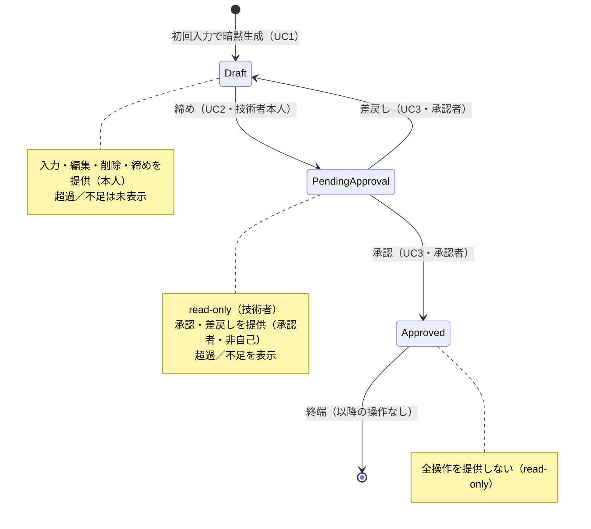

# 勤務月画面 — UI/画面 共通仕様

MVP 3ユースケース（稼働実績の入力・編集 / 月次締め / 承認申請・承認）の UI は、**単一の「勤務月画面」**に集約する。その画面骨格・状態表示・状態×ロールの操作可否・共通コンポーネント・read-only／エラー表示の共通形を本仕様が定める。各 UC 固有の操作 UI は per-UC の UI 仕様（`daily-record-entry-ui.md` / `monthly-closing-ui.md` / `approval-ui.md`）が持つ。

**単一画面に集約する根拠**: 集約は `WorkMonth` の1つのみ（`docs/rules/scope.md`／`docs/domain/ubiquitous-language.md`）。かつ `docs/specs/approval.md` AC-8-1 が「**既存の勤務月画面**で状態（`Draft` / `PendingApproval` / `Approved`）を表示する」と、単一の勤務月画面の存在を前提としている。UI はこの集約と 1:1 に対応させる。

**業務ルール・状態遷移・丸め規則・ユビキタス言語はこの仕様へ書き写さない。** 正解は `docs/domain/ubiquitous-language.md` と各業務仕様（`daily-record-entry.md` / `monthly-closing.md` / `approval.md`）にあり、本仕様はそれらを参照して「**画面が満たすべき形**」だけを定める（ADR 0004）。

- **決定者**: 人間（プロジェクトオーナー）。旧「未確定点」Q1〜Q9 は人間が決定済み（末尾「確定事項」）。決定で新たに対象化した画面（勤務月一覧・ログイン）は別 spec が持つ
- **日付**: 2026-07-23
- **前提 ADR**: 0015（Claude Design。デザイントークン・具体レイアウトは本仕様の対象外で、デザイン工程が担う）／0016（エンドユーザー認証＝Cognito。ゲスト・ロール・認証の分界）

---

## スコープ

- **対象**: 勤務月画面の画面骨格、状態バッジ（状態表示）、**状態×ロールの操作可否マトリクス**（ゲスト含む）、共通コンポーネント一覧、超過／不足の表示タイミング、read-only の共通挙動、エラー表示の共通形、画面遷移（状態駆動）
- **非対象**（未確定ではなく、確定済みで別 spec が持つ）:
  - 各 UC 固有の操作フロー・入力フォーム・確認ステップ（per-UC の UI 仕様）
  - **勤務月一覧（本人の勤務月一覧・承認待ち一覧）** → `work-month-listing-ui.md`
  - **ログイン・認証・現在ユーザー／ロールの決定** → `login-ui.md`（ADR 0016）
  - デザイントークン・配色・タイポグラフィ・レスポンシブ・具体レイアウト（ADR 0015 のデザイン工程）
  - 業務ルールそのもの（各業務仕様が持つ）

---

## 前提（P）— 確定事項（参照のみ、再定義しない）

| # | 前提 | 出典 |
|---|---|---|
| P-1 | 画面は単一の勤務月（`契約 × 年月`）を対象とする。画面と集約は 1:1 | ユビキタス言語「勤務月の同一性」 |
| P-2 | データ取得・操作はすべて Next.js Route Handler 経由（ブラウザは Lambda を直接呼ばない）。エンドユーザー認証も BFF で終端する | `docs/rules/architecture.md`（BFF 一方通行）／ADR 0016 |
| P-3 | 状態は `Draft` / `PendingApproval` / `Approved` の3つ。遷移は循環しない（承認済は終端） | ユビキタス言語「状態遷移」 |
| P-4 | ロールは技術者（`Engineer`）と承認者（`Approver`）。同一利用者が「対象勤務月の技術者本人」かつ「承認者ロール保持」でありうる（自己承認の論点）。自己承認排除はロールに依存せず維持する | ユビキタス言語「中核概念」／`approval.md` D-4／ADR 0016 |
| P-5 | 超過（`Excess`）／不足（`Shortfall`）は締め時に算出・保存される（`Draft` では未確定） | `monthly-closing.md` D-2・AC-3 |
| P-6 | 認証は Cognito。利用者はゲスト（未ログイン＝閲覧のみ）／技術者／承認者のいずれか。ロール（`Engineer`/`Approver`）はデモ用に切替可能で、ロール管理画面は作らない | ADR 0016／`docs/rules/scope.md` |

---

## 受け入れ条件（AC）

| AC | 主題 | 出典（業務仕様） |
|---|---|---|
| AC-1 | 画面骨格と共通コンポーネント | 全 UC |
| AC-2 | 状態バッジ（状態表示） | `approval.md` D-6・AC-8-1 |
| AC-3 | 状態×ロールの操作可否マトリクス（ゲスト含む） | 全 UC／ADR 0016 |
| AC-4 | 総稼働時間・精算幅・超過／不足の表示タイミング | `monthly-closing.md` D-2・AC-3 |
| AC-5 | read-only の共通挙動 | UC1 P-5／`monthly-closing.md` AC-5-2／`approval.md` AC-5-3・AC-7 |
| AC-6 | エラー表示の共通形 | 全 UC |
| AC-7 | 画面遷移（状態駆動） | ユビキタス言語「状態遷移」 |
| AC-8 | 限界 — 本仕様が担保しないこと | — |

### AC-1. 画面骨格と共通コンポーネント

勤務月画面は次の要素を持つ。各要素の表示可否は状態・ロールで変わる（AC-3〜AC-5）。

| # | 要素 | 表示条件 | 備考 |
|---|---|---|---|
| 1-1 | 勤務月の識別（契約 × 対象年月） | 常時 | 契約は**契約表示名（人間可読）**で示す（人間決定 Q9） |
| 1-2 | 状態バッジ | 常時 | AC-2 |
| 1-3 | 総稼働時間（`TotalHours`） | 常時 | 丸め後の値。日次表示と整合（AC-4） |
| 1-4 | 精算幅（下限・上限） | 常時 | 勤務月が保持するスナップショット |
| 1-5 | 超過／不足 | 締め後（`PendingApproval` / `Approved`）のみ | AC-4 |
| 1-6 | 日次実績の一覧 | 常時（閲覧は全状態・ゲスト含む） | **カレンダー**表示（人間決定 Q4）。詳細は `daily-record-entry-ui.md` |
| 1-7 | 操作領域（入力・編集・削除／締め／承認／差戻し） | 状態×ロールで出し分け | AC-3。詳細は各 UC UI 仕様 |

### AC-2. 状態バッジ（状態表示）

| # | 条件 | 期待 |
|---|---|---|
| 2-1 | 画面表示時 | 現在の状態（`Draft` / `PendingApproval` / `Approved`）を常に表示し、3値を互いに区別できる |
| 2-2 | 技術者本人・承認者・ゲストのいずれが見ても | 同一の状態表示を見る（状態表示はロールで変えない。`approval.md` D-6・AC-8-1） |
| 2-3 | 通知 | 状態は画面を開いて確認する。プッシュ通知・メール等の能動通知 UI は設けない（`approval.md` D-5・AC-8-3） |

### AC-3. 状態×ロールの操作可否マトリクス（ゲスト含む）

各セルは操作要素を **提供する（表示し活性）** / **提供しない** のいずれか。**「提供しない」は非表示で統一する**（人間決定 Q8。非活性表示は採らない。ゲスト含む全セル）。判定の業務根拠は各業務仕様（本表へ書き写さない）。

**操作者種別**: ①技術者本人（対象勤務月の技術者） ②他の技術者 ③承認者（本人でない） ④承認者かつ本人（自己承認の対象者） ⑤ゲスト（未ログイン＝閲覧のみ）

| 状態 | 操作者種別 | 入力・編集・削除 | 締め | 承認 | 差戻し | 根拠 |
|---|---|---|---|---|---|---|
| `Draft` | ①技術者本人 | 提供 | 提供 | 提供しない | 提供しない | UC1 AC-5-1／UC2 AC-1-1・AC-2-1 |
| `Draft` | ②他の技術者 | 提供しない | 提供しない | 提供しない | 提供しない | UC2 AC-2-2 |
| `Draft` | ③承認者（本人でない） | 提供しない | 提供しない | 提供しない | 提供しない | UC3 AC-1-2・AC-2-2 |
| `Draft` | ④承認者かつ本人 | 提供 | 提供 | 提供しない | 提供しない | 本人としてのみ操作可 |
| `PendingApproval` | ①技術者本人 | 提供しない | 提供しない | 提供しない | 提供しない | UC2 AC-5-2（read-only）・AC-1-2（二重締め禁止） |
| `PendingApproval` | ②他の技術者 | 提供しない | 提供しない | 提供しない | 提供しない | — |
| `PendingApproval` | ③承認者（本人でない） | 提供しない | 提供しない | 提供 | 提供 | UC3 AC-1-1・AC-2-1・AC-3 |
| `PendingApproval` | ④承認者かつ本人 | 提供しない | 提供しない | 提供しない | 提供しない | 自己承認排除 UC3 D-4・AC-4-1（ロール非依存で維持。ADR 0016） |
| `Approved` | 全員 | 提供しない | 提供しない | 提供しない | 提供しない | 終端 UC3 AC-7 |
| 全状態 | ⑤ゲスト（未ログイン） | 提供しない | 提供しない | 提供しない | 提供しない | 閲覧のみ。ADR 0016／`docs/rules/scope.md` |

> ゲストは状態を変える操作要素を一切持たず（非表示）、閲覧に限られる（ADR 0016）。ゲストは**デモ用サンプル勤務月群を読み取り専用で閲覧する**（人間決定・旧 N-1。仕様は `work-month-listing-ui.md` AC-3／`login-ui.md` AC-4 が持つ）。本人一覧・承認待ち一覧はゲストの導線ではない。

### AC-4. 総稼働時間・精算幅・超過／不足の表示タイミング

| # | 状態 | 総稼働時間 | 精算幅 | 超過／不足 |
|---|---|---|---|---|
| 4-1 | `Draft` | 表示する | 表示する | **数値を表示しない**（締め時に算出・保存されるため未確定。P-5）。「締め時に確定する」旨を示す |
| 4-2 | `PendingApproval` | 表示する | 表示する | 締め時に算出・保存された値を表示する（`monthly-closing.md` AC-3） |
| 4-3 | `Approved` | 表示する | 表示する | 締め時の値をそのまま表示する（`approval.md` AC-5-2） |

- 4-4: 総稼働時間と日次実績一覧の各日の表示値は**整合する**（人間が日次を足し合わせた結果と月次合計が一致して見える）。日次の表示・丸めの詳細は `daily-record-entry-ui.md` AC-1。
- 4-5: `Draft` で「締め前の見込み超過／不足」は**表示しない**（締め時のみ確定。人間決定 Q7。AC-4-1 と一致）。

### AC-5. read-only の共通挙動

| # | 状態 | 期待 |
|---|---|---|
| 5-1 | `PendingApproval` | 稼働実績の入力・編集・削除の操作要素を提供しない（UC1 P-5）。日次実績一覧は閲覧できる |
| 5-2 | `Approved` | 終端状態。状態を変える操作要素を一切提供しない（UC3 AC-7）。閲覧のみ |
| 5-3 | read-only の各状態・ゲスト | 一覧・総稼働時間・精算幅・超過／不足は閲覧できる（表示は AC-4） |

### AC-6. エラー表示の共通形

| # | 条件 | 期待 |
|---|---|---|
| 6-1 | 入力・操作が業務ルールで弾かれる（値域／未来日／当該月外／状態不整合／認可など） | 操作を弾き、**理由を利用者に提示**する。個別の弾き条件は各 UC UI 仕様が持つ |
| 6-2 | バリデーションエラー時 | **利用者が入力した値を失わせない**（再入力を強いない） |
| 6-3 | 通信・サーバエラー時 | エラーを提示し、破壊的な状態変化（未確定の締め・承認等）を伴わない |
| 6-4 | 競合（他経路で状態が変わっていた等） | 現在の状態を反映し直し、古い操作を成立させない |

### AC-7. 画面遷移（状態駆動）

勤務月画面は**同一画面のまま状態で操作要素が変わる**（画面自体は遷移しない）。状態そのものの遷移はユビキタス言語「状態遷移」に従い、本仕様では再定義しない。画面間の遷移（ログイン→一覧→勤務月画面）は `login-ui.md` / `work-month-listing-ui.md` が持つ。

### AC-8. 限界 — 本仕様が担保しないこと

**以下は仕様どおりであり、欠陥ではない。**

| # | 内容 |
|---|---|
| 8-1 | **勤務月一覧（本人・承認待ち）は `work-month-listing-ui.md`、ログイン・認証は `login-ui.md` が持つ**（確定済みで別 spec 化）。本仕様は勤務月画面本体に閉じる |
| 8-2 | **デザイントークン・具体レイアウト・レスポンシブは対象外**（ADR 0015 のデザイン工程が担う）。本仕様は受け入れ条件（満たすべき形）のみを定める |
| 8-3 | **通知 UI を設けない**（`approval.md` D-5・AC-8-3） |
| 8-4 | 本仕様は画面の受け入れ条件のみを定め、コンポーネント実装・状態管理・Route Handler の配線の詳細は実装工程が既存 ADR に従って決める |

---

## 確定事項（旧「未確定点」Q1〜Q9 — 人間が決定済み）

旧「未確定点」は人間がすべて決定した。**AI が業務判断を足していない。** 反映先を併記する。

| # | 論点 | 決定 | 反映先・出典 |
|---|---|---|---|
| Q1 | 本人の勤務月への到達手段 | **自分の勤務月一覧＋直近を既定表示**（技術者横断ビューは非スコープのまま。本人分の一覧に限る） | `work-month-listing-ui.md`。人間決定 |
| Q2 | 承認者の到達手段 | **承認待ち一覧を設ける**。承認済一覧は禁止・維持（`approval.md` AC-8-2） | `work-month-listing-ui.md`／`approval-ui.md` AC-8。人間決定 |
| Q3 | 認証・現在ユーザー／ロールの決定 | **Cognito 3方式**（ゲスト=閲覧のみ／メール+パスワード+MFA(TOTP)／Google OIDC）。ロール `Engineer`/`Approver` はデモ用切替、管理画面は非スコープ | ADR 0016／`docs/rules/scope.md`。`login-ui.md`。P-6・AC-3 ゲスト行 |
| Q4 | 日次実績一覧の表示形態 | **カレンダー** | `daily-record-entry-ui.md` AC-1。AC-1-6。人間決定 |
| Q5 | 稼働時間の入力ウィジェット | **時・分の数値入力** | `daily-record-entry-ui.md` AC-3。人間決定 |
| Q6 | 一覧の既定並び順・ページング | **年月降順・ページングあり**（本人一覧・承認待ち一覧の両方） | `work-month-listing-ui.md`。人間決定 |
| Q7 | `Draft` の見込み超過／不足 | **表示しない**（締め時のみ確定） | AC-4-1・AC-4-5。人間決定 |
| Q8 | 「提供しない」操作の扱い | **非表示で統一**（全セル・ゲスト含む） | AC-3。人間決定 |
| Q9 | 勤務月の契約識別 | **契約表示名（人間可読）** | AC-1-1。人間決定 |

---

## 確定事項（追補 — 旧「新たに人間確認が必要な点」N-1〜N-3 を人間が決定）

旧 N-1〜N-3 は人間がすべて決定した。**AI が業務判断を足していない。** 反映先を併記する。

| # | 論点 | 決定 | 反映先・出典 |
|---|---|---|---|
| N-1 | ゲスト（未ログイン）の閲覧導線 | **デモ用サンプル勤務月群を読み取り専用で提示**する。ゲスト専用の閲覧導線とし、本人一覧・承認待ち一覧はゲストの導線としない | `work-month-listing-ui.md` AC-3／`login-ui.md` AC-4-3。人間決定 |
| N-2 | デモ用ロール切替（`Engineer`/`Approver`）の提供方法 | **ヘッダー等に軽量な切替コントロールを置く**（ロール管理画面は作らない。`docs/rules/scope.md`／ADR 0016 維持） | `login-ui.md` AC-6。人間決定 |
| N-3 | 一覧の1ページあたりの件数 | **仕様で固定しない**（業務要件なし。デザイン／実装工程の詳細に委ねる） | `work-month-listing-ui.md` AC-4-2。人間決定 |

**残存する未確定点は無い。**
