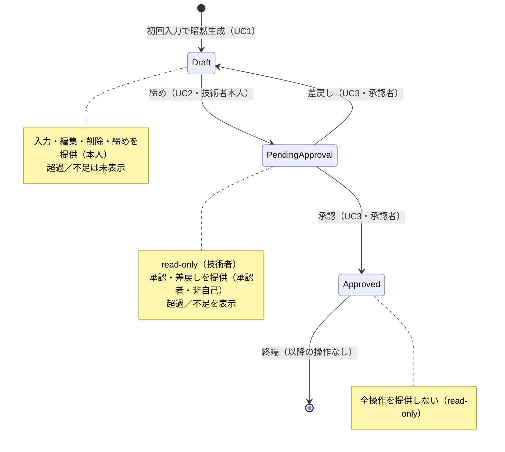

# 勤務月画面 — UI/画面 共通仕様

MVP 3ユースケース（稼働実績の入力・編集 / 月次締め / 承認申請・承認）の UI は、**単一の「勤務月画面」**に集約する。その画面骨格・状態表示・状態×ロールの操作可否・共通コンポーネント・read-only／エラー表示の共通形を本仕様が定める。各 UC 固有の操作 UI は per-UC の UI 仕様（`daily-record-entry-ui.md` / `monthly-closing-ui.md` / `approval-ui.md`）が持つ。

**単一画面に集約する根拠**: 集約は `WorkMonth` の1つのみ（`docs/rules/scope.md`／`docs/domain/ubiquitous-language.md`）。かつ `docs/specs/approval.md` AC-8-1 が「**既存の勤務月画面**で状態（`Draft` / `PendingApproval` / `Approved`）を表示する」と、単一の勤務月画面の存在を前提としている。UI はこの集約と 1:1 に対応させる。

**業務ルール・状態遷移・丸め規則・ユビキタス言語はこの仕様へ書き写さない。** 正解は `docs/domain/ubiquitous-language.md` と各業務仕様（`daily-record-entry.md` / `monthly-closing.md` / `approval.md`）にあり、本仕様はそれらを参照して「**画面が満たすべき形**」だけを定める（ADR 0004）。

- **決定者**: 人間（プロジェクトオーナー）。UI 固有で業務判断を要する論点は末尾「未確定点」に列挙し、**確定するまでその画面のデザインへ進まない**
- **日付**: 2026-07-23
- **前提 ADR**: 0015（Claude Design。デザイントークン・具体レイアウトは本仕様の対象外で、デザイン工程が担う）

---

## スコープ

- **対象**: 勤務月画面の画面骨格、状態バッジ（状態表示）、**状態×ロールの操作可否マトリクス**、共通コンポーネント一覧、超過／不足の表示タイミング、read-only の共通挙動、エラー表示の共通形、画面遷移（状態駆動）
- **非対象**:
  - 各 UC 固有の操作フロー・入力フォーム・確認ステップ（per-UC の UI 仕様が持つ）
  - **勤務月への到達手段・ナビゲーション・一覧・認証／現在ユーザーの決定**（UI 固有の業務判断を要する。末尾「未確定点」Q1〜Q3。確定まで実装しない）
  - デザイントークン・配色・タイポグラフィ・レスポンシブ・具体レイアウト（ADR 0015 のデザイン工程）
  - 業務ルールそのもの（各業務仕様が持つ）

---

## 前提（P）— 確定事項（参照のみ、再定義しない）

| # | 前提 | 出典 |
|---|---|---|
| P-1 | 画面は単一の勤務月（`契約 × 年月`）を対象とする。画面と集約は 1:1 | ユビキタス言語「勤務月の同一性」 |
| P-2 | データ取得・操作はすべて Next.js Route Handler 経由（ブラウザは Lambda を直接呼ばない） | `docs/rules/architecture.md`（BFF 一方通行） |
| P-3 | 状態は `Draft` / `PendingApproval` / `Approved` の3つ。遷移は循環しない（承認済は終端） | ユビキタス言語「状態遷移」 |
| P-4 | ロールは技術者（`Engineer`）と承認者（`Approver`）。同一利用者が「対象勤務月の技術者本人」かつ「承認者ロール保持」でありうる（自己承認の論点） | ユビキタス言語「中核概念」／`approval.md` D-4 |
| P-5 | 超過（`Excess`）／不足（`Shortfall`）は締め時に算出・保存される（`Draft` では未確定） | `monthly-closing.md` D-2・AC-3 |

---

## 受け入れ条件（AC）

| AC | 主題 | 出典（業務仕様） |
|---|---|---|
| AC-1 | 画面骨格と共通コンポーネント | 全 UC |
| AC-2 | 状態バッジ（状態表示） | `approval.md` D-6・AC-8-1 |
| AC-3 | 状態×ロールの操作可否マトリクス | 全 UC |
| AC-4 | 総稼働時間・精算幅・超過／不足の表示タイミング | `monthly-closing.md` D-2・AC-3 |
| AC-5 | read-only の共通挙動 | UC1 P-5／`monthly-closing.md` AC-5-2／`approval.md` AC-5-3・AC-7 |
| AC-6 | エラー表示の共通形 | 全 UC |
| AC-7 | 画面遷移（状態駆動） | ユビキタス言語「状態遷移」 |
| AC-8 | 限界 — 本仕様が担保しないこと | — |

### AC-1. 画面骨格と共通コンポーネント

勤務月画面は次の要素を持つ。各要素の表示可否は状態・ロールで変わる（AC-3〜AC-5）。

| # | 要素 | 表示条件 | 備考 |
|---|---|---|---|
| 1-1 | 勤務月の識別（契約の識別 × 対象年月） | 常時 | 契約の表示名／識別子の在り方は未確定（Q9） |
| 1-2 | 状態バッジ | 常時 | AC-2 |
| 1-3 | 総稼働時間（`TotalHours`） | 常時 | 丸め後の値。日次表示と整合（AC-4） |
| 1-4 | 精算幅（下限・上限） | 常時 | 勤務月が保持するスナップショット |
| 1-5 | 超過／不足 | 締め後（`PendingApproval` / `Approved`）のみ | AC-4 |
| 1-6 | 日次実績の一覧 | 常時（閲覧は全状態） | 表示形態は未確定（Q4）。詳細は `daily-record-entry-ui.md` |
| 1-7 | 操作領域（入力・編集・削除／締め／承認／差戻し） | 状態×ロールで出し分け | AC-3。詳細は各 UC UI 仕様 |

### AC-2. 状態バッジ（状態表示）

| # | 条件 | 期待 |
|---|---|---|
| 2-1 | 画面表示時 | 現在の状態（`Draft` / `PendingApproval` / `Approved`）を常に表示し、3値を互いに区別できる |
| 2-2 | 技術者本人・承認者のいずれが見ても | 同一の状態表示を見る（状態表示はロールで変えない。`approval.md` D-6・AC-8-1） |
| 2-3 | 通知 | 状態は画面を開いて確認する。プッシュ通知・メール等の能動通知 UI は設けない（`approval.md` D-5・AC-8-3） |

### AC-3. 状態×ロールの操作可否マトリクス

各セルは操作要素を **提供する（表示し活性）** / **提供しない（非表示または非活性）** のいずれか。判定の業務根拠は各業務仕様（本表へ書き写さない）。

**操作者種別**: ①技術者本人（対象勤務月の技術者） ②他の技術者 ③承認者（本人でない） ④承認者かつ本人（自己承認の対象者）

| 状態 | 操作者種別 | 入力・編集・削除 | 締め | 承認 | 差戻し | 根拠 |
|---|---|---|---|---|---|---|
| `Draft` | ①技術者本人 | 提供 | 提供 | 提供しない | 提供しない | UC1 AC-5-1／UC2 AC-1-1・AC-2-1 |
| `Draft` | ②他の技術者 | 提供しない | 提供しない | 提供しない | 提供しない | UC2 AC-2-2 |
| `Draft` | ③承認者（本人でない） | 提供しない | 提供しない | 提供しない | 提供しない | UC3 AC-1-2・AC-2-2 |
| `Draft` | ④承認者かつ本人 | 提供 | 提供 | 提供しない | 提供しない | 本人としてのみ操作可 |
| `PendingApproval` | ①技術者本人 | 提供しない | 提供しない | 提供しない | 提供しない | UC2 AC-5-2（read-only）・AC-1-2（二重締め禁止） |
| `PendingApproval` | ②他の技術者 | 提供しない | 提供しない | 提供しない | 提供しない | — |
| `PendingApproval` | ③承認者（本人でない） | 提供しない | 提供しない | 提供 | 提供 | UC3 AC-1-1・AC-2-1・AC-3 |
| `PendingApproval` | ④承認者かつ本人 | 提供しない | 提供しない | 提供しない | 提供しない | 自己承認排除 UC3 D-4・AC-4-1 |
| `Approved` | 全員 | 提供しない | 提供しない | 提供しない | 提供しない | 終端 UC3 AC-7 |

> 「提供しない」を**非表示**で行うか**非活性＋理由表示**で行うかは、画面全体で一貫させるべき UX 方針であり未確定（Q8）。本表は「操作できないことが利用者に伝わる」ことのみ要求する。

### AC-4. 総稼働時間・精算幅・超過／不足の表示タイミング

| # | 状態 | 総稼働時間 | 精算幅 | 超過／不足 |
|---|---|---|---|---|
| 4-1 | `Draft` | 表示する | 表示する | **数値を表示しない**（締め時に算出・保存されるため未確定。P-5）。「締め時に確定する」旨を示す |
| 4-2 | `PendingApproval` | 表示する | 表示する | 締め時に算出・保存された値を表示する（`monthly-closing.md` AC-3） |
| 4-3 | `Approved` | 表示する | 表示する | 締め時の値をそのまま表示する（`approval.md` AC-5-2） |

- 4-4: 総稼働時間と日次実績一覧の各日の表示値は**整合する**（人間が日次を足し合わせた結果と月次合計が一致して見える）。日次の表示・丸めの詳細は `daily-record-entry-ui.md` AC-1。
- 4-5: `Draft` で「締め前の見込み超過／不足」を表示するかは未確定（Q7。業務仕様は締め時算出のみ定義し、見込み表示は業務判断）。

### AC-5. read-only の共通挙動

| # | 状態 | 期待 |
|---|---|---|
| 5-1 | `PendingApproval` | 稼働実績の入力・編集・削除の操作要素を提供しない（UC1 P-5）。日次実績一覧は閲覧できる |
| 5-2 | `Approved` | 終端状態。状態を変える操作要素を一切提供しない（UC3 AC-7）。閲覧のみ |
| 5-3 | read-only の各状態 | 一覧・総稼働時間・精算幅・超過／不足は閲覧できる（表示は AC-4） |

### AC-6. エラー表示の共通形

| # | 条件 | 期待 |
|---|---|---|
| 6-1 | 入力・操作が業務ルールで弾かれる（値域／未来日／当該月外／状態不整合／認可など） | 操作を弾き、**理由を利用者に提示**する。個別の弾き条件は各 UC UI 仕様が持つ |
| 6-2 | バリデーションエラー時 | **利用者が入力した値を失わせない**（再入力を強いない） |
| 6-3 | 通信・サーバエラー時 | エラーを提示し、破壊的な状態変化（未確定の締め・承認等）を伴わない |
| 6-4 | 競合（他経路で状態が変わっていた等） | 現在の状態を反映し直し、古い操作を成立させない |

### AC-7. 画面遷移（状態駆動）

勤務月画面は**同一画面のまま状態で操作要素が変わる**（画面自体は遷移しない）。状態そのものの遷移はユビキタス言語「状態遷移」に従い、本仕様では再定義しない。

### AC-8. 限界 — 本仕様が担保しないこと

**以下は仕様どおりであり、欠陥ではない。**

| # | 内容 |
|---|---|
| 8-1 | **勤務月への到達手段・ナビゲーション・一覧・認証／現在ユーザーの決定は本仕様の対象外**（未確定点 Q1〜Q3）。確定するまで、それらの画面のデザインへ進まない。核心の勤務月画面は本仕様と各 UC UI 仕様で確定させる |
| 8-2 | **デザイントークン・具体レイアウト・レスポンシブは対象外**（ADR 0015 のデザイン工程が担う）。本仕様は受け入れ条件（満たすべき形）のみを定める |
| 8-3 | **通知 UI を設けない**（`approval.md` D-5・AC-8-3） |
| 8-4 | 本仕様は画面の受け入れ条件のみを定め、コンポーネント実装・状態管理・Route Handler の配線の詳細は実装工程が既存 ADR に従って決める |

---

## 未確定点（人間の確認が必要）

**推測で埋めていない。** UI 固有だが業務判断を要する、または業務仕様が沈黙している論点。**確定するまで該当箇所のデザインへ進まない。**

| # | 論点 | 候補（例） | 影響範囲 |
|---|---|---|---|
| Q1 | 勤務月への到達手段（掛け持ちで技術者は複数勤務月を持つ） | (a) URL/ディープリンクで `契約 × 年月` を直接指定 (b) 自分の勤務月の選択 UI／一覧 (c) 直近の勤務月を既定表示 | 技術者の横断ビューは非スコープ（ユビキタス言語）。一覧を設けるなら Q6 も要決定 |
| Q2 | 承認者が承認待ち（`PendingApproval`）の勤務月へ到達する手段 | (a) ディープリンク (b) **承認待ち一覧**を設ける | `approval.md` AC-8-2 は「承認済一覧」を禁じるが、承認待ち一覧の可否は業務仕様が沈黙。集約をまたぐ参照系に該当するかの判断が要る |
| Q3 | 認証・現在ユーザー／ロールの決定と、そのための画面（ログイン等） | (a) MVP では対象外としてスタブ (b) 最小のログイン画面を設ける | ユーザー・ロール管理は MVP 非スコープ（`approval.md` AC-9-5）。ただし画面は「現在ユーザーが本人か／承認者か」を必要とする |
| Q4 | 日次実績一覧の表示形態 | (a) カレンダー (b) 日付順のリスト／表 | `daily-record-entry-ui.md` AC-1。業務仕様に根拠がなく UI 固有 |
| Q5 | 稼働時間の入力ウィジェット | (a) 時・分の数値入力を分離 (b) プルダウン (c) 時刻風入力 | `daily-record-entry-ui.md` AC-3。値域・粒度は業務仕様が持つが、ウィジェットは UI 固有 |
| Q6 | （Q1／Q2 で一覧を設ける場合）既定の並び順・ページング粒度 | 年月降順／昇順、ページングの有無・件数 | 一覧を設けると発生。設けないなら不要 |
| Q7 | `Draft` での「締め前の見込み超過／不足」表示の有無 | (a) 表示しない（締め時のみ確定） (b) 参考値として表示 | 業務仕様は締め時算出のみ定義。見込み表示は業務判断 |
| Q8 | 操作の「提供しない」を非表示で行うか非活性＋理由表示で行うか | (a) 非表示 (b) 非活性＋理由 | 画面全体で一貫させる UX 方針。AC-3 の全セルに影響 |
| Q9 | 勤務月の識別表示で契約をどう示すか | (a) 契約識別子 (b) 契約表示名 | 契約管理は非スコープで契約の表示属性が未定義（`docs/rules/scope.md`）。AC-1-1 |
