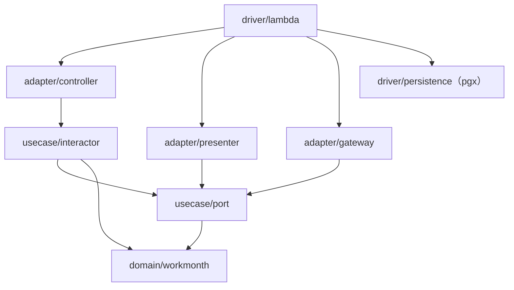

# 勤務月（WorkMonth）実装設計 — 仕様

`services/api`（Go）における **`WorkMonth` 集約と3ユースケースの実装設計**。層への型配置、集約・値オブジェクトの構成、`usecase/port` のインターフェース設計、認可を判定する層を定める。

**業務ルール（値域・丸め・未来日・締め可否・承認可否・自己承認排除・状態遷移）はこの仕様へ書き写さない。** 正解は `docs/specs/daily-record-entry.md` / `docs/specs/monthly-closing.md` / `docs/specs/approval.md` と `docs/domain/ubiquitous-language.md` にあり、本仕様はそれらを**参照するだけ**である（ADR 0004）。本仕様が決めるのは**実装設計**に限る。

HTTP の契約（パス・DTO・ステータスコード）は `docs/specs/domain-api-http-contract.md` が持つ。本仕様は両者の境界（エラーの受け渡し・ポートの形）までを定める。

- **決定者**: 実装設計の各決定は仕様工程（AI）。ただし**集約の中身・ユビキタス言語への語の追加・技術選定・業務ルールに関わる決定は人間の決定事項**であり（`docs/ai-collaboration.md` 責務分界表）、該当する行の「決定者」欄には **人間** と記す。2026-07-27・2026-07-28・2026-07-31 に上げた論点は**すべて確定済み**で、経緯と確定内容は末尾「人間が確定させた決定」に残す。**未決の論点は現在なし**
- **日付**: 2026-07-27（人間の決定事項を反映）／**2026-07-28 追記**（当該年月に属さない対象日への削除の確定を AC-2-5・AC-3-11・AC-4-2・AC-7-9 へ反映。業務ルールの実体は `daily-record-entry.md` D-9・AC-5-5）／**2026-07-30 追記**（UC2 の実装設計を AC-2-5・AC-4-3・AC-5-7〜AC-5-9・AC-7-10・AC-7-11・AC-13-12 へ追加）／**2026-07-31 追記**（決定9＝`Reconstruct` における「確定済みの超過／不足と状態の整合」を3つ目の不変条件とする確定を AC-2-5・AC-5-9・AC-11-5・AC-12-7・AC-13-13 へ反映）

---

## スコープ

- **対象**: `services/api/internal/` 配下の型配置（`domain` / `usecase/port` / `usecase/interactor` / `adapter/*` / `driver/*`）、`WorkMonth` 集約ルートと値オブジェクトの構成・不変条件の置き場所、repository / 参照 / 時計の各ポート、入出力ポートと依存性反転、認可を判定する層、エラーの定義と層間の受け渡し、テスト可能性
- **非対象**:
  - **業務ルールそのもの**（3業務仕様が持つ。本仕様は参照のみ）
  - **HTTP のパス・DTO・ステータスコード**（`domain-api-http-contract.md` が持つ）
  - **DDL の全文・マイグレーション手段・インデックス設計**（AC-10-6）。**Postgres ドライバの選定は ADR 0017（pgx）が持つ**（本仕様は層の境界＝「pgx は `driver/persistence` に閉じる」だけを写す。AC-1-6・AC-9-3・AC-10-3）
  - フロントエンド（`apps/web`）・BFF の実装（Issue #54 が `domain-api-http-contract.md` を参照して行う）
  - Terraform・Cognito のインフラ構成（ADR 0013 / 0016）

---

## 前提（P）— 確定事項（参照のみ、再定義しない）

| # | 前提 | 出典 |
|---|---|---|
| P-1 | 内部アーキテクチャはクリーンアーキテクチャ。リングは `domain`（Entities）/ `usecase` / `adapter` / `driver` で、**依存は内側にのみ向かう** | ADR 0008 |
| P-2 | `domain` は **Go 標準ライブラリのみ**に依存する。テストコードも対象で、例外は `github.com/google/go-cmp` のみ（`make check-domain-deps` が機械検査） | ADR 0007・ADR 0008・`docs/rules/development-process.md` |
| P-3 | **repository interface は `usecase/port` に置く**（`domain` に置かない）。出力側も port の interface を通じて反転させ、interactor は presenter を知らない | ADR 0008 |
| P-4 | 集約は **`WorkMonth` の1つだけ**。契約（`Contract`）は勤務月の**集約外**であり、勤務月は生成時に精算幅を値オブジェクトとして複写する | `docs/rules/scope.md`／ユビキタス言語「勤務月の同一性」「契約と精算幅の保持」 |
| P-5 | 勤務月は `契約 × 年月` で一意。状態は `Draft` / `PendingApproval` / `Approved` で、遷移は循環しない（承認済は終端） | ユビキタス言語「状態遷移」 |
| P-6 | **承認者を `WorkMonth` 集約に持ち込まない。** 承認者ロールの判定も「操作者 ≠ その勤務月の技術者本人」の判定も**集約の外（認可の関心事）**で行い、集約が守るのは状態遷移の正当性に閉じる | `approval.md` D-1・AC-4 注記 |
| P-7 | テストは標準 `testing` + go-cmp のみ。モックライブラリを使わず、テストダブルは**手書きのインメモリ Fake** | ADR 0007 |
| P-8 | 実行基盤は Lambda（Function URL・`AWS_IAM`）と Neon。ドメイン API を呼べるのは SigV4 署名できる BFF のみ | ADR 0003・0013・0014 |
| P-9 | エンドユーザー認証は **BFF で終端**する。ドメイン API は BFF が付与した操作者・ロールを受け取る（受け渡しの形は `domain-api-http-contract.md` AC-1） | ADR 0016 |
| P-10 | module は `github.com/h-k741953/effort-tracker/services/api`、Go 1.26（**本仕様の起草時点で既存の Go ファイルは `internal/domain/workmonth/doc.go` のみ**。以降の実装で増える） | `services/api/go.mod` |

---

## 決定（D）— 実装設計

| # | 論点 | 決定 | 決定者 |
|---|---|---|---|
| D-1 | 勤務月が契約について保持するもの | **`ContractID` のみ保持する。** 技術者（`Engineer`）・契約表示名は集約に持たない。契約は `usecase/port` の**参照専用リードモデル `port.Contract`** として表現し、`domain` に `contract` パッケージを新設しない（P-4 の「集約は1つ」と P-6 の「認可は集約の外」に揃える） | **人間**（2026-07-27 確定） |
| D-2 | 精算幅 | 生成時に契約から複写した `SettlementRange` を**勤務月が値オブジェクトとして保持**する（ユビキタス言語の確定事項の直接の帰結。再定義ではない） | 仕様工程 |
| D-3 | 総稼働時間・超過／不足の保持形式 | **総稼働時間は保持せず、稼働実績から都度算出する**（締め後は実績が編集不可のため値は不変）。**超過／不足は締め時に確定値として勤務月が保持**し、`Draft` では未確定として扱う（`monthly-closing.md` D-2 の実装形） | 仕様工程 |
| D-4 | 認可を判定する層 | **`usecase/interactor` で判定する。** 本人判定（UC1・UC2）・承認者ロール判定・自己承認排除（UC3）はすべて interactor が `port.Contract` の技術者識別子と操作者を突き合わせて行い、**集約（`domain`）は認可を一切知らない**（P-6） | 仕様工程 |
| D-5 | 「当日」（未来日判定の基準） | **`domain` は時計もタイムゾーンも持たない。** 「当日」は引数として集約メソッドへ渡す。**基準タイムゾーンの解決**（時刻から「当日」を決めること）は `usecase/port.Clock` の実装（`driver`）が担う。**どのタイムゾーンを基準とするかは `daily-record-entry.md` D-8 が持ち、本仕様は書き写さない**（AC-13-1） | 仕様工程 |
| D-6 | 出力側の依存性反転 | interactor は**出力ポート（interface）を呼ぶだけ**で戻り値を返さない。presenter が ViewModel を組み立て、`driver/lambda` がそれを直列化する。**presenter はリクエストごとに生成**する（状態を持つため） | 仕様工程（ADR 0008 の要求の実装形） |
| D-7 | 参照系（勤務月一覧） | **専用の参照ポート（リードモデルを返すクエリ）**を `usecase/port` に置く。集約の再構築を経由せず、契約表示名を含む行を返す（契約表示名を集約に入れないため／行ごとの契約参照＝N+1 を避けるため） | 仕様工程 |
| D-8 | UC1 の操作名 | 集約メソッド／interactor 名を **`EnterDailyRecord` / `DeleteDailyRecord`** とする。**この2語は `docs/domain/ubiquitous-language.md`「状態と操作」に追加済み**（2026-07-27）。本仕様は語を定義せず、確定した語を使うだけである | **人間**（2026-07-27 確定・用語を追加） |
| D-9 | 操作者の表現 | 3業務仕様の表にある「操作者」を `port.Actor`（識別子・ロール・認証済みか）として表す。ロール値は `Engineer` / `Approver` の**2つのまま**（ユビキタス言語の語をそのまま使う）。**ゲストは「未認証の操作者」**として表し、`Guest` というロール値を作らない | **人間**（2026-07-27 確定） |
| D-10 | 追加する依存 | `driver/lambda` に `github.com/aws/aws-lambda-go`（Function URL イベント型）、`driver/persistence` に **`github.com/jackc/pgx`（ADR 0017）**、テストに `github.com/google/go-cmp` のみ。**`domain` には何も足さない**（P-2） | 仕様工程（**ドライバ選定は人間**・ADR 0017） |
| D-11 | pgx を閉じ込める位置 | **pgx を import してよいのは `driver/persistence` だけ**とする（AC-1-6）。`adapter/gateway` は SQL 文と行 ↔ 集約の変換を持つが、**SQL の実行手段は `adapter/gateway` 側が宣言する最小のインターフェース**（`Query` / `Exec` / トランザクション相当）で受け取り、その pgx 実装を `driver/persistence` が提供して `driver/lambda` が結線する（AC-10-2）。`adapter` が `driver` を import しない（AC-1-5）ことと ADR 0017 の「pgx を `driver/persistence` に閉じる」を同時に満たすための形 | 仕様工程（ADR 0017 の帰結） |

---

## 受け入れ条件（AC）

| AC | 主題 | 主に効く工程 |
|---|---|---|
| AC-1 | パッケージ構成と依存の向き | tester・implementer・reviewer |
| AC-2 | 集約ルート `WorkMonth` が保持するもの／保持しないもの（D-1・D-3） | tester・implementer |
| AC-3 | 値オブジェクトと不変条件の置き場所 | tester・implementer |
| AC-4 | 状態と遷移メソッド（P-5・P-6） | tester・implementer |
| AC-5 | 総稼働時間の算出と超過／不足の確定（D-3） | tester・implementer |
| AC-6 | `usecase/port` — repository・参照ポート・時計（P-3・D-7） | tester・implementer |
| AC-7 | 入出力ポートと interactor（D-6） | tester・implementer |
| AC-8 | 認可を判定する層（D-4・P-6） | tester・implementer |
| AC-9 | `adapter` の責務分担（controller / presenter / gateway） | tester・implementer |
| AC-10 | `driver` の責務（lambda 配線・persistence） | implementer・reviewer |
| AC-11 | エラーの定義と層間の受け渡し | tester・implementer |
| AC-12 | テスト可能性（P-7） | tester |
| AC-13 | 限界 — 本仕様が担保しないこと | reviewer |

### AC-1. パッケージ構成と依存の向き

| # | 条件 | 期待 |
|---|---|---|
| 1-1 | ディレクトリ構成 | ADR 0008 の対応表に一致する。下記「配置」の各パッケージ以外を新設しない（**層の増減には人間の承認が要る**。`docs/rules/development-process.md`） |
| 1-2 | `internal/domain/workmonth` の import | **Go 標準ライブラリのみ**（`_test.go` は加えて go-cmp のみ）。`make check-domain-deps` が違反0で通る（P-2） |
| 1-3 | `usecase/port` の import | `domain` と Go 標準ライブラリのみ。`adapter` / `driver` を import しない |
| 1-4 | `usecase/interactor` の import | `domain` と `usecase/port` のみ。**`adapter` / `driver` を import しない**（CI は検査しない。規律で守る。ADR 0008「悪い影響」） |
| 1-5 | `adapter/*` の import | `usecase/port`・`domain`・標準ライブラリ・HTTP 関連。**`driver` を import しない** |
| 1-6 | `driver/*` | 唯一 AWS SDK / Lambda / DB ドライバを import してよい層。DI 配線もここに置く。**pgx を import してよいのは `driver/persistence` だけ**（D-11・ADR 0017） |

**配置**（ファイル名は例示。本 AC が固定するのは**パッケージと責務の対応**）:

```
services/api/internal/
├── domain/workmonth/        WorkMonth 集約ルート・値オブジェクト・状態・ドメインエラー
├── usecase/
│   ├── port/                repository / 参照 / 時計 / 入出力の各 interface と DTO・Actor・usecase エラー
│   └── interactor/          3ユースケース + 参照系の実装（認可判定を含む）
├── adapter/
│   ├── controller/          HTTP リクエスト → 入力 DTO
│   ├── presenter/           出力 DTO → ViewModel（HTTP ステータス + JSON ボディ）
│   └── gateway/             repository / 参照ポートの実装（SQL）
└── driver/
    ├── lambda/              Function URL イベント ↔ http.Request、ルーティング、DI 配線
    └── persistence/         Neon（PostgreSQL）接続
```



> 矢印は **import の向き**。`adapter/presenter` と `adapter/gateway` は `usecase/port` の interface を**実装する**ため、依存は内向きのままである（依存性反転）。
>
> **`adapter/gateway` から `driver/persistence` への矢印は無い。** gateway は SQL の実行手段を自身が宣言するインターフェースで受け取り、その pgx 実装を `driver/lambda` が注入する（D-11）。Go の interface は実装側の import を要さないため、`driver/persistence` も `adapter/gateway` を import しない。

### AC-2. 集約ルート `WorkMonth` が保持するもの／保持しないもの

| # | 項目 | 期待 |
|---|---|---|
| 2-1 | 保持する | `ContractID`（契約参照）／`YearMonth`／`SettlementRange`（生成時の複写。D-2）／状態（`State`）／稼働実績の集合（**対象日で一意**、かつ**すべての対象日が当該年月に属する**＝AC-2-6）／確定済みの超過・不足（締め後のみ。D-3） |
| 2-2 | **保持しない** | **技術者（`Engineer`）・契約表示名**（D-1。人間が確定済み。`EngineerID` のスナップショットも持たない）／**承認者・「誰が承認したか」**（`approval.md` D-1・D-2・AC-5-4）／**差戻しの理由・回数**（`approval.md` D-3・AC-6-4・AC-6-5）／**締め・承認の履歴・日時**（監査履歴は非スコープ。`monthly-closing.md` AC-8-3） |
| 2-3 | フィールドの可視性 | すべて**非公開フィールド**とし、生成・再構築・遷移メソッド以外から変更できない（不変条件を集約の内側に閉じる） |
| 2-4 | 生成 | `New(contractID, yearMonth, settlement)` で生成し、初期状態は `Draft`（`daily-record-entry.md` AC-1-3） |
| 2-5 | 永続化からの再構築 | `Reconstruct(...)` を公開し、`adapter/gateway` のみが使う。**状態遷移の検査は行わず**（保存済みの事実を復元する操作であり、遷移ではないため）、**値オブジェクトの妥当性と集約の不変条件**を検査する。不変条件は次の**3つ**で、いずれの違反も `ErrInvalidValue` で失敗させる（AC-3-11。正常な経路では作られない行に対する防御であり、利用者の要求の不正ではないため `ErrDateOutOfMonth` を使わない）。①「**対象日で一意**」（AC-2-6）／②「**すべての対象日が当該年月に属する**」（AC-2-1 の「当該年月の稼働実績だけを保持する」）／③「**確定済みの超過／不足が状態と整合する**」（AC-5-9 の対応表。**決定9**。`Draft` なのに値がある行、`PendingApproval` / `Approved` なのに値が無い行を通さない）。**確定済みの超過／不足も引数として受け取る**（AC-5-9。`Draft` は「値なし」、締め後は値あり。永続化側の表現は AC-10-5） |
| 2-6 | 稼働実績の集合（不変条件） | 対象日をキーとして**1日最大1件**（`daily-record-entry.md` D-1・AC-2-2）。かつ**すべての対象日が当該年月に属する**（同 AC-2-4・AC-5-5・D-9。入力・削除・再構築のいずれの経路でもこの条件を壊さない。AC-3-11）。参照用の取得は**対象日の昇順**で返す |

### AC-3. 値オブジェクトと不変条件の置き場所

すべて `internal/domain/workmonth` に置く。**構築時に検証し、不正な値のインスタンスを存在させない**（コンストラクタは値とエラーを返す）。

| # | 型 | 表すもの | 構築時の検証 | 業務仕様の出典 |
|---|---|---|---|---|
| 3-1 | `ContractID` | 契約の識別子 | 空文字は不可 | P-4 |
| 3-2 | `YearMonth` | 勤務月の対象年月 | 月が 1〜12 | P-5 |
| 3-3 | `Date` | 暦日 | 暦上実在する日付であること（例: 2月30日は不可） | — |
| 3-4 | `WorkingHours` | 稼働の量（1日・1ヶ月の双方に使う） | 時・分それぞれの値域を検査する。**境界の正解は出典が持つ**（本仕様は値を書かない。AC-13-1） | `daily-record-entry.md` AC-3-4・AC-3-5、ユビキタス言語「稼働時間」 |
| 3-5 | `DailyRecord` | 1日分の稼働の記録（対象日 + 稼働時間） | 1日の稼働時間の下限・上限を検査する。**境界の正解と上限を含むか否かは出典が持つ**（AC-13-1） | `daily-record-entry.md` AC-3-1〜AC-3-3・D-7 |
| 3-6 | `SettlementRange` | 精算幅（下限・上限） | 下限 ≤ 上限 | ユビキタス言語「精算」 |
| 3-7 | `State` | 勤務月の状態 | `Draft` / `PendingApproval` / `Approved` の3値のみ。**文字列表現はユビキタス言語の英語名と一致**させる | ユビキタス言語「状態と操作」 |

| # | 条件 | 期待 |
|---|---|---|
| 3-8 | 1日の稼働時間の上限の検査位置 | **`DailyRecord` の構築時**に行う。`WorkingHours` 自体は上限を持たない（同じ型を1ヶ月の量にも使い、精算幅は1日の上限より大きい値を取りうるため）。**上限の値・上限を含むか否かは `daily-record-entry.md` D-7・AC-3-2・AC-3-3 が持ち、精算幅の例示値は `monthly-closing.md` AC-4 が持つ。本仕様は値を書かない**（AC-13-1） |
| 3-9 | 丸めの置き場所と適用位置 | 丸めは `WorkingHours` のメソッドとして提供する。**日次の値に対して適用**し、合計に対しては適用しない（`daily-record-entry.md` AC-6-1）。**丸めの単位と方向はユビキタス言語「丸め規則」が持つ**（本仕様は値を書かない。AC-13-1） |
| 3-10 | 内部表現 | 稼働の量は**分の整数**で保持し、浮動小数点を使わない（丸め・比較・減算をすべて分単位で行う。`monthly-closing.md` AC-4 注記） |
| 3-11 | 「対象日が当該年月に属するか」の判定の置き場所 | **`YearMonth` の公開メソッド**として1箇所に置き、規則を複数箇所へ実装しない。利用者は集約の `EnterDailyRecord` / `DeleteDailyRecord`（AC-4-1・AC-4-2）、`Reconstruct`（AC-2-5）、**未生成の勤務月に対する削除の interactor**（AC-7-9）の4つ。返すエラーは利用者側で使い分ける: 利用者の要求に対する判定は `ErrDateOutOfMonth`（AC-11-2）、`Reconstruct` は `ErrInvalidValue`（AC-2-5）。**業務ルールの正解は `daily-record-entry.md` AC-2-4（入力）・AC-5-5／D-9（削除）が持つ** |

### AC-4. 状態と遷移メソッド

**状態遷移の正当性だけが集約の責務**である（P-6）。各メソッドは状態を検査し、不正なら遷移させずドメインエラーを返す。

| # | メソッド | 許可される状態 | 帰結 | 業務仕様の出典 |
|---|---|---|---|---|
| 4-1 | `EnterDailyRecord(record, today)` | `Draft` のみ | **対象日が当該年月に属さなければ `ErrDateOutOfMonth`**（AC-3-11）、未来日なら `ErrFutureDate`。いずれにも当たらなければ対象日のレコードを追加または上書き（同一日は編集扱い） | UC1 AC-2-3・AC-2-4・AC-4・AC-5-1〜AC-5-3 |
| 4-2 | `DeleteDailyRecord(date)` | `Draft` のみ | **対象日が当該年月に属さなければ `ErrDateOutOfMonth`**（UC1 D-9・AC-5-5。AC-3-11 の判定を使う）。属する場合は対象日のレコードを取り除き、**レコードが無い日への削除も成功として扱う**（「レコードのない日＝稼働なし」と区別しないため。UC1 D-5）。**検査順は ①状態（`Draft` か） → ②当該年月に属するか**とし、`domain-api-http-contract.md` AC-9 の順 5 →順 6 と一致させる | UC1 AC-5-4・AC-5-5・D-5・D-9 |
| 4-3 | `Close()` | `Draft` のみ | 超過／不足を算出して確定させ（AC-5-7〜AC-5-9）、`PendingApproval` へ遷移。`Draft` 以外なら**遷移も算出もせず** `ErrNotClosable`（AC-11-6。二重締め・終端。UC2 AC-1-2・AC-1-3）。**引数を取らない**（締めに月末制約が無く「当日」を要さないため。UC2 D-3・AC-1-4）。**実績0件でも締められる**（UC2 D-6・AC-7-2）。**未生成の年月には集約が存在せずこのメソッドに到達しない**（interactor が `ErrWorkMonthNotFound` を返す。AC-7-9・UC2 AC-7-4） | UC2 AC-1・AC-3・AC-5・AC-7 |
| 4-4 | `Approve()` | `PendingApproval` のみ | `Approved` へ遷移。**総稼働時間・超過／不足を再計算・変更しない** | UC3 AC-1・AC-5-1・AC-5-2 |
| 4-5 | `Reject()` | `PendingApproval` のみ | `Draft` へ遷移し、**確定済みの超過／不足を未確定へ戻す**（再締め時に改めて算出される） | UC3 AC-2・AC-6-1・AC-6-3 |
| 4-6 | 上記以外の遷移 | — | **提供しない。** 締めの取消し（`PendingApproval` → `Draft` を技術者が行う）・承認取消し（`Approved` からの遷移）に相当するメソッドを**存在させない** | UC2 D-4・AC-6／UC3 AC-7-4 |
| 4-7 | 引数 `today` | — | 未来日判定の基準日を**呼び出し側から受け取る**（D-5）。集約は `time.Now()` を呼ばない |

### AC-5. 総稼働時間の算出と超過／不足の確定

| # | 条件 | 期待 |
|---|---|---|
| 5-1 | 総稼働時間 | `TotalHours()` として**都度算出**する（D-3）。算出規則は **`daily-record-entry.md` AC-6-1（日次の値を丸めてから合計し、合計に丸めを適用しない）** に従い、本仕様で再定義しない。**丸めの単位と方向はユビキタス言語「丸め規則」が持ち、本仕様は値を書かない**（AC-3-9・AC-13-1） |
| 5-2 | `Draft` の超過／不足 | **未確定**。アクセサは「未確定である」ことを呼び出し側が判別できる形で返す（例: `(WorkingHours, bool)`）。0 と未確定を混同させない（UI は `Draft` で数値を表示しない。`work-month-screen-ui.md` AC-4-1） |
| 5-3 | 締め成立時 | その時点の `TotalHours()` と保持している `SettlementRange` から超過／不足を算出し、**勤務月が保持する**（UC2 AC-3-1・D-2）。算出規則・境界は UC2 AC-4 に従い、本仕様で再定義しない |
| 5-4 | 締め後 | 保持した超過／不足は再計算されない。承認（AC-4-4）でも変わらない（UC2 AC-3-2・AC-3-3／UC3 AC-5-2） |
| 5-5 | 差戻し後 | 未確定へ戻る（AC-4-5・UC3 AC-6-3） |
| 5-6 | 超過と不足の同時成立 | 算出は1つの関数（または1つのメソッド）で行い、**両方が同時に正になる戻り値を構造上作らない**（UC2 AC-3-4） |
| 5-7 | 超過／不足のアクセサ | `Excess() (WorkingHours, bool)` / `Shortfall() (WorkingHours, bool)` を公開する。第2戻り値は**確定済みか**を表し、**両者で常に同じ値**になる（超過と不足は締めで同時に確定するため。UC2 AC-3-1・AC-3-4）。未確定のとき第1戻り値はゼロ値とし、呼び出し側は第2戻り値でのみ判別する（AC-5-2）。名前は `docs/domain/ubiquitous-language.md`「精算」の確定済みの英語名をそのまま使い、新しい語を作らない |
| 5-8 | 算出の置き場所 | **集約の非公開メソッド1つ**に置き（AC-5-6）、呼ぶのは `Close()` だけとする（AC-4-3）。**確定させる手段を集約の外へ公開しない**（生成・入力・削除・再構築のいずれの経路でも確定させない）。算出の入力は `TotalHours()` と集約が保持する `SettlementRange` に限り、契約の現在値を参照しない（UC2 AC-3-2） |
| 5-9 | 永続化との往復 | 確定済みの超過／不足は `Reconstruct` の**末尾の引数**として `excess`・`shortfall` の順（いずれも `*WorkingHours`）で受け取る（AC-2-5）。**未確定は `nil`** とし、永続化側の NULL と1対1に対応させる（AC-10-5）。**復元時に再計算しない**（締めた時点の事実を固定する。UC2 D-2・AC-3-2）。ポインタで受け取っても集約は値として保持し、呼び出し側から書き換えられないようにする（AC-2-3）。**受け取った `excess` / `shortfall` と状態の整合を検査し、違反は `ErrInvalidValue`**（AC-2-5 の不変条件③。**決定9**）。組み合わせの網羅は下表 |

**`Reconstruct` における「確定済みの超過／不足」と状態の整合**（AC-5-9・AC-2-5 の不変条件③。決定9）。**状態は `Draft` / `PendingApproval` / `Approved` の3値がすべて**であり（AC-3-7・ユビキタス言語「状態遷移」）、差戻し（`Reject`）は状態ではなく操作で、その結果の状態は `Draft` である（AC-4-5）。したがって下表で全状態を尽くす。

| # | 状態 | 復元に成功する `(excess, shortfall)` | `ErrInvalidValue` で失敗する組み合わせ | 復元後のアクセサ（AC-5-7）の第2戻り値 |
|---|---|---|---|---|
| 5-9-a | `Draft` | `(nil, nil)` **のみ** | `(値, nil)` / `(nil, 値)` / `(値, 値)` の**3通りすべて**（`Draft` に確定値は存在しない。AC-5-2） | `false`（両アクセサとも） |
| 5-9-b | `PendingApproval` | **双方が非 nil のみ** | `(nil, nil)` / `(値, nil)` / `(nil, 値)` の**3通りすべて**（締めで超過と不足は同時に確定する。AC-5-7） | `true`（両アクセサとも） |
| 5-9-c | `Approved` | **双方が非 nil のみ**（承認は確定値を変えない。AC-4-4・AC-5-4） | 5-9-b と同じ3通り | `true`（両アクセサとも） |

> 片方だけが `nil` の行を全状態で弾くのは、**超過と不足が常に同時に確定する**という既定の性質（AC-5-6・AC-5-7）を復元経路でも崩さないためである。**値そのもの**（ゼロか正か、超過と不足が同時に正か）は本 AC の検査対象に含まない（AC-13-13）。
>
> **`Draft` で `(nil, nil)` を渡した場合に第1戻り値がゼロ値になること**は AC-5-2・AC-5-7 が既に定めており、本表はそれを再定義しない。

### AC-6. `usecase/port` — repository・参照ポート・時計

interface はすべて `usecase/port` に置く（P-3）。**`domain` に置かない。**

| # | ポート | 形 | 備考 |
|---|---|---|---|
| 6-1 | `WorkMonthRepository` | `Find(ctx, ContractID, YearMonth) (*workmonth.WorkMonth, error)` / `Save(ctx, *workmonth.WorkMonth) error` | 見つからない場合は `ErrWorkMonthNotFound`（AC-11）。`Save` は**集約単位で原子的**（勤務月と稼働実績を1トランザクションで永続化） |
| 6-2 | `ContractRepository` | `Find(ctx, ContractID) (Contract, error)` | 契約は**与件・読み取り専用**（`docs/rules/scope.md`）。作成・更新のメソッドを設けない |
| 6-3 | `Contract`（リードモデル） | 契約の識別子／**契約表示名**／**技術者識別子**／精算幅 | D-1 の帰結。`usecase/port` に置き、**`domain` に `contract` パッケージを新設しない** |
| 6-4 | `WorkMonthQuery`（参照系） | 条件（技術者識別子・状態・並び・件数・開始位置）を受け取り、**行のリードモデル**（契約識別子／契約表示名／年月／状態）と総件数を返す | D-7。一覧の並び順・ページングの要求は `work-month-listing-ui.md` AC-4 |
| 6-5 | `Clock` | `Today() workmonth.Date` | **「当日」を返す**。基準タイムゾーンは `daily-record-entry.md` D-8 が持ち、本仕様は書き写さない（AC-13-1）。実装は `driver`。interactor はこれを AC-4-7 の引数として渡す |
| 6-6 | ポートの数 | 上記4つ + 出力ポート（AC-7）に限る。**新しいポートの追加は設計変更**として扱い、本仕様を更新してから行う | ADR 0007「Fake の保守が手作業になる」 |

### AC-7. 入出力ポートと interactor

| # | 条件 | 期待 |
|---|---|---|
| 7-1 | interactor の一覧 | `EnterDailyRecord` / `DeleteDailyRecord`（UC1）、`CloseWorkMonth`（UC2）、`ApproveWorkMonth` / `RejectWorkMonth`（UC3）、`GetWorkMonth` / `ListWorkMonths`（参照系）。**1ユースケース1 interactor**とし、1つの型に複数操作を詰め込まない |
| 7-2 | 入力 | 各 interactor は `usecase/port` の**入力 DTO** を受け取る。DTO は操作者（`Actor`。D-9。ゲストは**未認証の `Actor`** として渡る）と対象（契約識別子・年月・対象日など）を含む |
| 7-3 | 出力 | interactor は**戻り値を返さない**（D-6）。成功時は出力ポートの `Present(...)`、失敗時は `PresentError(err)` を呼ぶ。**interactor は presenter の具体型を知らない**（ADR 0008） |
| 7-4 | 出力 DTO | `usecase/port` に置き、**`domain` の型をそのまま外へ出さない**（時・分は整数、状態は文字列など、表示に依らない素の値へ落とす）。JSON の形は `adapter/presenter` が決める |
| 7-5 | 出力ポートの粒度 | 「勤務月1件を返す」ものと「一覧を返す」ものの2種類。すべての更新系（UC1〜UC3）は**更新後の勤務月**を返す出力ポートを共有する（BFF が再描画に使える。`domain-api-http-contract.md` AC-4〜AC-8） |
| 7-6 | presenter の生成単位 | **リクエストごとに新しい presenter を生成**して interactor へ渡す（ViewModel という可変状態を持つため。プロセス内で共有しない） |
| 7-7 | interactor の責務順序 | ①操作者の認証済み確認 → ②対象の取得（契約・勤務月） → ③認可判定（AC-8） → ④集約の操作（AC-4。状態の検査と業務検証は集約が行う） → ⑤保存 → ⑥出力ポート。**判定順序は `domain-api-http-contract.md` AC-9 のエラー優先順位と一致させる。** 例外は**未生成の勤務月に対する削除**（AC-7-9）だけで、集約が存在しないため ④に相当する業務検証（対象日が当該年月に属するか）を interactor が `YearMonth` の判定（AC-3-11）で直接行う |
| 7-8 | 未生成の勤務月の取得 | `GetWorkMonth` は勤務月が未生成でもエラーとせず、**契約から組み立てた空の下書き相当の出力**（生成済みか否かの区別を含む）を返す。**この経路では永続化しない**（明示的な生成契機を作らない。`daily-record-entry.md` D-6・AC-1-5／`domain-api-http-contract.md` AC-2-2・D-7） |
| 7-9 | 更新系での未生成の扱い | `EnterDailyRecord` のみ暗黙生成する（UC1 AC-1-1）。`DeleteDailyRecord` は**未生成なら何もせず成功**（`domain-api-http-contract.md` AC-5-3）。ただし**対象日が当該年月に属さない場合は、勤務月の生成有無によらず `ErrDateOutOfMonth`**（UC1 D-9・AC-5-5／`domain-api-http-contract.md` AC-5-8）であり、未生成経路では集約が無いため interactor が AC-3-11 の判定を直接使う。**`CloseWorkMonth` / `ApproveWorkMonth` / `RejectWorkMonth` は `ErrWorkMonthNotFound`**（締めは生成契機ではない。`monthly-closing.md` AC-7-4・D-6 の注記／`domain-api-http-contract.md` AC-6-6） |
| 7-10 | `CloseWorkMonth`（UC2）の入力と責務順序 | 入力 DTO は `port.CloseWorkMonthInput`（**操作者・契約識別子・年月のみ**。対象日も稼働時間も持たない。締めの HTTP 要求はボディを取らない＝`domain-api-http-contract.md` AC-6-8）。順序は ①操作者の認証済み確認（未認証は `ErrUnauthenticated`。AC-8-7） → ②契約の取得（不在は `ErrContractNotFound`） → ③**勤務月の取得。未生成ならここで打ち切り `ErrWorkMonthNotFound`**（AC-7-9） → ④認可（**本人のみ。ロールは問わない**。AC-8-2） → ⑤`Close()`（状態の検査と超過／不足の確定は集約が行う。AC-4-3） → ⑥`Save` → ⑦出力ポート。**③が④より先である**のは `domain-api-http-contract.md` AC-9 の順3（対象の実在）が順4（認可）に先行するためで、**未生成かつ本人でない要求には `ErrWorkMonthNotFound` が返る**（同 AC-6-9）。**`Clock` を依存に取らない**（締めに「当日」を要さない。AC-4-3）。弾かれた要求では `Save` を呼ばない（AC-9-4） |
| 7-11 | 更新系の出力 DTO の超過／不足 | 集約のアクセサ（AC-5-7）から詰め、**未確定なら「値なし」**とする（`Draft` を返す経路＝UC1 と差戻し）。**UC1 の実装は「値なし」を固定値で埋めている**ため、UC2 の実装時に集約の値から詰める形へ改める（**テストが先**。`docs/rules/development-process.md`）。未生成の年月を返す経路（AC-7-8・AC-7-9）は常に「値なし」 |

### AC-8. 認可を判定する層

**認可はすべて `usecase/interactor` で判定する**（D-4）。集約は認可を知らない（P-6）。

| # | 操作 | 判定 | 業務仕様の出典 |
|---|---|---|---|
| 8-1 | 稼働実績の入力・編集・削除（UC1） | 操作者の識別子 = 当該勤務月の契約が指す技術者識別子（**本人のみ**）。**ロールは問わない** | `work-month-screen-ui.md` AC-3（`Draft` ④承認者かつ本人は入力・編集を提供）／UC1 P-5 |
| 8-2 | 締め（UC2） | 操作者 = 本人。**ロールは問わない**。他の技術者・承認者の代行締めは弾く | UC2 D-5・AC-2 |
| 8-3 | 承認・差戻し（UC3） | 操作者が**承認者ロール**を持つこと。かつ**操作者 ≠ 当該勤務月の技術者本人**（自己承認・自己差戻しの排除） | UC3 D-1・D-4・AC-3・AC-4 |
| 8-4 | 自己承認排除の維持 | ロール切替（ADR 0016 のデモ用切替）によらず維持する。`Approver` へ切り替えても本人の勤務月は承認・差戻しできない | UC3 D-4／ADR 0016／`login-ui.md` AC-6-4 |
| 8-5 | 承認者の一意性 | 承認者が誰であるかを勤務月に記録しない。**1人の承認で `Approved` に至る** | UC3 D-2・AC-3-3・AC-5-4 |
| 8-6 | 「本人」の判定材料の取得元 | `ContractRepository`（AC-6-2）が返す `Contract` の技術者識別子。**集約からは取れない**（D-1・AC-2-2） | D-1 |
| 8-7 | 未認証（ゲスト）の更新操作 | すべて弾く（`ErrUnauthenticated`）。ゲストは `port.Actor` の**未認証**として表れる（D-9）。ロール値 `Guest` は存在しない | ADR 0016／`work-month-screen-ui.md` AC-3 ゲスト行 |
| 8-8 | 参照系の認可 — 勤務月の取得（`GetWorkMonth`） | **操作者で絞らない。** 未認証（ゲスト）でも成功する。ロールも問わない（ゲスト＝閲覧のみというデモ公開の前提。`docs/rules/scope.md`・ADR 0016） | **人間**（2026-07-27 確定）／`domain-api-http-contract.md` AC-2-5 |
| 8-9 | 参照系の認可 — 本人の勤務月一覧（`ListWorkMonths` で技術者識別子を指定） | **操作者で絞らない。** 指定された技術者識別子で絞り込むだけで、「操作者 = その技術者」を要求しない。未認証でも成功する | **人間**（2026-07-27 確定）／`domain-api-http-contract.md` AC-3-1 |
| 8-10 | 参照系の認可 — 承認待ち一覧（`ListWorkMonths` で技術者識別子を省略） | **`Approver` ロールを要求する**（唯一ロールを要求する参照系）。未認証なら `ErrUnauthenticated`、認証済みでロールが違えば `ErrNotApprover` | **人間**（2026-07-27 確定）／`domain-api-http-contract.md` AC-3-2・AC-9 |

### AC-9. `adapter` の責務分担

| # | パッケージ | 責務 | やらないこと |
|---|---|---|---|
| 9-1 | `controller` | HTTP リクエスト（パス・クエリ・ヘッダ・ボディ）を**入力 DTO へ変換**し、interactor を呼ぶ。構文・型・書式の検査（`YYYY-MM` 等）まで | **業務ルールの判定をしない**（値域・未来日・状態・認可はいずれも内側の層） |
| 9-2 | `presenter` | 出力ポートを実装し、出力 DTO → **ViewModel（HTTP ステータス + JSON ボディ）**へ変換。エラー → ステータス・エラーコードの対応（`domain-api-http-contract.md` AC-9）を持つ | 集約・repository を触らない |
| 9-3 | `gateway` | `WorkMonthRepository` / `ContractRepository` / `WorkMonthQuery` を実装。SQL と行 ↔ 集約（`Reconstruct`。AC-2-5）の変換。**SQL の実行手段は自身が宣言する最小のインターフェース越しに受け取る**（D-11） | 業務ルールを持たない。SQL 側で丸め・超過計算をしない（`domain` の責務）。**pgx を直接 import しない**（D-11・AC-1-5） |
| 9-4 | ViewModel | JSON のフィールド名・型は `domain-api-http-contract.md` AC-10 に従う。**契約の唯一の実体はそちら**であり、本仕様で再定義しない | — |

### AC-10. `driver` の責務

| # | 条件 | 期待 |
|---|---|---|
| 10-1 | `driver/lambda` | Function URL のイベントを `*http.Request` 相当へ変換し、**標準 `net/http` のルーティング**（メソッド + パスパターン）で `controller` へ振り分け、ViewModel を JSON として返す |
| 10-2 | DI 配線 | ここでのみ具体型を結線する（gateway・presenter・Clock・interactor）。**リクエストごとに presenter を生成**する（AC-7-6）。DB 接続はコールドスタート時に1度だけ確立し再利用する（予約同時実行数5。`docs/rules/cost-guardrails.md`） |
| 10-3 | `driver/persistence` | Neon（PostgreSQL）への接続。**ドライバは pgx（ADR 0017）で、pgx を import してよいのはこのパッケージだけ**（D-11）。接続情報は環境変数から取得し、**コード・docs に実値を書かない**（`docs/rules/security.md`） |
| 10-4 | 時計の実装 | `port.Clock` を実装し、**「当日」**を返す（AC-6-5）。基準タイムゾーンは `daily-record-entry.md` D-8 が持ち、本仕様は書き写さない（AC-13-1）。**タイムゾーンの解決を担うのはこの層だけ**であり、`domain` / `usecase` / `adapter` は基準タイムゾーンを知らない |
| 10-5 | テーブルの粒度（骨子のみ） | 契約（与件・seed）／勤務月（`契約 × 年月` が主キー、状態・精算幅・確定済みの超過／不足）／稼働実績（`契約 × 年月 × 対象日` が主キー、稼働の量）。**超過／不足は未確定を NULL で表す**（AC-5-2） |
| 10-6 | DDL・マイグレーション | **本仕様は列の意味の骨子までを定め、DDL 全文・マイグレーション手段・インデックス設計を固定しない**（実装 PR が決める。Issue #51 の完了条件は実装設計と HTTP 契約が残っていること）。**ドライバは ADR 0017 で pgx に確定済み**であり、ここでの未固定に含まれない |
| 10-7 | 集約の保存 | `Save` は勤務月と稼働実績を**1トランザクション**で書き込む（AC-6-1）。集約をまたぐトランザクションを作らない |

### AC-11. エラーの定義と層間の受け渡し

| # | 層 | エラー | 意味 |
|---|---|---|---|
| 11-1 | `domain/workmonth` | `ErrNotEditable` | `Draft` 以外での稼働実績の入力・編集・削除（UC1 AC-5-2・AC-5-3） |
| 11-2 | `domain/workmonth` | `ErrDateOutOfMonth` | 対象日が当該勤務月の年月に属さない。**入力・編集（UC1 AC-2-4）と削除（UC1 AC-5-5・D-9）の双方**で返す。`Reconstruct` の同種の違反は `ErrInvalidValue`（AC-2-5・AC-3-11） |
| 11-3 | `domain/workmonth` | `ErrFutureDate` | 対象日が「当日」より後（UC1 AC-4-3） |
| 11-4 | `domain/workmonth` | `ErrWorkingHoursOutOfRange` | 稼働時間が値域外（UC1 AC-3-3〜AC-3-5） |
| 11-5 | `domain/workmonth` | `ErrInvalidValue` | 値オブジェクトの構築失敗（暦上存在しない日付・月が範囲外・下限 > 上限 等）。**加えて `Reconstruct` における集約の不変条件違反**（対象日の重複・当該年月外の対象日・**確定済みの超過／不足と状態の不整合**）。AC-2-5・AC-5-9。**`Reconstruct` 由来のこのエラーは 400 として外へ出さない**（利用者の要求ではなく永続化行の破損であるため。`domain-api-http-contract.md` のエラー表の `INTERNAL_ERROR` に含まれる。AC-11-10・AC-11-11。決定9） |
| 11-6 | `domain/workmonth` | `ErrNotClosable` / `ErrNotApprovable` / `ErrNotRejectable` | 状態が締め／承認／差戻しを許さない（UC2 AC-1-2・AC-1-3／UC3 AC-1-2・AC-1-3・AC-2-2・AC-2-3） |
| 11-7 | `usecase/port` | `ErrWorkMonthNotFound` / `ErrContractNotFound` | 対象が存在しない |
| 11-8 | `usecase/port` | `ErrUnauthenticated` / `ErrNotOwner` / `ErrNotApprover` / `ErrSelfApproval` | 認可の失敗（AC-8）。**`domain` に置かない**（P-6） |
| 11-9 | 受け渡し | 各エラーは**番兵値（sentinel）として公開**し、`errors.Is` で判別できること。ラップする場合も `errors.Is` が通ること | — |
| 11-10 | HTTP への対応 | エラー → ステータス・エラーコードの対応表は `domain-api-http-contract.md` AC-9 が唯一の実体。`adapter/presenter` がその表を実装する。**内部エラーの文言をそのまま外へ出さない** | — |
| 11-11 | 想定外のエラー | 上記のいずれにも該当しないエラーは 500 として扱い、詳細を応答に含めない（`domain-api-http-contract.md` AC-9） | — |

### AC-12. テスト可能性

| # | 条件 | 期待 |
|---|---|---|
| 12-1 | `domain` のテスト | 標準 `testing` + go-cmp のみ。テーブル駆動。**集約のテストに DB・HTTP・時計を要さない**（AC-4-7 により「当日」は引数） |
| 12-2 | テストダブル | `port` の各 interface に対する**手書きのインメモリ Fake**（ADR 0007）。モックライブラリを入れない |
| 12-3 | 出力ポートのテストダブル | 受け取った出力・エラーを記録するだけの手書き実装（spy）。interactor のテストはこれを検査する（interactor が戻り値を返さないため。D-6） |
| 12-4 | 値オブジェクトの比較 | 非公開フィールドを持つため、go-cmp では比較用の公開アクセサ、または `cmp.AllowUnexported` を用いる。**`reflect.DeepEqual` を使わない**（差分が読めない。ADR 0007） |
| 12-5 | `adapter/controller` のテスト | `net/http/httptest` で HTTP レイヤ単体を検査できること（Lambda を起動しない） |
| 12-6 | 永続化のテスト | **本仕様では要求しない**（実 DB を要するテストの扱いは ADR 0007 が未決としている。AC-13-4）。**pgx をテストの依存に持ち込まない**（テストで許される非標準ライブラリは go-cmp のみ。ADR 0007・ADR 0017） |
| 12-7 | Fake が集約を複製する経路 | `WorkMonthRepository` の Fake は `Reconstruct` で複製を返す（保存済みの状態が `Save` を経ずに変わらないことを実装と同じ性質で再現するため）。**確定済みの超過／不足も複製へ引き継ぐ**（AC-5-9）。引き継がないと締め済・承認済の勤務月が未確定として復元され、テストが実装より弱くなる。**決定9 以降、引き継がない Fake は復元そのものが `ErrInvalidValue` で失敗する**（AC-5-9-b・AC-5-9-c）ため、`Reconstruct` の戻り値のエラーを握り潰さない |

### AC-13. 限界 — 本仕様が担保しないこと

**以下は仕様どおりであり、欠陥ではない。**

| # | 内容 |
|---|---|
| 13-1 | **業務ルールを本仕様は持たない。** 値域・丸め・未来日・締め可否・承認可否・自己承認排除・状態遷移の正解は3業務仕様とユビキタス言語にある。本仕様の AC は「どこに置くか」だけを固定する。 **言及の許容範囲（判定基準）**: **規則を同定するための言及は許すが、境界値と単位は書かない。** 「どの規則の話をしているか」が分かる語（例:「1日の稼働時間の上限」「日次の丸め」「当日の基準タイムゾーン」「精算幅の下限・上限」）は残してよい。一方、その**値**（数値・単位・タイムゾーン名・時間量の例示）は書かず、出典（`daily-record-entry.md` / `monthly-closing.md` / `approval.md` の該当 D・AC 番号、またはユビキタス言語の該当節）を参照させる。**この基準に反する記述を見つけたら、値を削って出典参照へ置き換える**（レビューの指摘対象。機械検査はしない＝AC-13-11） |
| 13-2 | **CI が検査するのは `domain` の依存だけ**である（AC-1-2）。`usecase → adapter`・`adapter → driver` の逆流（AC-1-4・AC-1-5）と、**「pgx は `driver/persistence` にしか現れない」（D-11）も機械検査されない**。`make check-domain-deps` が保証するのは `domain` の側だけであり、それ以外はレビューと規律で守る（ADR 0008「悪い影響」・ADR 0017） |
| 13-3 | **DDL 全文・マイグレーション・インデックス設計を固定しない**（AC-10-6）。ドライバは pgx に確定済み（ADR 0017）だが、`database/sql` 経由で使うか pgx のネイティブ API を使うかは実装 PR の判断に委ねる |
| 13-4 | **永続化（gateway / persistence）のテスト方針を決めない。** 実 DB を使うテストは ADR 0007 が未決とした領域であり、本仕様では扱わない |
| 13-5 | **同時実行制御（楽観ロック等）を持たない。** 競合は「状態を検査してから遷移する」ことで弾かれ、古い操作は状態不一致のエラーになる（`work-month-screen-ui.md` AC-6-4 の要求はこれで満たす）。版番号による排他は導入しない |
| 13-6 | **監査・履歴・通知の仕組みを持たない**（UC2 AC-8-3／UC3 D-5・AC-9-2・AC-9-4） |
| 13-7 | **契約の CRUD・技術者やロールの管理を持たない**（`docs/rules/scope.md`／UC3 AC-9-5）。契約は読み取り専用の与件（AC-6-2） |
| 13-8 | 本仕様は実装設計のみを定め、HTTP の契約は `domain-api-http-contract.md`、画面の受け入れ条件は各 UI 仕様が持つ |
| 13-9 | **契約期間と対象年月の整合を検査しない**（人間が 2026-07-27 に確定）。契約の「期間」は業務仕様・ユビキタス言語のいずれにも定義が無く、検査を入れることは**新しい業務ルールを追加する**ことに等しいため行わない。**帰結**: 契約が実在すれば、その契約が実際には存在しなかった年月に対しても勤務月を生成・入力・締め・承認できる。これを弾きたくなった時点で、まず `docs/domain/ubiquitous-language.md` と業務仕様に「期間」を定義する（人間の決定領域） |
| 13-10 | **参照系を操作者で絞らないこと自体は仕様である**（AC-8-8・AC-8-9。人間が 2026-07-27 に確定）。他人の勤務月を BFF が取得できる点は API では防がない。防御は「BFF しか到達できない」（P-8）と BFF 側の導線に依存する（`domain-api-http-contract.md` AC-11-3） |
| 13-11 | **AC-13-1 の「言及の許容範囲」は機械検査しない。** 本仕様に業務ルールの境界値・単位が紛れ込んでいないことを検査する仕組みは無く、担保はレビューと、この基準を読むエージェントの遵守に留まる（`docs/rules/notation.md`「機械検査の限界」と同じ位置づけ） |
| 13-12 | **「メソッド・エンドポイントを存在させない」ことをテストで Red にできない**（AC-4-6）。締めの取消し・承認取消しに相当する集約メソッドが無いこと（UC2 D-4・AC-6-1・AC-6-2／UC3 AC-7-4）は、**存在しない識別子を呼ぶテストがコンパイルできない**ため検証できない。担保はレビューと、HTTP 側の「未定義のパス・メソッド → 404」（`domain-api-http-contract.md` AC-1-11・AC-6-7）に留まる |
| 13-13 | **決定9 の検査は「値の有無」と状態の整合に限る。** `Reconstruct` は、確定済みとして受け取った超過／不足の**値そのもの**（両方が正である行、総稼働時間・精算幅と合わない値）を検査しない。復元時に再計算しないという決定（AC-5-9・UC2 D-2）と表裏であり、値の正しさは締めた時点の算出（AC-5-8）と永続化の一貫性に依存する。これを検査したくなった場合は**集約が守る範囲を広げる変更**にあたり、決定9 と同じく人間の決定領域である（Q-1 の起票理由と同じ） |

---

## 人間が確定させた決定

**`docs/ai-collaboration.md` の責務分界表で人間の決定領域**（集約の切り方・ユビキタス言語の用語・技術選定・業務ルール）に触れる論点は、**2026-07-27・2026-07-28・2026-07-31 に人間が明示選択して確定した**（Issue #51）。確定内容は上表の D と各 AC に反映済みであり、下表は「何を選び、何を退けたか」を残すためのものである（Issue コメントに書き写さない。ADR 0004）。**未決の論点は現在なし**（次節）。

| # | 論点 | 確定した決定 | 退けた案 | 反映先 |
|---|---|---|---|---|
| 1 | 勤務月が技術者（`Engineer`）を保持するか | **保持しない。** `ContractID` のみ持ち、技術者・契約表示名は `port.Contract` から得る。集約は `WorkMonth` の1つのまま | (a) `EngineerID` を生成時スナップショットとして持つ (b) `domain` に `contract` パッケージを新設する | D-1・AC-2-2・AC-6-3・AC-8-6 |
| 2 | UC1 の操作名（ユビキタス言語に無かった） | **`EnterDailyRecord` / `DeleteDailyRecord`。** 用語の追加も承認され、`docs/domain/ubiquitous-language.md`「状態と操作」へ追記済み | (a) `RecordDaily` / `RemoveDailyRecord` (b) 名前を決めずに実装へ進む | D-8・AC-4-1・AC-4-2・AC-7-1／ユビキタス言語 |
| 3 | 「操作者」の表現とゲストの表し方 | **`port.Actor`（識別子・ロール・認証済みか）。** ロールは `Engineer` / `Approver` の2つのまま、**ゲストは未認証の操作者**として表す | (a) ロール値に `Guest` を追加する（ユビキタス言語への語の追加になる） (b) 別名（`Operator` 等）にする | D-9・AC-7-2・AC-8-7／`domain-api-http-contract.md` AC-1 |
| 4 | 参照系の認可 | **勤務月の取得・本人一覧は操作者で絞らない。承認待ち一覧のみ `Approver` を要求する。** ゲスト＝閲覧のみ（`docs/rules/scope.md`）とデモ公開の前提に沿う | (a) 取得も「本人 or 承認者」に限る (b) API 側で一切判定せず承認待ち一覧のロール要求も外す | AC-8-8〜AC-8-10・AC-13-10／`domain-api-http-contract.md` AC-2-5・AC-3-2 |
| 5 | Postgres ドライバの選定 | **pgx（`github.com/jackc/pgx`）を採用**し、`driver/persistence` に閉じる。技術選定のため **ADR 0017** を起票した | (a) `database/sql` + `lib/pq` (b) ORM / コード生成（ADR 0017 の代替案表を見る） | D-10・D-11・AC-10-3・AC-13-3／**ADR 0017** |
| 6 | 契約期間と対象年月の整合検査 | **行わない。** 契約の「期間」は業務仕様にもユビキタス言語にも定義が無く、検査は新しい業務ルールの追加に等しいため | (a) 契約に期間を持たせ期間外の年月を弾く（先に業務仕様・ユビキタス言語の追記が要る） | AC-13-9／`domain-api-http-contract.md` AC-11-5 |
| 7 | 未生成の年月を締められるか（HTTP 契約側の論点） | **締められない**（`ErrWorkMonthNotFound` → 404）。`monthly-closing.md` D-6 の「空の勤務月」は**生成済みで実績0件の勤務月**を指すと確定した | (a) 締めを生成契機として認める (b) 締め前に必ず1件の入力を要求する運用にする | AC-4-3・AC-7-9／`monthly-closing.md` D-6 の注記・AC-7-4／`domain-api-http-contract.md` AC-6-6 |
| 8 | **当該年月に属さない対象日への削除**（業務ルール。**2026-07-28 確定**）。入力側は `daily-record-entry.md` AC-2-4 が弾くと定めていたが削除側の規則が無く、`Reconstruct` の検査の非対称性（当該年月に属さない行をそのまま復元する）とあわせて未決だった | **弾く**（`ErrDateOutOfMonth` → 400 `DATE_OUT_OF_WORK_MONTH`）。**それ以前の実装の 200 no-op から変更する。** 集約の不変条件（勤務月は当該年月の実績のみ保持。AC-2-1・AC-2-6）と一致し、`Reconstruct` が同じ日付を弾くこと（AC-2-5）とも整合する。200 だとクライアントのバグが黙って隠れる | (a) 200 no-op のまま（`daily-record-entry.md` D-5「レコードのない日への削除は成功」の延長として扱う） (b) 404 を返す（対象日を独立したリソースとみなす） | **`daily-record-entry.md` D-9・AC-5-5**（業務ルールの実体）／AC-2-1・AC-2-5・AC-2-6・AC-3-11・AC-4-1・AC-4-2・AC-7-7・AC-7-9・AC-11-2／`domain-api-http-contract.md` D-13・AC-5-8・AC-5-9・AC-9 |
| 9 | **`Reconstruct` が受け取る「確定済みの超過／不足」と状態の整合を、集約の不変条件として検査するか**（**2026-07-31 確定**。2026-07-30 に UC2 の実装設計から Q-1 として上げていた）。AC-2-5 が不変条件を**2つ**と数え上げていたため、3つ目を足すことは**集約が守る範囲を広げる**変更にあたり、人間の決定領域だった | **検査する。** 3つ目の不変条件とし、`Draft` なのに値がある行、`PendingApproval` / `Approved` なのに値が無い行を**復元時に弾く**。違反は **`ErrInvalidValue`**（`ErrDateOutOfMonth` ではない＝**永続化の破損を 400 として外へ出さない**。既存の `Reconstruct` の年月検査が `ErrInvalidValue` を使うのと揃う）。決定8 と同じ思想＝**壊れた行を黙って通さない** | (a) 検査しない。受け取った値をそのまま復元し、整合は永続化側（AC-10-5 の NULL 可否）と gateway に委ねる（AC-2-5 の「不変条件は2つ」を維持する）。下記の注記の「再計算する」案は、そもそも選択肢に含めなかった | AC-2-5・AC-5-9（対応表 5-9-a〜5-9-c）・AC-11-5・AC-12-7・AC-13-13。**HTTP の表現は変わらない**（正常な経路では作られない行のみが対象） |

> **決定9 で退けるべき案として記録し続ける**: 「`Reconstruct` は超過／不足を引数に取らず、締め済・承認済なら復元時に総稼働時間と精算幅から再計算する」。締めた時点の事実を固定するという業務決定（`monthly-closing.md` D-2・AC-3-2）を壊し、精算幅の変更が過去の勤務月へ遡及しうるため、**選択肢に含めない**。
>
> **HTTP 契約側の論点も確定済み**（`domain-api-http-contract.md`「人間が確定させた決定」。1〜3 は 2026-07-27、4 は 2026-07-28）。**本ファイル・HTTP 契約のいずれにも未決は無い**（決定9 は集約の復元＝実装設計に閉じ、HTTP の表現を変えない）。
>
> **実装工程への申し送り（決定8）**: `services/api/internal/domain/workmonth/workmonth.go` の `Reconstruct` のコメントは「当該年月に属さない対象日の扱いは**未決**」と記し、200 no-op を現在の事実として残しているが、**決定8 でこの未決は解消した**。実装工程は当該コメントを AC-2-5 の内容へ改め、`DeleteDailyRecord` の振る舞いを AC-4-2 へ、未生成経路を AC-7-9 へ揃える（**テストが先。`docs/rules/development-process.md`**）。
>
> **実装工程への申し送り（決定9）**: `Reconstruct` の検査を AC-5-9 の対応表どおりに増やす。`Reconstruct` のコメントに「超過／不足と状態の整合は**未決**」と記した箇所が残っていれば、AC-5-9 の内容へ改める。あわせて `WorkMonthRepository` の Fake（AC-12-7）が確定済みの超過／不足を複製へ引き継いでいるかを確認する（引き継いでいなければ締め済・承認済の復元が `ErrInvalidValue` で失敗するようになる）。**テストが先**（`docs/rules/development-process.md`）。

---

## 人間の決定を待っている論点

**現在なし。** 2026-07-30 に上げていた Q-1（`Reconstruct` が受け取る確定済みの超過／不足と状態の整合を検査するか）は **2026-07-31 に人間が明示選択して確定し、上表「人間が確定させた決定」の決定9 へ移した**。

新たに人間の決定領域（ドメイン境界・集約の切り方・ユビキタス言語の用語・業務ルール・技術選定）に触れる論点が見つかったら、**推測で埋めず**（`docs/ai-collaboration.md`「AIの停止条件」）本節へ起票し、確定後に上表へ移して該当 AC を更新する。
