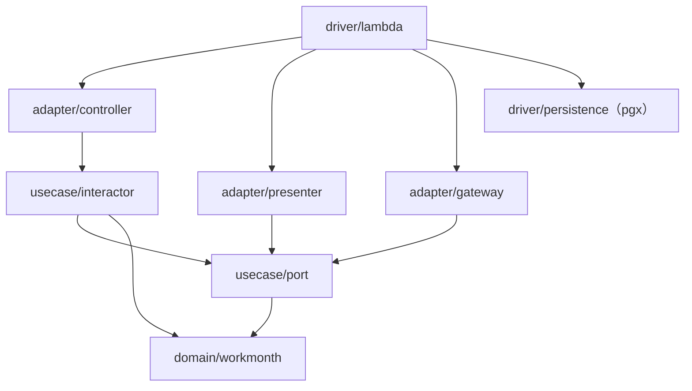

# 勤務月（WorkMonth）実装設計 — 仕様

`services/api`（Go）における **`WorkMonth` 集約と3ユースケースの実装設計**。層への型配置、集約・値オブジェクトの構成、`usecase/port` のインターフェース設計、認可を判定する層を定める。

**業務ルール（値域・丸め・未来日・締め可否・承認可否・自己承認排除・状態遷移）はこの仕様へ書き写さない。** 正解は `docs/specs/daily-record-entry.md` / `docs/specs/monthly-closing.md` / `docs/specs/approval.md` と `docs/domain/ubiquitous-language.md` にあり、本仕様はそれらを**参照するだけ**である（ADR 0004）。本仕様が決めるのは**実装設計**に限る。

HTTP の契約（パス・DTO・ステータスコード）は `docs/specs/domain-api-http-contract.md` が持つ。本仕様は両者の境界（エラーの受け渡し・ポートの形）までを定める。

- **決定者**: 実装設計の各決定は仕様工程（AI）。ただし**集約の中身・ユビキタス言語への語の追加・技術選定・業務ルールに関わる決定は人間の決定事項**であり（`docs/ai-collaboration.md` 責務分界表）、該当する行の「決定者」欄には **人間** と記す。2026-07-27・2026-07-28・2026-07-31・**2026-08-05** に上げた論点は**すべて確定済み**で、経緯と確定内容は末尾「人間が確定させた決定」に残す。**2026-08-10 に Q-5（`driver/persistence` が `adapter/gateway` を import するか）を起票しており、これが現在唯一の未決である**（末尾「人間の決定を待っている論点」。**推測で埋めた箇所は無い**）
- **日付**: 2026-07-27（人間の決定事項を反映）／**2026-07-28 追記**（当該年月に属さない対象日への削除の確定を AC-2-5・AC-3-11・AC-4-2・AC-7-9 へ反映。業務ルールの実体は `daily-record-entry.md` D-9・AC-5-5）／**2026-07-30 追記**（UC2 の実装設計を AC-2-5・AC-4-3・AC-5-7〜AC-5-9・AC-7-10・AC-7-11・AC-13-12 へ追加）／**2026-07-31 追記**（決定9＝`Reconstruct` における「確定済みの超過／不足と状態の整合」を3つ目の不変条件とする確定を AC-2-5・AC-5-9・AC-11-5・AC-12-7・AC-13-13 へ反映）／**2026-07-31 追記（UC3）**（承認・差戻しの実装設計を AC-4-4・AC-4-5・AC-5-10・AC-7-12〜AC-7-14・AC-8-11・AC-11-12・AC-12-8・AC-13-14・AC-13-15 へ追加。**新しい業務ルールを決めていない**。承認・差戻しの可否と自己承認の排除は `approval.md` が、HTTP の表現と判定順序は `domain-api-http-contract.md` AC-7・AC-8・AC-9 が既に持つ）／**2026-08-04 追記**（UC3 のレビュー往復2 で挙がった Critical への対応として **AC-12-8** を更新。判定順序の固定を求める組へ**3組目＝自己承認 × 状態が不成立**を追加し、④（認可）が⑤（集約の遷移メソッド）より先であることを自己承認の枝でも観測させる。**テスト方針の更新に閉じ、新しい業務ルールを決めていない**）／**2026-08-05 追記（adapter 層）**（`controller` / `presenter` / `gateway` の実装設計を **AC-9-5〜AC-9-19・AC-11-13・AC-12-9〜AC-12-11・AC-13-16〜AC-13-19** へ追加。**新しい業務ルールを決めていない**。エンドポイント・DTO・ステータス・`code`・判定順序の実体は `domain-api-http-contract.md` が持ち、本追記は AC 番号で参照するだけである。あわせて既存 AC と契約から**一意に読み取れなかった3件を Q-2〜Q-4 として起票**した）／**2026-08-05 追記（Q-2〜Q-4 の確定）**（起票した3件を人間が明示選択で確定。**Q-2**＝controller が契約 AC-9 の順1（認証）を再現する／**Q-3**＝`adapter/controller` が必要な最小の interface を自ら宣言する／**Q-4**＝`Query` / `Exec` / `Begin` の3メソッドを gateway が宣言する。**AC-9-6 の注記・AC-9-7-a・AC-9-8-a・AC-9-8-c・AC-9-14-e・AC-12-9・AC-12-11・AC-13-17** へ反映済みで、経緯と退けた案は末尾「人間が確定させた決定」の**決定10〜決定12**に残す。**新しい業務ルールを決めていない**。`domain-api-http-contract.md` は変更しておらず、ポートの数を定める **AC-6-6 も変更していない**）／**2026-08-05 追記（決定13）**（adapter 層のレビュー往復1 で指摘された **`adapter/presenter` → `adapter/controller` の横 import** の解消を人間が明示選択で確定。**要求の構文・型・書式の不正を表す番兵を `usecase/port` へ移し**、controller / presenter の双方が `port` 経由で参照する。**AC-9-9-a・AC-9-9-c・AC-9-9-d・AC-11-8・AC-11-13・AC-12-10・AC-13-17** へ反映し、経緯と退けた案は末尾「人間が確定させた決定」の**決定13**に残す。**写像そのものは変えていない**（要求側の識別子 → `INVALID_REQUEST`）。**新しい業務ルールを決めていない**。**`domain-api-http-contract.md`・AC-1-1・AC-1-5・AC-6-6 のいずれも変更していない**）／**2026-08-06 追記（参照系）**（未実装だった参照系（`WorkMonthQuery`・`GetWorkMonth` / `ListWorkMonths` の interactor・参照クエリの gateway・一覧の presenter）を**テストに落とせる粒度**へ具体化し、**AC-6-7・AC-7-15〜AC-7-17・AC-9-11-f・AC-9-13-d・AC-9-18-g・AC-9-18-h・AC-12-12〜AC-12-14・AC-13-20・AC-13-21** を追加した。**新しい業務ルールを決めていない**: ゲストの可否（AC-8-8〜AC-8-10）・並び順とページング（契約 AC-3-4・AC-3-5）・総件数の意味（絞り込み後＝契約 AC-3-5）・他人の勤務月の取得（絞らない＝AC-8-8・AC-13-10）・行の項目（契約 AC-3-9・AC-10-2）はいずれも既に確定しており、本追記は AC 番号で参照するだけである。**`domain-api-http-contract.md` は変更していない**（#54 が消費する唯一の実体を動かさない）。**AC-1-1（パッケージ構成）・AC-6-6（ポートは4つ + 出力ポート）も変更していない**）／**2026-08-10 追記（driver の結線）**（`driver/lambda` のルーティングと DI 配線を、**「テストを要求しない」から「検査対象」へ移した**。**AC-10-8・AC-10-9・AC-12-15 を追加**し、**AC-13-19 を置換**した（「検査するテストを本仕様は要求しない」→「**AC-12-15 が検査する。その射程の外に何が残るか**」）。あわせて **AC-9-13-c・AC-10-1・AC-10-2 に参照を足し**、AC の一覧表で **AC-10 に効く工程へ tester を加えた**。**テスト方針の変更にあたるため人間が明示選択して確定**（AC-13-19 を置換し、結線を検査する AC を新たに起こす）。**新しい業務ルールを決めていない**: パスとメソッドの実体は契約 **E-1〜E-7**、未定義のパス・メソッドの扱いは契約 **AC-1-11・AC-6-7**、操作者ヘッダ不在の扱いは契約 **AC-1-6** と AC-9-7-a、「当日」の基準タイムゾーンは `daily-record-entry.md` D-8 が持ち、本追記は **AC 番号・E 番号で参照するだけ**である（値・単位・タイムゾーン名を書いていない＝AC-13-1）。**`domain-api-http-contract.md` は変更していない**（#54 が消費する唯一の実体を動かさない）。**AC-1-1（パッケージ構成。実行可能なエントリポイント＝`package main` を新設せず、射程は `internal/driver/lambda` のハンドラ組み立てまで）・AC-6-6（ポートは4つ + 出力ポート）も変更していない**）／**2026-08-10 追記（非正規化パスの限界）**（標準 `net/http` の `ServeMux`（AC-10-1）の path cleaning により、**パスが正規化されていない要求への応答が契約 AC-9-1 の形にならない**ことを「射程の限界」として **AC-13-22 に追加**し、**AC-12-15 ② に「本 AC の対象外」である旨の参照を足した**。**人間が明示選択して据え置きを確定**（**契約を変えず、実装でも埋めず、限界として記録する**）。**新しい業務ルールを決めていない**: 本追記は振る舞いを定める AC ではなく**担保しないことの記録**であり、未定義のパス・メソッドの扱いの実体は契約 **AC-1-11・AC-6-7**、エラー本体の形は契約 **AC-9-1** が持ち、**AC 番号で参照するだけ**である。**`domain-api-http-contract.md` は変更していない**（#54 が消費する唯一の実体を動かさない。リダイレクトの扱いを契約が定めていないこと自体も変えていない）。**AC-10-1・AC-10-8 の実装設計と AC-12-15 が検査する4つ（①〜④）も変更していない**）／**2026-08-10 追記（driver/persistence）**（**受け入れ条件が1件も存在しなかった `driver/persistence`（Neon 接続・pgx）を、テストに落とせる粒度へ起こした**。**AC-10-10〜AC-10-14・AC-12-16・AC-13-23 を追加**し、**AC-12-6 に AC-12-16 への参照を足した**。**着手そのものを人間が明示選択して承認**（AC-12-6 の「本仕様では要求しない」のうち**実 DB を要さない範囲だけ**を要求へ移す。**実 DB を要するテストの方針は AC-12-6・AC-13-4 のまま決めない**）。**新しい業務ルールを決めていない**: 本追記が定めるのは、pgx を閉じ込める位置（D-11・AC-1-6・ADR 0017）・SQL 実行インターフェースの形（AC-9-14-e＝**決定12**）・接続の確立の分界（AC-10-9）という**既存の決定を `driver/persistence` の側から言い換えたもの**に限る。**テーブル定義・カラム名・SQL の意味論は本追記に書いていない**（`driver/persistence` は SQL 文を持たない＝AC-9-14-c。実体は `adapter/gateway` にある）。**`domain-api-http-contract.md` は変更していない**（#54 が消費する唯一の実体を動かさない）。**`docs/adr/0017` も変更していない**（ADR 0001 運用ルール3。読むだけ）。**AC-1-1（パッケージ構成）も変更していない**（`driver/persistence` の配置は起草時から「配置」に載っており、追記を要さなかった。**新しいパッケージも増やしていない**）。**ただし、AC-1-1 の注記（「`driver/persistence` も `adapter/gateway` を import しない」）と決定12 が確定した形（`Query` が `gateway.Rows` を返すため、実装側が当該型を名指す必要がある）が両立しないことが判明したため、埋めずに Q-5 として起票した**（末尾「人間の決定を待っている論点」。**AC-10-14 と AC-12-16 ② はこの確定を待つ**）

---

## スコープ

- **対象**: `services/api/internal/` 配下の型配置（`domain` / `usecase/port` / `usecase/interactor` / `adapter/*` / `driver/*`）、`WorkMonth` 集約ルートと値オブジェクトの構成・不変条件の置き場所、repository / 参照 / 時計の各ポート、入出力ポートと依存性反転、認可を判定する層、エラーの定義と層間の受け渡し、テスト可能性
- **非対象**:
  - **業務ルールそのもの**（3業務仕様が持つ。本仕様は参照のみ）
  - **HTTP のパス・DTO・ステータスコード**（`domain-api-http-contract.md` が持つ）
  - **DDL の全文・マイグレーション手段・インデックス設計**（AC-10-6）。**Postgres ドライバの選定は ADR 0017（pgx）が持つ**（本仕様は層の境界＝「pgx は `driver/persistence` に閉じる」だけを写す。AC-1-6・AC-9-3・AC-10-3）
  - フロントエンド（`apps/web`）・BFF の実装（Issue #54 が `domain-api-http-contract.md` を参照して行う）
  - Terraform・Cognito のインフラ構成（ADR 0013 / 0016）

---

## 前提（P）— 確定事項（参照のみ、再定義しない）

| # | 前提 | 出典 |
|---|---|---|
| P-1 | 内部アーキテクチャはクリーンアーキテクチャ。リングは `domain`（Entities）/ `usecase` / `adapter` / `driver` で、**依存は内側にのみ向かう** | ADR 0008 |
| P-2 | `domain` は **Go 標準ライブラリのみ**に依存する。テストコードも対象で、例外は `github.com/google/go-cmp` のみ（`make check-domain-deps` が機械検査） | ADR 0007・ADR 0008・`docs/rules/development-process.md` |
| P-3 | **repository interface は `usecase/port` に置く**（`domain` に置かない）。出力側も port の interface を通じて反転させ、interactor は presenter を知らない | ADR 0008 |
| P-4 | 集約は **`WorkMonth` の1つだけ**。契約（`Contract`）は勤務月の**集約外**であり、勤務月は生成時に精算幅を値オブジェクトとして複写する | `docs/rules/scope.md`／ユビキタス言語「勤務月の同一性」「契約と精算幅の保持」 |
| P-5 | 勤務月は `契約 × 年月` で一意。状態は `Draft` / `PendingApproval` / `Approved` で、遷移は循環しない（承認済は終端） | ユビキタス言語「状態遷移」 |
| P-6 | **承認者を `WorkMonth` 集約に持ち込まない。** 承認者ロールの判定も「操作者 ≠ その勤務月の技術者本人」の判定も**集約の外（認可の関心事）**で行い、集約が守るのは状態遷移の正当性に閉じる | `approval.md` D-1・AC-4 注記 |
| P-7 | テストは標準 `testing` + go-cmp のみ。モックライブラリを使わず、テストダブルは**手書きのインメモリ Fake** | ADR 0007 |
| P-8 | 実行基盤は Lambda（Function URL・`AWS_IAM`）と Neon。ドメイン API を呼べるのは SigV4 署名できる BFF のみ | ADR 0003・0013・0014 |
| P-9 | エンドユーザー認証は **BFF で終端**する。ドメイン API は BFF が付与した操作者・ロールを受け取る（受け渡しの形は `domain-api-http-contract.md` AC-1） | ADR 0016 |
| P-10 | module は `github.com/h-k741953/effort-tracker/services/api`、Go 1.26（**本仕様の起草時点で既存の Go ファイルは `internal/domain/workmonth/doc.go` のみ**。以降の実装で増える） | `services/api/go.mod` |

---

## 決定（D）— 実装設計

| # | 論点 | 決定 | 決定者 |
|---|---|---|---|
| D-1 | 勤務月が契約について保持するもの | **`ContractID` のみ保持する。** 技術者（`Engineer`）・契約表示名は集約に持たない。契約は `usecase/port` の**参照専用リードモデル `port.Contract`** として表現し、`domain` に `contract` パッケージを新設しない（P-4 の「集約は1つ」と P-6 の「認可は集約の外」に揃える） | **人間**（2026-07-27 確定） |
| D-2 | 精算幅 | 生成時に契約から複写した `SettlementRange` を**勤務月が値オブジェクトとして保持**する（ユビキタス言語の確定事項の直接の帰結。再定義ではない） | 仕様工程 |
| D-3 | 総稼働時間・超過／不足の保持形式 | **総稼働時間は保持せず、稼働実績から都度算出する**（締め後は実績が編集不可のため値は不変）。**超過／不足は締め時に確定値として勤務月が保持**し、`Draft` では未確定として扱う（`monthly-closing.md` D-2 の実装形） | 仕様工程 |
| D-4 | 認可を判定する層 | **`usecase/interactor` で判定する。** 本人判定（UC1・UC2）・承認者ロール判定・自己承認排除（UC3）はすべて interactor が `port.Contract` の技術者識別子と操作者を突き合わせて行い、**集約（`domain`）は認可を一切知らない**（P-6） | 仕様工程 |
| D-5 | 「当日」（未来日判定の基準） | **`domain` は時計もタイムゾーンも持たない。** 「当日」は引数として集約メソッドへ渡す。**基準タイムゾーンの解決**（時刻から「当日」を決めること）は `usecase/port.Clock` の実装（`driver`）が担う。**どのタイムゾーンを基準とするかは `daily-record-entry.md` D-8 が持ち、本仕様は書き写さない**（AC-13-1） | 仕様工程 |
| D-6 | 出力側の依存性反転 | interactor は**出力ポート（interface）を呼ぶだけ**で戻り値を返さない。presenter が ViewModel を組み立て、`driver/lambda` がそれを直列化する。**presenter はリクエストごとに生成**する（状態を持つため） | 仕様工程（ADR 0008 の要求の実装形） |
| D-7 | 参照系（勤務月一覧） | **専用の参照ポート（リードモデルを返すクエリ）**を `usecase/port` に置く。集約の再構築を経由せず、契約表示名を含む行を返す（契約表示名を集約に入れないため／行ごとの契約参照＝N+1 を避けるため） | 仕様工程 |
| D-8 | UC1 の操作名 | 集約メソッド／interactor 名を **`EnterDailyRecord` / `DeleteDailyRecord`** とする。**この2語は `docs/domain/ubiquitous-language.md`「状態と操作」に追加済み**（2026-07-27）。本仕様は語を定義せず、確定した語を使うだけである | **人間**（2026-07-27 確定・用語を追加） |
| D-9 | 操作者の表現 | 3業務仕様の表にある「操作者」を `port.Actor`（識別子・ロール・認証済みか）として表す。ロール値は `Engineer` / `Approver` の**2つのまま**（ユビキタス言語の語をそのまま使う）。**ゲストは「未認証の操作者」**として表し、`Guest` というロール値を作らない | **人間**（2026-07-27 確定） |
| D-10 | 追加する依存 | `driver/lambda` に `github.com/aws/aws-lambda-go`（Function URL イベント型）、`driver/persistence` に **`github.com/jackc/pgx`（ADR 0017）**、テストに `github.com/google/go-cmp` のみ。**`domain` には何も足さない**（P-2） | 仕様工程（**ドライバ選定は人間**・ADR 0017） |
| D-11 | pgx を閉じ込める位置 | **pgx を import してよいのは `driver/persistence` だけ**とする（AC-1-6）。`adapter/gateway` は SQL 文と行 ↔ 集約の変換を持つが、**SQL の実行手段は `adapter/gateway` 側が宣言する最小のインターフェース**（`Query` / `Exec` / トランザクション相当）で受け取り、その pgx 実装を `driver/persistence` が提供して `driver/lambda` が結線する（AC-10-2）。`adapter` が `driver` を import しない（AC-1-5）ことと ADR 0017 の「pgx を `driver/persistence` に閉じる」を同時に満たすための形 | 仕様工程（ADR 0017 の帰結） |

---

## 受け入れ条件（AC）

| AC | 主題 | 主に効く工程 |
|---|---|---|
| AC-1 | パッケージ構成と依存の向き | tester・implementer・reviewer |
| AC-2 | 集約ルート `WorkMonth` が保持するもの／保持しないもの（D-1・D-3） | tester・implementer |
| AC-3 | 値オブジェクトと不変条件の置き場所 | tester・implementer |
| AC-4 | 状態と遷移メソッド（P-5・P-6） | tester・implementer |
| AC-5 | 総稼働時間の算出と超過／不足の確定（D-3） | tester・implementer |
| AC-6 | `usecase/port` — repository・参照ポート・時計（P-3・D-7） | tester・implementer |
| AC-7 | 入出力ポートと interactor（D-6） | tester・implementer |
| AC-8 | 認可を判定する層（D-4・P-6） | tester・implementer |
| AC-9 | `adapter` の責務分担（controller / presenter / gateway） | tester・implementer |
| AC-10 | `driver` の責務（lambda 配線・persistence） | tester・implementer・reviewer |
| AC-11 | エラーの定義と層間の受け渡し | tester・implementer |
| AC-12 | テスト可能性（P-7） | tester |
| AC-13 | 限界 — 本仕様が担保しないこと | reviewer |

### AC-1. パッケージ構成と依存の向き

| # | 条件 | 期待 |
|---|---|---|
| 1-1 | ディレクトリ構成 | ADR 0008 の対応表に一致する。下記「配置」の各パッケージ以外を新設しない（**層の増減には人間の承認が要る**。`docs/rules/development-process.md`） |
| 1-2 | `internal/domain/workmonth` の import | **Go 標準ライブラリのみ**（`_test.go` は加えて go-cmp のみ）。`make check-domain-deps` が違反0で通る（P-2） |
| 1-3 | `usecase/port` の import | `domain` と Go 標準ライブラリのみ。`adapter` / `driver` を import しない |
| 1-4 | `usecase/interactor` の import | `domain` と `usecase/port` のみ。**`adapter` / `driver` を import しない**（CI は検査しない。規律で守る。ADR 0008「悪い影響」） |
| 1-5 | `adapter/*` の import | `usecase/port`・`domain`・標準ライブラリ・HTTP 関連。**`driver` を import しない** |
| 1-6 | `driver/*` | 唯一 AWS SDK / Lambda / DB ドライバを import してよい層。DI 配線もここに置く。**pgx を import してよいのは `driver/persistence` だけ**（D-11・ADR 0017） |

**配置**（ファイル名は例示。本 AC が固定するのは**パッケージと責務の対応**）:

```
services/api/internal/
├── domain/workmonth/        WorkMonth 集約ルート・値オブジェクト・状態・ドメインエラー
├── usecase/
│   ├── port/                repository / 参照 / 時計 / 入出力の各 interface と DTO・Actor・usecase エラー
│   └── interactor/          3ユースケース + 参照系の実装（認可判定を含む）
├── adapter/
│   ├── controller/          HTTP リクエスト → 入力 DTO
│   ├── presenter/           出力 DTO → ViewModel（HTTP ステータス + JSON ボディ）
│   └── gateway/             repository / 参照ポートの実装（SQL）
└── driver/
    ├── lambda/              Function URL イベント ↔ http.Request、ルーティング、DI 配線
    └── persistence/         Neon（PostgreSQL）接続
```



> 矢印は **import の向き**。`adapter/presenter` と `adapter/gateway` は `usecase/port` の interface を**実装する**ため、依存は内向きのままである（依存性反転）。
>
> **`adapter/gateway` から `driver/persistence` への矢印は無い。** gateway は SQL の実行手段を自身が宣言するインターフェースで受け取り、その pgx 実装を `driver/lambda` が注入する（D-11）。Go の interface は実装側の import を要さないため、`driver/persistence` も `adapter/gateway` を import しない。

### AC-2. 集約ルート `WorkMonth` が保持するもの／保持しないもの

| # | 項目 | 期待 |
|---|---|---|
| 2-1 | 保持する | `ContractID`（契約参照）／`YearMonth`／`SettlementRange`（生成時の複写。D-2）／状態（`State`）／稼働実績の集合（**対象日で一意**、かつ**すべての対象日が当該年月に属する**＝AC-2-6）／確定済みの超過・不足（締め後のみ。D-3） |
| 2-2 | **保持しない** | **技術者（`Engineer`）・契約表示名**（D-1。人間が確定済み。`EngineerID` のスナップショットも持たない）／**承認者・「誰が承認したか」**（`approval.md` D-1・D-2・AC-5-4）／**差戻しの理由・回数**（`approval.md` D-3・AC-6-4・AC-6-5）／**締め・承認の履歴・日時**（監査履歴は非スコープ。`monthly-closing.md` AC-8-3） |
| 2-3 | フィールドの可視性 | すべて**非公開フィールド**とし、生成・再構築・遷移メソッド以外から変更できない（不変条件を集約の内側に閉じる） |
| 2-4 | 生成 | `New(contractID, yearMonth, settlement)` で生成し、初期状態は `Draft`（`daily-record-entry.md` AC-1-3） |
| 2-5 | 永続化からの再構築 | `Reconstruct(...)` を公開し、`adapter/gateway` のみが使う。**状態遷移の検査は行わず**（保存済みの事実を復元する操作であり、遷移ではないため）、**値オブジェクトの妥当性と集約の不変条件**を検査する。不変条件は次の**3つ**で、いずれの違反も `ErrInvalidValue` で失敗させる（AC-3-11。正常な経路では作られない行に対する防御であり、利用者の要求の不正ではないため `ErrDateOutOfMonth` を使わない）。①「**対象日で一意**」（AC-2-6）／②「**すべての対象日が当該年月に属する**」（AC-2-1 の「当該年月の稼働実績だけを保持する」）／③「**確定済みの超過／不足が状態と整合する**」（AC-5-9 の対応表。**決定9**。`Draft` なのに値がある行、`PendingApproval` / `Approved` なのに値が無い行を通さない）。**確定済みの超過／不足も引数として受け取る**（AC-5-9。`Draft` は「値なし」、締め後は値あり。永続化側の表現は AC-10-5） |
| 2-6 | 稼働実績の集合（不変条件） | 対象日をキーとして**1日最大1件**（`daily-record-entry.md` D-1・AC-2-2）。かつ**すべての対象日が当該年月に属する**（同 AC-2-4・AC-5-5・D-9。入力・削除・再構築のいずれの経路でもこの条件を壊さない。AC-3-11）。参照用の取得は**対象日の昇順**で返す |

### AC-3. 値オブジェクトと不変条件の置き場所

すべて `internal/domain/workmonth` に置く。**構築時に検証し、不正な値のインスタンスを存在させない**（コンストラクタは値とエラーを返す）。

| # | 型 | 表すもの | 構築時の検証 | 業務仕様の出典 |
|---|---|---|---|---|
| 3-1 | `ContractID` | 契約の識別子 | 空文字は不可 | P-4 |
| 3-2 | `YearMonth` | 勤務月の対象年月 | 月が 1〜12 | P-5 |
| 3-3 | `Date` | 暦日 | 暦上実在する日付であること（例: 2月30日は不可） | — |
| 3-4 | `WorkingHours` | 稼働の量（1日・1ヶ月の双方に使う） | 時・分それぞれの値域を検査する。**境界の正解は出典が持つ**（本仕様は値を書かない。AC-13-1） | `daily-record-entry.md` AC-3-4・AC-3-5、ユビキタス言語「稼働時間」 |
| 3-5 | `DailyRecord` | 1日分の稼働の記録（対象日 + 稼働時間） | 1日の稼働時間の下限・上限を検査する。**境界の正解と上限を含むか否かは出典が持つ**（AC-13-1） | `daily-record-entry.md` AC-3-1〜AC-3-3・D-7 |
| 3-6 | `SettlementRange` | 精算幅（下限・上限） | 下限 ≤ 上限 | ユビキタス言語「精算」 |
| 3-7 | `State` | 勤務月の状態 | `Draft` / `PendingApproval` / `Approved` の3値のみ。**文字列表現はユビキタス言語の英語名と一致**させる | ユビキタス言語「状態と操作」 |

| # | 条件 | 期待 |
|---|---|---|
| 3-8 | 1日の稼働時間の上限の検査位置 | **`DailyRecord` の構築時**に行う。`WorkingHours` 自体は上限を持たない（同じ型を1ヶ月の量にも使い、精算幅は1日の上限より大きい値を取りうるため）。**上限の値・上限を含むか否かは `daily-record-entry.md` D-7・AC-3-2・AC-3-3 が持ち、精算幅の例示値は `monthly-closing.md` AC-4 が持つ。本仕様は値を書かない**（AC-13-1） |
| 3-9 | 丸めの置き場所と適用位置 | 丸めは `WorkingHours` のメソッドとして提供する。**日次の値に対して適用**し、合計に対しては適用しない（`daily-record-entry.md` AC-6-1）。**丸めの単位と方向はユビキタス言語「丸め規則」が持つ**（本仕様は値を書かない。AC-13-1） |
| 3-10 | 内部表現 | 稼働の量は**分の整数**で保持し、浮動小数点を使わない（丸め・比較・減算をすべて分単位で行う。`monthly-closing.md` AC-4 注記） |
| 3-11 | 「対象日が当該年月に属するか」の判定の置き場所 | **`YearMonth` の公開メソッド**として1箇所に置き、規則を複数箇所へ実装しない。利用者は集約の `EnterDailyRecord` / `DeleteDailyRecord`（AC-4-1・AC-4-2）、`Reconstruct`（AC-2-5）、**未生成の勤務月に対する削除の interactor**（AC-7-9）の4つ。返すエラーは利用者側で使い分ける: 利用者の要求に対する判定は `ErrDateOutOfMonth`（AC-11-2）、`Reconstruct` は `ErrInvalidValue`（AC-2-5）。**業務ルールの正解は `daily-record-entry.md` AC-2-4（入力）・AC-5-5／D-9（削除）が持つ** |

### AC-4. 状態と遷移メソッド

**状態遷移の正当性だけが集約の責務**である（P-6）。各メソッドは状態を検査し、不正なら遷移させずドメインエラーを返す。

| # | メソッド | 許可される状態 | 帰結 | 業務仕様の出典 |
|---|---|---|---|---|
| 4-1 | `EnterDailyRecord(record, today)` | `Draft` のみ | **対象日が当該年月に属さなければ `ErrDateOutOfMonth`**（AC-3-11）、未来日なら `ErrFutureDate`。いずれにも当たらなければ対象日のレコードを追加または上書き（同一日は編集扱い） | UC1 AC-2-3・AC-2-4・AC-4・AC-5-1〜AC-5-3 |
| 4-2 | `DeleteDailyRecord(date)` | `Draft` のみ | **対象日が当該年月に属さなければ `ErrDateOutOfMonth`**（UC1 D-9・AC-5-5。AC-3-11 の判定を使う）。属する場合は対象日のレコードを取り除き、**レコードが無い日への削除も成功として扱う**（「レコードのない日＝稼働なし」と区別しないため。UC1 D-5）。**検査順は ①状態（`Draft` か） → ②当該年月に属するか**とし、`domain-api-http-contract.md` AC-9 の順 5 →順 6 と一致させる | UC1 AC-5-4・AC-5-5・D-5・D-9 |
| 4-3 | `Close()` | `Draft` のみ | 超過／不足を算出して確定させ（AC-5-7〜AC-5-9）、`PendingApproval` へ遷移。`Draft` 以外なら**遷移も算出もせず** `ErrNotClosable`（AC-11-6。二重締め・終端。UC2 AC-1-2・AC-1-3）。**引数を取らない**（締めに月末制約が無く「当日」を要さないため。UC2 D-3・AC-1-4）。**実績0件でも締められる**（UC2 D-6・AC-7-2）。**未生成の年月には集約が存在せずこのメソッドに到達しない**（interactor が `ErrWorkMonthNotFound` を返す。AC-7-9・UC2 AC-7-4） | UC2 AC-1・AC-3・AC-5・AC-7 |
| 4-4 | `Approve()` | `PendingApproval` のみ | `Approved` へ遷移。**総稼働時間・超過／不足を再計算・変更しない**（締め時に確定した値をそのまま保持する。AC-5-4）。`PendingApproval` 以外なら**遷移も値の変更もせず** `ErrNotApprovable`（AC-11-6。二重承認・下書きの承認。UC3 AC-1-2・AC-1-3・AC-7-1）。**引数を取らない**（承認に「当日」を要さず、**承認者も集約の外**＝P-6・UC3 D-1。「誰が承認したか」を受け取らない＝UC3 AC-5-4）。**未生成の年月には集約が存在せずこのメソッドに到達しない**（interactor が `ErrWorkMonthNotFound` を返す。AC-7-9・`domain-api-http-contract.md` AC-7-6） | UC3 AC-1・AC-5-1・AC-5-2・AC-5-4 |
| 4-5 | `Reject()` | `PendingApproval` のみ | `Draft` へ遷移し、**確定済みの超過／不足を未確定へ戻す**（AC-5-10。再締め時に改めて算出される）。`PendingApproval` 以外なら**遷移も値の変更もせず** `ErrNotRejectable`（AC-11-6。下書き・終端状態からの差戻し。UC3 AC-2-2・AC-2-3・AC-7-2）。**引数を取らない**（差戻しの理由を受け取らない＝UC3 D-3・AC-6-4。往復回数も保持しない＝同 AC-6-5）。**稼働実績は取り除かない**（`Draft` へ戻って再び編集の対象になるだけ。UC3 AC-6-2・AC-6-3）。未生成の年月への到達可能性は 4-4 と同じ | UC3 AC-2・AC-6-1・AC-6-2・AC-6-3 |
| 4-6 | 上記以外の遷移 | — | **提供しない。** 締めの取消し（`PendingApproval` → `Draft` を技術者が行う）・承認取消し（`Approved` からの遷移）に相当するメソッドを**存在させない** | UC2 D-4・AC-6／UC3 AC-7-4 |
| 4-7 | 引数 `today` | — | 未来日判定の基準日を**呼び出し側から受け取る**（D-5）。集約は `time.Now()` を呼ばない |

### AC-5. 総稼働時間の算出と超過／不足の確定

| # | 条件 | 期待 |
|---|---|---|
| 5-1 | 総稼働時間 | `TotalHours()` として**都度算出**する（D-3）。算出規則は **`daily-record-entry.md` AC-6-1（日次の値を丸めてから合計し、合計に丸めを適用しない）** に従い、本仕様で再定義しない。**丸めの単位と方向はユビキタス言語「丸め規則」が持ち、本仕様は値を書かない**（AC-3-9・AC-13-1） |
| 5-2 | `Draft` の超過／不足 | **未確定**。アクセサは「未確定である」ことを呼び出し側が判別できる形で返す（例: `(WorkingHours, bool)`）。0 と未確定を混同させない（UI は `Draft` で数値を表示しない。`work-month-screen-ui.md` AC-4-1） |
| 5-3 | 締め成立時 | その時点の `TotalHours()` と保持している `SettlementRange` から超過／不足を算出し、**勤務月が保持する**（UC2 AC-3-1・D-2）。算出規則・境界は UC2 AC-4 に従い、本仕様で再定義しない |
| 5-4 | 締め後 | 保持した超過／不足は再計算されない。承認（AC-4-4）でも変わらない（UC2 AC-3-2・AC-3-3／UC3 AC-5-2） |
| 5-5 | 差戻し後 | 未確定へ戻る（AC-4-5・UC3 AC-6-3） |
| 5-6 | 超過と不足の同時成立 | 算出は1つの関数（または1つのメソッド）で行い、**両方が同時に正になる戻り値を構造上作らない**（UC2 AC-3-4） |
| 5-7 | 超過／不足のアクセサ | `Excess() (WorkingHours, bool)` / `Shortfall() (WorkingHours, bool)` を公開する。第2戻り値は**確定済みか**を表し、**両者で常に同じ値**になる（超過と不足は締めで同時に確定するため。UC2 AC-3-1・AC-3-4）。未確定のとき第1戻り値はゼロ値とし、呼び出し側は第2戻り値でのみ判別する（AC-5-2）。名前は `docs/domain/ubiquitous-language.md`「精算」の確定済みの英語名をそのまま使い、新しい語を作らない |
| 5-8 | 算出の置き場所 | **集約の非公開メソッド1つ**に置き（AC-5-6）、呼ぶのは `Close()` だけとする（AC-4-3）。**確定させる手段を集約の外へ公開しない**（生成・入力・削除・再構築のいずれの経路でも確定させない）。算出の入力は `TotalHours()` と集約が保持する `SettlementRange` に限り、契約の現在値を参照しない（UC2 AC-3-2） |
| 5-9 | 永続化との往復 | 確定済みの超過／不足は `Reconstruct` の**末尾の引数**として `excess`・`shortfall` の順（いずれも `*WorkingHours`）で受け取る（AC-2-5）。**未確定は `nil`** とし、永続化側の NULL と1対1に対応させる（AC-10-5）。**復元時に再計算しない**（締めた時点の事実を固定する。UC2 D-2・AC-3-2）。ポインタで受け取っても集約は値として保持し、呼び出し側から書き換えられないようにする（AC-2-3）。**受け取った `excess` / `shortfall` と状態の整合を検査し、違反は `ErrInvalidValue`**（AC-2-5 の不変条件③。**決定9**）。組み合わせの網羅は下表 |
| 5-10 | 差戻し時の未確定化の置き場所 | **集約の非公開の手段**とし、呼ぶのは `Reject()` だけとする（AC-4-5）。**未確定へ戻す手段を集約の外へ公開しない**（AC-5-8 の「確定させる手段を外へ公開しない」と対をなす。生成・入力・削除・再構築・承認のいずれの経路でも未確定へ戻さない）。差戻し後、アクセサ（AC-5-7）の第2戻り値は**両者とも** `false` になり、第1戻り値はゼロ値になる（AC-5-2。0 と未確定を混同させない）。この勤務月は `Draft` かつ「値なし」として保存され（AC-10-5 の NULL）、復元も `(nil, nil)` のみが通る（AC-5-9-a） |

**`Reconstruct` における「確定済みの超過／不足」と状態の整合**（AC-5-9・AC-2-5 の不変条件③。決定9）。**状態は `Draft` / `PendingApproval` / `Approved` の3値がすべて**であり（AC-3-7・ユビキタス言語「状態遷移」）、差戻し（`Reject`）は状態ではなく操作で、その結果の状態は `Draft` である（AC-4-5）。したがって下表で全状態を尽くす。

| # | 状態 | 復元に成功する `(excess, shortfall)` | `ErrInvalidValue` で失敗する組み合わせ | 復元後のアクセサ（AC-5-7）の第2戻り値 |
|---|---|---|---|---|
| 5-9-a | `Draft` | `(nil, nil)` **のみ** | `(値, nil)` / `(nil, 値)` / `(値, 値)` の**3通りすべて**（`Draft` に確定値は存在しない。AC-5-2） | `false`（両アクセサとも） |
| 5-9-b | `PendingApproval` | **双方が非 nil のみ** | `(nil, nil)` / `(値, nil)` / `(nil, 値)` の**3通りすべて**（締めで超過と不足は同時に確定する。AC-5-7） | `true`（両アクセサとも） |
| 5-9-c | `Approved` | **双方が非 nil のみ**（承認は確定値を変えない。AC-4-4・AC-5-4） | 5-9-b と同じ3通り | `true`（両アクセサとも） |

> 片方だけが `nil` の行を全状態で弾くのは、**超過と不足が常に同時に確定する**という既定の性質（AC-5-6・AC-5-7）を復元経路でも崩さないためである。**値そのもの**（ゼロか正か、超過と不足が同時に正か）は本 AC の検査対象に含まない（AC-13-13）。
>
> **`Draft` で `(nil, nil)` を渡した場合に第1戻り値がゼロ値になること**は AC-5-2・AC-5-7 が既に定めており、本表はそれを再定義しない。

### AC-6. `usecase/port` — repository・参照ポート・時計

interface はすべて `usecase/port` に置く（P-3）。**`domain` に置かない。**

| # | ポート | 形 | 備考 |
|---|---|---|---|
| 6-1 | `WorkMonthRepository` | `Find(ctx, ContractID, YearMonth) (*workmonth.WorkMonth, error)` / `Save(ctx, *workmonth.WorkMonth) error` | 見つからない場合は `ErrWorkMonthNotFound`（AC-11）。`Save` は**集約単位で原子的**（勤務月と稼働実績を1トランザクションで永続化） |
| 6-2 | `ContractRepository` | `Find(ctx, ContractID) (Contract, error)` | 契約は**与件・読み取り専用**（`docs/rules/scope.md`）。作成・更新のメソッドを設けない |
| 6-3 | `Contract`（リードモデル） | 契約の識別子／**契約表示名**／**技術者識別子**／精算幅 | D-1 の帰結。`usecase/port` に置き、**`domain` に `contract` パッケージを新設しない** |
| 6-4 | `WorkMonthQuery`（参照系） | 条件（技術者識別子・状態・並び・件数・開始位置）を受け取り、**行のリードモデル**（契約識別子／契約表示名／年月／状態）と総件数を返す | D-7。一覧の並び順・ページングの要求は `work-month-listing-ui.md` AC-4 |
| 6-5 | `Clock` | `Today() workmonth.Date` | **「当日」を返す**。基準タイムゾーンは `daily-record-entry.md` D-8 が持ち、本仕様は書き写さない（AC-13-1）。実装は `driver`。interactor はこれを AC-4-7 の引数として渡す |
| 6-6 | ポートの数 | 上記4つ（6-1・6-2・6-4・6-5）+ 出力ポート（AC-7）に限る。**新しいポートの追加は設計変更**として扱い、本仕様を更新してから行う | ADR 0007「Fake の保守が手作業になる」 |
| 6-7 | `WorkMonthQuery` の具体形（AC-6-4 の具体化。**2026-08-06 追記**） | 下表のとおり。**新しいポートを足すものではなく**、AC-6-4 の1行をテストに落とせる粒度へ落とすだけである（**AC-6-6 は不変**） | D-7／契約 AC-3・AC-10-2 |

**AC-6-7. `WorkMonthQuery` の具体形**（AC-6-4 の実装形。条件・戻り値・呼び出し元を固定する）

| # | 条件 | 期待 |
|---|---|---|
| 6-7-a | 呼び出し元 | **`ListWorkMonths`（一覧）だけ**が使う。**`GetWorkMonth`（1件）は使わない**（AC-7-15）。行のリードモデルは AC-6-7-d の4項目しか持たず、契約 AC-10-1 の表現（稼働実績・総稼働時間・精算幅・超過／不足）を組み立てられないため、1件の取得は `WorkMonthRepository` + `ContractRepository` で行う |
| 6-7-b | 形 | `List(ctx, 条件) (行のスライス, 総件数, error)`。条件は**1つの構造体**として `usecase/port` に置く |
| 6-7-c | 条件が持つもの | **技術者識別子（省略可）・状態（省略可）・件数・開始位置の4つだけ**。**並び順を条件として受け取らない**（AC-6-4 は条件に「並び」を挙げているが、**並び順は契約 AC-3-4 に固定されており可変ではなく**、追加の並び替え軸も非スコープ＝`work-month-listing-ui.md` AC-4-3。実現は SQL の `ORDER BY`＝AC-9-18-c。本行は AC-6-4 の当該語を具体化するものであり、**並び順の規則を変えない**）。**`Actor` を持たない**（ポートは認可を判定しない＝AC-9-18-f）ため、**入力 DTO `port.ListWorkMonthsInput` とは別の型**とする。省略は**空文字列**で表す（入力 DTO の既存の表し方に揃える。技術者識別子・状態のいずれも空文字列を正当な値として持たない） |
| 6-7-d | 行のリードモデルが持つもの | **契約識別子・契約表示名・年月・状態の4つだけ**（契約 AC-3-9・AC-10-2）。稼働実績・総稼働時間・精算幅・超過／不足を持たない。`usecase/port` に置き、**AC-6-3 の `Contract` とは別の型**とする（用途が異なる）。各項目の型を `domain` の値オブジェクトにするか素の値にするかは**固定しない**（実装 PR の選択。AC-13-17 と同じ扱い）が、**出力 DTO へ写す時点では素の値**にする（AC-7-4・AC-7-17） |
| 6-7-e | 総件数 | **絞り込み後・ページング適用前**の件数（契約 AC-3-5・AC-9-18-d）。返した行の数ではない |
| 6-7-f | `ctx` | 受け取る（AC-6-1・AC-6-2 と同じ） |

### AC-7. 入出力ポートと interactor

| # | 条件 | 期待 |
|---|---|---|
| 7-1 | interactor の一覧 | `EnterDailyRecord` / `DeleteDailyRecord`（UC1）、`CloseWorkMonth`（UC2）、`ApproveWorkMonth` / `RejectWorkMonth`（UC3）、`GetWorkMonth` / `ListWorkMonths`（参照系）。**1ユースケース1 interactor**とし、1つの型に複数操作を詰め込まない |
| 7-2 | 入力 | 各 interactor は `usecase/port` の**入力 DTO** を受け取る。DTO は操作者（`Actor`。D-9。ゲストは**未認証の `Actor`** として渡る）と対象（契約識別子・年月・対象日など）を含む |
| 7-3 | 出力 | interactor は**戻り値を返さない**（D-6）。成功時は出力ポートの `Present(...)`、失敗時は `PresentError(err)` を呼ぶ。**interactor は presenter の具体型を知らない**（ADR 0008） |
| 7-4 | 出力 DTO | `usecase/port` に置き、**`domain` の型をそのまま外へ出さない**（時・分は整数、状態は文字列など、表示に依らない素の値へ落とす）。JSON の形は `adapter/presenter` が決める |
| 7-5 | 出力ポートの粒度 | 「勤務月1件を返す」ものと「一覧を返す」ものの2種類。すべての更新系（UC1〜UC3）は**更新後の勤務月**を返す出力ポートを共有する（BFF が再描画に使える。`domain-api-http-contract.md` AC-4〜AC-8） |
| 7-6 | presenter の生成単位 | **リクエストごとに新しい presenter を生成**して interactor へ渡す（ViewModel という可変状態を持つため。プロセス内で共有しない） |
| 7-7 | interactor の責務順序 | ①操作者の認証済み確認 → ②対象の取得（契約・勤務月） → ③認可判定（AC-8） → ④集約の操作（AC-4。状態の検査と業務検証は集約が行う） → ⑤保存 → ⑥出力ポート。**判定順序は `domain-api-http-contract.md` AC-9 のエラー優先順位と一致させる。** 例外は**未生成の勤務月に対する削除**（AC-7-9）だけで、集約が存在しないため ④に相当する業務検証（対象日が当該年月に属するか）を interactor が `YearMonth` の判定（AC-3-11）で直接行う |
| 7-8 | 未生成の勤務月の取得 | `GetWorkMonth` は勤務月が未生成でもエラーとせず、**契約から組み立てた空の下書き相当の出力**（生成済みか否かの区別を含む）を返す。**この経路では永続化しない**（明示的な生成契機を作らない。`daily-record-entry.md` D-6・AC-1-5／`domain-api-http-contract.md` AC-2-2・D-7） |
| 7-9 | 更新系での未生成の扱い | `EnterDailyRecord` のみ暗黙生成する（UC1 AC-1-1）。`DeleteDailyRecord` は**未生成なら何もせず成功**（`domain-api-http-contract.md` AC-5-3）。ただし**対象日が当該年月に属さない場合は、勤務月の生成有無によらず `ErrDateOutOfMonth`**（UC1 D-9・AC-5-5／`domain-api-http-contract.md` AC-5-8）であり、未生成経路では集約が無いため interactor が AC-3-11 の判定を直接使う。**`CloseWorkMonth` / `ApproveWorkMonth` / `RejectWorkMonth` は `ErrWorkMonthNotFound`**（締めは生成契機ではない。`monthly-closing.md` AC-7-4・D-6 の注記／`domain-api-http-contract.md` AC-6-6） |
| 7-10 | `CloseWorkMonth`（UC2）の入力と責務順序 | 入力 DTO は `port.CloseWorkMonthInput`（**操作者・契約識別子・年月のみ**。対象日も稼働時間も持たない。締めの HTTP 要求はボディを取らない＝`domain-api-http-contract.md` AC-6-8）。順序は ①操作者の認証済み確認（未認証は `ErrUnauthenticated`。AC-8-7） → ②契約の取得（不在は `ErrContractNotFound`） → ③**勤務月の取得。未生成ならここで打ち切り `ErrWorkMonthNotFound`**（AC-7-9） → ④認可（**本人のみ。ロールは問わない**。AC-8-2） → ⑤`Close()`（状態の検査と超過／不足の確定は集約が行う。AC-4-3） → ⑥`Save` → ⑦出力ポート。**③が④より先である**のは `domain-api-http-contract.md` AC-9 の順3（対象の実在）が順4（認可）に先行するためで、**未生成かつ本人でない要求には `ErrWorkMonthNotFound` が返る**（同 AC-6-9）。**`Clock` を依存に取らない**（締めに「当日」を要さない。AC-4-3）。弾かれた要求では `Save` を呼ばない（AC-9-4） |
| 7-11 | 更新系の出力 DTO の超過／不足 | 集約のアクセサ（AC-5-7）から詰め、**未確定なら「値なし」**とする（`Draft` を返す経路＝UC1 と差戻し）。**UC1 の実装は「値なし」を固定値で埋めている**ため、UC2 の実装時に集約の値から詰める形へ改める（**テストが先**。`docs/rules/development-process.md`）。未生成の年月を返す経路（AC-7-8・AC-7-9）は常に「値なし」 |
| 7-12 | `ApproveWorkMonth` / `RejectWorkMonth`（UC3）の入力と依存 | 入力 DTO は `port.ApproveWorkMonthInput` / `port.RejectWorkMonthInput`（いずれも**操作者・契約識別子・年月のみ**）。`CloseWorkMonthInput`（AC-7-10）と同じ形だが**型を共有しない**（1ユースケース1 interactor＝AC-7-1 に揃え、片方の契約変更が他方へ波及しないようにする）。**理由・コメントに当たるフィールドを持たない**（差戻しは状態を戻すだけ。UC3 D-3・AC-6-4。承認・差戻しの HTTP 要求はボディを取らない＝`domain-api-http-contract.md` AC-7-8・AC-8-5。送られた未知フィールドを落とすのは `adapter/controller` の責務＝AC-9-1）。依存は `WorkMonthRepository` / `ContractRepository` / 出力ポートの3つで、**`Clock` を依存に取らない**（承認・差戻しに「当日」を要さない。AC-4-4・AC-4-5） |
| 7-13 | `ApproveWorkMonth` / `RejectWorkMonth` の責務順序（**両者で同一**） | ①操作者の認証済み確認（未認証は `ErrUnauthenticated`。AC-8-7・`domain-api-http-contract.md` AC-1-6） → ②契約の取得（不在は `ErrContractNotFound`。**認可の判定材料でもある**＝AC-8-6） → ③**勤務月の取得。未生成ならここで打ち切り `ErrWorkMonthNotFound`**（AC-7-9・同 AC-7-6・AC-8-8） → ④認可（**承認者ロール → 自己承認**の2段。順序と根拠は AC-8-11） → ⑤集約の遷移メソッド（AC-7-14-a。**状態の検査は集約が行う**。AC-4-4・AC-4-5） → ⑥`Save` → ⑦出力ポート。**③が④より先・④が⑤より先**である根拠は `domain-api-http-contract.md` AC-9 の順3（対象の実在）→順4（認可）→順5（状態）であり、帰結として**未生成の年月に対しては承認者ロールを持たない要求にも `ErrWorkMonthNotFound` が返り**、**`Draft` の勤務月への承認者でない者の要求には状態のエラーではなく `ErrNotApprover` が返る**（同 AC-9 順4 の例）。弾かれた要求では `Save` を呼ばない（AC-9-4）。**承認・差戻しには順6（業務バリデーション）に当たる判定が無い**（要求が対象日も稼働時間も持たないため。AC-7-12） |
| 7-14 | 承認と差戻しの差分 | **判定順序（AC-7-13）は完全に同一**であり、異なるのは下表の4点だけである。**差戻しにだけ判定を足さない・省かない**（差戻しも自己承認と同様に扱う。UC3 D-4・`domain-api-http-contract.md` AC-8-4）。認可を満たしたうえで状態が許さない場合の扱いも対称である（AC-7-14-b） |
| 7-15 | `GetWorkMonth`（E-1）の入力・依存・責務順序（**2026-08-06 追記**） | 入力 DTO は `port.GetWorkMonthInput`（操作者・契約識別子・年月）。依存は **`WorkMonthRepository` / `ContractRepository` / 勤務月1件の出力ポート（`port.WorkMonthOutputPort`）の3つ**で、**`Clock` を取らない**（未来日の判定が無い）・**`WorkMonthQuery` を取らない**（AC-6-7-a）。順序は ①**認証・認可をいずれも判定しない**（ゲストでも成功し、操作者で絞らない＝AC-8-8・契約 AC-2-5。`ErrUnauthenticated` / `ErrNotOwner` / `ErrNotApprover` を返す経路が無い） → ②契約の取得（不在は `ErrContractNotFound`＝契約 AC-2-3） → ③勤務月の取得。**生成済みなら集約と `Contract` から出力 DTO を組み立て**（`Generated` は真・精算幅は**集約が保持するスナップショット**・超過／不足は AC-7-11 と同じくアクセサから詰める）、**`ErrWorkMonthNotFound` なら空の下書き相当の出力**（`Generated` は偽・状態は `Draft`・稼働実績は空・総稼働時間は0・超過／不足は「値なし」・精算幅は**契約が現在定める値**＝AC-7-8・契約 AC-2-2） → ④出力ポート。**`Save` を呼ばない**（参照は生成契機にしない＝AC-7-8）。**`ErrWorkMonthNotFound` 以外のエラーを空の出力へ写さない**（そのまま `PresentError` へ渡す。永続化の失敗を 200 で隠さない＝AC-11-11） |
| 7-16 | `ListWorkMonths`（E-2）の入力・依存・責務順序（**2026-08-06 追記**） | 入力 DTO は `port.ListWorkMonthsInput`（操作者・技術者識別子・状態・件数・開始位置）。依存は **`WorkMonthQuery`（AC-6-7）と一覧の出力ポート（AC-7-17）の2つだけ**で、**`ContractRepository` を取らない**（契約表示名は結合で取る＝AC-9-18-b。N+1 を作らない）・**`WorkMonthRepository` / `Clock` も取らない**。順序は ①**技術者識別子が省略されている場合にのみ**認可を判定する（承認待ち一覧＝AC-8-10）: **未認証なら `ErrUnauthenticated`、認証済みでロールが `Approver` でなければ `ErrNotApprover`**（この順。契約 AC-9 の順1 → 順4） → ②`WorkMonthQuery` の呼び出し（入力の条件を**そのまま**渡す） → ③出力ポート。**技術者識別子が指定されている場合は認可を判定しない**（未認証でも成功＝AC-8-9・契約 AC-3-1）。**弾いた場合は `WorkMonthQuery` を呼ばない**（AC-9-4 と同じ形）。**技術者の実在を検査しない**（該当0件は空の一覧＝契約 AC-3-7。技術者を引くポートは無く AC-6-6 は不変。帰結は AC-13-21）。**技術者識別子の省略と状態の組み合わせの制約（契約 AC-3-3）を再検査しない**（順2 に当たり controller の責務＝AC-9-6-j） |
| 7-17 | 一覧の出力ポートと出力 DTO（AC-7-5 の「一覧を返す」側。**2026-08-06 追記**） | 出力 DTO は **行のスライス・総件数・適用された件数・適用された開始位置**を持つ（契約 AC-10-2）。行は AC-6-7-d の4項目を**素の値**で持つ（年月・状態は文字列＝AC-7-4）。**件数・開始位置は入力 DTO の値をそのまま載せる**（既定値の適用は controller が済ませている＝AC-9-6-k。interactor が既定値・上限を持たない）。**総件数は `WorkMonthQuery` が返した値をそのまま載せる**（interactor が数え直さない）。**該当0件でも行は空のスライス**とし、`nil` を presenter へ渡さない（AC-9-11-f と対）。エラー時は同じポートの `PresentError` を呼ぶ（AC-7-3。写像は AC-11-12・AC-11-13 と共通） |

**承認（`ApproveWorkMonth`）と差戻し（`RejectWorkMonth`）の差分**（AC-7-14。⑤以降のみ）:

| # | 観点 | `ApproveWorkMonth` | `RejectWorkMonth` |
|---|---|---|---|
| 7-14-a | ⑤で呼ぶ集約メソッド | `Approve()`（AC-4-4） | `Reject()`（AC-4-5） |
| 7-14-b | 状態が許さないときのエラー | `ErrNotApprovable`（AC-11-6） | `ErrNotRejectable`（AC-11-6） |
| 7-14-c | ⑦の出力 DTO の状態 | `Approved` | `Draft` |
| 7-14-d | ⑦の出力 DTO の超過／不足 | 締め時に確定した値をそのまま詰める（AC-5-4・AC-7-11） | **「値なし」**（未確定へ戻るため。AC-5-10・AC-7-11） |

### AC-8. 認可を判定する層

**認可はすべて `usecase/interactor` で判定する**（D-4）。集約は認可を知らない（P-6）。

| # | 操作 | 判定 | 業務仕様の出典 |
|---|---|---|---|
| 8-1 | 稼働実績の入力・編集・削除（UC1） | 操作者の識別子 = 当該勤務月の契約が指す技術者識別子（**本人のみ**）。**ロールは問わない** | `work-month-screen-ui.md` AC-3（`Draft` ④承認者かつ本人は入力・編集を提供）／UC1 P-5 |
| 8-2 | 締め（UC2） | 操作者 = 本人。**ロールは問わない**。他の技術者・承認者の代行締めは弾く | UC2 D-5・AC-2 |
| 8-3 | 承認・差戻し（UC3） | 操作者が**承認者ロール**を持つこと。かつ**操作者 ≠ 当該勤務月の技術者本人**（自己承認・自己差戻しの排除） | UC3 D-1・D-4・AC-3・AC-4 |
| 8-4 | 自己承認排除の維持 | ロール切替（ADR 0016 のデモ用切替）によらず維持する。`Approver` へ切り替えても本人の勤務月は承認・差戻しできない | UC3 D-4／ADR 0016／`login-ui.md` AC-6-4 |
| 8-5 | 承認者の一意性 | 承認者が誰であるかを勤務月に記録しない。**1人の承認で `Approved` に至る** | UC3 D-2・AC-3-3・AC-5-4 |
| 8-6 | 「本人」の判定材料の取得元 | `ContractRepository`（AC-6-2）が返す `Contract` の技術者識別子。**集約からは取れない**（D-1・AC-2-2） | D-1 |
| 8-7 | 未認証（ゲスト）の更新操作 | すべて弾く（`ErrUnauthenticated`）。ゲストは `port.Actor` の**未認証**として表れる（D-9）。ロール値 `Guest` は存在しない | ADR 0016／`work-month-screen-ui.md` AC-3 ゲスト行 |
| 8-8 | 参照系の認可 — 勤務月の取得（`GetWorkMonth`） | **操作者で絞らない。** 未認証（ゲスト）でも成功する。ロールも問わない（ゲスト＝閲覧のみというデモ公開の前提。`docs/rules/scope.md`・ADR 0016） | **人間**（2026-07-27 確定）／`domain-api-http-contract.md` AC-2-5 |
| 8-9 | 参照系の認可 — 本人の勤務月一覧（`ListWorkMonths` で技術者識別子を指定） | **操作者で絞らない。** 指定された技術者識別子で絞り込むだけで、「操作者 = その技術者」を要求しない。未認証でも成功する | **人間**（2026-07-27 確定）／`domain-api-http-contract.md` AC-3-1 |
| 8-10 | 参照系の認可 — 承認待ち一覧（`ListWorkMonths` で技術者識別子を省略） | **`Approver` ロールを要求する**（唯一ロールを要求する参照系）。未認証なら `ErrUnauthenticated`、認証済みでロールが違えば `ErrNotApprover` | **人間**（2026-07-27 確定）／`domain-api-http-contract.md` AC-3-2・AC-9 |
| 8-11 | 承認・差戻し（UC3）の認可判定の**内訳と順序**（AC-8-3 の実装形） | **①承認者ロールを持つか → ②操作者 ≠ 当該勤務月の技術者本人か**、の順に判定する。①の違反は `ErrNotApprover`、②の違反は `ErrSelfApproval`（AC-11-8・AC-11-12）。**両方に該当する操作者**（承認者ロールを持たず、かつその勤務月の技術者本人＝自分の勤務月を自分で承認しようとする技術者）には**①の `ErrNotApprover` が返る**。この順序は**新しい業務ルールではなく、確定済みの規則の当てはめ**である: 自己承認の排除は「**承認者ロールを持つ者が**自分自身が技術者である勤務月を承認・差戻しすること」を禁じる規則であり（UC3 D-4・AC-4-1 が「操作者が承認者ロールを持ち、かつ本人」を条件としている）、HTTP 契約も自己承認の 403 を `Approver` を持つ場合の行として定めている（`domain-api-http-contract.md` AC-7-4）。②の判定材料は AC-8-6（`Contract` の技術者識別子）であり、集約からは取れない。**承認と差戻しで判定を変えない**（UC3 D-4「差戻しも同様に扱う」・同 AC-8-4） | UC3 D-4・AC-3-2・AC-4-1・AC-4-2／`domain-api-http-contract.md` AC-7-3・AC-7-4・AC-8-3・AC-8-4・AC-9 順4 |

### AC-9. `adapter` の責務分担

| # | パッケージ | 責務 | やらないこと |
|---|---|---|---|
| 9-1 | `controller` | HTTP リクエスト（パス・クエリ・ヘッダ・ボディ）を**入力 DTO へ変換**し、interactor を呼ぶ。構文・型・書式の検査（`YYYY-MM` 等）まで | **業務ルールの判定をしない**（値域・未来日・状態・認可はいずれも内側の層） |
| 9-2 | `presenter` | 出力ポートを実装し、出力 DTO → **ViewModel（HTTP ステータス + JSON ボディ）**へ変換。エラー → ステータス・エラーコードの対応（`domain-api-http-contract.md` AC-9）を持つ | 集約・repository を触らない |
| 9-3 | `gateway` | `WorkMonthRepository` / `ContractRepository` / `WorkMonthQuery` を実装。SQL と行 ↔ 集約（`Reconstruct`。AC-2-5）の変換。**SQL の実行手段は自身が宣言する最小のインターフェース越しに受け取る**（D-11） | 業務ルールを持たない。SQL 側で丸め・超過計算をしない（`domain` の責務）。**pgx を直接 import しない**（D-11・AC-1-5） |
| 9-4 | ViewModel | JSON のフィールド名・型は `domain-api-http-contract.md` AC-10 に従う。**契約の唯一の実体はそちら**であり、本仕様で再定義しない | — |

以下 AC-9-5〜AC-9-19 は、AC-9-1〜AC-9-4 が定めた責務分担を**テストに落とせる粒度**へ落とす（2026-08-05 追記）。**エンドポイント・パス・クエリ・ボディ・ステータス・`code` の実体は `domain-api-http-contract.md` にあり、本節は AC 番号で参照するだけで書き写さない**（ADR 0004・AC-13-1）。

#### `adapter/controller`（AC-9-1 の実装形）

**AC-9-5. 入力 DTO への写し**（本表が固定するのは**写し先**だけ。エンドポイントの定義は契約 E-1〜E-7、ボディの形は契約 AC-10 が持つ）

> 参照系（E-1・E-2）の入力 DTO と一覧の出力ポートは **`usecase/port` にまだ存在しない**。本 AC はそれらが AC-6-4・AC-7-2・AC-7-5 の形で追加されることを前提とし、**controller 側の写し先としてのみ**言及する（形を再定義しない）。
>
> **2026-08-06 追記**: 参照系の入力 DTO（`port.GetWorkMonthInput` / `port.ListWorkMonthsInput`）は追加済みであり、**一覧の出力ポートと出力 DTO の形は AC-7-17 が、参照ポートの形は AC-6-7 が持つ**。本表（AC-9-5-a・AC-9-5-b）は引き続き**写し先**だけを定める。

| # | エンドポイント | 入力 DTO | 写す元 |
|---|---|---|---|
| 9-5-a | E-1 | 参照系（勤務月1件）の入力 DTO（AC-7-1 の `GetWorkMonth`） | パスの契約識別子・年月、操作者ヘッダ → `port.Actor`（AC-9-7） |
| 9-5-b | E-2 | 参照系（一覧）の入力 DTO（AC-7-1 の `ListWorkMonths`）。条件は参照ポートが受け取るもの（AC-6-4）と対応させる | クエリの技術者識別子（省略可）・状態（省略可）・件数・開始位置、操作者ヘッダ |
| 9-5-c | E-3 | `port.EnterDailyRecordInput` | パスの契約識別子・年月・対象日、ボディの稼働時間を**素の整数のまま**（AC-9-6-e）、操作者ヘッダ |
| 9-5-d | E-4 | `port.DeleteDailyRecordInput` | パスの契約識別子・年月・対象日、操作者ヘッダ |
| 9-5-e | E-5 | `port.CloseWorkMonthInput` | パスの契約識別子・年月、操作者ヘッダ |
| 9-5-f | E-6 | `port.ApproveWorkMonthInput` | 同上 |
| 9-5-g | E-7 | `port.RejectWorkMonthInput` | 同上 |

**AC-9-6. controller が弾くもの／弾かないもの**（構文・型・書式まで。業務ルールの判定はしない＝AC-9-1）

> **操作者ヘッダ不在（ゲスト）と本表の検査が同時に該当する場合の順序は確定済み**（2026-08-05・人間の決定）。**controller が契約 AC-9 の順1（認証）を再現する**: 操作者ヘッダの**有無**の判定を本表の構文検査より前に置き、**契約 AC-9 順1 が対象とする要求**（更新系 E-3〜E-7 と、`engineerId` を省略した一覧＝承認待ち一覧。契約 AC-1-6・AC-3-2）で両ヘッダが不在なら、**入力 DTO を組み立てずに `UNAUTHENTICATED` へ写るエラーを出力側へ渡す**（AC-9-7-a）。これで順1 → 順2 が controller 内でも保たれるため、**契約は変更しない**（#54 が消費する唯一の実体を動かさない）。**controller が判定するのはヘッダの有無だけ**であり（値の妥当性検証は BFF で終端済み＝P-9）、**認可は従来どおり interactor が判定する**（D-4・AC-8-7。本決定は認可の配置を変えない）。この組み合わせのテストは AC-12-9 が固定する。

| # | 対象 | 期待 |
|---|---|---|
| 9-6-a | 契約識別子 | **契約 AC-1-10 が定める書式**に適合しない要求を弾く（値は書き写さない）。`workmonth.NewContractID` は空文字しか弾かないため、**書式の検査は controller が持つ** |
| 9-6-b | 年月 | `workmonth.NewYearMonth` で構築し、構築の失敗と書式不一致（契約 AC-2-4）を弾く |
| 9-6-c | 対象日 | `workmonth.NewDate` で構築し、暦上存在しない日付・書式不正（契約 AC-4-8）を弾く |
| 9-6-d | 対象日と年月の一致 | **検査しない。** 順6（業務バリデーション）であり、集約と interactor が `ErrDateOutOfMonth` で判定する（AC-3-11・AC-4-1・AC-4-2・AC-7-9） |
| 9-6-e | 稼働時間 | **値域を検査しない。** 時・分を**素の整数のまま**入力 DTO へ写す（`port.EnterDailyRecordInput` が値オブジェクトではなく整数を持つのはこのため）。弾くのは**欠落と型不一致だけ**（契約 AC-4-9） |
| 9-6-f | 未来日・状態・認可（本人・ロール・自己承認） | **いずれも検査しない**（順4〜順6。AC-9-1・D-4） |
| 9-6-g | ボディの未知フィールド | **落とす**（エラーにしない。契約 AC-4-10・AC-8-5）。未知フィールドを拒否する復号設定を使わない |
| 9-6-h | ボディを取らないエンドポイント（E-4〜E-7） | ボディを読まない・検査しない（契約 AC-5-7・AC-6-8・AC-7-8・AC-8-5） |
| 9-6-i | `Content-Type` | **ボディを持つ E-3 でのみ**検査する（契約 AC-1-2） |
| 9-6-j | 一覧のクエリ | 件数・開始位置を整数として解釈し、契約 AC-3-6 に反する値を弾く。状態は AC-3-7 の3値（ユビキタス言語の英語名）以外を弾く。**技術者識別子を省略したときの組み合わせの制約（契約 AC-3-3）も controller が弾く**（契約のエラー表で `INVALID_REQUEST` に属し、順2 だから）。一方、**承認待ち一覧のロール要求は判定しない**（AC-8-10。interactor の責務） |
| 9-6-k | 件数の省略 | controller が既定値を与え、**適用値を入力 DTO に載せる**（応答に実際の適用値を返すため。契約 AC-3-5）。**既定値と上限の値は契約が固定しておらず、本仕様も定めない**（AC-13-16） |

**AC-9-7. 操作者ヘッダ → `port.Actor`**（ヘッダ名・値の実体は契約 D-2・AC-1-4・AC-1-5）

| # | 条件 | 期待 |
|---|---|---|
| 9-7-a | 両ヘッダ不在 | **経路で分かれる**（2026-08-05 確定。AC-9-6 の注記）。①**契約 AC-9 順1 の対象**（更新系 E-3〜E-7・`engineerId` を省略した一覧＝承認待ち一覧。契約 AC-1-6・AC-3-2）では、**本表以外の構文検査（AC-9-6）より前に弾く**: 入力 DTO を組み立てず、`port.ErrUnauthenticated`（AC-11-8。presenter が契約 AC-9 の表どおり `UNAUTHENTICATED` へ写す＝AC-11-13 末尾）を出力側へ渡し、呼び出し先（AC-9-8-a）を呼ばない。**要求側の識別子（AC-9-9-a）を新設しない**（AC-9-9-a が対象とするのは構文・型・書式の不正と未定義のパス・メソッドであり、認証は含まない）。②**それ以外**（E-1・`engineerId` を指定した一覧）では**弾かず、未認証の `port.Actor`**（`Authenticated` が偽）を組み立てて渡す（ゲストでも成功する経路＝AC-8-8・AC-8-9・契約 AC-1-6）。いずれの場合も `Guest` というロール値を作らない（D-9）。**interactor 側の未認証判定（AC-8-7）はそのまま残す**（認可の配置を変えない＝D-4） |
| 9-7-b | 両ヘッダあり・ロール値が `port.Role` の2値と一致 | 認証済みの `Actor` として識別子とロールを写す |
| 9-7-c | 片方だけ／ロール値が2値以外 | **要求の構文不正として弾く**（契約 AC-1-4・AC-1-5。ロール値は大文字小文字を含めて一致させる） |
| 9-7-d | 参照系 | ヘッダの有無・ロールで**応答を変えない**（絞り込みに使わない。AC-8-8・AC-8-9） |
| 9-7-e | 署名 | **検証しない**（IAM に委ねる。契約 AC-1-8・P-8） |

**AC-9-8. interactor の呼び出し**

| # | 条件 | 期待 |
|---|---|---|
| 9-8-a | 依存の向き | controller は **`usecase/interactor` を import しない**（AC-1-5 の許可リストに無い）。呼び出し先は**差し替え可能な抽象**として受け取り、`driver/lambda` が結線する。**抽象は `adapter/controller` が自ら宣言する**（2026-08-05 確定。gateway が SQL 実行インターフェースを自ら宣言するのと同じ形＝D-11・AC-9-14-a）。宣言するのは controller が実際に呼ぶ操作に要る**最小の interface**（入力 DTO を1つ受け取り、**戻り値を返さない**＝AC-7-2・AC-7-3）で、使わないメソッドを含めない。**`usecase/port` に入力ポートを足さない**ので、**AC-6-6（ポートは4つ + 出力ポート）は変更しない**。interactor 側は Go の interface 充足により宣言を要さず、`usecase` は `adapter` を知らないまま（AC-1-4） |
| 9-8-b | 戻り値 | 使わない（interactor は戻り値を返さない。AC-7-3）。応答は presenter が保持する結果から `driver/lambda` が組み立てる（AC-9-13） |
| 9-8-c | 差し替え可能性 | AC-9-8-a で controller が宣言した interface に**手書きの spy**（AC-12-2・AC-12-3 と同じ形）を渡すことで、**Lambda・DB・interactor の実体を起動せずに「HTTP 要求 → 入力 DTO」の写しを検査できる**こと（AC-12-5・AC-12-9） |

**AC-9-9. 要求側の失敗を表す識別子**

| # | 条件 | 期待 |
|---|---|---|
| 9-9-a | 識別子 | controller / `driver/lambda` が検出する失敗（要求の構文・型・書式の不正、未定義のパス・メソッド）は、**`domain` / `usecase/port` の既存のいずれの番兵とも別の識別子**で表し、`errors.Is` で区別できること（AC-11-9）。とりわけ `workmonth.ErrInvalidValue` と兼ねない（AC-9-9-b）。**「別の識別子であること」と「どのパッケージに置くか」は別の話**であり、**要求の構文・型・書式の不正を表す番兵の置き場所は `usecase/port`**（2026-08-05 確定＝**決定13**。`controller` と `presenter` の双方が `port` 経由で参照し、`presenter → controller` の横 import を作らない。AC-11-8・AC-1-5） |
| 9-9-b | 理由 | `workmonth.NewDate` / `NewYearMonth` / `NewContractID` は `ErrInvalidValue` を返すが、**同じ番兵は `Reconstruct` 由来の永続化行の破損にも使われ、そちらは 400 として外へ出さない**（AC-11-5）。controller が domain の番兵をそのまま presenter へ渡すと presenter が両者を区別できず、**破損した行が 400 として外へ出る** |
| 9-9-c | 帰結 | controller は値オブジェクトの構築失敗を**要求側の識別子へ変換してから**出力側へ渡す（変換先は `usecase/port` の番兵＝AC-9-9-a・AC-11-8。決定13）。写像は AC-11-13 |
| 9-9-d | 置き場所と名前 | **要求の構文・型・書式の不正を表す番兵の置き場所は `usecase/port` に確定**（決定13。AC-9-9-a・AC-11-8）。**名前は固定しない。** **未定義のパス・メソッドを表す識別子は名前も置き場所も固定しない**（`presenter` が単独で検出・写像でき、層をまたいで参照されないため。AC-9-12-d）。いずれも AC-13-17 の射程。テストが固定するのは「controller の構文失敗は `INVALID_REQUEST` へ、`workmonth.ErrInvalidValue` は `INTERNAL_ERROR` へ写る」ことである（AC-12-10） |

#### `adapter/presenter`（AC-9-2 の実装形）

**AC-9-10. 成功時**

| # | 条件 | 期待 |
|---|---|---|
| 9-10-a | ステータス | 成功の応答は**すべて 200**（参照・入力・編集・削除・締め・承認・差戻し。契約 AC-2〜AC-8）。201 / 204 を使い分けない |
| 9-10-b | 勤務月1件 | 出力ポート（AC-7-5）の成功呼び出しで受け取った `port.WorkMonthOutput` を**契約 AC-10-1 の形**へ写す |
| 9-10-c | 一覧 | 一覧の出力ポートで受け取った行と総件数・件数・開始位置を**契約 AC-10-2 の形**へ写す |
| 9-10-d | `Content-Type` | 契約 AC-1-3 に従う（エラー応答も同じ） |

**AC-9-11. 出力 DTO → ViewModel**

| # | 条件 | 期待 |
|---|---|---|
| 9-11-a | 時分 | `port.Hours` を契約 AC-10-1 の時分オブジェクトへ写す（時・分の2値。単位を変換しない） |
| 9-11-b | 超過／不足が未確定 | **`null` として直列化する。** 0 に置き換えない（AC-5-2・契約 AC-2-6。0 と未確定を混同させない） |
| 9-11-c | 稼働実績が空 | **空配列**として直列化する（`null` にしない。契約 AC-2-2 が空の下書きで空配列を返すと定めるため） |
| 9-11-d | 状態・生成済みか | 出力 DTO の値をそのまま写す。状態の文字列はユビキタス言語の英語名（AC-3-7） |
| 9-11-e | フィールド | **契約 AC-10 に無いフィールドを足さない**（契約 AC-10-3 が「含めないもの」を定める）。フィールド名・型・並び順の実体は契約が持ち、本仕様は再定義しない（AC-9-4） |
| 9-11-f | 一覧が空（**2026-08-06 追記**） | `items` を**空配列**として直列化する（`null` にしない。契約 AC-3-7 が該当0件で `items: []`・`total: 0` と定める）。`dailyRecords`（AC-9-11-c）と同じ扱い。**`total` / `limit` / `offset` は出力 DTO（AC-7-17）の値をそのまま写す**（presenter が数え直さない・既定値を与えない） |

**AC-9-12. エラー時**

| # | 条件 | 期待 |
|---|---|---|
| 9-12-a | 写像 | `errors.Is` で AC-11-12・AC-11-13 の対応表を引き、`code` とステータスを決める。**対応表に無いエラーは `INTERNAL_ERROR`**（AC-11-11） |
| 9-12-b | `message` | 診断用の短い説明とし、**受け取ったエラーの文字列をそのまま入れない**（契約 AC-9-3・AC-11-10。SQL・接続情報・内部識別子を外へ出さない） |
| 9-12-c | 形 | 契約 AC-9-1（`error.code` / `error.message`）。**フィールドを増やさない** |
| 9-12-d | 未定義のパス・メソッド | 検出は `driver/lambda` のルーティング（AC-10-1）だが、**応答は presenter が組み立てる**。`code` の対応表を presenter 以外に持たせない（AC-11-10） |

**AC-9-13. presenter の生成単位と結果の受け渡し**

| # | 条件 | 期待 |
|---|---|---|
| 9-13-a | 生成単位 | **リクエストごとに生成**する（AC-7-6・D-6）。プロセス内で共有しない |
| 9-13-b | 結果 | 成功・失敗いずれか1回の呼び出しの結果（ステータス + ボディ）を保持し、`driver/lambda` が取り出して直列化する（AC-10-1）。**presenter 自身は HTTP の応答へ書き込まない**（ViewModel までが adapter の責務＝AC-9-2） |
| 9-13-c | 一度も呼ばれない場合 | 「結果なし」を表現でき、`driver/lambda` はそれを **`INTERNAL_ERROR`** として応答する（配線の誤りを 200 で返さない）。**`driver/lambda` 側でこれを検査する**（**2026-08-10 追記**。構造は AC-10-8 ②、テストは AC-12-15 ③。presenter 単体での「結果なし」の表現は AC-12-14 ⑤ が固定する） |
| 9-13-d | 一覧の presenter（**2026-08-06 追記**） | 一覧の出力ポート（AC-7-17）を実装する presenter も 9-13-a〜9-13-c と**同じ形**（リクエストごとに生成・結果を1回だけ保持・「結果なし」を表現できる）。**勤務月1件の presenter と型を分ける**（出力ポートが2種類だから＝AC-7-5）が、**エラー → `code`・ステータスの対応表（AC-11-12・AC-11-13）を二重に持たない**（`adapter/presenter` パッケージ内で1つを共有する。対応表を presenter 以外に持たせない＝AC-11-10 と、写像が2箇所でずれないことの双方を満たす） |

#### `adapter/gateway`（AC-9-3 の実装形）

**AC-9-14. gateway が宣言する SQL 実行インターフェース**（D-11）

| # | 条件 | 期待 |
|---|---|---|
| 9-14-a | 宣言する側 | **`adapter/gateway` が宣言**し、`driver/persistence` が pgx で実装し、`driver/lambda` が注入する。gateway は `driver` を import せず（AC-1-5）、**pgx も import しない**（AC-1-6。機械検査されないことは AC-13-2） |
| 9-14-b | 引数 | 各メソッドは `context.Context` を受ける（ポートが `ctx` を受けるため。AC-6-1・AC-6-2） |
| 9-14-c | SQL 文の置き場所 | **gateway が持つ**（AC-9-3）。`driver/persistence` は SQL 文を持たず、渡された文と引数を実行するだけ |
| 9-14-d | `usecase/port` との関係 | **`port` に置かない。** SQL 実行はユースケースの境界ではなく、`port` のポートの数は AC-6-6 が固定している |
| 9-14-e | 具体的な形 | **`Query` / `Exec` / `Begin` の3メソッド**とする（2026-08-05 確定）。**これ以外のメソッドを足さない**（足すのは設計変更として本仕様を更新してから行う）。①`Query` は**行の走査**を返し、gateway は **`database/sql` の `Rows` 相当の最小 interface**（行を進める／値を写す／閉じる／走査中のエラーを返す、の4つに相当するもの）で受ける。**行 ↔ 集約の変換は gateway 側に保つ**（AC-9-15・AC-9-3・D-11 の責務分担）。②`Exec` は結果行を返さない実行に使う。③`Begin` は**トランザクションを表す最小 interface**（その中での `Query` / `Exec` と、確定・取消しに相当する2つ）を返し、**`Save` の原子性（AC-9-16-a・AC-10-7）は gateway 側にある**（トランザクションの単位を `driver/lambda` が決めて注入する形は採らない）。宣言するのは AC-9-14-a のとおり `adapter/gateway` で、pgx 実装は `driver/persistence` にある（**`adapter` は pgx も `driver` も import しない**＝AC-1-5・AC-1-6）。`database/sql` 経由か pgx のネイティブ API かの選択は実装 PR に委ねたまま（AC-13-3）で、**gateway 側のこの形はその選択に依らない**。テストは AC-12-11 |

**AC-9-15. 行 → 集約の変換**

| # | 条件 | 期待 |
|---|---|---|
| 9-15-a | 使う手段 | **`workmonth.Reconstruct`（AC-2-5）のみ。** `New` を復元に使わない（初期状態で上書きされ、保存済みの状態が失われるため） |
| 9-15-b | 引数 | 契約識別子・年月・**勤務月の行が持つ精算幅**（生成時に複写したスナップショット。AC-2-1・D-2。**契約の現在値で埋めない**）・状態・稼働実績（対象日と**入力された稼働時間**）・確定済みの超過／不足 |
| 9-15-c | 超過／不足（決定9） | 列の NULL を「値なし」、値を確定済みとして写す（AC-5-9・AC-10-5 と1対1）。**gateway 側で再計算しない・状態から補わない**（AC-5-9）。**片方だけ NULL の行や状態と矛盾する行を gateway 自身が検査しない**（検査は `Reconstruct` の不変条件③＝AC-5-9 の対応表） |
| 9-15-d | `Reconstruct` の失敗 | **握り潰さない。** 呼び出し元へ返す（presenter が `INTERNAL_ERROR` へ写す。AC-11-5・AC-11-13） |
| 9-15-e | 行が無い | `port.ErrWorkMonthNotFound` を返す（AC-6-1）。**空の集約を作って返さない**（未生成と生成済みの区別を interactor が使う。AC-7-8・AC-7-9） |
| 9-15-f | 状態の文字列 | 行の値をそのまま `workmonth.State` へ写す。**未定義の値の判定は `Reconstruct` に委ねる**（AC-3-7・AC-2-5） |
| 9-15-g | 丸め | 行にも変換にも現れない（丸めは `domain` の責務＝AC-3-9・AC-9-3） |

**AC-9-16. 集約 → 行の書き込み（`Save`）**

| # | 条件 | 期待 |
|---|---|---|
| 9-16-a | 原子性 | 勤務月の行と稼働実績の行を**1トランザクション**で書き込む（AC-10-7）。集約をまたぐトランザクションを作らない |
| 9-16-b | 行集合の一致 | 保存後の稼働実績の行集合が集約の稼働実績と一致する。**削除された対象日の行を残さない**（残すと `DeleteDailyRecord` の結果が観測できなくなる） |
| 9-16-c | 書き込む値 | 稼働実績は**入力された稼働時間**のみ。**丸め値・総稼働時間の列を持たない**（都度算出＝D-3・AC-5-1） |
| 9-16-d | 超過／不足 | 集約のアクセサ（AC-5-7）が未確定を返すなら NULL、確定済みなら値（AC-10-5） |
| 9-16-e | 未生成からの初回保存 | 既存行の有無によらず同じ呼び出しで成立させる（暗黙生成＝AC-7-9。呼び出し側は生成と更新を区別しない） |
| 9-16-f | 業務ルール | SQL 側で丸め・超過／不足の算出・状態遷移を行わない（AC-9-3） |

**AC-9-17. `ContractRepository` の実装**

| # | 条件 | 期待 |
|---|---|---|
| 9-17-a | 返すもの | `port.Contract`（識別子・契約表示名・技術者識別子・精算幅。AC-6-3） |
| 9-17-b | 行が無い | `port.ErrContractNotFound`（AC-6-2） |
| 9-17-c | 書き込み | **提供しない**（読み取り専用の与件。AC-6-2・AC-13-7） |
| 9-17-d | 精算幅の構築 | `workmonth.NewSettlementRange` を使い、失敗（下限 > 上限）は `ErrInvalidValue` のまま返す（AC-3-6。`INTERNAL_ERROR` へ写る＝AC-11-13） |

**AC-9-18. 参照クエリ（`WorkMonthQuery`）の実装**

| # | 条件 | 期待 |
|---|---|---|
| 9-18-a | 集約を経由しない | 行のリードモデルを返す（D-7・AC-6-4）。**`Reconstruct` を呼ばない** |
| 9-18-b | 契約表示名 | 勤務月と契約の結合で取る。**行ごとに契約を引かない**（N+1 を作らない。D-7） |
| 9-18-c | 並び順 | 契約 AC-3-4 の並び順を **SQL の `ORDER BY`** で与える（呼び出し側で並べ替えない） |
| 9-18-d | 件数 | 絞り込み後の総件数を返す（AC-6-4・契約 AC-3-5）。ページングの適用も SQL 側 |
| 9-18-e | 対象 | **生成済みの勤務月の行のみ**（契約 AC-3-8）。未生成の年月を行として作らない |
| 9-18-f | 認可 | **判定しない**（承認待ち一覧のロール要求は interactor。AC-8-10） |
| 9-18-g | 条件の省略（**2026-08-06 追記**） | 技術者識別子・状態が**省略**（空文字列＝AC-6-7-c）なら、**その条件を絞り込みに加えない**（空文字列に一致する行を探さない）。技術者識別子を省略した一覧は**技術者横断**（承認待ち一覧。契約 AC-3-2）であり、行が0件になるのが正しい振る舞いではない |
| 9-18-h | 0件（**2026-08-06 追記**） | **エラーにしない。** 空のスライスと総件数0を返し、**`port.ErrWorkMonthNotFound` へ変換しない**（AC-9-15-e とは扱いが異なる。一覧の0件は誤りではない＝契約 AC-3-7）。`nil` ではなく空のスライスを返す（AC-7-17 と対）。**総件数の取得手段**（別の集計クエリか窓関数か）は**固定しない**（AC-13-20） |

**AC-9-19. gateway が返すエラー**

| # | 条件 | 期待 |
|---|---|---|
| 9-19-a | 変換 | 「行が無い」は `port` の番兵へ変換する（AC-9-15-e・AC-9-17-b）。それ以外のドライバ由来のエラーはそのまま返し、presenter が `INTERNAL_ERROR` として扱う（AC-11-11） |
| 9-19-b | 文言 | **SQL 文・接続情報・認証情報をエラーの文言に含めない**（`docs/rules/security.md`・契約 AC-9-3） |

### AC-10. `driver` の責務

| # | 条件 | 期待 |
|---|---|---|
| 10-1 | `driver/lambda` | Function URL のイベントを `*http.Request` 相当へ変換し、**標準 `net/http` のルーティング**（メソッド + パスパターン）で `controller` へ振り分け、ViewModel を JSON として返す。**パスとメソッドの実体は契約 E-1〜E-7 が持ち、本仕様は書き写さない**（ADR 0004）。**テスト可能性のための構造は AC-10-8、テストは AC-12-15**（**2026-08-10 追記**） |
| 10-2 | DI 配線 | ここでのみ具体型を結線する（gateway・presenter・Clock・interactor）。**リクエストごとに presenter を生成**する（AC-7-6）。DB 接続はコールドスタート時に1度だけ確立し再利用する（予約同時実行数5。`docs/rules/cost-guardrails.md`）。**テスト可能性のための構造は AC-10-8・AC-10-9、テストは AC-12-15**（**2026-08-10 追記**） |
| 10-3 | `driver/persistence` | Neon（PostgreSQL）への接続。**ドライバは pgx（ADR 0017）で、pgx を import してよいのはこのパッケージだけ**（D-11）。接続情報は環境変数から取得し、**コード・docs に実値を書かない**（`docs/rules/security.md`） |
| 10-4 | 時計の実装 | `port.Clock` を実装し、**「当日」**を返す（AC-6-5）。基準タイムゾーンは `daily-record-entry.md` D-8 が持ち、本仕様は書き写さない（AC-13-1）。**タイムゾーンの解決を担うのはこの層だけ**であり、`domain` / `usecase` / `adapter` は基準タイムゾーンを知らない |
| 10-5 | テーブルの粒度（骨子のみ） | 契約（与件・seed）／勤務月（`契約 × 年月` が主キー、状態・精算幅・確定済みの超過／不足）／稼働実績（`契約 × 年月 × 対象日` が主キー、稼働の量）。**超過／不足は未確定を NULL で表す**（AC-5-2） |
| 10-6 | DDL・マイグレーション | **本仕様は列の意味の骨子までを定め、DDL 全文・マイグレーション手段・インデックス設計を固定しない**（実装 PR が決める。Issue #51 の完了条件は実装設計と HTTP 契約が残っていること）。**ドライバは ADR 0017 で pgx に確定済み**であり、ここでの未固定に含まれない |
| 10-7 | 集約の保存 | `Save` は勤務月と稼働実績を**1トランザクション**で書き込む（AC-6-1）。集約をまたぐトランザクションを作らない |
| 10-8 | **ハンドラの組み立ての取り出し**（テスト可能性。**2026-08-10 追記**） | AC-10-1（ルーティング）と AC-10-2（DI 配線）を、**Lambda ランタイムの起動と DB 接続の確立から切り離した関数として取り出す**。取り出す境界は次の**3つ**で、いずれも **`internal/driver/lambda` パッケージの内側**に置く（**新しいパッケージを作らない**＝AC-1-1 は不変。**実行可能なエントリポイント（`package main`）を本仕様は要求しない**）: ①**ルーティング** — 各エンドポイントの `http.Handler` を**引数として受け取り**、標準 `net/http` のメソッド + パスパターン（AC-10-1）で1つの `http.Handler` を組み立てて返す。**gateway・interactor・presenter・`Clock` のいずれの具体型も知らない**。②**リクエストごとの結線** — 「**出力ポート（presenter）を受け取り、controller の呼び出し先（AC-9-8-a の抽象）を返す**もの」を**引数として受け取り**、`http.Handler` を返す。その内側で**リクエストごとに presenter を生成**し（AC-9-13-a・AC-7-6）、受け取ったものへ渡して呼び出し先を組み立て、controller を呼び、**presenter が保持する結果を取り出して直列化**する（AC-9-13-b）。**結果が無ければ `INTERNAL_ERROR`**（AC-9-13-c。`code` は presenter から得る＝AC-11-10・AC-9-12-d。対応表を `driver/lambda` に持たない）。**presenter の型はエンドポイントで異なる**（勤務月1件と一覧＝AC-9-13-d）ため、**これを1つの関数にまとめることは要求しない**。③**具体型の結線** — **SQL 実行インターフェース**（AC-9-14-e）と **`port.Clock`**（AC-6-5）を**引数として受け取り**、gateway（AC-9-14-a の注入）と interactor を組み立てて ② が要求する形にする。**関数の名前・署名・分割の粒度は固定しない**（実装 PR に委ねる＝AC-13-17 と同じ扱い）。**固定するのは、①②③のそれぞれを Lambda ランタイムも実 DB も起動せずに単体で呼び出せること**である（テストは AC-12-15） |
| 10-9 | **接続の確立と組み立ての分離**（**2026-08-10 追記**） | AC-10-8 ③ は **DB 接続の確立も AWS SDK / Lambda ランタイムの初期化も行わない**。確立済みの SQL 実行インターフェースの実装（pgx＝`driver/persistence`。AC-10-3・D-11）と `port.Clock` の実装（AC-10-4）を**引数として受け取る**。**接続をコールドスタート時に1度だけ確立して再利用すること（AC-10-2）と、Lambda ランタイムへのハンドラ登録は AC-10-8 ③ の呼び出し側の責務**であり、そこは AC-12-15 の射程外（AC-13-19） |
| 10-10 | **`driver/persistence` が持つもの／持たないもの**（AC-10-3 の具体化。**2026-08-10 追記**） | **持つのは次の2つだけ**: ①**`adapter/gateway` が宣言した SQL 実行インターフェース（AC-9-14-e＝決定12。`Query` / `Exec` / `Begin` と `Rows` 相当・`Tx` 相当）の pgx 実装**、②**その実装を組み立てる手段**（接続の設定を受け取り、確立済みの実装を返すもの。AC-10-11・AC-10-12）。**持たないもの**: **SQL 文**（`gateway` が持つ＝AC-9-14-c。渡された文と引数を実行するだけ）／**行 ↔ 集約の変換**（AC-9-15。`domain/workmonth` を import しない）／**業務ルール**（AC-9-3。丸め・超過／不足の算出・状態遷移を持たない）／**`usecase/port` の番兵への変換**（AC-9-19-a は `gateway` の責務＝AC-10-13 ①）／**ルーティング・DI 配線**（AC-10-1・AC-10-2 は `driver/lambda`）／**認可・HTTP の関心事**。**pgx を import してよい唯一のパッケージ**である一方（AC-1-6・D-11・ADR 0017）、**`usecase/interactor`・`adapter/controller`・`adapter/presenter`・`driver/lambda` のいずれも import しない**（結線は `driver/lambda` から一方向＝AC-1-1 の図）。**`adapter/gateway` を import するか否かは Q-5**（AC-10-14） |
| 10-11 | **接続の確立と所有**（AC-10-9 と対。**2026-08-10 追記**） | 確立の**手段**（関数）を公開するが、**確立そのものをパッケージの初期化で行わない**: `init()`・パッケージ変数での接続確立・プロセス内シングルトンを**持たない**。**いつ確立し、いくつ保持し、再利用するか**（コールドスタート時に1度だけ＝AC-10-2）を決めるのは**呼び出し側**（AC-10-8 ③ の呼び出し側＝AC-10-9）であり、`driver/persistence` は確立済みの実装を返すところまでを担う。**確立の実行を AC-10-8 ③ の内側へ持ち込まない**（AC-10-9。③ は確立済みの実装を引数で受け取る）。**関数名・型名・戻り値が接続プールか単一接続か・接続を閉じる手段を公開するかは固定しない**（AC-13-17 と同じ扱い。`pgxpool` を使うかも ADR 0017 が実装 PR へ委ねた範囲） |
| 10-12 | **接続設定の取得**（AC-10-3 の具体化。**2026-08-10 追記**） | 接続情報は**環境変数から取得**し、**実値をコード・docs・テストに書かない**（AC-10-3・`docs/rules/security.md`）。**設定の組み立て（環境変数の読み取り）と接続の確立を別の関数に分ける**（前者は**ネットワークに触れずに単体で呼べる**こと。テストは AC-12-16 ①）。**環境変数の探索を引数として受け取れる形**にし（探索する関数を受け取る、または取得済みの値を受け取る）、**プロセスの環境変数を書き換えないとテストできない形にしない**。**必要な設定が未設定または空**なら、**接続を試みずにエラーを返す**（既定値へ黙って落ちない）。**環境変数の名前を本仕様は固定しない**（**どの docs にも実体が無い**ため起こさない。AC-13-17 と同じ扱いで実装 PR に委ね、テストは名前に依存しない形で書く＝AC-12-16 ①） |
| 10-13 | **`driver/persistence` が返すエラー**（AC-9-19 と対。**2026-08-10 追記**） | ①**`usecase/port` の番兵へ変換しない**（「行が無い」は `Rows` の走査で表れ、番兵への変換は `gateway` の責務＝AC-9-15-e・AC-9-17-b・AC-9-19-a）。②**pgx 由来のエラーはそのまま返す**（AC-9-19-a の「それ以外のドライバ由来のエラー」に当たり、`presenter` が `INTERNAL_ERROR` として扱う＝AC-11-11）。ラップする場合も `errors.Is` が通る形にする（`%w`。AC-11-9）。③**自ら構築するエラーの文言に、接続文字列・認証情報・環境変数の値を含めない**（AC-9-19-b・`docs/rules/security.md`。テストは AC-12-16 ①）。④**pgx の型を公開 API の引数・戻り値に露出させない**（露出させると呼び出し側＝`driver/lambda` が pgx を import することになり AC-1-6・D-11 に反する。エラーは標準の `error` として返す） |
| 10-14 | **`gateway` が要求する形への適合**（**2026-08-10 追記**。**Q-5 の確定を待つ**） | pgx 実装は AC-9-14-e が確定した形を**そのまま**満たす: `DB` の3つ（`Query` / `Exec` / `Begin`）・`Rows` 相当の4つ（進める／写す／閉じる／走査中のエラー）・`Tx` 相当の4つ（`Query` / `Exec` / 確定 / 取消し）。**メソッドを足さない・省かない**（AC-9-14-e。足すのは設計変更として本仕様を更新してから行う）。pgx 側の署名が異なる場合（結果を返さない・戻り値の数が異なる等）に**この形へ写すのが `driver/persistence` の仕事**である（`gateway` 側の形は変えない）。**ただし、適合をどこで型として名指すか**（`driver/persistence` が `adapter/gateway` を import して当該インターフェースを直接実装するか、別の形を採るか）**は未決である**: **AC-1-1 の注記は「`driver/persistence` も `adapter/gateway` を import しない」と述べるが、決定12 の形では `Query` の戻り値が `gateway` の `Rows` 型であり、実装側が当該型を名指さずに満たすことはできない**。**推測で埋めず Q-5 として起票した**（末尾「人間の決定を待っている論点」）。**確定するまで本行と AC-12-16 ② の実装・テストに入らない** |

### AC-11. エラーの定義と層間の受け渡し

| # | 層 | エラー | 意味 |
|---|---|---|---|
| 11-1 | `domain/workmonth` | `ErrNotEditable` | `Draft` 以外での稼働実績の入力・編集・削除（UC1 AC-5-2・AC-5-3） |
| 11-2 | `domain/workmonth` | `ErrDateOutOfMonth` | 対象日が当該勤務月の年月に属さない。**入力・編集（UC1 AC-2-4）と削除（UC1 AC-5-5・D-9）の双方**で返す。`Reconstruct` の同種の違反は `ErrInvalidValue`（AC-2-5・AC-3-11） |
| 11-3 | `domain/workmonth` | `ErrFutureDate` | 対象日が「当日」より後（UC1 AC-4-3） |
| 11-4 | `domain/workmonth` | `ErrWorkingHoursOutOfRange` | 稼働時間が値域外（UC1 AC-3-3〜AC-3-5） |
| 11-5 | `domain/workmonth` | `ErrInvalidValue` | 値オブジェクトの構築失敗（暦上存在しない日付・月が範囲外・下限 > 上限 等）。**加えて `Reconstruct` における集約の不変条件違反**（対象日の重複・当該年月外の対象日・**確定済みの超過／不足と状態の不整合**）。AC-2-5・AC-5-9。**`Reconstruct` 由来のこのエラーは 400 として外へ出さない**（利用者の要求ではなく永続化行の破損であるため。`domain-api-http-contract.md` のエラー表の `INTERNAL_ERROR` に含まれる。AC-11-10・AC-11-11。決定9） |
| 11-6 | `domain/workmonth` | `ErrNotClosable` / `ErrNotApprovable` / `ErrNotRejectable` | 状態が締め／承認／差戻しを許さない（UC2 AC-1-2・AC-1-3／UC3 AC-1-2・AC-1-3・AC-2-2・AC-2-3） |
| 11-7 | `usecase/port` | `ErrWorkMonthNotFound` / `ErrContractNotFound` | 対象が存在しない |
| 11-8 | `usecase/port` | `ErrUnauthenticated` / `ErrNotOwner` / `ErrNotApprover` / `ErrSelfApproval`／**要求の構文・型・書式の不正を表す番兵**（AC-9-9-a。名前は固定しない＝AC-9-9-d） | 前の4つは認可の失敗（AC-8）。**`domain` に置かない**（P-6）。**要求の構文・型・書式の不正を表す番兵もここに置く**（2026-08-05 確定＝**決定13**）: `controller` が発生させ（AC-9-9-c）`presenter` が写像を引く（AC-11-13）ため双方から参照でき、**`presenter → controller` の横 import を作らない**（AC-1-5 の許可リストは `usecase/port` を含み、adapter 内部の横方向 import を含まない）。**既に `ErrUnauthenticated` が同じ形**（`port` に置き、controller が AC-9-7-a で発生させ presenter が写す）であり、その先例に揃えた。**番兵であってポートではないため AC-6-6（ポートは4つ + 出力ポート）は変わらない** |
| 11-9 | 受け渡し | 各エラーは**番兵値（sentinel）として公開**し、`errors.Is` で判別できること。ラップする場合も `errors.Is` が通ること | — |
| 11-10 | HTTP への対応 | エラー → ステータス・エラーコードの対応表は `domain-api-http-contract.md` AC-9 が唯一の実体。`adapter/presenter` がその表を実装する。**内部エラーの文言をそのまま外へ出さない** | — |
| 11-11 | 想定外のエラー | 上記のいずれにも該当しないエラーは 500 として扱い、詳細を応答に含めない（`domain-api-http-contract.md` AC-9） | — |
| 11-12 | UC3 のエラー識別子と `code` の対応 | presenter（AC-9-2）が `domain-api-http-contract.md` AC-9 の表を実装するにあたり、**Go のエラー識別子と `code` の対応**を次のとおりとする（**ステータスコード・発生条件・利用者向け文言の正解は同 AC-9 と各 UI 仕様が持ち、本仕様は写さない**）: `ErrNotApprovable` → `INVALID_STATE_FOR_APPROVE`、`ErrNotRejectable` → `INVALID_STATE_FOR_REJECT`、`ErrNotApprover` → `FORBIDDEN_NOT_APPROVER`、`ErrSelfApproval` → `FORBIDDEN_SELF_APPROVAL`。**`ErrNotApprovable` と `ErrNotRejectable` を1つのエラーに統合しない**（両者は異なる `code` に対応するため、統合すると presenter が「呼び出し元がどちらの操作か」を知る必要が生じ、エラーだけで応答を決められなくなる）。`ErrNotApprover` は承認待ち一覧（AC-8-10）と共有し、`code` も同一である |
| 11-13 | **adapter 層のエラー識別子と `code` の対応** | AC-11-12（UC3 分）と対をなし、**controller / `driver/lambda` が検出する失敗**（AC-9-9-a）と、**`domain` の `ErrInvalidValue` が presenter へ届いた場合**の写像を次のとおりとする（**ステータスコード・発生条件・利用者向け文言の正解は `domain-api-http-contract.md` AC-9 と各 UI 仕様が持ち、本仕様は写さない**）: **要求の構文・型・書式の不正を表す識別子**（`usecase/port` の番兵＝AC-11-8・AC-9-9-a。**2026-08-05 確定＝決定13**。写像そのものは決定13 で変えていない） → `INVALID_REQUEST`、**未定義のパス・メソッドを表す識別子**（置き場所を固定しない＝AC-9-9-d） → `NOT_FOUND`（検出は `driver/lambda` のルーティングだが、応答を組み立てるのは presenter＝AC-9-12-d）、**`workmonth.ErrInvalidValue`** → `INTERNAL_ERROR`（AC-11-5。`Reconstruct` 由来の永続化行の破損＝AC-9-15-d、`gateway` での値オブジェクトの構築失敗＝AC-9-17-d のいずれも **400 として外へ出さない**）。**この2つ（要求側の識別子と `ErrInvalidValue`）を1つの識別子で兼ねない**。兼ねると presenter が両者を区別できず、破損した行が 400 として外へ出る（AC-9-9-b）。controller は値オブジェクトの構築失敗を要求側の識別子へ**変換してから**出力側へ渡す（AC-9-9-c）ため、presenter に届く `ErrInvalidValue` は要求由来ではない。**要求側の識別子は、置き場所が `usecase/port` に確定している一方（決定13。AC-9-9-a・AC-9-9-d・AC-11-8）名前は固定しない。未定義のパス・メソッドの識別子は名前も置き場所も固定しない**（AC-9-9-d・AC-13-17）。本表は**写像だけ**を固定する（テストは AC-12-10。テストは名前に依存しない形で書く）。本表と AC-11-12 が挙げない `domain` / `usecase/port` の番兵（`ErrNotEditable`・`ErrFutureDate`・`ErrWorkingHoursOutOfRange`・`ErrDateOutOfMonth`・`ErrNotClosable`・`ErrWorkMonthNotFound`・`ErrContractNotFound`・`ErrUnauthenticated`・`ErrNotOwner`）は、AC-11-1〜AC-11-8 の意味と契約 AC-9 の表の発生条件が1対1に対応するため、対応表を本仕様で再掲しない（AC-11-10） |

### AC-12. テスト可能性

| # | 条件 | 期待 |
|---|---|---|
| 12-1 | `domain` のテスト | 標準 `testing` + go-cmp のみ。テーブル駆動。**集約のテストに DB・HTTP・時計を要さない**（AC-4-7 により「当日」は引数） |
| 12-2 | テストダブル | `port` の各 interface に対する**手書きのインメモリ Fake**（ADR 0007）。モックライブラリを入れない |
| 12-3 | 出力ポートのテストダブル | 受け取った出力・エラーを記録するだけの手書き実装（spy）。interactor のテストはこれを検査する（interactor が戻り値を返さないため。D-6） |
| 12-4 | 値オブジェクトの比較 | 非公開フィールドを持つため、go-cmp では比較用の公開アクセサ、または `cmp.AllowUnexported` を用いる。**`reflect.DeepEqual` を使わない**（差分が読めない。ADR 0007） |
| 12-5 | `adapter/controller` のテスト | `net/http/httptest` で HTTP レイヤ単体を検査できること（Lambda を起動しない） |
| 12-6 | 永続化のテスト | **本仕様では要求しない**（実 DB を要するテストの扱いは ADR 0007 が未決としている。AC-13-4）。**pgx をテストの依存に持ち込まない**（テストで許される非標準ライブラリは go-cmp のみ。ADR 0007・ADR 0017）。**2026-08-10 追記**: **実 DB を要さない範囲**の `driver/persistence` のテストは **AC-12-16** が要求する（人間が明示選択して着手を承認）。**実 DB を要するテストの方針は本行のまま決めない**（AC-13-4）。**pgx をテストの依存に持ち込まないことも本行のまま**であり、**手書きの偽 pgx も作らない**（AC-12-16・AC-13-23 ②） |
| 12-7 | Fake が集約を複製する経路 | `WorkMonthRepository` の Fake は `Reconstruct` で複製を返す（保存済みの状態が `Save` を経ずに変わらないことを実装と同じ性質で再現するため）。**確定済みの超過／不足も複製へ引き継ぐ**（AC-5-9）。引き継がないと締め済・承認済の勤務月が未確定として復元され、テストが実装より弱くなる。**決定9 以降、引き継がない Fake は復元そのものが `ErrInvalidValue` で失敗する**（AC-5-9-b・AC-5-9-c）ため、`Reconstruct` の戻り値のエラーを握り潰さない |
| 12-8 | UC3（承認・差戻し）のテストで固定すること | **集約**（`domain`）: `Approve()` / `Reject()` を **3状態（`Draft` / `PendingApproval` / `Approved`。AC-3-7 がこれで尽きると定める）× 2メソッド**で網羅する。弾かれた場合は**状態も確定済みの超過／不足も動かない**ことを、`State()` とアクセサ（AC-5-7）の双方で確認する（`Close()` の同種のテストと同じ形）。成立した場合は、承認では確定値が**締め時のまま**（AC-4-4）、差戻しでは**両アクセサの第2戻り値が `false`**（AC-5-10）であることを確認する。**interactor**: 認可の分岐は `ContractRepository` の Fake が返す技術者識別子（AC-8-6）と入力の `Actor`（識別子・ロール・認証済みか）の組み合わせで作る。**自己承認**（`Approver` かつ 操作者識別子 = Fake の技術者識別子）は、**`ErrNotApprover` が先に返る組み合わせ**（`Engineer` かつ 本人）と**対にして**検査する（AC-8-11 の順序を固定するため。片方だけでは順序が検証されない）。判定順序（AC-7-13）は、**未生成 × 承認者でない**（`ErrWorkMonthNotFound` が先）、**`Draft` × 承認者でない**（`ErrNotApprover` が先）、**`Draft` × 承認者ロールを持つ本人**（＝自己承認。`ErrSelfApproval` が先で、状態のエラー＝AC-7-14-b の `ErrNotApprovable` / `ErrNotRejectable` ではない）の3組で固定し、**3組とも承認・差戻しの両 interactor に対して置く**（判定順序が両者で同一だから＝AC-7-14）。3組目は**④（認可）が⑤（集約の遷移メソッド）より先である**ことを、ロール判定の枝（2組目）だけでなく**自己承認の枝でも**観測するために要る。これが無いと、自己承認の判定を⑤の後ろへ移しても状態が成立する経路では違いが出ず、**認可の失敗として返るはず**（AC-7-13・AC-8-11／`domain-api-http-contract.md` AC-7-4・AC-8-4）の応答が状態の失敗に化けることを、どのテストも検出できない。弾かれた要求で `Save` が呼ばれていないことを Fake の記録で確認する。**Fake との組み合わせ**: 差戻し後に保存された勤務月は `Draft` かつ未確定であり、Fake が `Reconstruct` で複製する経路（AC-12-7）で `ErrInvalidValue` にならない（AC-5-9-a）。承認後は `Approved` かつ確定済みとして複製される（AC-5-9-c） |
| 12-9 | `adapter/controller` のテスト — **入力 DTO の写しの検査**（AC-12-5 が定める「Lambda を起動しない」ことに加えて、**呼び出し先の差し替え可能性をテスト側から要求する**） | controller は呼び出し先（interactor に相当するもの）を**差し替え可能な抽象として受け取る**こと（AC-9-8-a）。テストは**受け取った入力 DTO を記録するだけの手書きの spy**（AC-12-2・AC-12-3 と同じ形。モックライブラリを入れない＝ADR 0007）を渡し、`httptest` で組み立てた要求（AC-12-5）に対して **AC-9-5 の写し先どおりの入力 DTO がちょうど1回渡ること**を go-cmp で比較する。**Lambda・DB・interactor の実体をいずれも起動しない**（AC-9-8-c）。固定する対象は **AC-9-5（写し先）・AC-9-6（弾くもの／弾かないもの）・AC-9-7（操作者ヘッダ → `port.Actor`）** の3つで、**controller が弾いた要求では spy が1回も呼ばれていない**ことを記録で確認する（逆に、controller が弾かないと定めた値＝**当該年月に属さない対象日**（AC-9-6-d）・**値域外の稼働時間**（AC-9-6-e）・**未来日**（AC-9-6-f）は、弾かれずに**そのまま入力 DTO へ渡ること**を確認する。状態・認可は controller の入力に現れないため観測しない）。spy が満たすのは **controller 自身が宣言する interface**（AC-9-8-a。2026-08-05 確定）であり、`usecase/port` に入力ポートを足さない（AC-6-6 は不変）。**操作者ヘッダ不在 × 構文検査の同時該当（AC-9-6 の注記。2026-08-05 確定）も本 AC が固定する**: **契約 AC-9 順1 の対象**（更新系 E-3〜E-7・`engineerId` を省略した一覧）に対し、**両ヘッダ不在かつ構文不正**（例: 年月の書式不正＝AC-9-6-b、契約識別子の書式不正＝AC-9-6-a）の要求を与え、①出力側へ渡るのが **`UNAUTHENTICATED` へ写るエラー**（`port.ErrUnauthenticated`。AC-9-7-a）であり `INVALID_REQUEST` へ写る識別子（AC-9-9-a）ではないこと、②**spy が1回も呼ばれていない**ことを確認する。**片方だけ該当する要求**（ヘッダ不在のみ→ spy が呼ばれずに `UNAUTHENTICATED`／構文不正のみ→ spy が呼ばれずに `INVALID_REQUEST`）と**対にして置く**（対にしないと「ヘッダの有無が構文検査より先」が観測されない。AC-12-8 の判定順序のテストと同じ形）。あわせて、**参照系（E-1・`engineerId` を指定した一覧）では両ヘッダ不在でも弾かれず、未認証の `Actor`（`Authenticated` が偽）を載せた入力 DTO が spy へ渡る**ことを置く（AC-9-7-a の分岐と AC-9-7-d を固定するため） |
| 12-10 | `adapter/presenter` のテスト — **エラーの写像**（AC-9-9-d が固定を求めるもの） | AC-11-13 の写像を presenter のテストで固定する: **controller が返す要求側の識別子（AC-9-9-a）は `INVALID_REQUEST` へ**、**`workmonth.ErrInvalidValue` は `INTERNAL_ERROR` へ**写ること（AC-9-9-b・AC-9-9-c）。テストは **HTTP サーバも interactor も起動せず**、presenter の `PresentError` を直接呼び、保持された結果（ステータス + ボディ。AC-9-13-b）を検査する。テーブル駆動とし、**ラップされたエラー**（`fmt.Errorf` の `%w`）でも同じ `code` へ写ることを併せて置く（写像を `errors.Is` で引くこと＝AC-9-12-a・AC-11-9 を固定するため。`==` 比較の実装では Red になる）。**対応表のいずれにも該当しないエラーが `INTERNAL_ERROR` になること**（AC-9-12-a・AC-11-11）と、**`message` に受け取ったエラーの文字列がそのまま入らないこと**（AC-9-12-b）も同じ形で固定する。**識別子の名前（AC-9-9-d・AC-13-17）に依存しない検査**とし、テストは写像だけを観測する（要求側の識別子の**置き場所は `usecase/port`** に確定済み＝決定13・AC-11-8 であり、テストはそこから引く。**名前は固定していない**） |
| 12-11 | `adapter/gateway` のテスト | **SQL 実行インターフェースの形は 2026-08-05 に確定した**（`Query` / `Exec` / `Begin` の3メソッド + `Rows` 相当・トランザクション相当の最小 interface＝AC-9-14-e）ため、**gateway の実装とそのテストに入ってよい**（着手を止めていた制約は解除された）。テストダブルは確定したこの形に対する**手書きの Fake**（AC-12-2。モックライブラリを入れない＝ADR 0007）とする。**固定するのは次の4つ**で、いずれも**実 DB を要さない**（実 DB を使うテストの方針は本仕様では決めない＝AC-12-6・AC-13-4。**Fake も pgx を import しない**＝AC-12-6・D-11）: ①**行 → 集約の変換**（AC-9-15）— 確定したインターフェースの手書き Fake が返す行に対し、`Reconstruct` へ渡る引数が AC-9-15-b のとおりであること（精算幅は**行の値**であり契約の現在値で埋めない）、超過／不足の NULL ↔ 未確定が1対1であること（AC-9-15-c。**gateway 側で再計算も補完もしない**）、`Reconstruct` の失敗を握り潰さず呼び出し元へ返すこと（AC-9-15-d）、行が無ければ `port.ErrWorkMonthNotFound` を返し空の集約を作らないこと（AC-9-15-e）。②**集約 → 行の書き込み**（AC-9-16）— Fake が記録した書き込みが、削除された対象日の行を残さないこと（AC-9-16-b）、稼働実績が**入力された稼働時間**のみで丸め値・総稼働時間の列を持たないこと（AC-9-16-c）、超過／不足の未確定が NULL に写ること（AC-9-16-d）。③**エラーの変換**（AC-9-19）— 「行が無い」だけを `port` の番兵へ変換し、それ以外のドライバ由来のエラーはそのまま返すこと（AC-9-19-a）。④**トランザクションの使い方**（AC-9-16-a。原子性が gateway 側にあること＝AC-9-14-e・AC-10-7）— `Save` が `Begin` で得た手段越しに**勤務月の行と稼働実績の行の両方**を書き、成功時に**確定を1回**呼び、途中の失敗では**取消しを呼び確定を呼ばない**ことを Fake の記録で確認する。**ただし④が観測できるのは呼び出しの順序と回数までであり、実際の原子性・`ORDER BY` による並び順（AC-9-18-c）・N+1 の不在（AC-9-18-b）・SQL 文そのものの正しさは Fake では観測できず、本 AC はこれらを担保しない**（AC-13-4・AC-13-18） |

| 12-12 | **参照系 interactor のテスト**（AC-7-15・AC-7-16。**2026-08-06 追記**） | テストダブルは AC-12-2・AC-12-3 と同じ手書きの Fake / spy（`WorkMonthQuery` の Fake を含む）。**`GetWorkMonth`**: ①**ゲスト（未認証の `Actor`）でも `Present` が呼ばれる**こと（AC-8-8。`PresentError` ではない）、②契約が無ければ `ErrContractNotFound` が `PresentError` へ渡ること、③**生成済み**なら `Generated` が真・契約表示名が `ContractRepository` の Fake の値・**精算幅が集約側のスナップショット**であること、④**`ErrWorkMonthNotFound`** なら `Generated` が偽・状態が `Draft`・稼働実績が**空スライス**・超過／不足が「値なし」・**精算幅が契約の現在値**であること。**③と④は対にして置く**（対にしないと精算幅の出所の違いが観測されず、契約の現在値で上書きする実装が Green になる）、⑤リポジトリが**`ErrWorkMonthNotFound` 以外**のエラーを返したら**そのエラーが `PresentError` へ渡る**こと（空の出力を `Present` しない）、⑥どの経路でも **`Save` が呼ばれていない**ことを Fake の記録で確認する。**`ListWorkMonths`**: 技術者識別子の**指定あり／省略** × `Actor`（未認証 / `Engineer` / `Approver`）の組み合わせで AC-8-9・AC-8-10 を固定し、最低限**（省略 × 未認証 → `ErrUnauthenticated`）・（省略 × `Engineer` → `ErrNotApprover`）・（省略 × `Approver` → 成功）・（指定あり × 未認証 → 成功）**の4組を置く（前2組を**対にしないと**契約 AC-9 の順1 → 順4 の順序が観測されない）。**弾いた組では `WorkMonthQuery` の Fake が1回も呼ばれていない**ことを記録で確認する。成功した組では、**入力の条件（技術者識別子・状態・件数・開始位置）がそのままクエリへ渡る**ことと、**総件数・件数・開始位置が出力 DTO へそのまま載る**ことを go-cmp で比較し、**該当0件でも行が空スライス（`nil` でない）**であることを置く |
| 12-13 | **参照クエリ（`WorkMonthQuery`）の gateway のテスト**（AC-9-18。**2026-08-06 追記**） | AC-12-11 と同じく、確定した SQL 実行インターフェース（AC-9-14-e）に対する**手書きの Fake**で行い、**実 DB を要さない**（Fake も pgx を import しない＝AC-12-6・D-11）。固定するのは ①**行 → リードモデルの変換**（AC-9-18-a。**`Reconstruct` を呼ばない**・集約を組み立てないので稼働実績の行を引かない）、②**総件数**が返ること（AC-9-18-e・AC-9-18-d）、③**0行なら空スライスと総件数0**で、**`port.ErrWorkMonthNotFound` へ変換しない**こと（AC-9-18-h。`Find`＝AC-9-15-e と扱いが異なる。**この2つを対にして置く**と取り違えが Red になる）、④ドライバ由来のエラーを**そのまま返す**こと（AC-9-19-a）と、走査中のエラーを握り潰さず `Rows` 相当を閉じること、⑤条件を**省略**したときにその条件で絞り込まないこと（AC-9-18-g。Fake が記録した引数で観測する）。**並び順（AC-9-18-c）・N+1 の不在（AC-9-18-b）・ページングの実効・SQL 文そのものの正しさは Fake では観測できず、本 AC は担保しない**（AC-13-18） |
| 12-14 | **一覧の presenter のテスト**（AC-9-10-c・AC-9-11-f・AC-9-13-d。**2026-08-06 追記**） | AC-12-10 と同じ形（**HTTP サーバも interactor も起動せず**、出力ポートのメソッドを直接呼び、保持された結果＝ステータス + ボディを検査する）。固定するのは ①成功が **200** で契約 AC-10-2 の形へ写ること（フィールド名・型の実体は契約＝AC-9-4）、②**該当0件で `items` が `[]`**（`null` でない＝AC-9-11-f）で `total` が 0 であること、③`total` / `limit` / `offset` が**出力 DTO の値のまま**であること、④エラーが AC-11-12・AC-11-13 の写像どおりであること（**`ErrUnauthenticated` → `UNAUTHENTICATED`**・**`ErrNotApprover` → `FORBIDDEN_NOT_APPROVER`**。承認待ち一覧の 401 / 403＝契約 AC-3-2）と、**ラップされたエラーでも同じ `code` へ写る**こと（`errors.Is` で引くこと＝AC-9-12-a）、⑤**一度も呼ばれていなければ「結果なし」**を返すこと（AC-9-13-c） |
| 12-15 | **`driver/lambda` のルーティングと DI 配線のテスト**（AC-10-8 が取り出した3つの境界。**2026-08-10 追記**。以前は AC-13-19 が「要求しない」としていたが、**人間が明示選択して検査対象へ移した**） | AC-12-5・AC-12-9 と同じく **`net/http/httptest` で `http.Handler` を直接叩き**、**Lambda ランタイムも実 DB も起動しない**（テストは `aws-lambda-go` も pgx も import しない＝AC-12-6・D-11）。テストダブルはすべて**手書き**（AC-12-2・AC-12-3。モックライブラリを入れない＝ADR 0007）。**固定するのは次の4つ**: ①**パスと controller の対応**（AC-10-1・AC-10-8 ①）— ルーティング（AC-10-8 ①）へ、**どのエンドポイントが呼ばれたかと受け取った要求を記録するだけの手書きの spy**（`http.Handler` を満たす）をエンドポイントの数だけ渡し、**契約 E-1〜E-7 の各メソッド + パス**の要求を与えると、**そのエンドポイントの spy がちょうど1回・他がいずれも0回**呼ばれること。パス変数（契約識別子・年月・対象日）を含む具体値で行い、**同じパスでメソッドだけが異なる組（E-3 と E-4）**と、**末尾だけが異なる組（E-5・E-6・E-7）**を**対にして置く**（対にしないとメソッド違い・動詞違いの取り違えが Red にならない）。**7本のパスとメソッドの実体は契約 E-1〜E-7 が持ち、本仕様に書き写さない**（テストも契約を出典とする。ADR 0004）。②**未定義のパス・メソッド**（契約 AC-1-11・AC-6-7・AC-9-12-d）— 定義のないパス、および **E-1〜E-7 のパスに対する定義のないメソッド**では、**どの spy も呼ばれず**、応答が契約 AC-9-1 の形で `code` が **`NOT_FOUND`**（AC-11-13）であること。**ただし、パスが正規化されていない要求**（例: スラッシュが重なるもの）**は本 AC の対象外**であり、そこでの応答を本仕様は担保しない（**2026-08-10 追記**＝AC-13-22）。**①と同じ組で置く**（①だけでは「すべてのパスを同じ controller へ流す」実装が Green になる）。③**presenter が一度も呼ばれない配線**（AC-9-13-c・AC-10-8 ②）— リクエストごとの結線（AC-10-8 ②）へ、**出力ポートを一度も呼ばない**手書きの spy（AC-9-8-a の抽象を満たす）を返すものを渡すと、応答が **`INTERNAL_ERROR`**（AC-11-13）になり **200 にならない**こと。**出力ポートを成功で1回呼ぶ spy を渡した組と対にして置く**（対にしないと「常に `INTERNAL_ERROR` を返す」実装が Green になる）。あわせて、**1回目は出力ポートを呼び2回目は呼ばない spy**（呼び出し回数で振る舞いを変える手書きの spy）を渡し、**同じ `http.Handler` へ続けて2回**要求を与えて **2回目が `INTERNAL_ERROR` になる**ことを置く（presenter をプロセス内で共有する実装では1回目の結果が残って 200 になるため Red。**リクエストごとの生成＝AC-9-13-a・AC-7-6 を観測できる唯一の手段**）。④**gateway / presenter / `Clock` / interactor の結線**（AC-10-2・AC-10-8 ③）— 具体型の結線（AC-10-8 ③）へ、**SQL 実行インターフェース（AC-9-14-e）の手書き Fake**（AC-12-11・AC-12-13 と同じもの）と、**固定の「当日」を返し呼び出しを記録する手書きの `Clock`**（AC-6-5。基準タイムゾーンの値は書かない＝AC-13-1）を渡して組み立てた `http.Handler` に要求を与え、(i) **gateway が結線されている** — SQL 実行 Fake の記録が **1回以上**あること（**何の SQL かは観測しない**＝AC-13-18）、(ii) **`Clock` が結線されている** — 「当日」を要する経路（interactor が AC-4-7 の引数として渡す更新系＝E-3）で**手書きの `Clock` が呼ばれている**こと（`Clock` を渡し忘れた結線では Red になる）、(iii) **presenter が結線されている** — 応答が契約の形（成功は AC-10-1 / AC-10-2、失敗は AC-9-1）で、**`INTERNAL_ERROR` にも「結果なし」にもならない**こと。**Fake が行を返すよう仕込んだ E-1**（**操作者ヘッダ不在でも弾かれない**＝AC-9-7-a ②・AC-8-8）を最低1組置く、(iv) **ルーティングのパス変数の名前と controller の取り出しが一致している** — E-1 に**互いに区別できる**契約識別子と年月を与え、**SQL 実行 Fake が記録した引数にその値が現れる**こと（名前が食い違うと controller が受け取る値が空になり、応答が `INVALID_REQUEST` になるか Fake へ渡る引数が空になるため Red。**この取り違えは AC-12-9 でも AC-12-11 でも観測できない**）。**ただし本 AC が観測できるのは `http.Handler` 越しの呼び出しと応答に限られ、Function URL の実イベント・Lambda ランタイムへの登録・接続の確立（AC-10-9）・本番で実際に注入される実装（pgx・`SystemClock`）はいずれも起動しないため観測できず、本 AC はこれらを担保しない**（AC-13-19） |
| 12-16 | **`driver/persistence` のテスト**（AC-10-10〜AC-10-14。**実 DB を要さない範囲に限る**。**2026-08-10 追記**） | **実 DB を使うテストの方針は本仕様では決めない**（AC-12-6・AC-13-4 は不変）。**テストは pgx を import しない**（AC-12-6・ADR 0017）。したがって**手書きの偽 pgx（pgx のインターフェースを満たすテストダブル）も作らない**。この制約の下で**固定するのは次の2つだけ**である。①**設定の組み立て**（AC-10-12）— 環境変数の探索を**引数で差し替えた**状態で、(i) **必要な設定が未設定・空なら、接続を試みずにエラーを返す**こと、(ii) **必要な設定が揃っていればエラーにならず設定が組み立つ**こと（**(i) と対にして置く**。対にしないと「常にエラーを返す」実装が Green になる）、(iii) **エラーの文言に、探索で得た値がそのまま含まれない**こと（AC-10-13 ③・`docs/rules/security.md`）。**テストは環境変数の名前に依存しない形で書く**（AC-10-12 で名前を固定していないため。差し替えた探索が要求された名前を記録するだけにし、名前そのものを期待値にしない＝AC-12-10 と同じ形）。**プロセスの環境変数を書き換えない**（AC-10-12 の「差し替えられる形」を観測する唯一の手段であり、書き換えないと Red にならない）。②**`gateway` が要求する形への適合**（AC-10-14）— pgx 実装が AC-9-14-e の3 + 4 + 4 のメソッドを満たすことを**コンパイル時に**検査する（インターフェース型の変数への代入。**メソッドが欠けていれば Red はテストの失敗ではなくビルドの失敗として現れる**＝AC-13-12 と同型）。**ただし、この検査をどこに置けるかは Q-5 の確定に依存する**（`driver/persistence` が `adapter/gateway` を import してよいか）。**確定するまで ② に着手しない**。**①②のいずれも、pgx の戻り値を `gateway` の形へ写す部分の正しさ・接続・トランザクションを観測しない**（AC-13-23） |

### AC-13. 限界 — 本仕様が担保しないこと

**以下は仕様どおりであり、欠陥ではない。**

| # | 内容 |
|---|---|
| 13-1 | **業務ルールを本仕様は持たない。** 値域・丸め・未来日・締め可否・承認可否・自己承認排除・状態遷移の正解は3業務仕様とユビキタス言語にある。本仕様の AC は「どこに置くか」だけを固定する。 **言及の許容範囲（判定基準）**: **規則を同定するための言及は許すが、境界値と単位は書かない。** 「どの規則の話をしているか」が分かる語（例:「1日の稼働時間の上限」「日次の丸め」「当日の基準タイムゾーン」「精算幅の下限・上限」）は残してよい。一方、その**値**（数値・単位・タイムゾーン名・時間量の例示）は書かず、出典（`daily-record-entry.md` / `monthly-closing.md` / `approval.md` の該当 D・AC 番号、またはユビキタス言語の該当節）を参照させる。**この基準に反する記述を見つけたら、値を削って出典参照へ置き換える**（レビューの指摘対象。機械検査はしない＝AC-13-11） |
| 13-2 | **CI が検査するのは `domain` の依存だけ**である（AC-1-2）。`usecase → adapter`・`adapter → driver` の逆流（AC-1-4・AC-1-5）と、**「pgx は `driver/persistence` にしか現れない」（D-11）も機械検査されない**。`make check-domain-deps` が保証するのは `domain` の側だけであり、それ以外はレビューと規律で守る（ADR 0008「悪い影響」・ADR 0017） |
| 13-3 | **DDL 全文・マイグレーション・インデックス設計を固定しない**（AC-10-6）。ドライバは pgx に確定済み（ADR 0017）だが、`database/sql` 経由で使うか pgx のネイティブ API を使うかは実装 PR の判断に委ねる |
| 13-4 | **永続化（gateway / persistence）のテスト方針を決めない。** 実 DB を使うテストは ADR 0007 が未決とした領域であり、本仕様では扱わない |
| 13-5 | **同時実行制御（楽観ロック等）を持たない。** 競合は「状態を検査してから遷移する」ことで弾かれ、古い操作は状態不一致のエラーになる（`work-month-screen-ui.md` AC-6-4 の要求はこれで満たす）。版番号による排他は導入しない |
| 13-6 | **監査・履歴・通知の仕組みを持たない**（UC2 AC-8-3／UC3 D-5・AC-9-2・AC-9-4） |
| 13-7 | **契約の CRUD・技術者やロールの管理を持たない**（`docs/rules/scope.md`／UC3 AC-9-5）。契約は読み取り専用の与件（AC-6-2） |
| 13-8 | 本仕様は実装設計のみを定め、HTTP の契約は `domain-api-http-contract.md`、画面の受け入れ条件は各 UI 仕様が持つ |
| 13-9 | **契約期間と対象年月の整合を検査しない**（人間が 2026-07-27 に確定）。契約の「期間」は業務仕様・ユビキタス言語のいずれにも定義が無く、検査を入れることは**新しい業務ルールを追加する**ことに等しいため行わない。**帰結**: 契約が実在すれば、その契約が実際には存在しなかった年月に対しても勤務月を生成・入力・締め・承認できる。これを弾きたくなった時点で、まず `docs/domain/ubiquitous-language.md` と業務仕様に「期間」を定義する（人間の決定領域） |
| 13-10 | **参照系を操作者で絞らないこと自体は仕様である**（AC-8-8・AC-8-9。人間が 2026-07-27 に確定）。他人の勤務月を BFF が取得できる点は API では防がない。防御は「BFF しか到達できない」（P-8）と BFF 側の導線に依存する（`domain-api-http-contract.md` AC-11-3） |
| 13-11 | **AC-13-1 の「言及の許容範囲」は機械検査しない。** 本仕様に業務ルールの境界値・単位が紛れ込んでいないことを検査する仕組みは無く、担保はレビューと、この基準を読むエージェントの遵守に留まる（`docs/rules/notation.md`「機械検査の限界」と同じ位置づけ） |
| 13-12 | **「メソッド・エンドポイントを存在させない」ことをテストで Red にできない**（AC-4-6）。締めの取消し・承認取消しに相当する集約メソッドが無いこと（UC2 D-4・AC-6-1・AC-6-2／UC3 AC-7-4）は、**存在しない識別子を呼ぶテストがコンパイルできない**ため検証できない。担保はレビューと、HTTP 側の「未定義のパス・メソッド → 404」（`domain-api-http-contract.md` AC-1-11・AC-6-7）に留まる |
| 13-13 | **決定9 の検査は「値の有無」と状態の整合に限る。** `Reconstruct` は、確定済みとして受け取った超過／不足の**値そのもの**（両方が正である行、総稼働時間・精算幅と合わない値）を検査しない。復元時に再計算しないという決定（AC-5-9・UC2 D-2）と表裏であり、値の正しさは締めた時点の算出（AC-5-8）と永続化の一貫性に依存する。これを検査したくなった場合は**集約が守る範囲を広げる変更**にあたり、決定9 と同じく人間の決定領域である（Q-1 の起票理由と同じ） |
| 13-14 | **自己承認の排除・承認者ロールの判定を集約のテストで検出できない。** 集約は承認者も操作者も知らない（P-6・D-4）ため、自己承認・非承認者による承認は `domain` に到達する前に interactor で弾かれる。集約の単体テストが示せるのは「`PendingApproval` なら**誰の呼び出しでも** `Approve()` が成功する」ことまでであり、UC3 D-4 の担保は **interactor のテスト（AC-12-8）と AC-8-11 の順序**に限られる。あわせて、**操作者識別子とロールが正しいことをドメイン API は検証しない**（認証は BFF で終端し、`X-Actor-Id` / `X-Actor-Role` は SigV4 の署名対象として渡る。P-8・P-9・`domain-api-http-contract.md` AC-1-7・AC-1-8）。ロール切替（AC-8-4）によって自己承認が抜けないことは、interactor が毎回 `Contract` の技術者識別子と突き合わせる（AC-8-6）ことのみで保たれ、**機械検査はしない** |
| 13-15 | **承認の履歴を検証できない。** 「誰がいつ承認・差戻ししたか」を集約も応答も持たない（AC-2-2・UC3 AC-5-4・AC-9-2／`domain-api-http-contract.md` AC-10-3-1）ため、**承認が1人で成立したこと（UC3 D-2・AC-3-3）をテストで直接観測できない**。観測できるのは「1回の `Approve()` で `Approved` になる」ことだけであり、「2人目の承認を求めていない」ことは**2回目の承認が `ErrNotApprovable` で弾かれる**（AC-4-4・AC-12-8）ことから間接的に示すに留まる |
| 13-16 | **一覧の件数の既定値と上限の値を本仕様は定めない**（AC-9-6-k）。契約（`domain-api-http-contract.md` AC-3-5・AC-3-6）もこれらの値を固定しておらず、値を決めることは **#54 が消費する唯一の契約の変更**にあたるため、本仕様では決めない（ADR 0004。実体は契約側に置く）。**帰結**: 省略時に controller が与える既定値と、上限として弾く値は実装 PR の選択に委ねられ、**同じ要求に対する応答の件数が実装の選択に依存する**。テストで固定できるのは「省略時に**何らかの**既定値が適用され、その適用値が入力 DTO に載ること」（AC-9-6-k・AC-12-9）までであり、**値そのものは固定しない**。値を固定したくなった時点で、まず契約へ書き、本仕様はそれを AC 番号で参照する |
| 13-17 | **adapter 層の内部の形を一部固定しない — `controller` / `driver/lambda` が検出する失敗を表すエラー識別子の名前**（AC-9-9-d）。本仕様が固定するのは**写像**（要求側の識別子 → `INVALID_REQUEST`、`workmonth.ErrInvalidValue` → `INTERNAL_ERROR`。AC-11-13）**と、要求の構文・型・書式の不正を表す番兵の置き場所＝`usecase/port`**（**2026-08-05 確定＝決定13**。AC-9-9-a・AC-11-8。**置き場所はもはや本行の限界に含まれない**）であり、**どの名前で置くか**は実装 PR に委ねる。**未定義のパス・メソッドを表す識別子は名前も置き場所も委ねたまま**（`presenter` が単独で検出・写像でき、層をまたいで参照されないため）。テストも名前に依存しない形で書く（AC-12-10）。これは「**固定しないと決めた**」ものであり、実装 PR が自由に選んでよい（決められないまま残っているものではない）。**なお、本行がかつて②として挙げていた「gateway が受け取る SQL 実行インターフェースの具体的な形」は 2026-08-05 に確定し（`Query` / `Exec` / `Begin` の3メソッド + `Rows` 相当・トランザクション相当。AC-9-14-e）、本行の限界には含まれない**（gateway の実装とテストは AC-12-11 の射程で行う） |
| 13-18 | **AC-12-11 の gateway のテストは SQL の正しさを担保しない。** 手書き Fake（AC-12-2）が観測できるのは gateway が宣言するインターフェース越しの呼び出しと戻り値に限られ、**トランザクションの原子性（AC-9-16-a・AC-10-7）・`ORDER BY` による並び順（AC-9-18-c）・結合で N+1 を作っていないこと（AC-9-18-b）・SQL 文そのものが意図どおりの行を返すこと**はいずれも検査できない。これらは実 DB を要し、その方針を本仕様は決めない（AC-13-4）。**AC-13-4 が「永続化のテスト方針を決めない」ことを述べるのに対し、本行は「AC-12-11 で決めたテストの射程の外に何が残るか」を述べる**（重複ではない） |
| 13-19 | **AC-12-15 の結線のテストは「本番で実際に動くこと」を担保しない**（**2026-08-10 に置換**）。本行はかつて「`driver/lambda` のルーティングと DI 配線を検査するテストを本仕様は要求しない」と述べ、**パスと controller の対応の誤り（AC-10-1）・gateway / presenter / `Clock` / interactor の結線の誤り（AC-10-2）・presenter が一度も呼ばれない配線（AC-9-13-c の「結果なし」）**をどの単体テストでも Red にならないものとして挙げていた。**この3つは AC-10-8 が取り出した境界に対する AC-12-15（①・④・③）が検査する**ため、本行の限界には含まれない（**テスト方針の変更にあたるため人間が明示選択して確定**）。**その射程の外に残るのは次の5つで、本仕様はこれらを担保しない**: ①**Function URL のイベント → `*http.Request` 相当への変換が実イベントで正しいこと**（AC-10-1）と **Lambda ランタイムへの登録・実行**（AC-12-15 は `http.Handler` を直接叩き、`aws-lambda-go` を起動しない）。②**本番の呼び出し側で実際に何が注入されるか**（AC-10-9）。AC-12-15 は Fake を注入するため、**pgx 実装（`driver/persistence`）と `SystemClock`（AC-10-4）が実際に渡っていること**・**接続がコールドスタート時に1度だけ確立され再利用されること**（AC-10-2）はいずれも観測しない。**基準タイムゾーンの解決（AC-10-4）も `Clock` を差し替えるため観測しない**（値・タイムゾーン名を本仕様は書かない＝AC-13-1。`SystemClock` 自身のテストは本 AC 群の外に置く）。③**SQL 文そのものの正しさ・トランザクションの原子性・並び順・N+1 の不在**（AC-13-18・AC-13-4 のまま。`http.Handler` 越しに叩いても Fake の射程は変わらない）。④**テストが契約 E-1〜E-7 のパスとメソッドを正しく写していること**。テスト側の文字列を実装に合わせて書き換えれば Green になり、契約との一致は機械検査されない（担保はレビューに留まる。AC-13-11 と同じ位置づけ）。⑤**同時並行の要求における presenter の独立性**（AC-9-13-a）。AC-12-15 ③ が観測できるのは「前の要求の結果が次の要求へ漏れないこと」までであり、並行実行は検査しない。**①②の担保はレビューと、デプロイ後の経路の確認に留まる** |
| 13-20 | **一覧の総件数の取得手段を固定しない**（AC-9-18-h。**2026-08-06 追記**）。別の集計クエリでも窓関数でもよく、いずれを選んでも Fake では区別できない（AC-12-13）。**あわせて、`total` と `items` が同一時点の整合を保つことを担保しない**: 取得の合間に他の要求が書き込めば総件数と行がずれうる。同時実行制御を持たない（AC-13-5）ことの帰結であり、一覧は**ページング UI のための概算**として扱う。厳密な整合が要るようになった時点で、まず契約（`domain-api-http-contract.md` AC-3-5）へ要求を書く |
| 13-21 | **参照系は一覧で技術者・契約の実在を検査しない**（AC-7-16。**2026-08-06 追記**）。技術者を引くポートは無く（AC-6-6 は4つ + 出力ポートのまま）、契約 AC-9 のエラー表にも該当する `code` が無い。**帰結**: 存在しない `engineerId` を指定した一覧は **200 と空の結果**になり（契約 AC-3-7）、**識別子の誤りと該当0件を利用者側で区別できない**。区別したくなった時点で、まず契約へ `code` を足す判断が要る（人間の決定領域）。**勤務月1件の取得（E-1）はこの限界の対象外**であり、契約の実在は `ContractRepository` が判定する（AC-7-15・契約 AC-2-3） |
| 13-22 | **非正規化パスに対する応答を本仕様は担保しない**（AC-10-1・AC-12-15 ②。**2026-08-10 追記**）。ルーティングは標準 `net/http` の `ServeMux`（AC-10-1）で組み立てるため、**パスが正規化されていない要求**（例: スラッシュが重なるもの）は `ServeMux` 自身の path cleaning に当たり、**契約 AC-9-1 の形のエラー本体ではなく、`Location` ヘッダつきのリダイレクト応答（3xx）と HTML のボディ**になる。**契約（`domain-api-http-contract.md`）は「未定義のパス・メソッド」の扱い（AC-1-11・AC-6-7）を定める一方、リダイレクトの扱いを定めていない**ため、この応答は契約に反しているとも沿っているとも言えず、**本仕様も AC-12-15 ② も担保の対象にしない**（**人間が明示選択して据え置きを確定した**＝2026-08-10。BFF 経由の一方通行（`docs/rules/architecture.md`）によりブラウザから直接到達せず、呼び出し側が `apps/web/src/lib/lambda-client.ts` に集約されるため実害が小さいと判断した。**契約を変えず、実装でも埋めず、限界として記録する**）。**帰結**: 非正規化パスを送った呼び出し側は、契約が定めるエラー本体を読めない。**本行の対象は非正規化パスに限る**（末尾にスラッシュが付くだけのパスは path cleaning の対象ではなく、AC-12-15 ② の「定義のないパス」として扱える）。これを契約の形に揃えたくなった時点で、**まず契約へリダイレクトの扱いを書き**、本仕様はそれを AC 番号で参照する（**#54 が消費する唯一の実体の変更にあたるため、実装や本仕様の側で先に埋めない**。AC-13-16 と同じ扱い） |
| 13-23 | **AC-12-16 の `driver/persistence` のテストは「実際に Neon へ接続して動くこと」を担保しない**（**2026-08-10 追記**）。**AC-13-4 が「永続化のテスト方針を決めない」ことを述べるのに対し、本行は「AC-12-16 で決めたテストの射程の外に何が残るか」を述べる**（AC-13-18・AC-13-19 と同じ形。重複ではない）。**射程の外に残るのは次の6つで、本仕様はこれらを担保しない**: ①**実際に Neon（PostgreSQL）へ接続できること**（接続先・TLS・資格情報・ネットワーク経路。AC-13-4 のまま。実 DB を要するテストの方針を決めないため）。②**pgx の戻り値を `gateway` が要求する形（AC-9-14-e）へ写す部分の正しさ** — 行の走査（`Next` / `Scan` / `Close` / 走査中のエラー）・`Exec` の結果の破棄・`Tx` の確定／取消しのいずれも、**テストが pgx を import できない**（AC-12-6・ADR 0017。手書きの偽 pgx も作らない）ため**写し違いがどの単体テストでも Red にならない**。AC-12-16 ② が示せるのは**メソッドが揃っていること**までであり、**中身は示さない**。③**トランザクションの原子性・SQL 文そのものの正しさ・`ORDER BY` による並び順・N+1 の不在**（AC-13-18・AC-13-19 ③ のまま。層が `driver` へ移っても Fake の射程は変わらない。**`driver/persistence` は SQL 文を持たない**＝AC-9-14-c ため、これらの担保は依然として実 DB を要する）。④**接続がコールドスタート時に1度だけ確立され再利用されること**（AC-10-2・AC-10-9・AC-13-19 ②。確立の**実行**は `driver/persistence` の外＝AC-10-11 にあり、**本番で実際に pgx 実装が注入されること**も観測しない）。⑤**Neon のプーラー（トランザクションプーリング）と pgx の既定値の相性**（ADR 0017「悪い影響」。実行モード・プリペアドステートメントのキャッシュの設定が要るか否かは、**実接続でしか確かめられない**）。⑥**「pgx が `driver/persistence` にしか現れない」ことは機械検査されない**（AC-13-2 のまま。`make check-domain-deps` が保証するのは `domain` の側だけ）。**①③⑤の担保はレビューと、デプロイ後の経路の確認に留まる。②は Q-5 の確定後も残る**（Q-5 はテストの置き場所の問題であって、pgx を import しないという制約＝AC-12-6 を変えないため） |

---

## 人間が確定させた決定

**`docs/ai-collaboration.md` の責務分界表で人間の決定領域**（集約の切り方・ユビキタス言語の用語・技術選定・業務ルール）に触れる論点は、**2026-07-27・2026-07-28・2026-07-31・2026-08-05 に人間が明示選択して確定した**（Issue #51）。確定内容は上表の D と各 AC に反映済みであり、下表は「何を選び、何を退けたか」を残すためのものである（Issue コメントに書き写さない。ADR 0004）。**2026-08-10 に Q-5 を起票しており、これが現在唯一の未決である**（次節）。

| # | 論点 | 確定した決定 | 退けた案 | 反映先 |
|---|---|---|---|---|
| 1 | 勤務月が技術者（`Engineer`）を保持するか | **保持しない。** `ContractID` のみ持ち、技術者・契約表示名は `port.Contract` から得る。集約は `WorkMonth` の1つのまま | (a) `EngineerID` を生成時スナップショットとして持つ (b) `domain` に `contract` パッケージを新設する | D-1・AC-2-2・AC-6-3・AC-8-6 |
| 2 | UC1 の操作名（ユビキタス言語に無かった） | **`EnterDailyRecord` / `DeleteDailyRecord`。** 用語の追加も承認され、`docs/domain/ubiquitous-language.md`「状態と操作」へ追記済み | (a) `RecordDaily` / `RemoveDailyRecord` (b) 名前を決めずに実装へ進む | D-8・AC-4-1・AC-4-2・AC-7-1／ユビキタス言語 |
| 3 | 「操作者」の表現とゲストの表し方 | **`port.Actor`（識別子・ロール・認証済みか）。** ロールは `Engineer` / `Approver` の2つのまま、**ゲストは未認証の操作者**として表す | (a) ロール値に `Guest` を追加する（ユビキタス言語への語の追加になる） (b) 別名（`Operator` 等）にする | D-9・AC-7-2・AC-8-7／`domain-api-http-contract.md` AC-1 |
| 4 | 参照系の認可 | **勤務月の取得・本人一覧は操作者で絞らない。承認待ち一覧のみ `Approver` を要求する。** ゲスト＝閲覧のみ（`docs/rules/scope.md`）とデモ公開の前提に沿う | (a) 取得も「本人 or 承認者」に限る (b) API 側で一切判定せず承認待ち一覧のロール要求も外す | AC-8-8〜AC-8-10・AC-13-10／`domain-api-http-contract.md` AC-2-5・AC-3-2 |
| 5 | Postgres ドライバの選定 | **pgx（`github.com/jackc/pgx`）を採用**し、`driver/persistence` に閉じる。技術選定のため **ADR 0017** を起票した | (a) `database/sql` + `lib/pq` (b) ORM / コード生成（ADR 0017 の代替案表を見る） | D-10・D-11・AC-10-3・AC-13-3／**ADR 0017** |
| 6 | 契約期間と対象年月の整合検査 | **行わない。** 契約の「期間」は業務仕様にもユビキタス言語にも定義が無く、検査は新しい業務ルールの追加に等しいため | (a) 契約に期間を持たせ期間外の年月を弾く（先に業務仕様・ユビキタス言語の追記が要る） | AC-13-9／`domain-api-http-contract.md` AC-11-5 |
| 7 | 未生成の年月を締められるか（HTTP 契約側の論点） | **締められない**（`ErrWorkMonthNotFound` → 404）。`monthly-closing.md` D-6 の「空の勤務月」は**生成済みで実績0件の勤務月**を指すと確定した | (a) 締めを生成契機として認める (b) 締め前に必ず1件の入力を要求する運用にする | AC-4-3・AC-7-9／`monthly-closing.md` D-6 の注記・AC-7-4／`domain-api-http-contract.md` AC-6-6 |
| 8 | **当該年月に属さない対象日への削除**（業務ルール。**2026-07-28 確定**）。入力側は `daily-record-entry.md` AC-2-4 が弾くと定めていたが削除側の規則が無く、`Reconstruct` の検査の非対称性（当該年月に属さない行をそのまま復元する）とあわせて未決だった | **弾く**（`ErrDateOutOfMonth` → 400 `DATE_OUT_OF_WORK_MONTH`）。**それ以前の実装の 200 no-op から変更する。** 集約の不変条件（勤務月は当該年月の実績のみ保持。AC-2-1・AC-2-6）と一致し、`Reconstruct` が同じ日付を弾くこと（AC-2-5）とも整合する。200 だとクライアントのバグが黙って隠れる | (a) 200 no-op のまま（`daily-record-entry.md` D-5「レコードのない日への削除は成功」の延長として扱う） (b) 404 を返す（対象日を独立したリソースとみなす） | **`daily-record-entry.md` D-9・AC-5-5**（業務ルールの実体）／AC-2-1・AC-2-5・AC-2-6・AC-3-11・AC-4-1・AC-4-2・AC-7-7・AC-7-9・AC-11-2／`domain-api-http-contract.md` D-13・AC-5-8・AC-5-9・AC-9 |
| 9 | **`Reconstruct` が受け取る「確定済みの超過／不足」と状態の整合を、集約の不変条件として検査するか**（**2026-07-31 確定**。2026-07-30 に UC2 の実装設計から Q-1 として上げていた）。AC-2-5 が不変条件を**2つ**と数え上げていたため、3つ目を足すことは**集約が守る範囲を広げる**変更にあたり、人間の決定領域だった | **検査する。** 3つ目の不変条件とし、`Draft` なのに値がある行、`PendingApproval` / `Approved` なのに値が無い行を**復元時に弾く**。違反は **`ErrInvalidValue`**（`ErrDateOutOfMonth` ではない＝**永続化の破損を 400 として外へ出さない**。既存の `Reconstruct` の年月検査が `ErrInvalidValue` を使うのと揃う）。決定8 と同じ思想＝**壊れた行を黙って通さない** | (a) 検査しない。受け取った値をそのまま復元し、整合は永続化側（AC-10-5 の NULL 可否）と gateway に委ねる（AC-2-5 の「不変条件は2つ」を維持する）。下記の注記の「再計算する」案は、そもそも選択肢に含めなかった | AC-2-5・AC-5-9（対応表 5-9-a〜5-9-c）・AC-11-5・AC-12-7・AC-13-13。**HTTP の表現は変わらない**（正常な経路では作られない行のみが対象） |
| 10 | **操作者ヘッダ不在（ゲスト）と controller の構文検査が同時に該当する場合の順序**（**2026-08-05 確定**。同日に adapter 層の実装設計から Q-2 として上げていた）。契約 AC-9 は**順1（認証）が順2（構文）に先行する**と定めるが、controller が入力 DTO を組み立てられない要求（書式不正＝AC-9-6-a〜AC-9-6-c）は**順1 を判定する層＝interactor（AC-8-7）へ到達しない**ため、`UNAUTHENTICATED` と `INVALID_REQUEST` のどちらが返るのかが契約からも本仕様からも一意に決まらなかった | **controller が順1（認証）を再現する。** 操作者ヘッダの**有無**の判定を構文検査より前に置き、**契約 AC-9 順1 の対象**（更新系 E-3〜E-7 と `engineerId` を省略した一覧＝承認待ち一覧。契約 AC-1-6・AC-3-2）で両ヘッダが不在なら、**入力 DTO を組み立てずに** `UNAUTHENTICATED` へ写るエラーを出力側へ渡す。これで順1 → 順2 が controller 内でも保たれるため、**契約は変更しない**（#54 が消費する唯一の実体を動かさない）。**controller が判定するのはヘッダの有無だけ**であり、値の妥当性検証は BFF で終端する（P-9）。**認可は従来どおり interactor**（D-4・AC-8-7 は不変）。E-1・`engineerId` を指定した一覧は**ゲスト許可のまま**（AC-8-8・AC-8-9） | （採ったのは (a)＝controller が順1 を再現する） (b) **構文検査を先に返すことを契約側で明示する** — 契約 AC-9 に「DTO を組み立てられない要求は順1 より先に `INVALID_REQUEST` を返す」旨の例外を書く。**#54（BFF）が消費する唯一の実体を動かす**ため退けた (c) **この組み合わせの応答を定義しないままにする** — 実装者ごとに応答が割れるため退けた | AC-9-6（注記）・AC-9-7-a・AC-12-9。**D-4・AC-8-7（認可の配置）は変更しない**／**`domain-api-http-contract.md` は変更しない** |
| 11 | **controller が呼ぶ interactor の抽象の置き場所**（**2026-08-05 確定**。同日に Q-3 として上げていた）。controller は `usecase/interactor` を import しない（AC-1-5）ため呼び出し先を差し替え可能な抽象として受け取るが（AC-9-8-a）、その置き場所が決まっておらず、`usecase/port` へ置く案は**ポートの数を固定した AC-6-6**（設計変更として扱う）に触れた | **`adapter/controller` が必要な最小の interface を自ら宣言する。** gateway が SQL 実行インターフェースを自ら宣言するのと同じ形である（D-11・AC-9-14-a）。宣言するのは controller が実際に呼ぶ操作に要る最小の形（入力 DTO を1つ受け取り、戻り値を返さない＝AC-7-2・AC-7-3）に限る。**`usecase/port` に入力ポートを足さないので AC-6-6（ポートは4つ + 出力ポート）は変更しない。** interactor 側は Go の interface 充足により宣言を要さず、`usecase` は `adapter` を知らないまま（AC-1-4） | （採ったのは (b)＝`adapter/controller` が自ら宣言する。同種の宣言が controller 側に増える点は承知のうえ） (a) **`usecase/port` に入力ポート（interface）を置く** — 入出力を port に揃えられるが、**AC-6-6 の更新（ポートの数の定義変更）が要る**ため退けた (c) **`driver/lambda` が関数値として渡す** — interface を作らず結線は最も軽いが、**複数の入力 DTO 型に対して型付けが弱くなる**ため退けた | AC-9-8-a・AC-9-8-c・AC-12-9。**AC-6-6 は変更しない**（ポートの数は据え置き） |
| 12 | **gateway が受け取る SQL 実行インターフェースの具体的な形**（**2026-08-05 確定**。同日に Q-4 として上げていた）。D-11・AC-9-14 は「gateway が宣言し `driver/persistence` が pgx で実装し `driver/lambda` が注入する」ことと SQL 文の置き場所までを定めるが、**メソッドの粒度・行の走査の受け取り方・トランザクションの取得方法**は定めておらず、ADR 0017 も `database/sql` 経由か pgx のネイティブ API かを実装 PR へ委ねている（AC-13-3）ため一意に決まらなかった | **`Query` / `Exec` / `Begin` の3メソッドを gateway が宣言する。** 行の走査は **`database/sql` の `Rows` 相当の最小 interface** で受け、**行 ↔ 集約の変換は gateway 側に保つ**（D-11・AC-9-3 の責務分担）。`Begin` を持つため **`Save` の原子性（AC-9-16-a・AC-10-7）は gateway 側にある**。**これ以外のメソッドを足さない**（足すのは設計変更として本仕様を更新してから行う）。`database/sql` 経由か pgx のネイティブ API かの選択は実装 PR に委ねたまま（AC-13-3）で、**gateway 側のこの形はその選択に依らない**。**pgx を import してよいのは `driver/persistence` だけ**（AC-1-6）・**`adapter` は `driver` を import しない**（AC-1-5）は不変 | （採ったのは (a)＝`Query` / `Exec` / `Begin` の3メソッド。汎用だが走査の作法が gateway に露出する点は承知のうえ） (b) **gateway が要る粒度で宣言する**（「1行取得」「複数行取得」「実行」）— 走査を `driver` 側へ閉じ gateway は行の構造体スライスを受ける。gateway は素朴になるが、**インターフェースが gateway の都合に依存して増える**ため退けた (c) **トランザクションを gateway が取得しない** — 単位を `driver/lambda` が決めて注入する。(a)(b) いずれとも組み合わせうるが、**原子性（AC-9-16-a・AC-10-7）を持つ層が変わる**ため採らなかった | AC-9-14-e・AC-12-11・AC-13-17（**②として挙げていた限界から外れた**）。AC-1-5・AC-1-6・D-11 は変更しない |
| 13 | **要求の構文・型・書式の不正を表す番兵（`ErrInvalidRequest` 相当）の置き場所**（**2026-08-05 確定**。adapter 層のレビュー往復1 で指摘された）。`presenter` の写像表（AC-11-13）が controller の発生させる識別子を引くため、**`adapter/presenter` が `adapter/controller` を import する**状態になっていた。AC-1-5 の許可リスト（`usecase/port`・`domain`・標準ライブラリ・HTTP 関連）は **adapter 内部の横方向 import を想定していない**ため、層の境界の解釈が一意に決まらなかった | **`usecase/port` へ移す。** `controller` と `presenter` の双方が `port` 経由で参照し、**adapter 内の横 import を消す**。既存の **`port.ErrUnauthenticated` と同じ形**（`port` に置き、controller が発生させ＝AC-9-7-a、presenter が写す）であり、その**先例に揃えただけ**である。`controller → port` も `presenter → port` も **AC-1-5 の許可リストに収まる**。**新規パッケージを作らないので AC-1-1 は変更しない。** **番兵であってポートではないため AC-6-6（ポートは4つ + 出力ポート）も変更しない。** **写像そのもの**（要求側の識別子 → `INVALID_REQUEST`）**は変えない**（AC-11-13）。**識別子の名前は引き続き固定しない**（AC-9-9-d・AC-13-17。固定したのは置き場所だけ）。**未定義のパス・メソッドを表す識別子は対象外**（`presenter` が単独で検出・写像でき層をまたがないため、名前も置き場所も委ねたまま） | （採ったのは (c)＝`usecase/port` へ移す） (a) **`adapter/` 配下に共有パッケージを新設する** — 横 import は消えるが、**AC-1-1（パッケージ構成。層の増減は人間の承認が要る）の変更が要る**ため退けた (b) **import の向きを逆にする**（controller が presenter を参照する） — **横 import が残る**ため退けた (d) **現状維持し AC-1-5 を「adapter 内の横 import を許す」と緩める** — **層の境界を緩める決定になる**ため退けた | AC-9-9-a・AC-9-9-c・AC-9-9-d・AC-11-8・AC-11-13・AC-12-10・AC-13-17。**AC-1-1・AC-1-5・AC-6-6 は変更しない**／**`domain-api-http-contract.md` は変更しない**（`code` もステータスも動かないため） |

> **決定9 で退けるべき案として記録し続ける**: 「`Reconstruct` は超過／不足を引数に取らず、締め済・承認済なら復元時に総稼働時間と精算幅から再計算する」。締めた時点の事実を固定するという業務決定（`monthly-closing.md` D-2・AC-3-2）を壊し、精算幅の変更が過去の勤務月へ遡及しうるため、**選択肢に含めない**。
>
> **HTTP 契約側の論点も確定済み**（`domain-api-http-contract.md`「人間が確定させた決定」。1〜3 は 2026-07-27、4 は 2026-07-28）。**本ファイル・HTTP 契約のいずれにも未決は無い**（決定9 は集約の復元＝実装設計に閉じ、HTTP の表現を変えない）。**これは 2026-07-31 時点の記述である。2026-08-05 に adapter 層の実装設計から Q-2〜Q-4 を起票したが、いずれも同日に確定して決定10〜決定12 へ移した**ため、**現在の未決は本ファイル・HTTP 契約のいずれにも無い**（次節）。**HTTP 契約側は起票から確定まで一貫して未決なし**であり、Q-2 は契約の変更を選択肢 (b) に含んでいたが**その案は退けられ、契約は変更していない**（決定10）。**2026-08-10 に `driver/persistence` の受け入れ条件を起こした際に Q-5 を起票したため、本ファイル側の未決は「現在なし」ではなくなった**（次節。**HTTP 契約側は引き続き未決なし**）。
>
> **実装工程への申し送り（決定8）**: `services/api/internal/domain/workmonth/workmonth.go` の `Reconstruct` のコメントは「当該年月に属さない対象日の扱いは**未決**」と記し、200 no-op を現在の事実として残しているが、**決定8 でこの未決は解消した**。実装工程は当該コメントを AC-2-5 の内容へ改め、`DeleteDailyRecord` の振る舞いを AC-4-2 へ、未生成経路を AC-7-9 へ揃える（**テストが先。`docs/rules/development-process.md`**）。
>
> **実装工程への申し送り（決定9）**: `Reconstruct` の検査を AC-5-9 の対応表どおりに増やす。`Reconstruct` のコメントに「超過／不足と状態の整合は**未決**」と記した箇所が残っていれば、AC-5-9 の内容へ改める。あわせて `WorkMonthRepository` の Fake（AC-12-7）が確定済みの超過／不足を複製へ引き継いでいるかを確認する（引き継いでいなければ締め済・承認済の復元が `ErrInvalidValue` で失敗するようになる）。**テストが先**（`docs/rules/development-process.md`）。

---

## 人間の決定を待っている論点

**Q-5（2026-08-10 起票・未決）— `driver/persistence` は `adapter/gateway` を import するのか。**

**論点**: `driver/persistence` は `adapter/gateway` が宣言した SQL 実行インターフェース（AC-9-14-e＝**決定12**）を pgx で実装する（D-11・AC-10-10）。ところが**その形を、当該インターフェースの型を名指さずに満たすことはできない**: `DB` の `Query` は `Rows`（`gateway` パッケージの型）を、`Begin` は `Tx`（同）を返すと決定12 が固定しており、**Go では戻り値の型が同一でなければメソッドは一致しない**（同じメソッド集合を持つ別名の interface を実装側で宣言しても、`Query` の戻り値の型が異なるため満たさない）。一方 **AC-1-1 の注記は「Go の interface は実装側の import を要さないため、`driver/persistence` も `adapter/gateway` を import しない」と述べている**。**この注記は決定12（2026-08-05）より前に書かれたものであり、両者は現在の形では両立しない。**

**なぜ AI が決めないか**: どちらを採ってもパッケージ構成（AC-1-1）か層の import 規約の記述に手が入る。**AC-1-1 は「層の増減には人間の承認が要る」と定める行**（`docs/rules/development-process.md`）であり、**その注記が定める import の可否を仕様工程が独断で書き換えることは、層の境界の解釈を変えること**にあたる（**決定13 が (d)「AC-1-5 を緩める」を「層の境界を緩める決定になる」として退けたのと同型**）。推測で埋めない（`docs/ai-collaboration.md`「AIの停止条件」）。

**どう決めれば進めるか（選択肢）**:

| 案 | 内容 | 帰結 |
|---|---|---|
| (a) | **`driver/persistence` が `adapter/gateway` を import する**（注記のうち `driver/persistence` に関する一文を、決定12 の形に合わせて改める） | リングの向きとしては **`driver` → `adapter` で内向き**であり、ADR 0008・AC-1-5（`adapter` が `driver` を import しない）・AC-1-6 のいずれにも反しない。**`driver/lambda` は既に `adapter/gateway` を import している**（`assembly.go`。AC-10-8 ③）ため、先例に揃う。**追加の型・層は要らない**。変えるのは AC-1-1 の注記の一文と図（`driver/persistence` → `adapter/gateway` の矢印）だけ |
| (b) | **`driver/persistence` が同じメソッド集合の interface を自ら宣言し、`driver/lambda` が両者を橋渡しする**（橋渡しの型は `driver/lambda` に置く。pgx は触らないので AC-1-6 に反しない） | AC-1-1 の注記を変えずに済むが、**同じインターフェースの宣言が2箇所になり**（決定12 の「gateway が宣言する」を実質的に二重化する）、**`driver/lambda` に橋渡しの型が増える**。AC-10-8 が固定した3つの境界の外に構造が1つ増える |
| (c) | **決定12 の形を変える**（`Query` が interface を返さない形にする等） | **決定12 を覆す**ことになり、**既に実装済みの `adapter/gateway` とそのテスト（AC-12-11・AC-12-13）に波及する**。AC-9-14-e の「これ以外のメソッドを足さない」も再定義が要る |

**確定するまで止まるもの**: **AC-10-14** と **AC-12-16 ②**（適合のコンパイル時検査の置き場所）。**AC-10-10〜AC-10-13 と AC-12-16 ①・AC-13-23 は本論点に依存しない**ため、確定を待たずにテスト・実装へ進めてよい。

**Q-1 は確定済み。** 2026-07-30 に上げていた Q-1（`Reconstruct` が受け取る確定済みの超過／不足と状態の整合を検査するか）は **2026-07-31 に人間が明示選択して確定し、上表「人間が確定させた決定」の決定9 へ移した**。

**Q-2〜Q-4 も確定済み。** 2026-08-05 に adapter 層の実装設計から上げていた Q-2（操作者ヘッダ不在と controller の構文検査が同時に該当する場合の順序）・Q-3（controller が呼ぶ interactor の抽象の置き場所）・Q-4（gateway が受け取る SQL 実行インターフェースの具体的な形）は、**同日に人間が明示選択して確定し、上表の決定10・決定11・決定12 へ移した**。退けた案とその理由も同表に残してある。

新たに人間の決定領域（ドメイン境界・集約の切り方・ユビキタス言語の用語・業務ルール・技術選定）に触れる論点が見つかったら、**推測で埋めず**（`docs/ai-collaboration.md`「AIの停止条件」）本節へ起票し、確定後に上表へ移して該当 AC を更新する。
